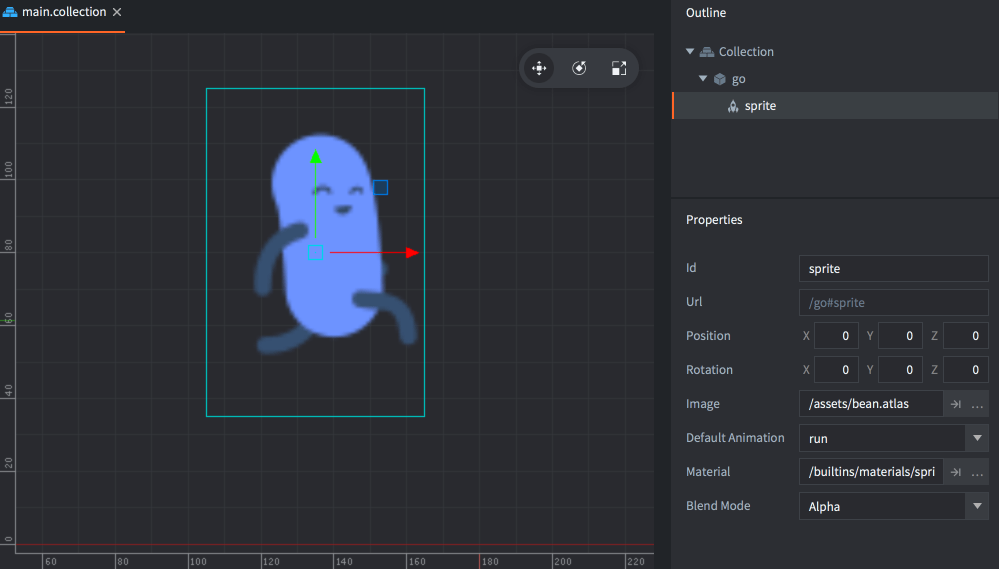

# Компонент Sprite

Компонент Sprite --- это простое изображение или мултикадровая анимация, отображаемая на экране.



Спрайт может брать графику либо из [атласа](/manuals/atlas), либо из [источника тайлов](/manuals/tilesource).

## Свойства спрайта

Помимо свойств *Id*, *Position* и *Rotation* существуют следующие специфические свойства компонента:

*Image*
: Если в шейдере используется один семплер, это поле называется `Image`. В противном случае каждая ячейка называется в соответствии с именем текстурного семплера в материале.
Каждая ячейка указывает ресурс атласа или источника тайлов, используемый для отображения спрайта на соответствующем семплере.

*Default Animation*
: Анимация, используемая для спрайта. Информация об анимации берётся из первого атласа или источника тайлов.

*Material*
: Материал, используемый для рендеринга спрайта.

*Blend Mode*
: Режим наложения, используемый при рендеринге спрайта.

*Size Mode*
: Если установлено значение `Automatic`, редактор автоматически задаст размер спрайта. Если установлено значение `Manual`, вы можете задать размер самостоятельно.

*Slice 9*
: Установите для сохранения пиксельного размера текстуры спрайта по краям при изменении размера спрайта.

:[Slice-9](../shared/slice-9-texturing.md)

### Режим наложения
:[blend-modes](../shared/blend-modes.md)

## Манипулирование при выполнении

Спрайтами можно манипулировать во время выполнения с помощью ряда различных функций и свойств (обращайтесь к [документации по API](/ref/sprite/)). Функции:

* `sprite.play_flipbook()` --- воспроизводит анимации в спрайте.
* `sprite.set_hflip()` и `sprite.set_vflip()` --- задает горизонтальное и вертикальное переворачивание в анимации спрайта.

Спрайт также имеет ряд различных свойств, которыми можно манипулировать с помощью `go.get()` и `go.set()`:

`cursor`
: Нормализованный курсор анимации (`number`).

`image`
: Изображение спрайта (`hash`). Его можно изменить с помощью свойства атласа или источника тайлов и `go.set()`. За примером обращайтесь к [справочнику по API](/ref/sprite/#image).

`material`
: Материал спрайта (`hash`). Его можно изменить с помощью свойства материала и `go.set()`. За примером обращайтесь к [справочнику по API](/ref/sprite/#material).

`playback_rate`
: Скорость воспроизведения анимации (`number`).

`scale`
: Неравномерный масштаб спрайта (`vector3`).

`size`
: Размер спрайта (`vector3`). Его можно изменить только если размер спрайта установлен в ручной режим (manual).

## Константы материала



`tint`
: Цветовой оттенок спрайта (`vector4`). Для представления оттенка с компонентами x, y, z и w, соответствующими красному, зеленому, синему и альфа оттенкам, используется тип `vector4`.

## Атрибуты материала

Спрайт может переопределять вершинные атрибуты из текущего назначенного материала, которые передаются в вершинный шейдер от компонента (подробности см. в [руководстве по материалам](/manuals/material/#attributes)).

Атрибуты, указанные в материале, будут отображаться как обычные свойства в инспекторе и могут быть заданы для отдельных компонентов спрайтов. Если какой-либо из атрибутов переопределён, он будет отображён как переопределённое свойство и сохранён в файле спрайта на диске:


## Конфигурация проекта

В файле *game.project* имеются несколько [настроек проекта](/manuals/project-settings#sprite), относящихся к спрайтам.

## Многотекстурные спрайты

При использовании спрайтом нескольких текстур есть несколько моментов, которые следует учитывать.

### Анимации

Данные анимации (fps, имена кадров) берутся из первой текстуры. Мы будем называть её "управляющей анимацией".

Идентификаторы изображений управляющей анимации используются для поиска изображений в других текстурах.
Поэтому важно, чтобы идентификаторы кадров совпадали между текстурами.

Например, если в вашем `diffuse.atlas` есть анимация `run` следующего вида:

```
run:
    /main/images/hero_run_color_1.png
    /main/images/hero_run_color_2.png
    ...
```

Тогда идентификаторы кадров будут `run/hero_run_color_1`, что, скорее всего, не будет найдено, например, в `normal.atlas`:

```
run:
    /main/images/hero_run_normal_1.png
    /main/images/hero_run_normal_2.png
    ...
```

Поэтому используйте `Паттерны переименования` в [атласе](/manuals/material/), чтобы переименовать их.
Установите `_color=` и `_normal=` в соответствующих атласах, и вы получите имена кадров следующего вида в обоих атласах:

```
run/hero_run_1
run/hero_run_2
...
```

### UV координаты

UV координаты берутся из первой текстуры. Так как имеется только один набор вершин, нельзя гарантировать
корректное совпадение, если вторичные текстуры имеют либо больше UV координат, либо другую форму.

Это важно учитывать, поэтому убедитесь, что изображения имеют достаточно схожую форму, иначе вы можете столкнуться с артефактами текстур.

Размеры изображений в каждой текстуре могут отличаться.
