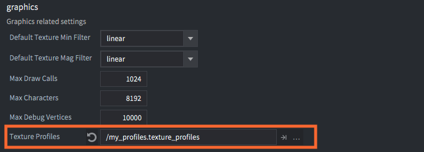
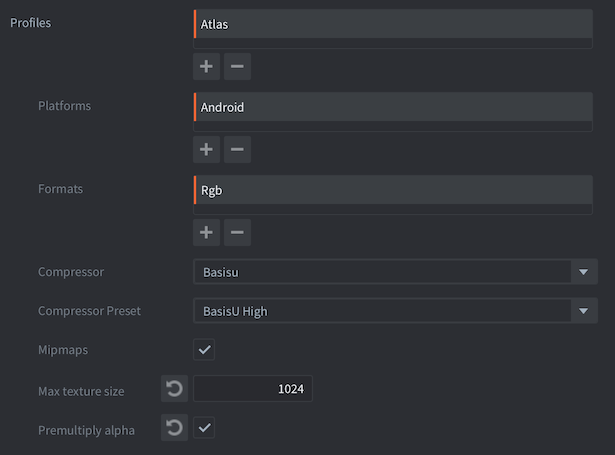
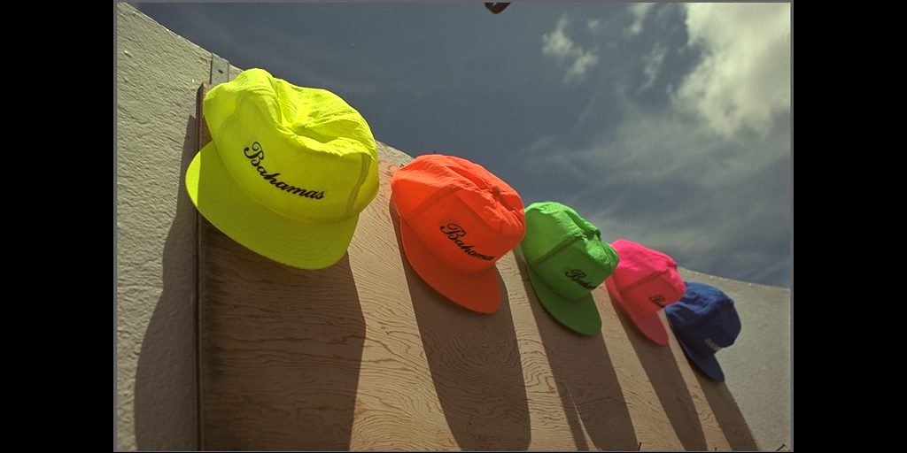

# Профили текстур

Defold поддерживает автоматическую обработку текстур и сжатие данных изображений (в *Atlas*, *Tile Sources*, *Cubemaps* и отдельных текстурах, используемых для моделей, GUI и т.д.).

Существует два типа сжатия: программное сжатие изображений и аппаратное сжатие текстур.

1. Программное сжатие (например, PNG и JPEG) уменьшает размер хранения ресурсов изображений. Это уменьшает итоговый размер бандла. Однако при загрузке в память такие файлы всё равно нужно распаковывать, поэтому даже небольшое на диске изображение может занимать много памяти.

2. Аппаратное сжатие текстур также уменьшает размер хранения ресурсов изображений. Но, в отличие от программного сжатия, оно уменьшает и объём памяти, занимаемой текстурами во время выполнения. Это возможно потому, что графическое оборудование умеет напрямую работать со сжатыми текстурами без предварительной распаковки.

Обработка текстур настраивается через специальный профиль текстур. В этом файле вы создаёте _профили_, которые определяют, какие сжатые формат(ы) и тип должны использоваться при создании бандлов для конкретной платформы. Затем _профили_ связываются с соответствующими _шаблонами путей_, что позволяет очень точно управлять тем, какие файлы проекта должны сжиматься и каким именно образом.

Поскольку все доступные варианты аппаратного сжатия текстур являются lossy, в данных текстуры будут появляться артефакты. Эти артефакты сильно зависят от того, как выглядит исходный материал и какой метод сжатия используется. Следует тестировать исходные материалы и экспериментировать, чтобы добиться наилучшего результата.

Можно выбрать, какое программное сжатие изображений будет применяться к итоговым данным текстуры (сжатым или raw) в архивах бандла. Defold поддерживает форматы сжатия [Basis Universal](https://github.com/BinomialLLC/basis_universal) и [ASTC](https://www.khronos.org/opengl/wiki/ASTC_Texture_Compression).

::: sidenote
Сжатие требует значительных ресурсов и времени и может приводить к _очень_ долгим сборкам в зависимости от количества изображений, которые нужно сжать, а также от выбранных форматов текстур и типа программного сжатия.
:::

### Basis Universal

Basis Universal (или сокращённо BasisU) сжимает изображение в промежуточный формат, который во время выполнения перекодируется в аппаратный формат, подходящий для GPU текущего устройства. Формат Basis Universal обеспечивает высокое качество, но относится к lossy-сжатию.
Все изображения также дополнительно сжимаются с помощью LZ4 для дальнейшего уменьшения размера при хранении в игровом архиве.

### ASTC

ASTC - это гибкий и эффективный формат сжатия текстур, разработанный ARM и стандартизованный Khronos Group. Он предлагает широкий диапазон размеров блоков и битрейтов, позволяя разработчикам эффективно балансировать качество изображения и использование памяти. ASTC поддерживает блоки размером от 4×4 до 12×12 текселей, что соответствует диапазону от 8 бит на пиксель до 0.89 бит на пиксель. Такая гибкость позволяет тонко управлять компромиссом между качеством текстур и требованиями к хранению.

ASTC поддерживает блоки размером от 4×4 до 12×12 текселей, что соответствует диапазону от 8 бит на пиксель до 0.89 бит на пиксель. Такая гибкость позволяет точно настраивать соотношение между качеством текстур и требованиями к хранилищу. Ниже приведена таблица поддерживаемых размеров блоков и соответствующих значений bits per pixel:

| Размер блока (ширина x высота) | Бит на пиксель |
| ------------------------------ | -------------- |
| 4x4                            | 8.00           |
| 5x4                            | 6.40           |
| 5x5                            | 5.12           |
| 6x5                            | 4.27           |
| 6x6                            | 3.56           |
| 8x5                            | 3.20           |
| 8x6                            | 2.67           |
| 10x5                           | 2.56           |
| 10x6                           | 2.13           |
| 8x8                            | 2.00           |
| 10x8                           | 1.60           |
| 10x10                          | 1.28           |
| 12x10                          | 1.07           |
| 12x12                          | 0.89           |

#### Поддерживаемые устройства

Хотя ASTC даёт отличные результаты, он поддерживается не всеми видеокартами. Ниже приведён краткий список поддержки по производителям GPU:

| Производитель GPU   | Поддержка                                                                |
| ------------------- | ------------------------------------------------------------------------ |
| ARM (Mali)          | Все ARM Mali GPU с поддержкой OpenGL ES 3.2 или Vulkan поддерживают ASTC. |
| Qualcomm (Adreno)   | Adreno GPU с поддержкой OpenGL ES 3.2 или Vulkan поддерживают ASTC.      |
| Apple               | Apple GPU начиная с чипа A8 поддерживают ASTC.                           |
| NVIDIA              | Поддержка ASTC в основном относится к мобильным GPU (например, Tegra).   |
| AMD (Radeon)        | AMD GPU с поддержкой Vulkan обычно поддерживают ASTC через software.     |
| Intel (Integrated)  | ASTC поддерживается на современных Intel GPU через software.             |

## Профили текстур

Каждый проект содержит специальный файл *.texture_profiles*, в котором хранится конфигурация, используемая при сжатии текстур. По умолчанию это файл *builtins/graphics/default.texture_profiles* с конфигурацией, которая сопоставляет каждый текстурный ресурс с профилем, использующим RGBA без аппаратного сжатия текстур и стандартное файловое сжатие ZLib.

Чтобы добавить сжатие текстур:

- Выберите <kbd>File ▸ New...</kbd> и создайте новый файл *Texture Profiles*. Либо скопируйте *default.texture_profiles* в место вне *builtins*.
- Выберите имя и расположение нового файла.
- Измените запись *texture_profiles* в *game.project*, чтобы она ссылалась на новый файл.
- Откройте файл *.texture_profiles* и настройте его в соответствии со своими требованиями.

Включать и отключать использование профилей текстур можно в настройках редактора. Выберите <kbd>File ▸ Preferences...</kbd>. На вкладке *General* есть флажок *Enable texture profiles*.

## Настройки путей

Раздел *Path Settings* в файле профилей текстур содержит список шаблонов путей и соответствующих *профилей*, которые должны использоваться при обработке ресурсов, совпадающих с путём. Пути задаются как шаблоны "Ant Glob" (подробнее см. [документацию](http://ant.apache.org/manual/dirtasks.html#patterns)). Можно использовать следующие wildcard-шаблоны:

`*`
: Соответствует нулю или более символов. Например, `sprite*.png` соответствует файлам *`sprite.png`*, *`sprite1.png`* и *`sprite_with_a_long_name.png`*.

`?`
: Соответствует ровно одному символу. Например, `sprite?.png` соответствует файлам *`sprite1.png`* и *`spriteA.png`*, но не *`sprite.png`* и не *`sprite_with_a_long_name.png`*.

`**`
: Соответствует целому дереву каталогов или, если используется как имя каталога, нулю или более каталогов. Например, `/gui/**` соответствует всем файлам в каталоге */gui* и во всех его подкаталогах.

В этом примере содержатся два шаблона путей и соответствующие им профили.

`/gui/**/*.atlas`
: Все файлы *.atlas* в каталоге *`/gui`* или любом его подкаталоге будут обрабатываться согласно профилю "gui_atlas".

`/**/*.atlas`
: Все файлы *.atlas* в любом месте проекта будут обрабатываться согласно профилю "atlas".

Обратите внимание, что более общий путь расположен ниже. Алгоритм сопоставления работает сверху вниз. Используется первое совпадение с путём ресурса. Шаблон ниже по списку никогда не переопределяет первое совпадение. Если бы эти пути были расположены в обратном порядке, все атласы обрабатывались бы профилем "atlas", включая те, что находятся в каталоге *`/gui`*.

Текстурные ресурсы, которые _не совпадают_ ни с одним путём в файле профилей, будут скомпилированы и масштабированы до ближайшей степени двойки, но в остальном останутся без изменений.

## Профили

Раздел *profiles* в файле профилей текстур содержит список именованных профилей. Каждый профиль содержит одну или несколько *platforms*, а каждая платформа описывается списком свойств.

*Platforms*
: Определяет подходящую платформу. `OS_ID_GENERIC` соответствует всем платформам, `OS_ID_WINDOWS` соответствует Windows-бандлам, `OS_ID_IOS` соответствует iOS-бандлам и так далее. Обратите внимание, что если задан `OS_ID_GENERIC`, он будет включён для всех платформ.

::: important
Если две [настройки путей](#настройки-путей) совпадают с одним и тем же файлом и путь использует разные профили с разными платформами, будут использованы **оба** профиля и будет сгенерировано **две** текстуры.
:::

*Formats*
: Один или несколько форматов текстур, которые нужно сгенерировать. Если задано несколько форматов, в бандл будут включены текстуры каждого формата. Движок сам выберет формат, поддерживаемый платформой выполнения.

*Mipmaps*
: Если включено, для платформы будут генерироваться mipmaps. По умолчанию отключено.

*Premultiply alpha*
: Если включено, альфа-канал будет premultiplied в данные текстуры. По умолчанию включено.

*Max Texture Size*
: Если задано ненулевое значение, размер текстур в пикселях будет ограничен указанным числом. Любая текстура, у которой ширина или высота больше этого значения, будет уменьшена.

Каждый *Format*, добавленный в профиль, имеет следующие свойства:

*Format*
: Формат, который используется при кодировании текстуры. Ниже перечислены все доступные форматы текстур.

*Compressor*
: Компрессор, используемый для кодирования текстуры.

*Compressor Preset*
: Выбирает preset сжатия, который будет использоваться для кодирования итогового сжатого изображения. Каждый preset уникален для конкретного компрессора, а его параметры зависят от самого компрессора. Чтобы упростить настройку, текущие presets сведены к четырём уровням:

| Preset    | Примечание                                |
| --------- | ----------------------------------------- |
| `LOW`     | Самое быстрое сжатие. Низкое качество     |
| `MEDIUM`  | Сжатие по умолчанию. Лучшее качество      |
| `HIGH`    | Самое медленное сжатие. Меньший размер    |
| `HIGHEST` | Медленное сжатие. Наименьший размер       |

Обратите внимание, что у компрессора `uncompressed` есть только один preset с именем `uncompressed`, то есть к текстурам не будет применяться никакое сжатие.
Список доступных компрессоров см. в разделе [Компрессоры](#компрессоры).

## Форматы текстур

Графические аппаратные текстуры могут быть обработаны в несжатые или *lossy*-сжатые данные с различным количеством каналов и глубиной цвета. Аппаратное сжатие с фиксированным размером означает, что итоговое изображение будет иметь фиксированный размер независимо от содержимого. Это означает, что потеря качества при сжатии зависит от содержимого исходной текстуры.

Поскольку перекодирование Basis Universal зависит от возможностей GPU устройства, рекомендуемыми форматами для использования с Basis Universal являются универсальные форматы:
`TEXTURE_FORMAT_RGB`, `TEXTURE_FORMAT_RGBA`, `TEXTURE_FORMAT_RGB_16BPP`, `TEXTURE_FORMAT_RGBA_16BPP`, `TEXTURE_FORMAT_LUMINANCE` и `TEXTURE_FORMAT_LUMINANCE_ALPHA`.

Транскодер Basis Universal поддерживает множество выходных форматов, таких как `ASTC4x4`, `BCx`, `ETC2`, `ETC1` и `PVRTC1`.

В настоящее время поддерживаются следующие lossy-форматы:

| Формат                           | Сжатие | Описание                                                            |
| -------------------------------- | ------ | ------------------------------------------------------------------- |
| `TEXTURE_FORMAT_RGB`             | none   | 3 цветовых канала. Альфа отбрасывается                              |
| `TEXTURE_FORMAT_RGBA`            | none   | 3 цветовых канала и полная альфа                                    |
| `TEXTURE_FORMAT_RGB_16BPP`       | none   | 3 цветовых канала. 5+6+5 бит                                        |
| `TEXTURE_FORMAT_RGBA_16BPP`      | none   | 3 цветовых канала и полная альфа. 4+4+4+4 бит                       |
| `TEXTURE_FORMAT_LUMINANCE`       | none   | 1 канал градаций серого, без альфы. RGB сводятся в один канал. Альфа отбрасывается |
| `TEXTURE_FORMAT_LUMINANCE_ALPHA` | none   | 1 канал градаций серого и полная альфа. RGB сводятся в один канал   |

Для ASTC количество каналов всегда будет равно 4 (RGB + alpha), а сам формат определяет размер блока сжатия.
Обратите внимание, что эти форматы совместимы только с компрессором ASTC - любая другая комбинация вызовет ошибку сборки.

`TEXTURE_FORMAT_RGBA_ASTC_4X4`
`TEXTURE_FORMAT_RGBA_ASTC_5X4`
`TEXTURE_FORMAT_RGBA_ASTC_5X5`
`TEXTURE_FORMAT_RGBA_ASTC_6X5`
`TEXTURE_FORMAT_RGBA_ASTC_6X6`
`TEXTURE_FORMAT_RGBA_ASTC_8X5`
`TEXTURE_FORMAT_RGBA_ASTC_8X6`
`TEXTURE_FORMAT_RGBA_ASTC_8X8`
`TEXTURE_FORMAT_RGBA_ASTC_10X5`
`TEXTURE_FORMAT_RGBA_ASTC_10X6`
`TEXTURE_FORMAT_RGBA_ASTC_10X8`
`TEXTURE_FORMAT_RGBA_ASTC_10X10`
`TEXTURE_FORMAT_RGBA_ASTC_12X10`
`TEXTURE_FORMAT_RGBA_ASTC_12X12`

## Компрессоры

По умолчанию поддерживаются следующие компрессоры текстур. Данные распаковываются при загрузке файла текстуры в память.

| Имя            | Форматы                 | Примечание                                                                 |
| -------------- | ----------------------- | -------------------------------------------------------------------------- |
| `Uncompressed` | Все форматы             | Сжатие не применяется. По умолчанию.                                       |
| `BasisU`       | Все RGB/RGBA форматы    | Basis Universal: высококачественное lossy-сжатие. Меньшее качество даёт меньший размер |
| `ASTC`         | Все ASTC форматы        | ASTC lossy-сжатие. Меньшее качество даёт меньший размер                    |

::: sidenote
В Defold 1.9.7 пайплайн компрессии текстур был переработан для поддержки устанавливаемых компрессоров. Это первый шаг к возможности реализовывать алгоритмы сжатия текстур в расширениях, например WEBP или полностью пользовательские варианты.
:::

## Пример изображения

Для лучшего понимания результата ниже приведён пример.
Обратите внимание, что качество изображения, время сжатия и итоговый размер всегда зависят от входного изображения и могут различаться.

Базовое изображение (1024x512):

### Время сжатия

| Preset    | Время сжатия | Относительное время |
| --------- | ------------ | ------------------- |
| `LOW`     | 0m0.143s     | 0.5x                |
| `MEDIUM`  | 0m0.294s     | 1.0x                |
| `HIGH`    | 0m1.764s     | 6.0x                |
| `HIGHEST` | 0m1.109s     | 3.8x                |

### Потеря сигнала

Сравнение выполнено с помощью утилиты `basisu` (измерение PSNR).
100 dB означает отсутствие потери сигнала, то есть изображение совпадает с оригиналом.

| Preset    | Сигнал                                           |
| --------- | ------------------------------------------------ |
| `LOW`     | Max:  34 Mean: 0.470 RMS: 1.088 PSNR: 47.399 dB |
| `MEDIUM`  | Max:  35 Mean: 0.439 RMS: 1.061 PSNR: 47.620 dB |
| `HIGH`    | Max:  37 Mean: 0.898 RMS: 1.606 PSNR: 44.018 dB |
| `HIGHEST` | Max:  51 Mean: 1.298 RMS: 2.478 PSNR: 40.249 dB |

### Размеры файлов после сжатия

Оригинальный размер файла: 1572882 байта.

| Preset    | Размер файла | Отношение |
| --------- | ------------ | --------- |
| `LOW`     | 357225       | 22.71 %   |
| `MEDIUM`  | 365548       | 23.24 %   |
| `HIGH`    | 277186       | 17.62 %   |
| `HIGHEST` | 254380       | 16.17 %   |

### Качество изображения

Ниже приведены итоговые изображения, полученные из ASTC-кодирования с помощью утилиты `basisu`.

`LOW`

`MEDIUM`

`HIGH`

`HIGHEST`

