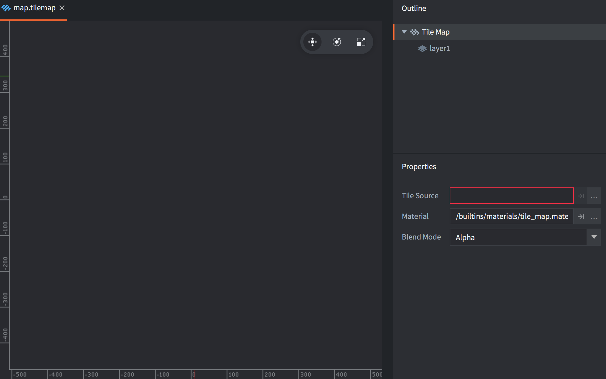
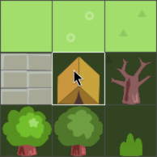
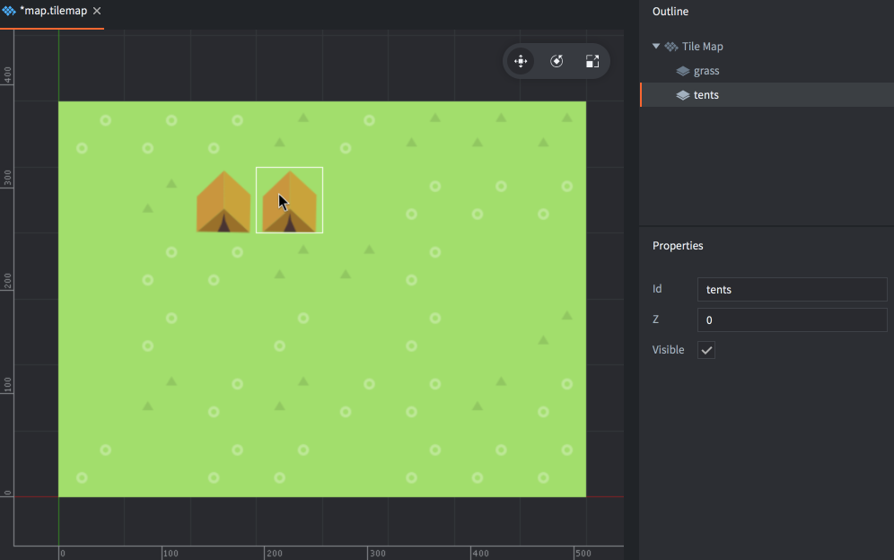
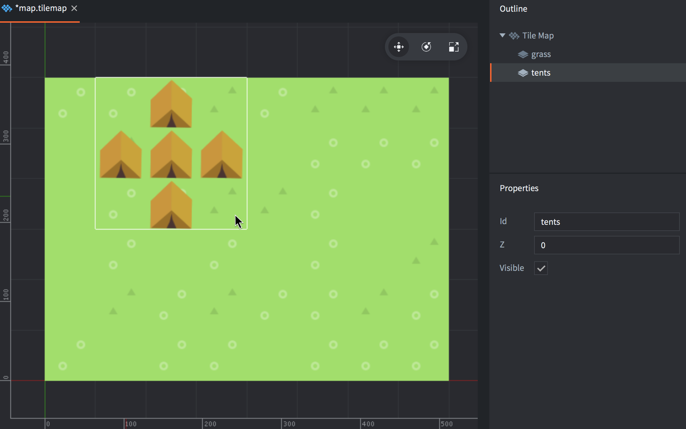
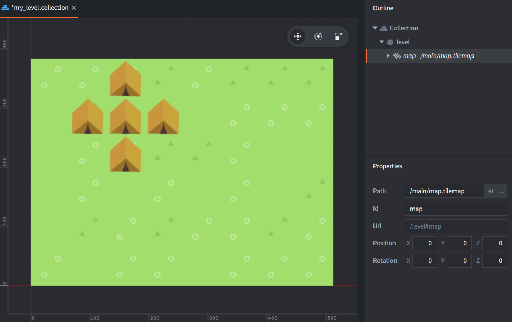

# Компонент Tile Map

*Тайловая карта* --- это компонент, который позволяет собирать, или наносить, тайлы из *Tile Source* на большой сетчатой области. Тайловые карты обычно используются для создания окружения игровых уровней. Также можно использовать *формы столкновений* из источника тайлов в картах для обнаружения столкновений и физических симуляций ([пример](/examples/tilemap/collisions/)).

Прежде чем создавать тайловую карту, необходимо создать Tile Source. Обращайтесь к [руководству по источникам тайлов](/manuals/tilesource), чтобы узнать, как их создавать.

## Создание тайловой карты

Чтобы создать новую тайловую карту:

- <kbd>Кликните ПКМ</kbd> в подходящем расположении в браузере *Assets*, затем выберите <kbd>New... ▸ Tile Map</kbd>.
- Присвойте файлу имя.
- Новая тайловая карта автоматически откроется в соответствующем редакторе.

  

- В свойстве *Tile Source* укажите подготовленный источник тайлов.

Чтобы нанести тайлы на тайловую карту:

1. В представлении *Outline* выберите или создайте *слой* для рисования.
2. Выберите тайл для использования его в качестве кисти (нажмите <kbd>Space</kbd> чтобы отобразить палитру тайлов)

   

3. Нанесите тайлы выбранной кистью. Чтобы стереть тайл, либо выберите пустой тайл и используйте его в качестве кисти, либо выберите ластик (<kbd>Edit ▸ Select Eraser</kbd>).

   

Тайлы можно выбирать непосредственно из слоя и использовать выбранное в качестве кисти. Удерживая <kbd>Shift</kbd>, кликните по тайлу, чтобы выбрать его в качестве текущей кисти. Удерживая <kbd>Shift</kbd>, можно также кликнуть с протяжкой, чтобы выбрать блок плиток для использования в качестве более крупной кисти. Также можно вырезать плитки, удерживая <kbd>Shift+Ctrl</kbd>, или стереть их, удерживая <kbd>Shift+Alt</kbd>.

Для поворота кисти по часовой стрелке используйте <kbd>Z</kbd>. Для отражения по горизонтали — <kbd>X</kbd>, а для отражения по вертикали — <kbd>Y</kbd>.



## Добавление тайловой карты в игру

Чтобы добавить тайловую карту в игру:

1. Создайте игровой объект для хранения тайловой карты. Игровой объект может находиться в файле или быть создан непосредственно в коллекции.
2. Кликните ПКМ в корне игрового объекта и выберите <kbd>Add Component File</kbd>.
3. Выберите файл тайловой карты.



## Манипулирование при выполнении

Тайловыми картами можно управлять во время выполнения с помощью ряда различных функций и свойств (обращайтесь к [документации по API](/ref/tilemap/)).

### Смена тайлов из скрипта

Содержимое тайловой карты можно считывать и записывать динамически во время работы игры. Для этого используются функции [`tilemap.get_tile()`](/ref/tilemap/#tilemap.get_tile) и [`tilemap.set_tile()`](/ref/tilemap/#tilemap.set_tile):

```lua
local tile = tilemap.get_tile("/level#map", "ground", x, y)

if tile == 2 then
    -- Заменить тайл с травой (2) на тайл с опасной ямой (number 4).
    tilemap.set_tile("/level#map", "ground", x, y, 4)
end
```

## Свойства тайловой карты

Помимо свойств *Id*, *Position*, *Rotation* и *Scale* существуют следующие специфичные для компонента свойства:

*Tile Source*
: Тайловый источник, используемый для тайловой карты.

*Material*
: Материал, используемый для рендеринга тайловой карты.

*Blend Mode*
: Режим наложения, используемый при рендеринге тайловой карты.

### Режимы наложения
:[blend-modes](../shared/blend-modes.md)

### Изменение свойств

Тайловая карта имеет ряд различных свойств, которыми можно манипулировать с помощью `go.get()` и `go.set()`:

`tile_source`
: Источник тайлов для тайловой карты (`hash`). Это свойство можно изменять с помощью свойства источника тайлов и `go.set()`. За примером обращайтесь к [справочнику по API](/ref/tilemap/#tile_source).

`material`
: Материал тайловой карты (`hash`). Это свойство можно изменять с помощью свойства материала и `go.set()`. За примером обращайтесь к [справочнику по API](/ref/tilemap/#material).

### Константы материала



`tint`
: Цветовой оттенок тайловой карты (`vector4`). Для представления оттенка с компонентами x, y, z и w, соответствующими красному, зеленому, синему и альфа оттенкам, используется тип vector4.

## Конфигурация проекта

В файле *game.project* имеются несколько [настроек проекта](/manuals/project-settings#tilemap), относящихся к тайловым картам.

## Внешние инструменты

Существуют внешние редакторы карт и уровней, которые могут экспортировать данные непосредственно в тайловые карты Defold:

### Tiled

[Tiled](https://www.mapeditor.org/) — это известный и широко используемый редактор карт для ортогональных, изометрических и гексагональных карт. Он поддерживает множество функций и может [экспортировать напрямую в Defold](https://doc.mapeditor.org/en/stable/manual/export-defold/). Подробнее о том, как экспортировать данные тайлмапа и дополнительную мета-информацию, читайте в [блоге пользователя Defold "goeshard"](https://goeshard.org/2025/01/01/using-tiled-object-layers-with-defold-tilemaps/).


### Tilesetter

[Tilesetter](https://www.tilesetter.org/docs/exporting#defold) позволяет автоматически создавать полноценные наборы тайлов из простых базовых плиток и содержит редактор карт, который может экспортировать данные непосредственно в Defold.

