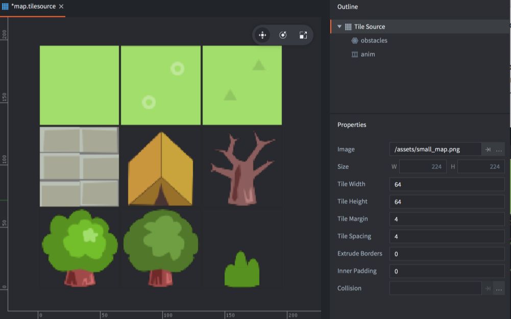

# Ресурс Tile Source

Ресурс *Tile Source* может использоваться [компонентом Tile Map](/manuals/tilemap) для нанесения тайлов поверх сетчатой области, или в качестве источника графики для компонентов [Sprite](/manuals/sprite) и [Particle FX](/manuals/particlefx). Также допускается использование *форм столкновений* из источника тайлов в Tilemap для [обнаружения столкновений и физических симуляций](/manuals/physics) ([пример](/examples/tilemap/collisions/)).

## Создание источника тайлов

Например, требуется изображение, содержащее все тайлы. Каждый тайл должен иметь абсолютно одинаковые размеры и располагаться по сетке. Defold поддерживает _пространство_ между тайлами и _отступ_ вокруг каждого тайла.

После того как исходное изображение создано, можно приступать к созданию Tile Source:

- Импортируйте изображение в проект, перетащив его в подходящее расположение в браузере *Assets*.
- Создайте новый файл источника тайлов (<kbd>кликните ПКМ</kbd> в каком-либо расположении в браузере *Assets*, затем выберите <kbd>New... ▸ Tile Source</kbd>).
- Присвойте имя новому файлу.
- Файл откроется в редакторе источника тайлов.
- Кликните кнопку обзора рядом со свойством *Image* и выберите изображение. В результате вы увидите изображение редакторе.
- Настройте *свойства* в соответствии с исходным изображением. Если все сделано правильно, плитки выстроятся идеально.

Size
: Размер исходного изображения.

Tile Width
: Ширина каждого тайла.

Tile Height
: Высота каждого тайла.

Tile Margin
: Количество пикселей, окружающих каждый тайл (оранжевый на изображении выше).

Tile Spacing
: Количество пикселей между каждым тайлом (синий на изображении выше).

Inner Padding
: Количество пустых пикселей, которые будут автоматически добавлены вокруг тайла в итоговую текстуру, используемую при запуске игры.

Extrude Border
: Указывает, сколько раз краевые пиксели должны быть автоматически повторены вокруг тайла в итоговой текстуре, используемой при запуске игры.

Collision
: Изображение, используемое для автоматического создания форм столкновений для тайлов.

## Анимация в тайловом источнике

Чтобы определить анимацию в источнике тайлов, тайлы-кадры должны располагаться рядом друг с другом в виде последовательности слева направо. Последовательность может переноситься с одного ряда на другой. Все вновь созданные источники тайлов по умолчанию имеют анимацию с именем "anim". Можно добавить новые анимации, <kbd>кликнув ПКМ</kbd> в корне источника тайлов в *Outline* и выбрав <kbd>Add ▸ Animation</kbd>.

При выделении анимации отображаются ее *свойства*.

Id
: Идентификатор анимации. Должен быть уникальным для источника тайлов.

Start Tile
: Первый тайл анимации. Нумерация начинается с 1 в левом верхнем углу и продолжается вправо, строка за строкой до правого нижнего угла.

End Tile
: Последний тайл анимации.

Playback
: Указывает, как должна воспроизводиться анимация:

  - `None` --- анимация вообще не воспроизводится, отображается первое изображение.
  - `Once Forward` --- воспроизводится один раз, начиная с первого и заканчивая последним изображением.
  - `Once Backward` --- воспроизводится один раз, начиная с последнего и заканчивая первым изображением.
  - `Once Ping Pong` --- воспроизводится один раз, начиная с первого и заканчивая последним изображением, затем возврат к первому.
  - `Loop Forward` --- воспроизводится циклически, начиная с первого и заканчивая последним изображением.
  - `Loop Backward` --- воспроизводится циклически, начиная с последнего и заканчивая первым изображением.
  - `Loop Ping Pong` --- воспроизводится циклически, начиная с первого и заканчивая последним изображением, затем возврат к первому.

Fps
: Скорость воспроизведения анимации, выраженная в кадрах в секунду (FPS).

Flip horizontal
: Переворачивает анимацию по горизонтали.

Flip vertical
: Переворачивает анимацию по вертикали.

## Формы столкновений источника тайлов

Defold использует изображение, указанное в свойстве *Collision*, для создания _выпуклой_ формы для каждого тайла. Эта форма описывает (обводит) ту часть тайла, которая содержит информацию о цвете, то есть не является 100% прозрачной.

Часто имеет смысл использовать для столкновений то же изображение, что и изображение, содержащее действительную графику, но также можно указать и отдельное изображение, если требуются формы столкновений, отличающиеся от визуальных. При указании изображения столкновений предварительный просмотр обновляется с контуром на каждом тайле, который указывает на сгенерированные формы столкновений.

Панель Outline источника тайлов содержит список групп столкновений, которые были добавлены в источник тайлов. Новые файлы источников тайлов получают одну группу столкновений с именем "default". Можно добавить новые группы, <kbd>кликнув ПКМ</kbd> в корне источника тайлов в *Outline* и выбрав <kbd>Add ▸ Collision Group</kbd>.

Чтобы выбрать формы тайлов, которые должны принадлежать определенной группе, необходимо выделить группу в *Outline*, затем кликнуть по каждому тайлу, который необходимо отнести к группе. Контур тайла и формы окрашивается в цвет группы, назначаемый редактором автоматически.

Чтобы удалить тайл из группы столкновений, выберите корневой элемент источника тайла в *Outline* и кликните по тайлу.
