# Defold для пользователей Unity

Если у вас уже есть опыт работы с Unity, это руководство поможет вам быстро начать продуктивно работать в Defold. Оно сосредоточено на самом важном и указывает на официальные руководства Defold там, где нужны более глубокие подробности.

## Введение

Defold — полностью бесплатный, действительно кроссплатформенный 3D-движок с редактором для Windows, Linux и macOS. Полный исходный код доступен на [Github](https://github.com/defold/defold/).

Defold ориентирован на производительность даже на слабых устройствах. Его компонентная и data-driven архитектура в некоторой степени похожа на подход DOTS в Unity.

Defold значительно меньше Unity. Размер движка с пустым проектом составляет от 1 до 3 МБ на всех платформах. Вы можете исключить дополнительные части движка и вынести часть игрового контента в [Live Update](/manuals/live-update), чтобы загружать его отдельно позже. Сравнение размеров и другие причины выбрать Defold описаны на странице [Why Defold](https://defold.com/why/).

Чтобы настроить Defold под свои нужды, вы можете написать собственные или использовать существующие:

1. Полностью скриптуемый рендеринг-пайплайн (render script + materials/shaders) с несколькими backend'ами на выбор (OpenGL, Vulkan и т.д.).
2. Код и компоненты как Native Extensions (C++/C#).
3. Editor Scripts и UI-виджеты для настройки редактора.
3. Измененную сборку движка и редактора, так как доступны полный исходный код и пайплайн сборки.

Также рекомендуем посмотреть видео Game From Scratch о [Defold для разработчиков Unity](https://www.youtube.com/watch?v=-3CzCbd4QZ0).

---

## Установка

1. Скачайте Defold для вашей ОС.
2. Распакуйте и запустите.

Вот и все. Никаких hub, дополнительных SDK, toolchain'ов или установок платформенных пакетов. Именно поэтому мы говорим, что у Defold нулевая настройка.

Если нужны подробности, прочитайте краткое [руководство по установке](/manuals/installation).

### Версии

Defold обновляется часто и не имеет отдельной ветки “LTS”. Мы рекомендуем всегда использовать последнюю версию. Новые версии выпускаются регулярно, обычно ежемесячно, с примерно двухнедельной публичной beta. Обновлять Defold можно прямо в редакторе.

---

## Экран приветствия

Defold встречает вас экраном приветствия, похожим на Unity Hub, где можно открывать недавние проекты:

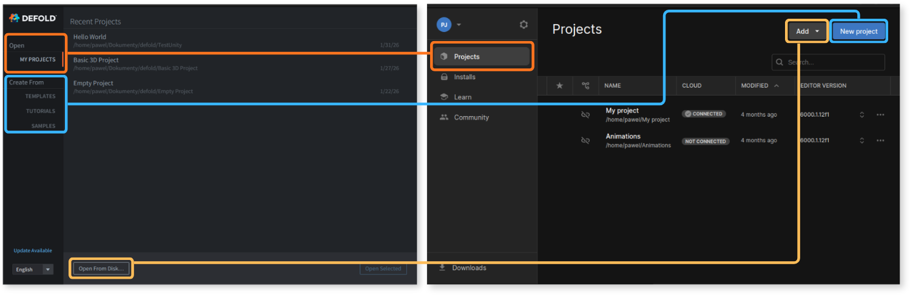

Или начать новый проект из:
- `Templates` — базовые пустые проекты для более быстрого старта под конкретную платформу или жанр,
- `Tutorials` — пошаговые обучающие сценарии, которые помогут сделать первые шаги,
- `Samples` — официальные или созданные сообществом примеры и кейсы,

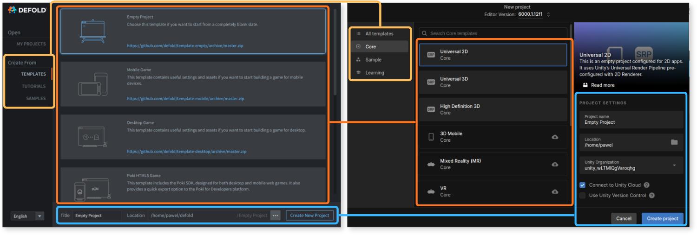

Когда вы создадите первый проект и/или откроете его, он откроется в редакторе Defold.

## Hello World

Это быстрый способ быстро сделать что-то в Defold: выполните шаги, а потом вернитесь и дочитайте остальную часть руководства.

1. Выберите пустой проект в `Templates`, задайте имя в `Title`, выберите расположение и создайте его, нажав `Create New Project`. Проект откроется в редакторе Defold.
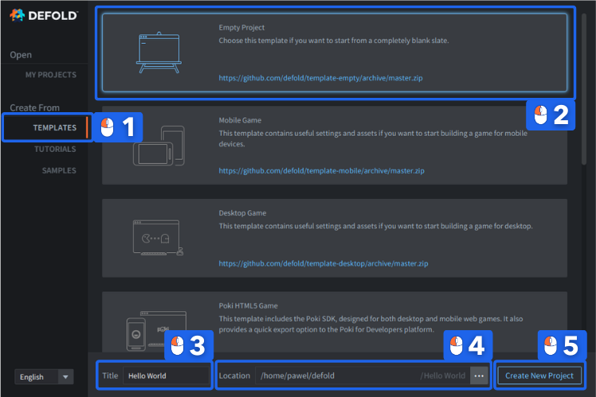
2. Слева, в панели `Assets`, откройте папку `main` и дважды щелкните по `main.collection`, чтобы открыть ее.
3. Справа, в панели `Outline`, щелкните правой кнопкой мыши по `Collection` и выберите `Add Game Object`.
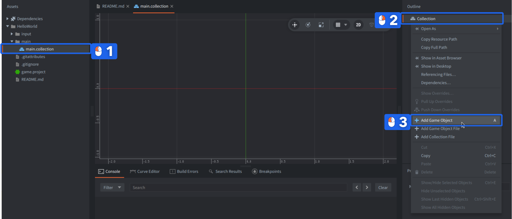
4. Щелкните правой кнопкой мыши по созданному game object `go`, выберите `Add Component`, а затем `Label`.
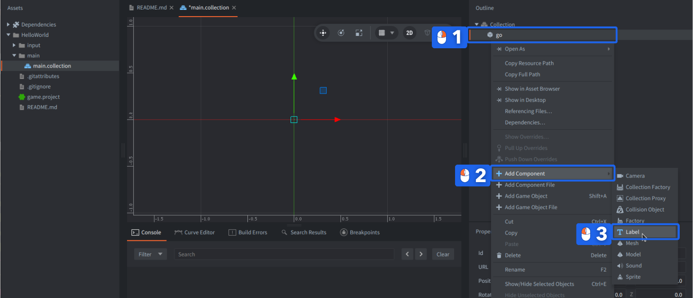
5. Ниже, слева, в панели `Properties`, введите что-нибудь в свойство `Text`.
6. В основной центральной сцене перетащите и переместите label в позицию около `(480,320,0)`, либо измените это значение в `Properties`: `Position`.
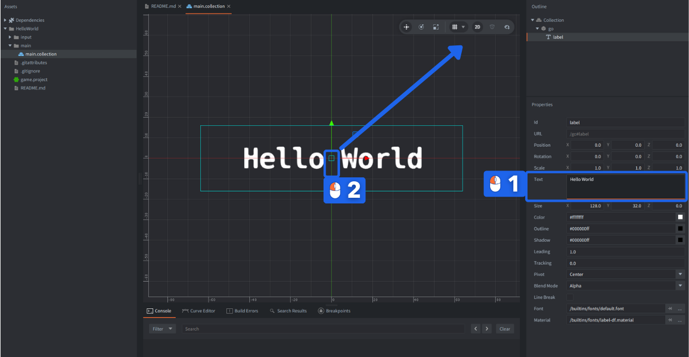
7. После изменения позиции label сохраните проект через `File` -> `Save All` или сочетанием клавиш <kbd>Ctrl</kbd>+<kbd>S</kbd> (<kbd>Cmd</kbd>+<kbd>S</kbd> на Mac).
8. Соберите проект через `Project` -> `Build` или сочетанием клавиш <kbd>Ctrl</kbd>+<kbd>B</kbd> (<kbd>Cmd</kbd>+<kbd>B</kbd> на Mac).
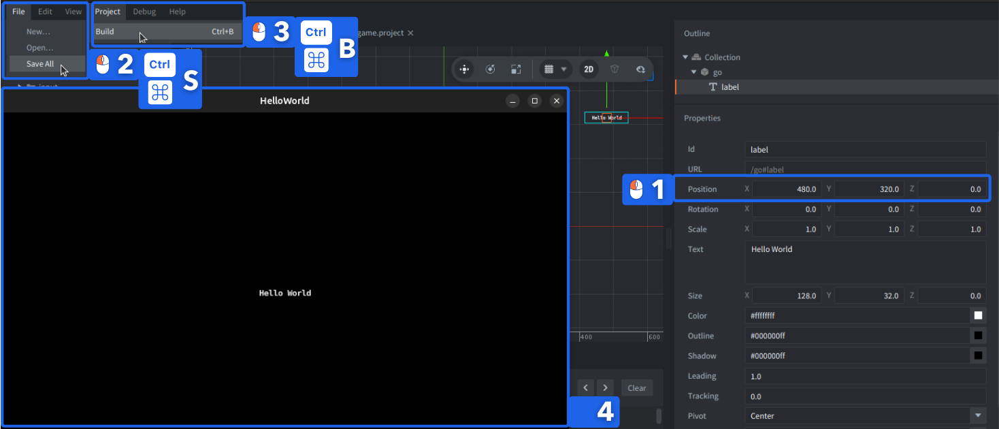

Вы только что собрали свой первый проект в Defold и должны увидеть свой текст в окне. Концепции game object и component должны быть вам знакомы. Collections, outline, properties и то, почему нам понадобилось немного сместить label в правый верхний угол, объясняются ниже.

---

## Обзор редактора Defold

Здесь мы покажем редактор Defold с точки зрения того, что пользователь Unity, вероятно, хочет узнать в первую очередь, но мы настоятельно рекомендуем затем прочитать полное [руководство по обзору редактора](/manuals/editor-overview).

### Сравнение редакторов

Первое различие, которое вы заметите между Unity и Defold, — стандартная компоновка редактора. Мы показываем редактор Unity со слегка измененной раскладкой, чтобы она соответствовала стандартной раскладке Defold. Они размещены рядом для более наглядного визуального сравнения основных панелей, поскольку так вам будет проще узнать вкладки Unity.

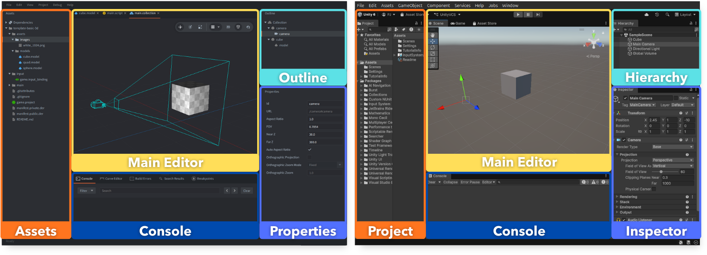

По умолчанию редактор Defold открывается в режиме 2D-ортографического предпросмотра. Если вы собираетесь работать над 3D-проектом или просто хотите получить ощущения, более близкие к Unity, мы рекомендуем переключиться из 2D в 3D, сняв флажок `2D` на панели инструментов и изменив проекцию камеры на перспективную, включив переключатель `Perspective`:

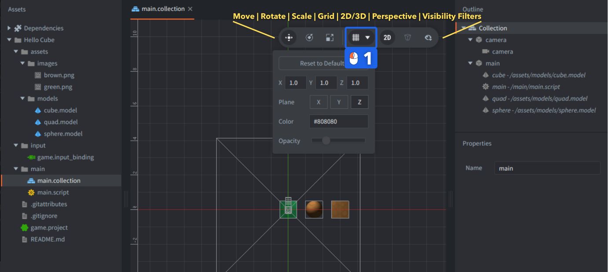

Вы также можете настроить `Grid Settings` на панели инструментов, чтобы использовать плоскость `Y`, как в Unity:

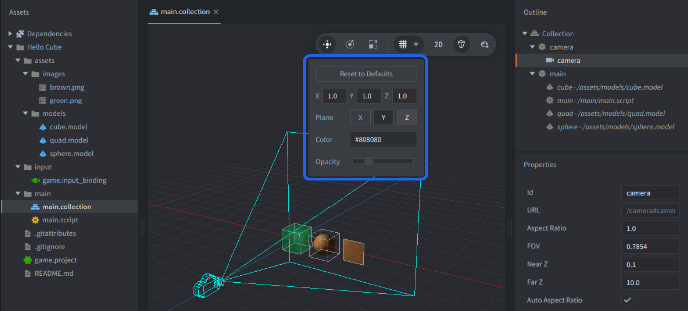

### Обзор панелей Defold

Редактор Defold разделен на 6 основных панелей.


Ниже приведено сравнение именования и функциональных различий в Defold:

| Defold | Unity | Differences |
|---|---|---|
| 1. Assets | Project (Assets Browser) | В Defold панель Assets закреплена слева. Defold не создает никаких `meta`-файлов. |
| 2. Main Editor | Scene View | Редактор Defold контекстно-зависим (разные редакторы для разных типов файлов), тогда как Unity использует отдельные специализированные окна (например, Animator, Shader Graph). В Defold также есть встроенный редактор кода. |
| 3. Outline | Hierarchy | Defold отображает только текущий открытый файл или выбранный элемент (game object или component), а не глобальную hierarchy. |
| 4. Properties | Inspector | Defold показывает только свойства **текущего выделения** в Outline, а не всех компонентов game object. |
| 5. Tools | Console | Defold предоставляет инструменты во вкладках: Console, Curve Editor, Build Errors, Search Results, Breakpoints и Debugger. |
| 6. Changed Files | Unity Version Control (Plastic) | В Defold, как только Git интегрирован в проект, измененные файлы отображаются здесь. При этом вы по-прежнему можете использовать Git вне редактора. |

Другие полезные названия, связанные с редактором:

| Defold | Unity | Differences |
|---|---|---|
| Game Build | Game Preview | Показывает запущенную игру, собранную движком. Defold может запускать несколько экземпляров игры из редактора, подобно Unity 6+ Multiplayer Play Mode. В Defold игра всегда работает в отдельном окне, а не внутри редактора. Defold также может запускать игру на внешнем устройстве (например, на мобильном телефоне), аналогично Unity Remote. |
| Tabs | Tabs | Defold позволяет редактировать рядом в двух панелях внутри Main Editor. Вкладки и панели закреплены в одном окне редактора; видимость панелей можно переключать (<kbd>F6</kbd>, <kbd>F7</kbd>, <kbd>F8</kbd>), а размеры панелей — изменять. |
| Toolbar | Toolbar / Scene View Options | Только в новых версиях Unity инструменты трансформации были перенесены в Scene view, как в Defold. |
| Console | Console | Консоль Defold нельзя отделить. Ошибки сборки в Defold появляются в отдельной вкладке `Build Errors`. |
| Build Errors | Compilation Errors in Console | Lua-скрипты интерпретируются, поэтому ошибок компиляции нет. Однако проект все же собирается, и некоторые ошибки могут возникать в процессе сборки. Defold также использует Lua Language Server для статического анализа скриптов. |
| Search Results | Search / Project Search | Фильтрации по типам и меткам в Defold нет. |
| Curve Editor | Unity Curve Editor | Curve Editor в Defold позволяет редактировать кривые только для свойств particle effect. |
| [Debugger](/manuals/debugging/) | Visual Studio Debugger | Отладчик полностью интегрирован в Defold из коробки. Также есть отдельная вкладка для отслеживания, включения и отключения breakpoints. |

---

## Ключевые концепции

Если достаточно обобщить, ключевые концепции большинства игровых движков очень похожи. Они созданы, чтобы помогать разработчикам проще собирать игры, как из блоков, одновременно самостоятельно беря на себя сложные и платформозависимые задачи.

### Строительные блоки

Defold оперирует всего несколькими базовыми строительными блоками:

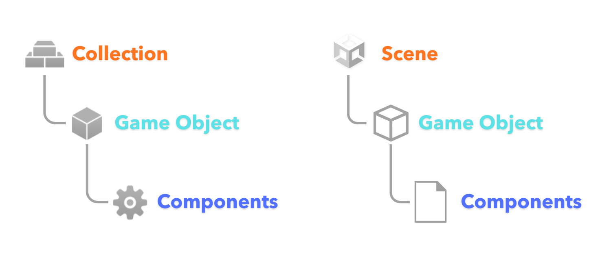

Подробности смотрите в полном руководстве о [строительных блоках Defold](/manuals/building-blocks/).

### Игровые объекты

Defold использует **"Game Objects"**, как и Unity. В обоих движках game objects — это контейнеры данных с идентификатором, и у всех есть transform: position, rotation и scale, но в Defold transform встроен, а не является отдельным компонентом.

Вы можете создавать отношения parent-child между game objects. В Defold это можно делать только в редакторе внутри "Collection" (объясняется ниже) или динамически из скрипта. Game objects не могут содержать другие game objects как вложенные объекты так же, как это возможно в Unity.

### Компоненты

В обоих движках Game Objects можно расширять **"Components"**. Defold предоставляет минимальный набор необходимых компонентов. Различий между 2D и 3D здесь меньше, чем в Unity (например, в коллайдерах), поэтому компонентов в целом меньше, и некоторых привычных для Unity компонентов вам может не хватать.

Подробнее о [компонентах Defold](/manuals/components/).

В таблице ниже приведены похожие компоненты Unity для быстрого поиска с ссылками на соответствующие руководства по компонентам Defold:

| Defold | Unity | Differences |
|---|---|---|
| [Sprite](/manuals/sprite/) | Sprite Renderer | В Defold tint (color property) можно менять только из кода. |
| [Tilemap](/manuals/tilemap/) | Tilemap / Grid | В Defold есть встроенный редактор Tilemap, поддерживающий квадратные сетки (но существует расширение, например, для [Hexagon](https://github.com/selimanac/defold-hexagon/)), и отсутствуют встроенные autotiling rules. Такие инструменты как [Tiled](https://defold.com/assets/tiled/), [TileSetter](https://defold.com/assets/tilesetter/) или [Sprite Fusion](https://defold.com/assets/spritefusion/) поддерживают экспорт в Defold. |
| [Label](/manuals/label/) | Text / TextMeshPro | В Defold есть расширение [RichText](https://defold.com/assets/richtext/) для rich formatting, аналогично TextMeshPro. |
| [Sound](/manuals/sound/) | AudioSource | В Defold звук только глобальный, а не spatial. Для Defold существует официальное [расширение FMOD](https://github.com/defold/extension-fmod). |
| [Factory](/manuals/factory/) | Prefab Instantiate() | В Defold Factory — это компонент с определенным prototype (prefab). |
| [Collection Factory](/manuals/collection-factory/) | - (No direct component equivalent) | Компонент Collection Factory в Defold может порождать сразу несколько Game Objects с отношениями parent-child. |
| [Collision Object](/manuals/physics-object) | Rigidbody + Collider | В Defold physics object и collision shapes объединены в одном компоненте. |
| [Collision Shapes](/manuals/physics-shapes/) | BoxCollider / SphereCollider / CapsuleCollider | В Defold shapes (box, sphere, capsule) настраиваются внутри компонента Collision Object. Оба движка поддерживают collision shapes из tilemaps и convex hull data. |
| [Camera](/manuals/camera/) | Camera | В Unity камера имеет больше встроенных настроек рендеринга и пост-обработки, тогда как в Defold это отдано пользователю через render script. |
| [GUI](/manuals/gui/) | UI Toolkit / Unity UI / uGUI Canvas | GUI в Defold — мощный компонент для построения полноценных UI и templates. В Unity нет одного эквивалентного UI-компонента, там есть несколько UI-фреймворков. Для Defold также есть расширение для [Extension](https://github.com/britzl/extension-imgui). |
| [GUI Script](/manuals/gui-script/) | Unity UI / uGUI scripts | GUI в Defold можно контролировать через GUI scripts, используя отдельный `gui` API. |
| [Model](/manuals/model/) | MeshRenderer + Material | В Defold компонент Model объединяет 3D-модель, texture'ы и material с shaders. |
| [Mesh](/manuals/mesh/) | MeshRenderer / MeshFilter / Procedural Mesh | В Defold Mesh — это компонент для управления набором вершин через код. Он похож на Defold Model, но еще более низкоуровневый. |
| [ParticleFX](/manuals/particlefx/) | Particle System | Редактор частиц Defold поддерживает 2D/3D particle effects со множеством свойств и позволяет анимировать их во времени с помощью curves в Curve Editor. У него нет Trails и Collisions. |
| [Script](/manuals/script/) | Script | Подробнее различия программирования объясняются ниже. |

#### Расширения и пользовательские компоненты

У Defold также есть официальные компоненты [Spine](/manuals/extension-spine/) и [Rive](/manuals/extension-rive/), доступные через расширения.

Вы также можете создавать собственные [custom Components](https://github.com/defold/extension-simpledata) с помощью Native Extensions, например, как в этом созданном сообществом [компоненте интерполяции объектов](https://github.com/indiesoftby/defold-object-interpolation).

У некоторых компонентов Unity нет готового эквивалента в Defold, например: Audio Listener, Light, Terrain, LineRenderer, TrailRenderer, Cloth или Animator. Однако всю эту функциональность можно реализовать в скриптах, и уже существуют готовые решения — например, разные lighting pipeline, компонент Mesh для генерации произвольных mesh'ей (включая terrain) или [Hyper Trails](https://defold.com/assets/hypertrails/) для настраиваемых trail-эффектов. В будущем Defold также может добавить новые встроенные компоненты, например свет.

### Ресурсы

Некоторым компонентам требуются **"Resources"**, как и в Unity, например, sprite'ам и моделям нужны texture'ы. Несколько таких ресурсов сравниваются в таблице ниже:

| Defold | Unity | Differences |
|---|---|---|
| [Atlas](/manuals/atlas/) | Sprite Atlas / Texture2D | В Defold также есть [расширение для Texture Packer](https://defold.com/extension-texturepacker/). |
| [Tile source](/manuals/tilesource/) | Tile Palette + Asset | В Defold tile source может использоваться как texture для tilemap, но также и для sprite'ов или particle effects. |
| [Font](/manuals/font/) | Font | Используется компонентом Label в Defold или text nodes в GUI, аналогично Text/TextMeshPro в Unity. |
| [Material](/manuals/material/) | Material | В Defold shader'ы называются vertex program и fragment program. |

### Collection против Scene

В Defold Game Objects и Components могут быть размещены в отдельных файлах, как prefab'ы Unity, либо определены в объединяющем файле **"Collection"**.

Collection в Defold — это, по сути, текстовый файл со статическим описанием сцены. Это **не** runtime-объект. Он лишь определяет, какие Game Objects должны быть инстанцированы в игре и какие parent-child отношения между ними должны быть установлены.

#### Игровые миры

Сцены Unity по умолчанию разделяют одно глобальное состояние игры и одну physics simulation, фактически один и тот же *world*. В Defold у вас есть два варианта:
1. Инстанцировать game objects из одного файла game object через `Factory` или из collection через `Collection Factory` в уже инстанцированный *world*, как prefab'ы.
2. Создавать отдельный игровой *world* во время выполнения с его собственными game objects, physics world, engine operations и namespace адресации через collection, загружаемую на bootstrap, или через компонент `Collection Proxy`.

Компоненты Factory и Proxy также объясняются ниже.
Подробнее о Collections читайте в [руководстве по Building Blocks](/manual/building-blocks/#collections).

---

## Ресурсы проекта и ассеты

Unity и Defold хранят игровой контент в директории проекта, но по-разному отслеживают и подготавливают ассеты.

### Assets

Unity хранит ассеты в `Assets/` и генерирует `.meta`-файлы. В Defold meta-файлов нет. Проект в Defold — это просто ваша структура папок, ровно такая же, как на диске, а панель `Assets` всегда ее отражает.

### Форматы ресурсов

Unity импортирует и преобразует ассеты во внутренние форматы “за кулисами”. В Defold вы работаете напрямую с исходными ресурсами (`.png`, `.gltf`, `.wav`, `.ogg` и т.д.) и назначаете их `Components`.

Unity может использовать одно изображение как Sprite. В Defold изображения можно использовать напрямую для Models/Meshes, но Sprites/GUI/Tilemaps/Particles требуют atlas (упакованные texture'ы) или tilesource (тайлы на основе сетки).

Большинство ресурсов Defold хранится в текстовом виде, что удобно для version control.

### Library Cache

Unity генерирует папку `Library/` для импортированных ассетов. В Defold такой директории нет; ассеты обрабатываются во время сборки, а кэшированные результаты попадают в build folder (с возможностью локального/удаленного build cache).

---

## Написание кода

Типичная ошибка разработчиков, пришедших из Unity, — воспринимать скрипты Defold как `MonoBehaviour` и прикреплять их к *каждому* game object. Хотя писать в объектно-ориентированном стиле можно, и для этого даже есть библиотеки, рекомендуемый подход, особенно при большом количестве одинаковых game objects, — использовать скрипты как systems или managers. Один скрипт может управлять сотнями или тысячами объектов и их компонентов, даже если у самих объектов нет собственных скриптов, благодаря мощной адресации и messaging system в Defold. Создание отдельного скрипта для каждого объекта редко необходимо и может привести к излишней сложности.

Пример того, как использовать script properties, factories, addressing и messaging в Defold для управления несколькими юнитами, можно найти [здесь](https://defold.com/examples/factory/spawn_manager/).

Полезные руководства по написанию кода:
- [Script manual](/manuals/script/)
- [Writing code](/manual/writing-code)
- [Debugging](/manuals/debugging/)

### Lua

Скрипты Defold пишутся на динамически типизированном многопарадигменном языке [Lua](https://www.lua.org/).

Существует несколько типов Lua-скриптов: `*.script`, `*.gui_script`, `*.render_script`, `*.editor_script` и модули `*.lua`.

### Teal

Defold поддерживает использование transpiler'ов, генерирующих Lua-код, например [Teal](https://teal-language.org/) — статически типизированного диалекта Lua, но эта функциональность более ограничена и требует дополнительной настройки. Подробности доступны в [репозитории расширения Teal](https://github.com/defold/extension-teal).

### Native Extensions на C++/C#

В Defold вы можете писать Native Extensions на C++ и C#. Если вам очень комфортно с C#, технически можно построить большую часть логики игры внутри C#-расширения и вызывать ее из небольшого bootstrap Lua-скрипта, однако это требует хорошего знания API и не рекомендуется новичкам.

Подробнее о расширениях в [руководстве по Native Extensions](/manual/extensions.md).

### Встроенный редактор кода

В редактор Defold встроен редактор кода с автодополнением, подсветкой синтаксиса, быстрым доступом к документации, linting'ом и встроенным debugger'ом.


### VS Code и другие редакторы

При желании вы по-прежнему можете использовать свой внешний редактор. Все компоненты Defold и связанные с ними файлы текстовые, поэтому вы можете редактировать их в любом текстовом редакторе, но обязаны соблюдать правильное форматирование и структуру элементов, так как они основаны на Protobuf.

Если вы привыкли к VS Code и хотите использовать его для написания кода игры, мы рекомендуем установить [Defold Kit](https://marketplace.visualstudio.com/items?itemName=astronachos.defold) или [Defold Buddy](https://marketplace.visualstudio.com/items?itemName=mikatuo.vscode-defold-ide) из Visual Studio Marketplace.

Вы также можете настроить параметры редактора Defold так, чтобы текстовые файлы по умолчанию открывались в VS Code (или любом другом внешнем редакторе). Подробности см. в [Editor Preferences](/manuals/editor-preferences/).

### Шейдеры - GLSL

Defold использует GLSL (OpenGL Shading Language) для shader'ов — `Vertex Programs` и `Fragment Programs`, как и Unity. Хотя в Defold нет Shader Graph, как в Unity (что может быть минусом), вы все равно можете создавать эквивалентные shader'ы вручную, кодом.

Подробнее о shader'ах читайте в [руководстве по Shaders](/manuals/shader).

#### Materials

Defold использует концепцию `Material`, которая связывает `.fp` и `.vp` shader'ы, samplers (texture'ы) и другие вещи, такие как Vertex Attributes или Constants.

Подробнее о materials читайте в [руководстве по Materials](/manuals/material).

---

## Система сообщений

В Defold объекты не хранят прямые ссылки друг на друга. Здесь нет `GetComponent`, нет межобъектных вызовов методов между скриптами и нет глобального доступа к сцене, как в Unity.

Вместо этого скрипты взаимодействуют через передачу сообщений: вы отправляете сообщения другим скриптам, а не вызываете методы и не обращаетесь к компонентам напрямую. Что получатели сделают с сообщениями — решают они сами.

Сначала это может показаться непривычным, но такой подход способствует слабой связанности и уменьшает количество жестких зависимостей.

### Отправка сообщения

В Unity взаимодействие обычно выглядит так:

```c#
var enemy = GameObject.Find("Enemy");
enemy.GetComponent<EnemyAI>().TakeDamage(10);
```

То есть объекты могут напрямую ссылаться друг на друга и вызывать методы других скриптов. Все существует в одном общем пространстве сцены.

В Defold вы отправляете сообщение из одного скрипта в другой скрипт (или другой component):

```lua
msg.post("#my_component", "my_message", { my_name = "Defold" })
```

И можете обработать это сообщение в скрипте:

```lua
function on_message(self, message_id, messsage)
    if message_id == hash("my_message") then
        print("Hello ", message.my_name)
    end
end
```

Пока не обращайте внимания на `#` и `hash`, до этого мы дойдем позже. Все остальное должно быть довольно понятным. Вы можете отправить сообщение любому component'у (даже этому же самому скрипту) любого инстанцированного game object.

#### Компоненты, отличные от скриптов

Иногда сообщения отправляются, например, `Sprite` или `Collision` components, чтобы включить или выключить их. Иногда сами `Components` отправляют сообщения вашему скрипту, например при collision, чтобы вы могли это обработать. Defold внутренне использует ту же messaging system как для engine events, так и для игровой логики.

Эта система в чем-то похожа на SendMessage или event systems в Unity, хотя адресация и соглашения отличаются.

Подробнее читайте в [руководстве по передаче сообщений](/manuals/message-passing/).

### Адресация

Objects и components в Defold идентифицируются адресами, называемыми URL.

У каждого инстанцированного объекта и component'а есть собственный уникальный адрес, и вам не нужно обходить scene graph, чтобы их найти. Это делает адресацию явной и прямой.

Простой URL в Defold может выглядеть так:
```lua
"/player"
```

Это *концептуально* похоже на:
```c#
GameObject.Find("player")
```

Теперь пришло время объяснить, почему в адресах использовались `"/"` или `"#"`.

URL в Defold (аналогично [URL](https://en.wikipedia.org/wiki/URL)) состоит из трех частей:

```yaml
socket: /path #fragment
```

Или, если описать это терминами Defold:

```yaml
collection: /gameobject #component
```

Пробелы в описаниях выше добавлены лишь для того, чтобы визуально отделить эти 3 части.

Итак, упрощенно:
1. `collection:` определяет контекст collection, с `:` в конце.
2. `/path` определяет Game Object, с `/` перед идентификатором.
3. `#fragment` определяет конкретный component этого объекта (например script, sprite или collision component), с `#` перед идентификатором.

#### Статический адрес

Эти идентификаторы задаются в момент создания и никогда не меняются, даже если вы затем измените parent-child отношения. Их можно задавать в свойстве `Id` в файлах или получать во время выполнения из вызовов `factory.create` или `collectionfactory.create` при инстанцировании.

#### Относительная адресация

Не всегда нужно использовать полный URL.

Если вы отправляете сообщения внутри одной collection (одного *world*), можно опустить часть socket:

```yaml
/gameobject #component
```

Если вы отправляете сообщение component'у внутри того же game object, можно опустить и game object:

```yaml
#component
```

Два удобных сокращения:
- `#` — для отправки в этот *Script* component
- `.` — для отправки всем components этого *Game Object*

Relative addressing и сокращения позволяют писать URL, которые можно переиспользовать в разных контекстах и game objects, не указывая полные пути.

### Сообщения для GUI и render

Поскольку Defold отделяет GUI world от Game Object world, вы также можете отправлять сообщения из `.scripts` ваших game object'ов в `.gui_scripts`.

Также можно отправлять сообщения в специальные системные namespace, используя идентификатор, начинающийся с `@`. Например, к системе render можно обращаться через `@render:`, используя это для управления некоторыми встроенными возможностями рендеринга, например для изменения проекции в стандартном render script:

```lua
msg.post("@render:", "use_stretch_projection", { near = -1, far = 1 })
```

Подробнее читайте в [руководстве по Addressing](/manuals/addressing/).

---

## Prefab'ы и instances

Unity может статически или динамически инстанцировать что угодно в Scene, и Defold может делать то же самое. В Unity вы берете Prefab и вызываете `Instantiate(prefab)`. В Defold есть 3 компонента для инстанцирования контента:

- `Factory` — инстанцирует **один Game Object** из заданного prototype: файла `*.go` (prefab).
- `Collection Factory` — инстанцирует **набор Game Objects** с parent-child отношениями из prototype: файла `*.collection`.
- `Collection Proxy` — **загружает** и инстанцирует новый *world* из файла `*.collection`.

### Factory

Как только у вас есть компонент `Factory` с правильно заданным свойством `Prototype`, порождение объекта в коде выглядит просто:

```lua
factory.create("#my_factory")
```

Здесь используется адрес component'а, в данном случае — относительный путь с идентификатором `"#my_factory"`.

Функция возвращает идентификатор newly created instance, поэтому, если он вам понадобится позже, его стоит сохранить в переменную:

```lua
local new_instance_id = factory.create("#my_factory")
```

Помните, что в Defold вам не нужно вручную реализовывать object pooling — движок делает pooling internally за вас.

Подробнее — в [руководстве по Factory](/manuals/factory/).

### Collection Factory

Разница между компонентами `Factory` и `Collection Factory` в том, что Collection Factory может порождать **несколько** game objects сразу и определять при создании parent-child отношения так, как они заданы в файле `*.collection`.

Такого различия нет в Unity, там нет выделенной концепции, напрямую соответствующей Collection Factory в Defold. Ближайшая аналогия — nested Prefab с hierarchy объектов внутри.

Collection Factory возвращает **table** с id всех созданных instances:

```lua
local spawned_instances = collectionfactory.create("#my_collectionfactory")
```

Подробнее — в [руководстве по Collection Factory](/manuals/collection-factory/).

#### Пользовательские свойства instances

При вызове `factory.create()` или `collectionfactory.create()` можно также задавать дополнительные параметры: position, rotation, scale и script properties, чтобы точно контролировать, как и где instance появится и как будет вести себя, например:

```lua
factory.create("#my_factory", my_position, my_rotation, my_scale, my_properties)
```

#### Динамическая загрузка

И в `Factory`, и в `Collection Factory` можно отметить Prototype для динамической загрузки ресурсов, чтобы тяжелые ассеты загружались в память только при необходимости и выгружались, когда больше не нужны.

Подробнее — в [руководстве по управлению ресурсами](/manuals/resource/).

### Collection Proxy

`Collection Proxy` ссылается на конкретный файл `*.collection`, но вместо того, чтобы внедрять объекты в *текущий world* (как factories), он **загружает и инстанцирует новый game world**. Это в чем-то похоже на загрузку целой scene в Unity, но с более строгим разделением.

В Unity вы могли бы загрузить additive scene так:

```c#
SceneManager.LoadSceneAsync("Level2", LoadSceneMode.Additive);
```

В Defold новая collection загружается просто отправкой сообщения component'у `Collection Proxy`:

```lua
msg.post("#myproxy", "load")
```

1. Когда вы отправляете proxy сообщение `"load"` (или `"async_load"` для асинхронной загрузки), движок выделяет новый world, инстанцирует там все из этой collection и изолирует его.
2. После загрузки proxy отправляет обратно сообщение `"proxy_loaded"`, означающее, что world готов.
3. Затем обычно отправляются сообщения `"init"` и `"enable"`, чтобы объекты в этом новом world начали свой обычный lifecycle.

Чтобы общаться между загруженными worlds, необходимо использовать явную передачу сообщений через URL, включающие имя world (`collection:`, первая часть URL).

Такая изоляция может быть огромным преимуществом при реализации переходов между уровнями, мини-игр или крупных модульных систем, потому что она предотвращает случайные взаимодействия и позволяет по отдельности управлять временем обновления при необходимости, например для паузы или slow motion.

Если вы использовали несколько scenes в Unity и хотели, чтобы они вели себя независимо, думайте о `Collection Proxy` как о способе принести эту концепцию напрямую в Defold.

Подробнее — в [руководстве по Collection Proxy](/manuals/collection-proxy/).

---

## Жизненный цикл приложения

В Unity вам знаком набор lifecycle events: `Awake`, `Start`, `Update`, `FixedUpdate`, `LateUpdate`, `OnDestroy` или `OnApplicationQuit`.

В Defold тоже есть четко определенный application lifecycle, но концепции и терминология отличаются. Defold предоставляет этапы lifecycle через набор предопределенных Lua-callback'ов, которые движок вызывает во время инициализации, каждого кадра и финализации.

Вот сравнение:

| Defold | Unity | Comment |
|-|-|-|
| `init()` | `Awake()` / `Start()` / `OnEnable()`| В Defold есть единая точка входа и единый callback инициализации — init(). Он вызывается у каждого component'а при его создании. |
| `on_input` | Input Methods | В Defold ввод поступает, когда [для скрипта установлен input focus](/manuals/input/#input-focus). Обрабатывается первым в update loop. |
| `fixed_update()` | `FixedUpdate()` | Вызывается с фиксированным timestep. Чтобы включить это в Defold, нужно задать `Use Fixed Timestep` — [подробности](https://defold.com/manuals/project-settings/#use-fixed-timestep). Начиная с 1.12.0, выполняется перед `update()`. |
| `update()` | `Update()` | Вызывается один раз за кадр с delta time. |
| `late_update()` | `LateUpdate()` | Вызывается после `update()`, непосредственно перед рендерингом кадра. Доступен начиная с 1.12.0. |
| `on_message` | Message Receiver | Основной callback Defold для получения сообщений. Вызывается, когда в очереди есть сообщение. |
| `final` | `OnDisable` / `OnDestroy` / `OnApplicationQuit` | Defold вызывает `final()` у каждого component'а, когда его game object уничтожается во время выполнения (`go.delete()`), либо когда world/collection выгружается, а также при завершении приложения для всех оставшихся объектов. |

::: sidenote
Помните, что Defold не гарантирует порядок выполнения между components, если несколько инициализируются/обновляются/удаляются одновременно. Поощряется decoupled design.

### Инициализация

Считайте, что `init()` в Defold сочетает элементы `Awake()`, `Start()` и `OnEnable()` из Unity в одной точке входа, где движок уже все настроил и вы можете безопасно подготовить состояние component'а.

### Когда обрабатываются сообщения?

Поскольку сообщения можно отправлять уже из `init()`, они сначала диспетчеризуются сразу после инициализации.

Затем сообщения обрабатываются после каждого внутреннего цикла обработки, каждый раз, когда в очереди что-то есть, так что `on_message()` может вызываться, например, даже несколько раз в одном update loop.

### Update loop

Каждый кадр Defold выполняет последовательность операций — обработка input, dispatch сообщений, вызовы обновлений script и GUI, применение physics, transforms и, в конце, рендеринг graphics.

### Финализация

В Defold cleanup всегда привязан к удалению объекта или выгрузке world, и ваш единственный per-component hook при завершении — `final()`.

Тонкое отличие от модели Unity в том, что нет отдельного различия между выключением component'а и завершением всего приложения.

### Рендеринг

Render script (`*.render_script`) является частью rendering pipeline и тоже участвует в lifecycle со своими callback'ами `init()`, `update()` и `on_message()`, но они работают на render thread и отделены от логики скриптов game object'ов и GUI.

Подробнее читайте в [руководстве по жизненному циклу приложения](/manuals/application-lifecycle/).

---

## GUI

GUI в Defold — это отдельный полноценный фреймворк для пользовательских интерфейсов: меню, overlay, dialog'ов и других элементов, аналогичный UI Toolkit или uGUI с Canvas.

GUI — это Component, и он отделен от Game Objects и Collections. Вместо Game Objects вы работаете с GUI nodes, выстроенными в hierarchy и управляемыми GUI script.

### GUI Nodes

Когда вы открываете файл `*.gui` component'а в Defold, перед вами появляется canvas, на котором размещаются `"GUI nodes"`. Это строительные блоки GUI. Вы можете добавлять GUI nodes следующих типов:

- Box (прямоугольная форма с texture)
- Text (с любым font)
- Pie (радиальный элемент-пирог с texture)
- ParticleFX
- Template (другой целый вложенный файл `.gui`, что-то вроде GUI-prefab)
- и Spine node, если используется расширение Spine.

### GUI Script

У GUI component'а есть специальное свойство для GUI scripts — одному component'у назначается один файл `*.gui_script`, и он позволяет изменять поведение component'а. Это очень похоже на обычные scripts, за исключением того, что здесь не используется namespace `go.*` (он предназначен для скриптов game object'ов). Вместо этого применяется специальный API `gui.*`, который работает только внутри GUI scripts (`*.gui_script`). Это можно воспринимать как отдельную Scene. Unity UI (uGUI) с Canvas.

### GUI Rendering

GUI-элементы рендерятся независимо от game camera, обычно в screen-space, но это поведение можно изменить в custom rendering pipeline.

Подробнее — в [руководстве по GUI](/manuals/gui/).

## Где Sorting Layers?

Это очень частый вопрос при переходе с Unity.

У GUI components есть `Layers`, и это работает почти так же, как "Sorting Layers" в Unity, но для других components, таких как `Sprites`, `Tilemaps`, `Models` и т.д., прямого эквивалента нет.

Вместо этого обычно комбинируются:
- Точная сортировка через ось Z при использовании стандартной camera или через depth при использовании Camera component.
- Грубая сортировка через render script и render predicates — для выбора того, что рисовать, по material tags.

Но не стоит пытаться один в один воспроизвести Unity Sorting Layers с большим количеством tags, потому что в Defold tags — это механизм уровня рендеринга. Их чрезмерное использование может ломать batching и увеличивать draw overhead.

---

## Куда идти дальше?

- [Defold examples](/examples)
- [Tutorials](/tutorials)
- [Manuals](/manuals)
- [API References](/ref/go)
- [FAQ](/faq/faq)

Если у вас возникнут вопросы или вы застрянете, [форум Defold](//forum.defold.com) или [Discord](https://defold.com/discord/) — отличные места, где можно попросить помощи.
