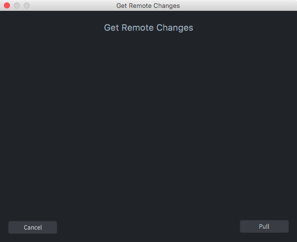
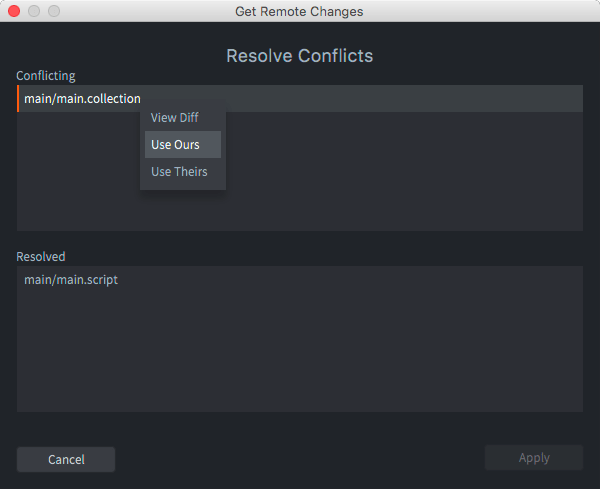
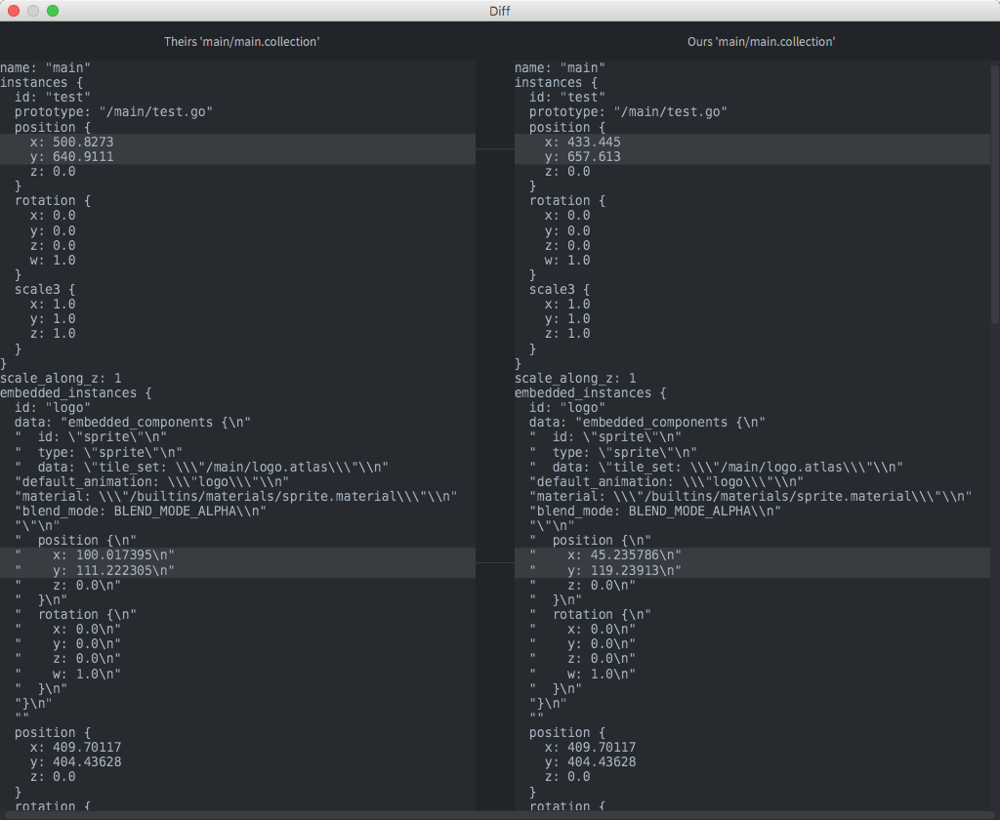
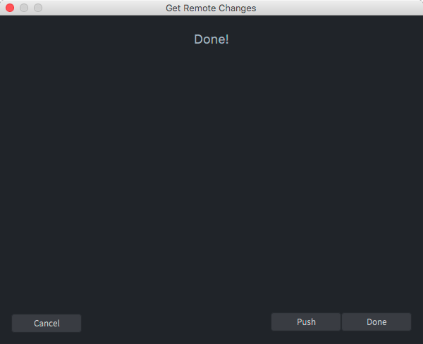
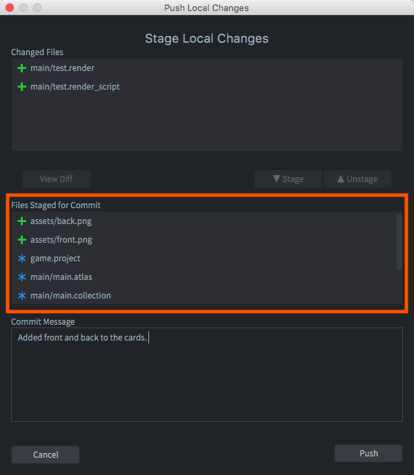

# Контроль версий

Defold создан для небольших команд, которые в тесном сотрудничестве работают над созданием игр. Члены команды могут работать параллельно над одним и тем же контентом с минимальным пересечением. Defold имеет встроенную поддержку контроля версий на базе [Git](https://git-scm.com). Git разработан для распределенной совместной работы и представляет собой чрезвычайно мощный инструмент, позволяющий реализовать широкий спектр рабочих процессов. 

## Измененные файлы 

Когда вы сохраняете изменения в своей локальной рабочей копии, Defold отслеживает все изменения в панели редактора *Changed Files*, перечисляя каждый файл, который был добавлен, удален или изменен.

{srcset="images/workflow/changed_files@2x.png 2x"}

Выберите файл в списке и нажмите <kbd>Diff</kbd>, чтобы просмотреть изменения, которые вы внесли в файл, или <kbd>Revert</kbd>, чтобы откатить все изменения и восстановить файл до состояния, которое он имел после последней синхронизации. 

## Синхронизация

::: important
Синхронизацию проекта также можно выполнить с помощью одного из множества отличных внешних инструментов для работы с Git репозиториями. [GitHub Desktop](https://desktop.github.com/), [GitTower](https://www.git-tower.com), [Git Kraken](https://www.gitkraken.com/git-client) и [SourceTree](https://www.sourcetreeapp.com/) - одни из наиболее популярных. 
:::

Синхронизация проекта означает, что файлы проекта синхронизируются с состоянием проекта на удаленном сервере. Вам следует выполнять синхронизацию, если: 

1. Вы хотите привести свой проект в соответствие с тем, что хранится на сервере.
2. Вы хотите поделиться своими локальными изменениями проекта с другими членами команды, зафиксировав и отправив свои изменения на сервер.

Чтобы начать синхронизацию, выберите в меню пункт <kbd>File ▸ Synchronize</kbd>. Последовательность диалогов проведет вас через процесс синхронизации. 

Нажмите <kbd>Pull</kbd>, чтобы получить изменения с сервера и слить их с вашими локальными изменениями. Если есть конфликты, система попросит вас разрешить их: 

Отметьте каждый конфликтующий файл, щелкните правой кнопкой мыши и выберите действие, которое нужно предпринять: 

View Diff
: Вывести текстовое представление различий вашей и серверной версии файла. 

  

  Слева находится файл, полученный с сервера. Справа показана ваша локальная версия. Любые различия четко выделены, так что вы можете быстро их просмотреть.

   Встроенный инструмент сравнения файлов работает только с текстовыми файлами. Однако, поскольку Defold хранит все рабочие файлы (игровые объекты, коллекции, атласы и т. д.) в легко читаемых файлах JSON, вы зачастую сможете понять смысл изменений, которые были внесены в такие файлы: 

Use Ours
: Отменить изменения с сервера и вместо этого использовать вашу версию.

Use Theirs
: Выкинуть свою версию и использовать вместо нее версию сервера. 

::: sidenote
Редактор не позволяет точечно отбирать изменения из обоих конфликтующих файлов. Если вам нужно это сделать, вы можете выполнять Git операции из командной строки и использовать отдельный инструмент слияния. 
:::

Когда редактор закончит с подтягиванием изменений и все конфликты будут разрешены, появится диалоговое окно с вопросом, как действовать дальше. 

* Нажмите <kbd>Cancel</kbd>, чтобы прервать операцию и вернуть проект в состояние, в котором он находился до синхронизации.
* Нажмите <kbd>Push</kbd>, чтобы продолжить с фиксацией и публикацией ваших изменений на сервер.
* Нажмите <kbd>Done</kbd>, чтобы принять изменения с сервера и разрешения конфликтов, но без последующей публикации. Вы всегда можете опубликоваться на сервер на более позднем этапе. 

Если вы продолжаете публикацию и имеете локальные изменения, вас попросят зафиксировать (commit) их перед публикацией (push-ем). Диалоговое окно позволяет вам выбрать (подготовить) файлы, которые должны быть включены в коммит (обведено оранжевой рамкой на изображении ниже).

Нажмите <kbd>Push</kbd>, чтобы зафиксировать и отправить изменения на сервер. 

## Git

Инструмент Git создан в первую очередь для обработки исходного кода и текстовых файлов и хранит эти типы файлов с минимальными издержками. Сохраняются только изменения (дельты) между каждой версией, что означает, что вы можете вести обширную историю изменений всех файлов вашего проекта с относительно небольшими затратами. Однако двоичные файлы, такие как изображения или звуковые файлы, не получают преимуществ от схемы хранения Git. Каждая новая версия, которую вы регистрируете и синхронизируете, занимает примерно одно и то же место. Обычно это не является серьезной проблемой с конечными ассетами проекта (изображения JPEG или PNG, звуковые файлы OGG и т. д.), н может быстро стать проблемой с рабочими файлами проекта (файлы PSD, проекты Protools и т. д.). Эти типы файлов часто сильно разрастаются в объеме, поскольку вы обычно работаете с гораздо более высоким разрешением, чем целевые ресурсы. Обычно считается, что лучше избегать передачи больших рабочих файлов для Git версионирования и вместо этого использовать для них отдельное хранилище и решение для резервного копирования.

Есть много способов использовать Git в командном рабочем процессе. Defold использует его таким образом. При синхронизации происходит следующее: 

1. Все локальные изменения хранятся в stash-е (stash-атся), поэтому их можно восстановить, если что-то выйдет из строя позже в процессе синхронизации.
2. Стягиваются серверные изменения.
3. Применяется stash с предыдущего шага (восстанавливаются локальные изменения), это может привести к конфликтам слияния, которые необходимо разрешить.
4. Пользователь получает возможность зафиксировать любые изменения в локальном файле.
5. Если есть локальные коммиты, пользователь может отправить их на сервер. Опять же, возможна ситуация, что это приведет к конфликтам, которые необходимо разрешить. 

Если вы предпочитаете другой рабочий процесс, вы можете запустить Git из командной строки или через стороннее приложение для выполнения операций стягивания, публикации, фиксации и слияния, работы с несколькими ветками и т. д. 
