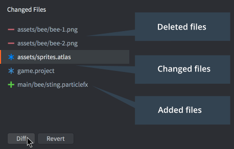

# Контроль версий

Defold создан для небольших команд, которые в тесном сотрудничестве работают над созданием игр. Члены команды могут работать параллельно над одним и тем же контентом с минимальным пересечением. Defold имеет встроенную поддержку контроля версий на базе [Git](https://git-scm.com). Git разработан для распределенной совместной работы и представляет собой чрезвычайно мощный инструмент, позволяющий реализовать широкий спектр рабочих процессов. 

## Измененные файлы 

Когда вы сохраняете изменения в своей локальной рабочей копии, Defold отслеживает все изменения в панели редактора *Changed Files*, перечисляя каждый файл, который был добавлен, удален или изменен.

Выберите файл в списке и нажмите <kbd>Diff</kbd>, чтобы просмотреть изменения, которые вы внесли в файл, или <kbd>Revert</kbd>, чтобы откатить все изменения и восстановить файл до состояния, которое он имел после последней синхронизации. 

## Git

Инструмент Git создан в первую очередь для обработки исходного кода и текстовых файлов и хранит эти типы файлов с минимальными издержками. Сохраняются только изменения (дельты) между каждой версией, что означает, что вы можете вести обширную историю изменений всех файлов вашего проекта с относительно небольшими затратами. Однако двоичные файлы, такие как изображения или звуковые файлы, не получают преимуществ от схемы хранения Git. Каждая новая версия, которую вы регистрируете и синхронизируете, занимает примерно одно и то же место. Обычно это не является серьезной проблемой с конечными ассетами проекта (изображения JPEG или PNG, звуковые файлы OGG и т. д.), н может быстро стать проблемой с рабочими файлами проекта (файлы PSD, проекты Protools и т. д.). Эти типы файлов часто сильно разрастаются в объеме, поскольку вы обычно работаете с гораздо более высоким разрешением, чем целевые ресурсы. Обычно считается, что лучше избегать передачи больших рабочих файлов для Git версионирования и вместо этого использовать для них отдельное хранилище и решение для резервного копирования.

Есть много способов использовать Git в командном рабочем процессе. Defold использует его таким образом. При синхронизации происходит следующее: 

1. Все локальные изменения хранятся в stash-е (stash-атся), поэтому их можно восстановить, если что-то выйдет из строя позже в процессе синхронизации.
2. Стягиваются серверные изменения.
3. Применяется stash с предыдущего шага (восстанавливаются локальные изменения), это может привести к конфликтам слияния, которые необходимо разрешить.
4. Пользователь получает возможность зафиксировать любые изменения в локальном файле.
5. Если есть локальные коммиты, пользователь может отправить их на сервер. Опять же, возможна ситуация, что это приведет к конфликтам, которые необходимо разрешить. 

Если вы предпочитаете другой рабочий процесс, вы можете запустить Git из командной строки или через стороннее приложение для выполнения операций стягивания, публикации, фиксации и слияния, работы с несколькими ветками и т. д. 
