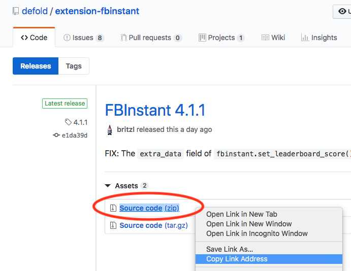

# Работа в оффлайне

Defold в большинстве случаев не требует подключения к Интернету для работы. Однако есть несколько ситуаций, когда требуется подключение к Интернету: 

* Автоматические обновления
* Отправка отчетов о проблемах
* Стягивание зависимостей
* Сборка нативных расширений 

## Автоматические обновления

Defold будет периодически проверять наличие новых обновлений. Проверки обновлений Defold выполняются для [официального сайта загрузки](https://d.defold.com). Если обнаружено обновление, оно будет загружено автоматически. 

Если у вас есть подключение к Интернету только в течение ограниченного периода времени и вы не хотите ждать запуска автоматического обновления, вы можете вручную загрузить новые версии Defold с [официального сайта загрузки](https://d.defold.com).

## Отправка отчетов о проблемах

Если вами была обнаружена проблема в редакторе, вы можете сообщить о проблеме в баг-трекер Defold. Баг-трекер [хостится на GitHub](https://www.github.com/defold/editor2-issues), что означает, что вам нужно подключение к Интернету, чтобы сообщить о проблеме.

Если вы столкнулись с проблемой будучи оффлайн, вы можете вручную сообщить об этом позже, используя опцию [Report Issue в меню «Help»](/manuals/getting-help/#report-a-problem-from-the-editor) редактора.

## Подгрузка зависимостей

Defold поддерживает систему, в которой разработчики могут обмениваться кодом и ассетами через так называемые [Library Projects](/manuals/libraries/). Библиотеки - это zip-файлы, которые можно хостить в любом месте в Интернете. Обычно library-проекты под Defold можно найти на GitHub и других онлайн-репозиториях исходного кода. 

В проект можно добавить библиотеку как [зависимость в настройках проекта](/manuals/project-settings/#dependencies). Зависимости загружаются/обновляются при открытии проекта или в любое время, когда в меню *Project* выбрана опция *Fetch Libraries*.

Если вам нужно работать в автономном режиме и в нескольких проектах, вы можете заранее выкачать зависимости, а затем поделиться ими с помощью локального сервера. Зависимости с GitHub обычно доступны на вкладке Releases конкретного репозитория проекта: 

Можно использовать Python для простого создания локального сервера: 

    python -m SimpleHTTPServer

Эта команда создаст сервер в текущем каталоге, обслуживающий файлы по адресу `localhost:8000`. Если текущий каталог содержит загруженные зависимости, вы можете добавить их в свой файл *game.project*: 

    http://localhost:8000/extension-fbinstant-4.1.1.zip

## Сборка нативных расширений

Defold поддерживает систему, в которой разработчики могут добавлять нативный код для расширения функциональности движка с помощью системы под названием [Native Extensions](/manuals/extensions/). Для нативных расширений Defold предоставляет для сборки простейшую точку входа без каких-либо шагов по установке в виде облачного решения.

При первой сборке проекта, когда проект содержит нативное расширение, нативный код будет скомпилирован и встроен в кастомизированный игровой движок Defold на серверах сборки Defold и отправлен обратно на ваш компьютер. Кастомизированный движок будет кэшироваться в вашем проекте и повторно использоваться для последующих сборок, пока вы не добавляете, не удаляете или не изменяете какие-либо нативные расширения и пока вы не обновляете редактор. 

Если вам нужно работать в оффлайн режиме и ваш проект содержит нативные расширения, вы должны убедиться, что собрали свой проект успешно, по крайней мере, один раз, чтобы быть уверенными, что ваш проект содержит кэшированную копию кастомизированного движка. 
