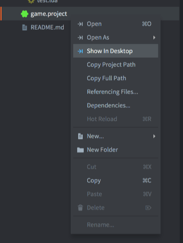
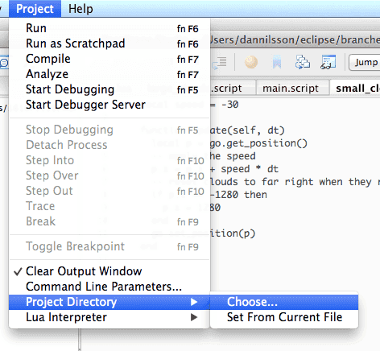
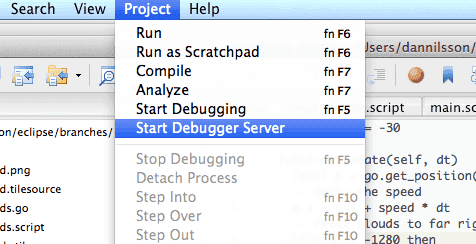

# Отладка Lua-скриптов с помощью ZeroBrane Studio

В Defold есть встроенный отладчик, но также можно использовать бесплатную Lua IDE с открытым исходным кодом, _ZeroBrane Studio_, как внешний отладчик. Чтобы использовать возможности отладки, необходимо установить ZeroBrane Studio. Программа является кроссплатформенной и работает как на macOS, так и на Windows.

Скачать "ZeroBrane Studio" можно с http://studio.zerobrane.com

## Настройка ZeroBrane

Чтобы ZeroBrane смог найти файлы в вашем проекте, нужно указать ему расположение директории проекта Defold. Удобный способ узнать её — использовать пункт <kbd>Show in Desktop</kbd> для файла в корне проекта Defold.

1. Щёлкните правой кнопкой мыши по *game.project*
2. Выберите <kbd>Show in Desktop</kbd>



## Настройка ZeroBrane

Чтобы настроить ZeroBrane, выберите <kbd>Project ▸ Project Directory ▸ Choose...</kbd>:



После того как путь будет настроен в соответствии с текущей директорией проекта Defold, в ZeroBrane должен стать доступен просмотр дерева директорий проекта Defold, а также навигация и открытие файлов.

Другие рекомендуемые, но не обязательные изменения конфигурации приведены ниже в документе.

## Запуск сервера отладки

Перед началом сеанса отладки необходимо запустить встроенный сервер отладки ZeroBrane. Пункт меню для запуска находится в меню <kbd>Project</kbd>. Просто выберите <kbd>Project ▸ Start Debugger Server</kbd>:



## Подключение приложения к отладчику

Отладку можно начать в любой момент жизненного цикла приложения Defold, но её нужно явно инициировать из Lua-скрипта. Lua-код для запуска сеанса отладки выглядит так:

::: sidenote
Если игра завершается при вызове `dbg.start()`, это может означать, что ZeroBrane обнаружил проблему и отправляет игре команду завершения. По какой-то причине ZeroBrane требует, чтобы был открыт какой-либо файл, иначе при запуске сеанса отладки он выдаст сообщение:
"Can't start debugging without an opened file or with the current file not being saved 'untitled.lua')."
Чтобы исправить эту ошибку, откройте в ZeroBrane файл, в который вы добавили `dbg.start()`.
:::

```lua
dbg = require "builtins.scripts.mobdebug"
dbg.start()
```

После добавления этого кода в приложение оно подключится к серверу отладки ZeroBrane (по умолчанию через "localhost") и остановится на следующей инструкции, которая должна быть выполнена.

```txt
Debugger server started at localhost:8172.
Mapped remote request for '/' to '/Users/my_user/Documents/Projects/Defold_project/'.
Debugging session started in '/Users/my_user/Documents/Projects/Defold_project'.
```

После этого можно использовать возможности отладки ZeroBrane: пошаговое выполнение, инспекцию, добавление и удаление точек останова и т.д.

::: sidenote
Отладка будет включена только для того Lua-контекста, из которого она была запущена. Если в *game.project* включён параметр "shared_state", вы сможете отлаживать всё приложение независимо от того, где именно запустили отладку.
:::


Если попытка подключения завершится неудачей (например, потому что сервер отладки не запущен), приложение продолжит работать как обычно после попытки подключения.

## Удалённая отладка

Поскольку отладка происходит через обычные сетевые соединения (TCP), это позволяет выполнять удалённую отладку. Это означает, что приложение можно отлаживать, когда оно запущено на мобильном устройстве.

Единственное, что нужно изменить, — команду запуска отладки. По умолчанию `start()` пытается подключиться к localhost, но для удалённой отладки нужно явно указать адрес сервера отладки ZeroBrane, например так:

```lua
dbg = require "builtins.scripts.mobdebug"
dbg.start("192.168.5.101")
```

Это также означает, что важно убедиться в наличии сетевого соединения у удалённого устройства и в том, что файрволы и другое подобное ПО разрешают TCP-подключения через порт 8172. Иначе приложение может зависнуть при запуске, когда будет пытаться подключиться к вашему серверу отладки.

## Другие рекомендуемые настройки ZeroBrane

ZeroBrane можно настроить так, чтобы он автоматически открывал Lua-файлы во время отладки. Это позволяет переходить в функции из других исходных файлов без необходимости открывать их вручную.

Первый шаг — открыть файл конфигурации редактора. Рекомендуется изменять пользовательскую версию этого файла.

- Выберите <kbd>Edit ▸ Preferences ▸ Settings: User</kbd>
- Добавьте в конфигурационный файл следующее:

  ```txt
  - to automatically open files requested during debugging
  editor.autoactivate = true
  ```

- Перезапустите ZeroBrane


