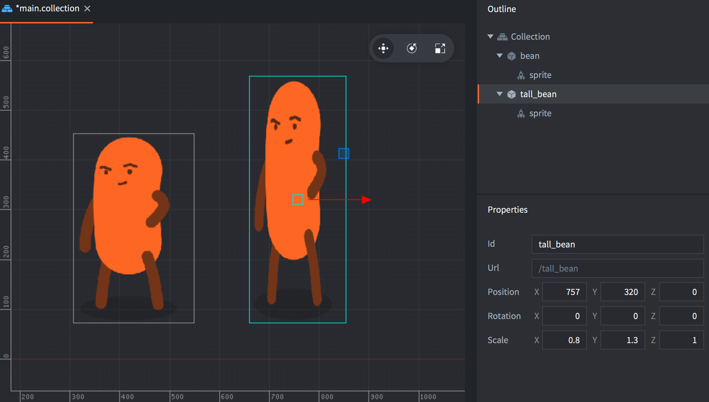

Компоненты используются для придания игровым объектам определенной выразительности и/или функциональности. Компоненты должны находиться внутри игровых объектов, причем на них влияет положение, вращение и масштаб игрового объекта который этот компонент содержит:

{srcset="../shared/images/components@2x.png 2x"}

Многие компоненты обладают специфическими свойствами, которыми можно манипулировать, а для взаимодействия с ними во время выполнения доступны функции, специфичные для конкретного типа компонента:

```lua
-- disable the can "body" sprite
msg.post("can#body", "disable")

-- play "hoohoo" sound on "bean" in 1 second
sound.play("bean#hoohoo", { delay = 1, gain = 0.5 } )
```

Компоненты добавляются в игровой объект либо непосредственно на месте, либо в виде ссылки на файл компонента:

Сделайте <kbd>двойной клик</kbd> на игровом объекте в представлении *Outline* и выберите <kbd>Add Component</kbd> (добавить на месте) или <kbd>Add Component File</kbd> (добавить как ссылку на файл).

В большинстве случаев имеет смысл создавать компоненты на месте, но следующие типы компонентов должны быть созданы в отдельных файлах ресурсов, прежде чем они будут добавлены в игровой объект по ссылке:

* Скрипт (Script)
* GUI
* Эффекты частиц (Particle FX)
* Тайловая карта (Tile Map)
