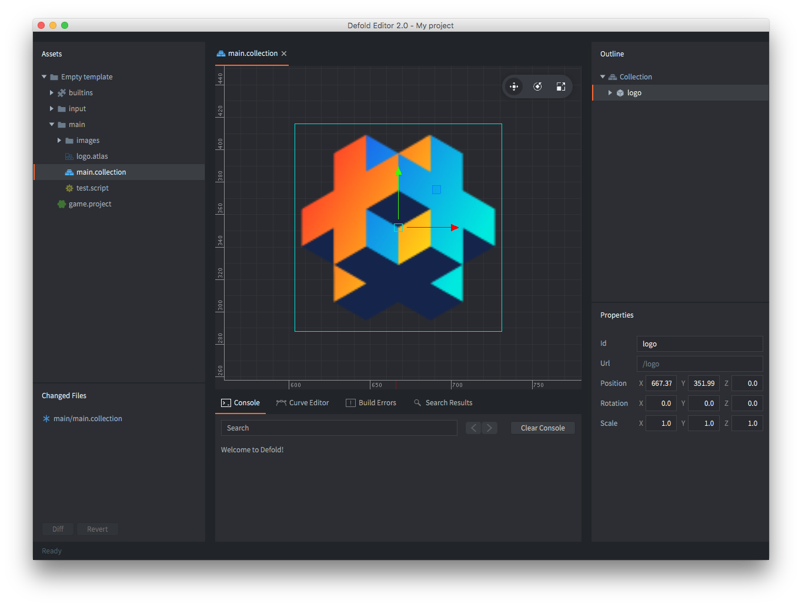

## Редакторы 1 и 2

Сейчас мы переходим на Defold editor 2, который на данный момент находится в стадии beta. Большая часть новой документации уже делается для нового редактора, и со временем мы обновим всю документацию, но это займёт время. Версию редактора на скриншотах можно определить по цветовой теме.

У editor 2 приятная тёмная тема:

У editor 1 стандартная светлая тема:

Будем рады, если вы [попробуете новый редактор](https://www.defold.com/editor-two/).
