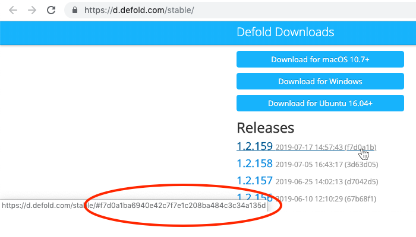

## Загрузка

Перейдите на [страницу загрузки Defold](https://defold.com/download/), где найдете кнопку загрузки для macOS, Windows и Linux (Ubuntu):


## Установка

Установка в macOS
: Загруженный файл представляет собой DMG-образ, содержащий программу.

  1. Перейдите к расположению файла "Defold-x86_64-macos.dmg" и выполните двойной клик по нему, чтобы открыть этот образ.
  2. Перетащите приложение "Defold" на ссылку папки "Applications".

  Чтобы запустить редактор, откройте папку "Applications" и выполните <kbd>двойной клик</kbd> по файлу "Defold".

  

Установка в Windows
: Загруженный файл представляет собой ZIP-архив, который необходимо распаковать:

  1. Перейдите к расположению файла архива "Defold-x86_64-win32.zip", <kbd>кликните ПКМ</kbd> по папке и выберите команду *Extract All*, затем следуйте инструкциям, чтобы извлечь архив в папку с именем "Defold".
  2. Переместите папку "Defold" в "C:\Program Files (x86)\".

  Чтобы запустить редактор, откройте папку "Defold" и выполните <kbd>двойной клик</kbd> по файлу "Defold.exe".

  

Установка в Linux
: Загруженный файл представляет собой ZIP-архив, который необходимо распаковать:

  1. В терминале перейдите к расположению файла архива "Defold-x86_64-linux.zip" и распакуйте его в целевой каталог с именем "Defold".

     ```bash
     $ unzip Defold-x86_64-linux.zip -d Defold
     ```

  Чтобы запустить редактор, перейдите в каталог, куда было извлечено приложение, затем запустите исполняемый файл `Defold` или выполните по нему <kbd>двойной клик</kbd> в файловом менеджере.

  ```bash
  $ cd Defold
  $ ./Defold
  ```

  Если возникнут проблемы с запуском редактора, открытием проекта или запуском игры на Defold, обращайтесь к разделу [часто задаваемых попросов по Linux](/faq/faq#linux-issues).

## Установка устаревших версий

### Со страницы релиза Defold на GitHub

Каждая стабильная версия Defold также [публикуется на GitHub](https://github.com/defold/defold/releases).

### Со страницы загрузки Defold

Старые версии редактора можно загрузить и установить по следующим ссылкам:

* Windows: https://d.defold.com/archive/%sha1%/stable/editor2/Defold-x86_64-win32.zip
* macOS: https://d.defold.com/archive/%sha1%/stable/editor2/Defold-x86_64-macos.dmg
* Linux: https://d.defold.com/archive/%sha1%/stable/editor2/Defold-x86_64-linux.zip

Следует заменить `%sha1%` на хэш релиза редактора, представляющего требуемую версию. Хэш каждой версии Defold можно обнаружить в ссылках на выпущенную версию на странице загрузки по адресу https://d.defold.com/stable/ (убедитесь, что скопировали только буквенно-цифровую часть без предшествующего символа "#"):


