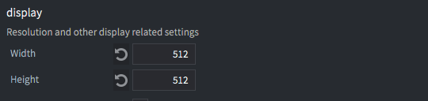
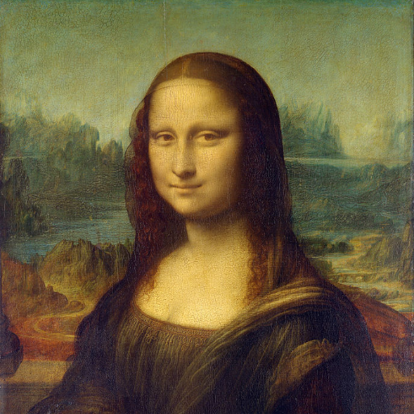
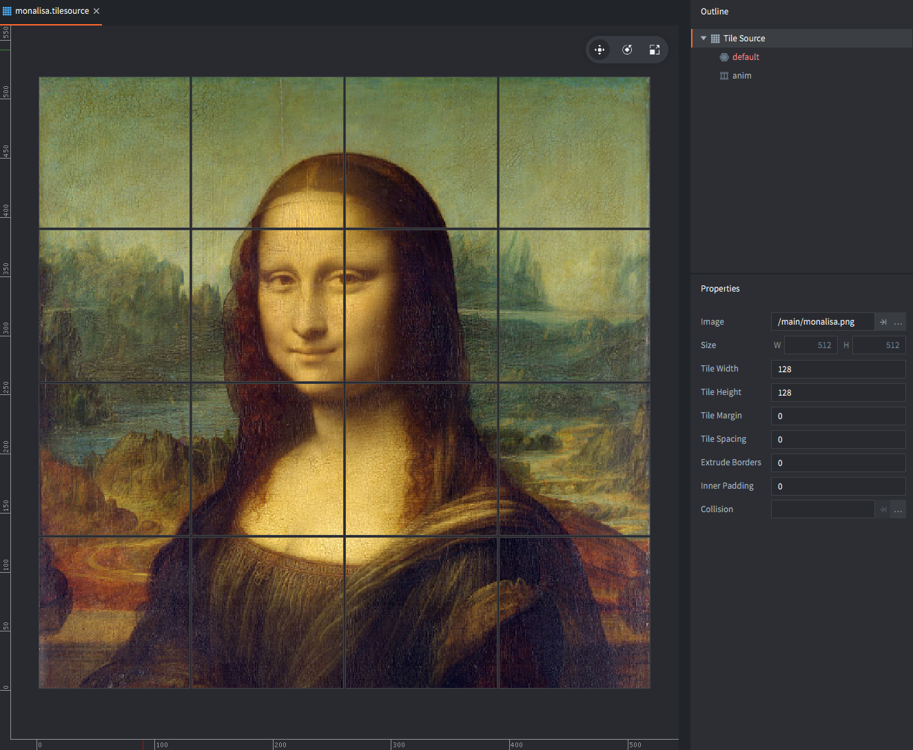
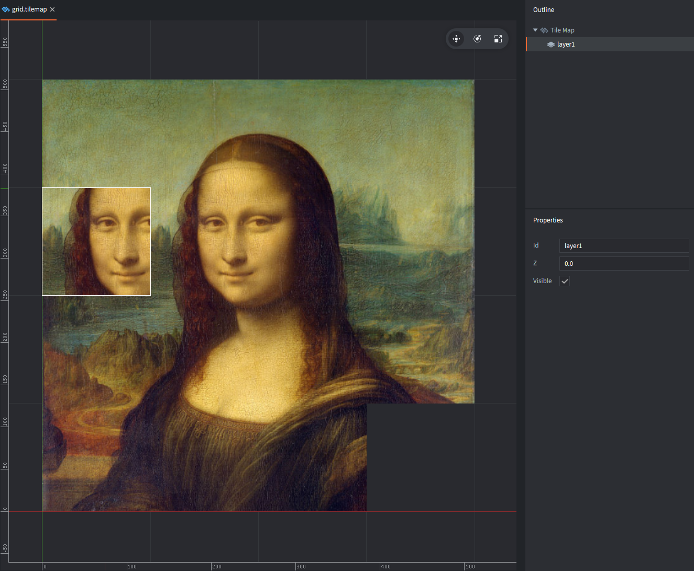
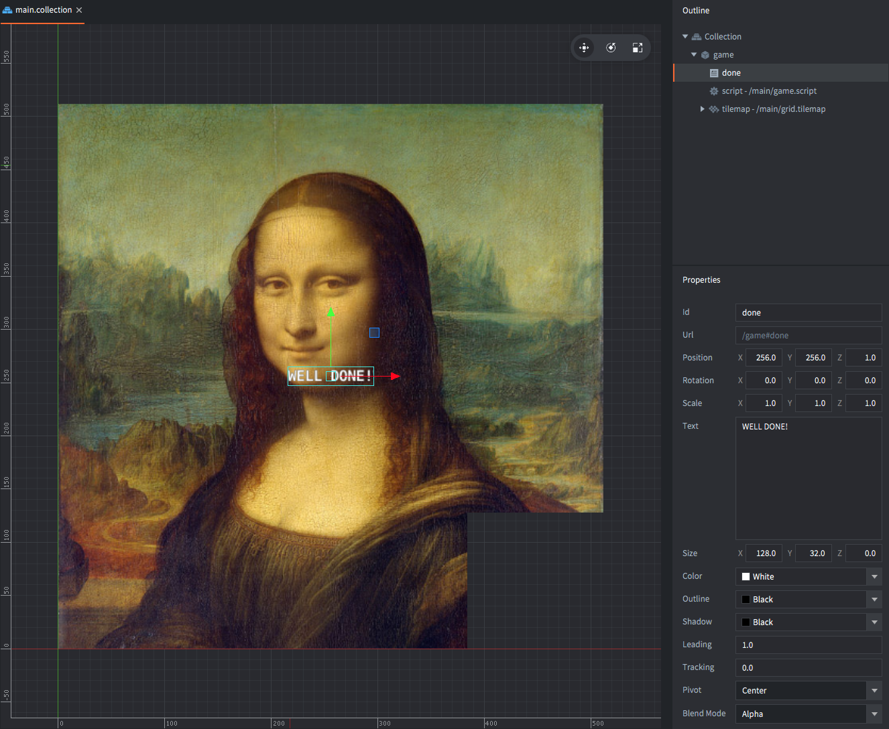
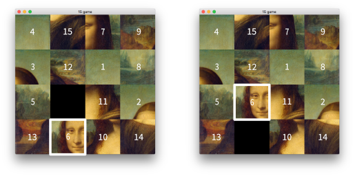
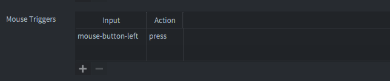

# Классическая «пятнашка»

Эта известная головоломка стала популярной в США еще в 1870-х годах. Цель игры — собрать плитки на поле в правильном порядке, сдвигая их по горизонтали и вертикали. Игра начинается с перемешанного положения плиток.

Самый распространенный вариант использует числа от 1 до 15. Но можно сделать задачу интереснее, если превратить плитки в фрагменты изображения. Прежде чем начать, попробуйте решить головоломку в готовом виде: нажмите на плитку рядом с пустой клеткой, чтобы сдвинуть ее в пустое место.

## Создание проекта

1. Запустите Defold.
2. Слева выберите *New Project*.
3. Перейдите на вкладку *From Template*.
4. Выберите *Empty Project*.
5. Укажите место для проекта на локальном диске.
6. Нажмите *Create New Project*.

Откройте файл настроек *game.project* и задайте размер игры 512⨉512. Эти размеры будут совпадать с изображением, которое вы будете использовать.



Следующий шаг — подобрать подходящее изображение для головоломки. Возьмите любое квадратное изображение, но убедитесь, что оно масштабировано до 512 на 512 пикселей. Если не хотите искать картинку самостоятельно, можно использовать эту:



Скачайте изображение и перетащите его в папку *main* вашего проекта.

## Представление сетки

В Defold есть встроенный компонент *Tilemap*, который отлично подходит для визуализации поля головоломки. Tilemap позволяет задавать и читать отдельные плитки, а для этого проекта этого достаточно.

Но прежде чем создавать tilemap, нужен *Tilesource*, из которого tilemap будет брать изображения плиток.

<kbd>Щелкните правой кнопкой</kbd> по папке *main* и выберите <kbd>New ▸ Tile Source</kbd>. Назовите новый файл `monalisa.tilesource`.

Установите свойства *Width* и *Height* равными 128. Тогда изображение размером 512⨉512 будет разрезано на 16 плиток. На tilemap они получат номера от 1 до 16.



Затем <kbd>щелкните правой кнопкой</kbd> по папке *main* и выберите <kbd>New ▸ Tile Map</kbd>. Назовите новый файл "grid.tilemap".

Defold требует инициализировать сетку. Для этого выберите слой "layer1" и нарисуйте сетку 4⨉4 чуть правее и выше точки начала координат. Неважно, какие именно плитки вы поставите: немного позже код автоматически задаст нужное содержимое.



## Собираем все вместе

Откройте *main.collection*. <kbd>Щелкните правой кнопкой</kbd> по корневому узлу в *Outline* и выберите <kbd>Add Game Object</kbd>. Для нового игрового объекта задайте *Id* = "game".

<kbd>Щелкните правой кнопкой</kbd> по этому объекту и выберите <kbd>Add Component File</kbd>. Выберите файл *grid.tilemap*. Для компонента задайте *Id* = "tilemap".

<kbd>Щелкните правой кнопкой</kbd> по игровому объекту снова и выберите <kbd>Add Component ▸ Label</kbd>. Для label задайте *Id* = "done", а в *Text* впишите "Well done". Переместите метку в центр tilemap.

Установите Z-позицию label в 1, чтобы текст рисовался поверх сетки.



Теперь создайте Lua-скрипт для логики игры: <kbd>щелкните правой кнопкой</kbd> по папке *main* и выберите <kbd>New ▸ Script</kbd>. Назовите файл "game.script".

После этого <kbd>щелкните правой кнопкой</kbd> по объекту "game" в *main.collection* и выберите <kbd>Add Component File</kbd>. Подключите файл *game.script*.

Запустите игру. Вы увидите сетку, которую только что создали, и метку "Well done" поверх нее.

## Логика головоломки

Все основные элементы уже на месте, поэтому оставшаяся часть руководства посвящена логике самой головоломки.

Скрипт будет хранить собственное представление поля отдельно от tilemap. Так с ним удобнее работать. Вместо двумерного массива плитки хранятся как одномерный список в Lua-таблице. Список идет последовательно от верхнего левого угла к нижнему правому:

```lua
-- The completed board looks like this:
self.board = {1, 2, 3, 4, 5, 6, 7, 8, 9, 10, 11, 12, 13, 14, 15, 0}
```

Код, который берет такой список и рисует его на tilemap, довольно простой, но ему нужно преобразовать позицию списка в координаты x и y:

```lua
-- Draw a table list of tiles onto a 4x4 tilemap
local function draw(t)
    for i=1, #t do
        local y = 5 - math.ceil(i/4) -- <1>
        local x = i - (math.ceil(i/4) - 1) * 4
        tilemap.set_tile("#tilemap","layer1",x,y,t[i])
    end
end
```
1. В tilemap плитка с x = 1 и y = 1 находится в левом нижнем углу, поэтому координату y нужно инвертировать.

Проверить функцию можно с временным `init()`:

```lua
function init(self)
    -- An inverted board, for test
    self.board = {15, 14, 13, 12, 11, 10, 9, 8, 7, 6, 5, 4, 3, 2, 1, 0}
    draw(self.board)
end
```

Если плитки хранятся в списке Lua, то перемешать их очень легко: достаточно пройти по элементам и поменять каждый из них с другим, выбранным случайно.

```lua
-- Swap two items in a table list
local function swap(t, i, j)
    local tmp = t[i]
    t[i] = t[j]
    t[j] = tmp
    return t
end

-- Randomize the order of a the elements in a table list
local function scramble(t)
    local n = #t
    for i = 1, n - 1 do
        t = swap(t, i, math.random(i, n))
    end
    return t
end
```

Но у «пятнашки» есть важный нюанс: если просто случайно перемешать плитки, примерно в половине случаев головоломка окажется *нерешаемой*.

Показывать игроку нерешаемую задачу нельзя, поэтому нужно уметь определять, можно ли решить текущее состояние.

## Проверка решаемости

Чтобы понять, решаема ли конфигурация поля 4⨉4, нужны две вещи:

1. Количество «инверсий». Инверсия — это ситуация, когда плитка стоит раньше плитки с меньшим номером. Например, список `{1, 2, 3, 4, 5, 6, 7, 8, 9, 12, 11, 10, 13, 14, 15, 0}` содержит 3 инверсии:

    - число 12 имеет после себя 11 и 10, то есть 2 инверсии;
    - число 11 имеет после себя 10, то есть еще 1 инверсию.

    (В собранной головоломке инверсий нет.)

2. Номер строки, в которой находится пустая клетка (0).

Эти два значения можно получить такими функциями:

```lua
-- Count the number of inversions in a list of tiles
local function inversions(t)
    local inv = 0
    for i=1, #t do
        for j=i+1, #t do
            if t[i] > t[j] and t[j] ~= 0 then -- <1>
                inv = inv + 1
            end
        end
    end
    return inv
end
```
1. Пустая клетка не считается.

```lua
-- Find the x and y position of a given tile
local function find(t, tile)
    for i=1, #t do
        if t[i] == tile then
            local y = 5 - math.ceil(i/4) -- <1>
            local x = i - (math.ceil(i/4) - 1) * 4
            return x,y
        end
    end
end
```
1. Координата y считается снизу.

После этого можно определить, решаема ли конфигурация поля 4⨉4. Она *решаема*, если:

- пустая клетка находится в *нечетной* строке (1 или 3, считая снизу), а число инверсий *четное*;
- пустая клетка находится в *четной* строке (2 или 4, считая снизу), а число инверсий *нечетное*.

## Почему это работает?

Каждый допустимый ход меняет местами какую-то плитку и пустую клетку по горизонтали или вертикали.

При горизонтальном ходе количество инверсий не меняется, и строка пустой клетки тоже не меняется.

А вот вертикальный ход меняет четность числа инверсий и одновременно меняет четность строки пустой клетки.

Например:



Такой ход меняет порядок плиток с:

`{ ... 0, 11, 2, 13, 6 ... }`

на:

`{ ... 6, 11, 2, 13, 0 ... }`

Новое состояние добавляет 3 инверсии:

- число `6` добавляет 1 инверсию (`2` теперь идет после `6`);
- число `11` теряет 1 инверсию (`6` теперь стоит перед `11`);
- число `13` теряет 1 инверсию (`6` теперь стоит перед `13`).

При вертикальном сдвиге число инверсий может измениться на ±1 или ±3, а строка пустой клетки — на ±1.

В конечном состоянии пустая клетка находится в правом нижнем углу (*нечетная* строка 1), а число инверсий равно *четному* значению 0. Каждый допустимый ход либо оставляет обе эти характеристики без изменений, либо меняет их четность (горизонтальный ход) или их полярность (вертикальный ход). Ни один допустимый ход не может сделать полярность инверсий и строки пустой клетки *нечетной*, *нечетной* или *четной*, *четной*.

Любая конфигурация, в которой оба числа либо нечетные, либо оба четные, поэтому неразрешима.

Проверка решаемости выглядит так:

```lua
-- Is the given table list of 4x4 tiles solvable?
local function solvable(t)
    local x,y = find(t, 0)
    if y % 2 == 1 and inversions(t) % 2 == 0 then
        return true
    end
    if y % 2 == 0 and inversions(t) % 2 == 1 then
        return true
    end
    return false    
end
```

## Пользовательский ввод

Осталось сделать головоломку интерактивной.

Создайте `init()`, который выполнит всю инициализацию в рантайме:

```lua
function init(self)
    msg.post(".", "acquire_input_focus") -- <1>
    math.randomseed(socket.gettime()) -- <2>
    self.board = scramble({1, 2, 3, 4, 5, 6, 7, 8, 9, 10, 11, 12, 13, 14, 15, 0}) -- <3>
    while not solvable(self.board) do -- <4>
        self.board = scramble(self.board)
    end
    draw(self.board) -- <5>
    self.done = false -- <6>
    msg.post("#done", "disable") -- <7>
end
```
1. Сообщаем движку, что этот игровой объект должен получать ввод.
2. Инициализируем генератор случайных чисел.
3. Создаем начальное случайное состояние поля.
4. Если состояние нерешаемо, перемешиваем снова.
5. Рисуем поле.
6. Ставим флаг завершения, чтобы отслеживать победу.
7. Скрываем метку с сообщением о завершении.

Откройте */input/game.input_bindings* и добавьте новый *Mouse Trigger*. Назовите действие "press":



Теперь вернитесь в скрипт и создайте `on_input()`:

```lua
-- Deal with user input
function on_input(self, action_id, action)
    if action_id == hash("press") and action.pressed and not self.done then -- <1>
        local x = math.ceil(action.x / 128) -- <2>
        local y = math.ceil(action.y / 128)
        local ex, ey = find(self.board, 0) -- <3>
        if math.abs(x - ex) + math.abs(y - ey) == 1 then -- <4>
            self.board = swap(self.board, (4-ey)*4+ex, (4-y)*4+x) -- <5>
            draw(self.board) -- <6>
        end
        ex, ey = find(self.board, 0)
        if inversions(self.board) == 0 and ex == 4 then -- <7>
            self.done = true
            msg.post("#done", "enable")
        end
    end
end
```
1. Если нажата кнопка мыши и игра еще не завершена, продолжаем обработку.
2. Вычисляем, по какой клетке нажал пользователь.
3. Находим текущую позицию пустой клетки.
4. Если выбранная клетка находится слева, справа, сверху или снизу от пустой, продолжаем.
5. Меняем местами выбранную плитку и пустую клетку.
6. Перерисовываем обновленное поле.
7. Если инверсий больше нет и пустая клетка находится в правом столбце, головоломка собрана.
8. Устанавливаем флаг завершения.
9. Показываем/включаем сообщение о завершении.

На этом все: игра готова.

## Полный скрипт

Ниже — полный код скрипта целиком:

```lua
local function inversions(t)
    local inv = 0
    for i=1, #t do
        for j=i+1, #t do
            if t[i] > t[j] and t[j] ~= 0 then
                inv = inv + 1
            end
        end
    end
    return inv
end

local function find(t, tile)
    for i=1, #t do
        if t[i] == tile then
            local y = 5 - math.ceil(i/4)
            local x = i - (math.ceil(i/4) - 1) * 4
            return x,y
        end
    end
end

local function solvable(t)
    local x,y = find(t, 0)
    if y % 2 == 1 and inversions(t) % 2 == 0 then
        return true
    end
    if y % 2 == 0 and inversions(t) % 2 == 1 then
        return true
    end
    return false    
end

local function scramble(t)
    for i=1, #t do
        local tmp = t[i]
        local r = math.random(#t)
        t[i] = t[r]
        t[r] = tmp
    end
    return t
end

local function swap(t, i, j)
    local tmp = t[i]
    t[i] = t[j]
    t[j] = tmp
    return t
end

local function draw(t)
    for i=1, #t do
        local y = 5 - math.ceil(i/4)
        local x = i - (math.ceil(i/4) - 1) * 4
        tilemap.set_tile("#tilemap","layer1",x,y,t[i])
    end
end

function init(self)
    msg.post(".", "acquire_input_focus")
    math.randomseed(socket.gettime())
    self.board = scramble({1, 2, 3, 4, 5, 6, 7, 8, 9, 10, 11, 12, 13, 14, 15, 0})   
    while not solvable(self.board) do
        self.board = scramble(self.board)
    end
    draw(self.board)
    self.done = false
    msg.post("#done", "disable")
end

function on_input(self, action_id, action)
    if action_id == hash("press") and action.pressed and not self.done then
        local x = math.ceil(action.x / 128)
        local y = math.ceil(action.y / 128)
        local ex, ey = find(self.board, 0)
        if math.abs(x - ex) + math.abs(y - ey) == 1 then
            self.board = swap(self.board, (4-ey)*4+ex, (4-y)*4+x)
            draw(self.board)
        end
        ex, ey = find(self.board, 0)
        if inversions(self.board) == 0 and ex == 4 then
            self.done = true
            msg.post("#done", "enable")
        end
    end
end

function on_reload(self)
    self.done = false
    msg.post("#done", "disable")
end
```

## Дальнейшие упражнения

1. Сделайте поле `5⨉5`, а потом `6⨉5`. Убедитесь, что проверка решаемости по-прежнему работает.
2. Добавьте анимацию скольжения. Плитки tilemap нельзя двигать по отдельности, поэтому придется придумать обходной путь. Например, можно использовать отдельную tilemap только для движущейся плитки.
