# Создаем машину

Если вы новичок в Defold, это руководство поможет освоиться в редакторе. Заодно вы познакомитесь с основными идеями и самыми распространенными строительными блоками движка: игровыми объектами, коллекциями, скриптами и спрайтами.

Мы начнем с пустого проекта и шаг за шагом соберем очень маленькое, но уже работающее приложение. После этого у вас должно появиться хорошее представление о том, как устроен Defold, и вы сможете переходить к более крупным руководствам или сразу к мануалам.

::: sidenote
На протяжении всего руководства подробные пояснения по концепциям и действиям отмечены вот так. Если вам кажется, что эти блоки слишком подробные, их можно пропускать.
:::

## Создание нового проекта

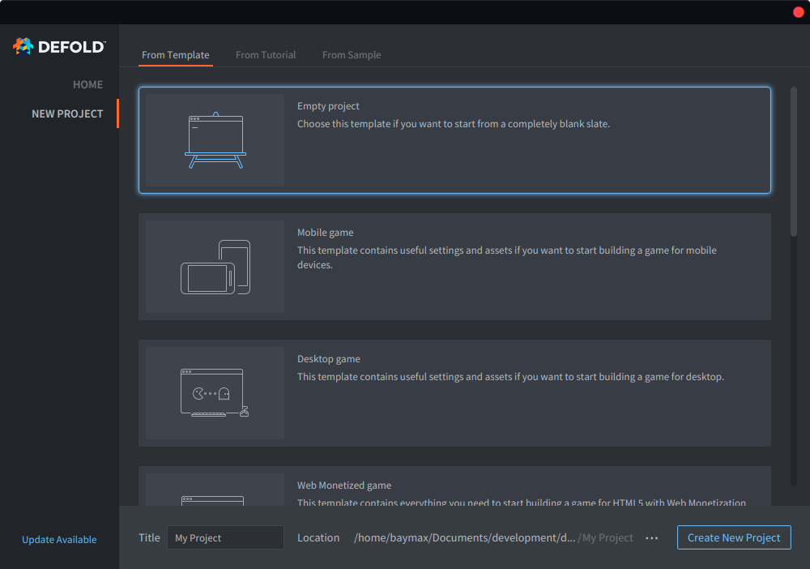

1. Запустите Defold.
2. Слева выберите *New Project*.
3. Перейдите на вкладку *From Template*.
4. Выберите *Empty Project*.
5. Укажите место для проекта на локальном диске.
6. Нажмите *Create New Project*.

## Редактор

Сначала создайте [новый проект](/manuals/project-setup/) и откройте его в редакторе. Если дважды щелкнуть файл *main/main.collection*, он откроется в редакторе:

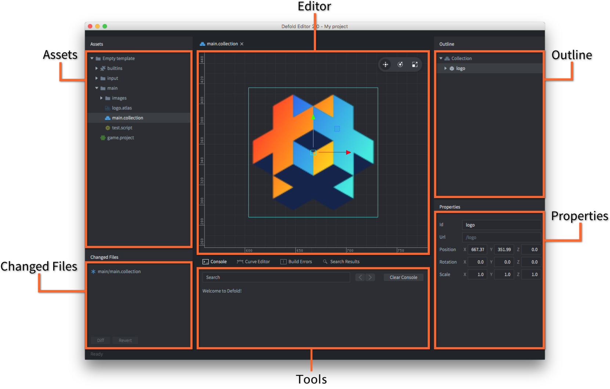

Редактор состоит из нескольких основных областей:

Assets pane
: Это представление всех файлов проекта. У разных типов файлов разные значки. Двойной щелчок открывает файл в соответствующем редакторе. Специальная папка *builtins* доступна во всех проектах и содержит полезные ресурсы: стандартный render script, шрифты, материалы для разных компонентов и другое.

Main Editor View
: В зависимости от типа редактируемого файла здесь показывается соответствующий редактор. Чаще всего используется редактор сцены. Каждый открытый файл отображается в отдельной вкладке.

Changed Files
: Список всех изменений, сделанных в текущей ветке с момента последней синхронизации. Если в этой панели что-то есть, значит у вас есть изменения, которых еще нет на сервере. Отсюда можно открыть текстовый diff и откатить изменения.

Outline
: Иерархическое представление текущего файла. Здесь можно добавлять, удалять, изменять и выбирать объекты и компоненты.

Properties
: Свойства выбранного объекта или компонента.

Console
: Во время запуска игры здесь отображается вывод движка: логи, ошибки, отладочная информация и пользовательские вызовы `print()` и `pprint()`. Если игра не запускается, в первую очередь стоит смотреть сюда.

## Запуск игры

Шаблон "Empty Project" на самом деле полностью пуст. Но даже в нем можно выбрать <kbd>Project ▸ Build</kbd>, чтобы собрать проект и запустить игру.

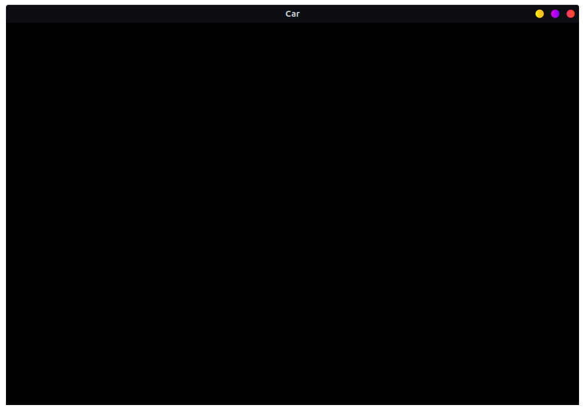

Черный экран вряд ли впечатляет, но это уже работающее приложение Defold, и его легко превратить во что-то интереснее. Этим и займемся.

::: sidenote
Редактор Defold работает с файлами. Двойным щелчком по файлу в *Assets pane* вы открываете его в подходящем редакторе и можете менять его содержимое.

Когда вы закончили редактирование файла, его нужно сохранить. Выберите <kbd>File ▸ Save</kbd>. Несохраненные изменения редактор помечает звездочкой `*` в заголовке вкладки.


:::

## Собираем машину

Сначала создадим новую коллекцию. Коллекция — это контейнер для игровых объектов, которые вы размещаете и настраиваете. Чаще всего коллекции используют для сборки уровней, но они полезны везде, где нужно переиспользовать группу объектов. Можно думать о коллекции как о разновидности prefab.

Выберите папку *main* в *Assets pane*, затем щелкните правой кнопкой и выберите <kbd>New ▸ Collection File</kbd>. То же самое доступно через <kbd>File ▸ New ▸ Collection File</kbd>.

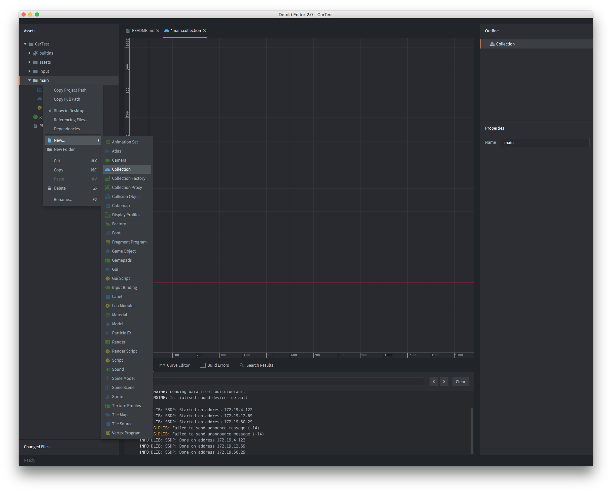

Назовите файл `car.collection` и откройте его. В этой пустой коллекции мы соберем машину из нескольких игровых объектов. Игровой объект — это контейнер для компонентов: спрайтов, звуков, логики, скриптов и так далее. Внутри игры каждый объект имеет свой уникальный id. Объекты могут обмениваться сообщениями, но до этого мы доберемся позже.

Игровой объект можно создать прямо внутри коллекции, как мы и сделаем. Такой объект существует в единственном экземпляре. Его можно копировать, но каждая копия будет самостоятельной: изменение одной не повлияет на остальные. Поэтому такие объекты удобно использовать там, где не нужно много повторяющихся экземпляров.

А вот игровой объект, сохраненный в отдельном _файле_, работает как прототип. Когда вы размещаете его экземпляры в коллекции, они создаются _по ссылке_ на этот прототип. Если вы меняете прототип, все экземпляры обновляются автоматически.

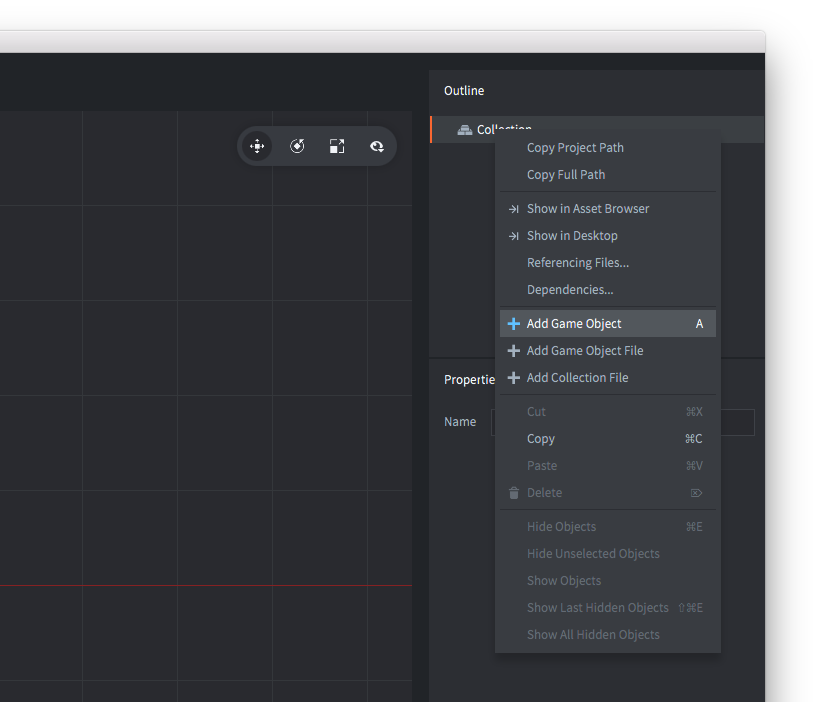

Выберите корневой узел "Collection" в *Outline*, щелкните правой кнопкой и выберите <kbd>Add Game Object</kbd>. В коллекции появится новый объект с id `go`. Выберите его и в *Properties* поменяйте id на `car`.

Пока объект `car` ничего не делает: у него нет графики и нет логики. Чтобы добавить визуальную часть, нам нужен компонент sprite.

Компоненты расширяют игровые объекты визуальным представлением (графика, звук) и функциональностью (factory, collision, scripted behavior). Компонент не существует сам по себе — он всегда находится внутри игрового объекта. Чаще всего компоненты создаются прямо в том же файле, что и объект. Но если компонент нужно переиспользовать, его можно хранить в отдельном файле и подключать по ссылке. Некоторые типы компонентов, например Lua-скрипты, всегда задаются через отдельные файлы.

Важно помнить, что напрямую вы работаете не с компонентами, а с игровыми объектами, которые эти компоненты содержат.

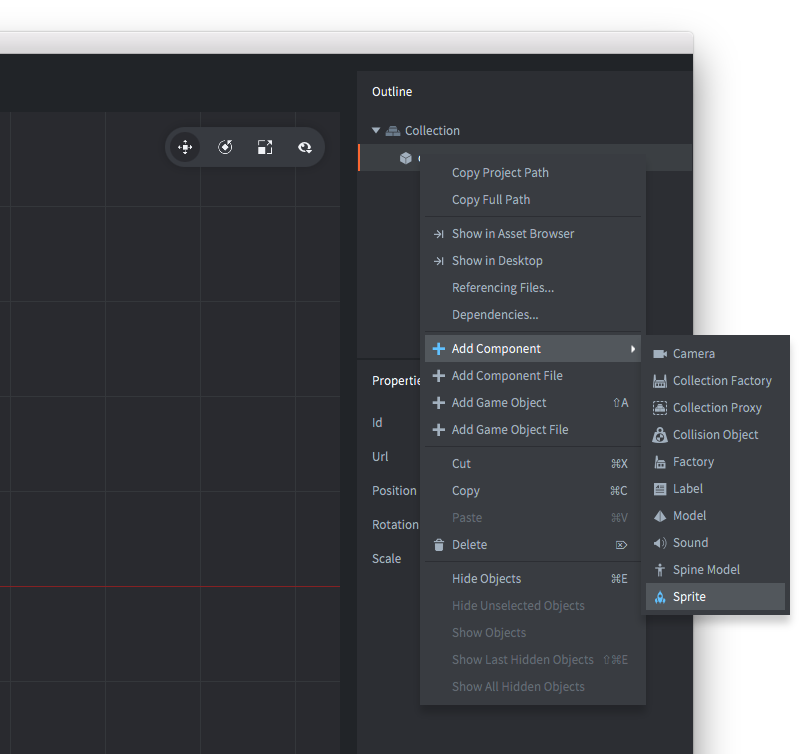

Выберите игровой объект `car`, щелкните правой кнопкой и выберите <kbd>Add Component</kbd>, затем выберите *Sprite* и нажмите *Ok*. Если отметить sprite в *Outline*, станет видно, что ему нужно задать несколько свойств:

Image
: Спрайту нужен источник изображений. Создайте atlas: выберите `main` в *Assets pane*, затем <kbd>New ▸ Atlas File</kbd>. Назовите файл `sprites.atlas` и откройте его двойным щелчком. Скачайте два изображения ниже, сохраните их на диск и перетащите в папку *main*. Затем выберите корневой узел atlas, щелкните правой кнопкой и выберите <kbd>Add Images</kbd>. Добавьте туда картинку машины и картинку колеса. После этого можно выбрать `sprites.atlas` в качестве источника изображения для sprite-компонента объекта `car`.

Изображения для игры:


Добавьте эти изображения в atlas:

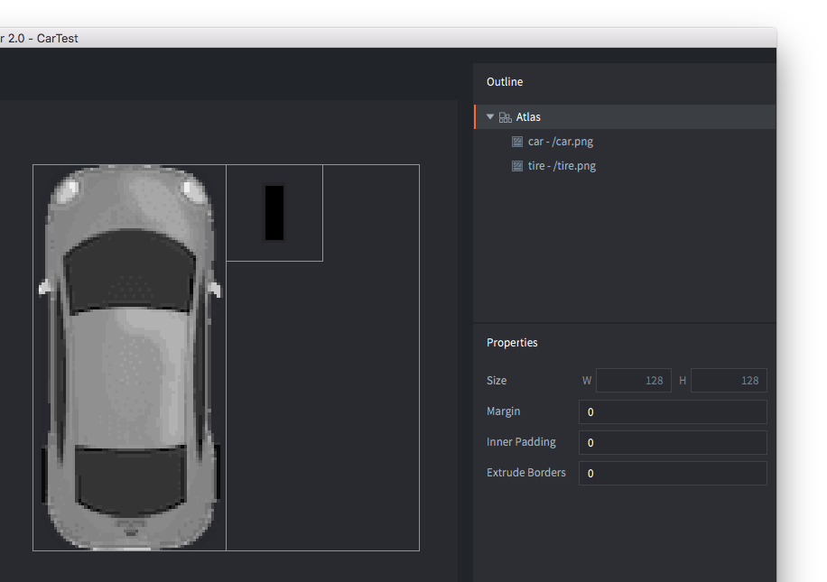

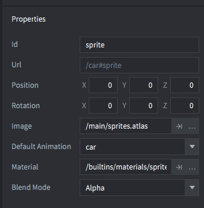

Default Animation
: Установите значение `car` (или имя, которое вы дали картинке машины). Каждому sprite нужен animation по умолчанию. Когда вы добавляете изображения в atlas, Defold автоматически создает для каждого файла однокадровую анимацию.

## Дорабатываем машину

Теперь добавьте в коллекцию еще два игровых объекта. Назовите их `left_wheel` и `right_wheel` и добавьте в каждый sprite-компонент, использующий изображение колеса из `sprites.atlas`. Затем перетащите оба объекта на `car`, чтобы они стали дочерними.

Дочерние игровые объекты следуют за своим родителем, когда тот двигается. При этом их можно двигать и отдельно, но движение всегда считается относительно родителя. Для колес это как раз то, что нужно: они будут двигаться вместе с машиной, а мы сможем слегка поворачивать их влево и вправо при рулении.

Расположите колеса, выбрав их и активировав <kbd>Scene ▸ Move Tool</kbd>. Переместите объекты в нужные места с помощью стрелок или центрального зеленого квадрата. Последний шаг — убедиться, что колеса рисуются под машиной. Для этого задайте им Z-позицию `-0.5`. Визуальные элементы рисуются от дальних к ближним по значению Z. У машины Z по умолчанию `0`, поэтому `-0.5` для колес гарантирует, что они окажутся позади.

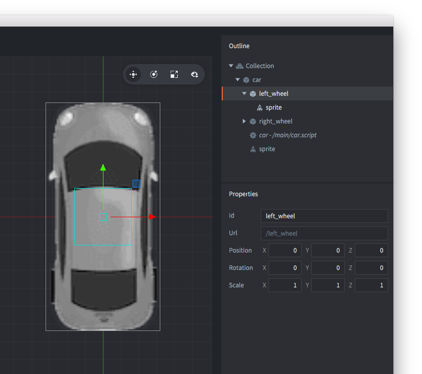

## Скрипт машины

Последний элемент — _script_, который будет управлять машиной. Скрипт — это компонент с программой, описывающей поведение игрового объекта. С помощью скриптов вы задаете правила игры и реакции объектов на действия игрока и другие события. Все скрипты пишутся на Lua.

Выберите `main` в *Assets pane*, щелкните правой кнопкой и выберите <kbd>New ▸ Script File</kbd>. Назовите файл `car.script`, затем добавьте его к объекту `car`: выберите `car` в *Outline*, щелкните правой кнопкой, выберите <kbd>Add Component File</kbd>, укажите `car.script` и нажмите *OK*. Сохраните файл коллекции.

Откройте `car.script` двойным щелчком.

::: sidenote
В Defold есть несколько lifecycle-функций для игровой логики. Подробнее о них можно прочитать в [руководстве по Script](/manuals/script).
:::

Для начала удалите функции `final`, `on_message` и `on_reload`: в этом руководстве они не понадобятся.

Теперь добавьте перед `init()` такой код:

```lua
-- Constants
local turn_speed = 0.1                           									  -- Slerp factor
local max_steer_angle_left = vmath.quat_rotation_z(math.pi / 6)     -- 30 degrees
local max_steer_angle_right = vmath.quat_rotation_z(-math.pi / 6)   -- -30 degrees
local steer_angle_zero = vmath.quat_rotation_z(0)									  -- Zero degrees
local wheels_vector = vmath.vector3(0, 72, 0)         		        	-- Vector from center of back and front wheel pairs

local acceleration = 100 																						-- The acceleration of the car

-- prehash the inputs
local left = hash("left")
local right = hash("right")
local accelerate = hash("accelerate")
local brake = hash("brake")
```

Здесь мы просто объявили набор констант, которые понадобятся позже для управления машиной.

::: sidenote
Обратите внимание, что хэши действий ввода заранее сохраняются в переменные. Это хорошая практика: код становится и читабельнее, и немного эффективнее.
:::

Теперь измените `init()` так, чтобы он выглядел так:

```lua
function init(self)
	-- Send a message to the render script (see builtins/render/default.render_script) to set the clear color.
	-- This changes the background color of the game. The vector4 contains color information
	-- by channel from 0-1: Red = 0.2. Green = 0.2, Blue = 0.2 and Alpha = 1.0
	msg.post("@render:", "clear_color", { color = vmath.vector4(0.2, 0.2, 0.2, 1.0) } )		--<1>

	-- Acquire input focus so we can react to input
	msg.post(".", "acquire_input_focus")		-- <2>

	-- Some variables
	self.steer_angle = vmath.quat()				 -- <3>
	self.direction = vmath.quat()

	-- Velocity and acceleration are car relative (not rotated)
	self.velocity = vmath.vector3()
	self.acceleration = vmath.vector3()

	-- Input vector. This is modified later in the on_input function
	-- to store the input.
	self.input = vmath.vector3()
end
```

Что именно здесь происходит:

1. Мы отправляем сообщение render script, чтобы задать серый цвет фона.
2. Через `acquire_input_focus` сообщаем, что этот объект должен получать ввод.
3. Затем создаем переменные, в которых будет храниться текущее состояние машины.

Теперь измените `update()` на такой вариант:

```lua
function update(self, dt)
	-- Set acceleration to the y input
	self.acceleration.y = self.input.y * acceleration				-- <1>

	-- Calculate the new positions of front and back wheels
	local front_vel = vmath.rotate(self.steer_angle, self.velocity)
	local new_front_pos = vmath.rotate(self.direction, wheels_vector + front_vel)
	local new_back_pos = vmath.rotate(self.direction, self.velocity)								-- <2>

	-- Calculate the car's new direction
	local new_dir = vmath.normalize(new_front_pos - new_back_pos)
	self.direction = vmath.quat_rotation_z(math.atan2(new_dir.y, new_dir.x) - math.pi / 2)			-- <3>

	-- Calculate new velocity based on current acceleration
	self.velocity = self.velocity + self.acceleration * dt			-- <4>

	-- Update position based on current velocity and direction
	local pos = go.get_position()
	pos = pos + vmath.rotate(self.direction, self.velocity)
	go.set_position(pos)																			-- <5>

	-- Interpolate the wheels using vmath.slerp
	if self.input.x > 0 then																		-- <6>
		self.steer_angle = vmath.slerp(turn_speed, self.steer_angle, max_steer_angle_right)
	elseif self.input.x < 0 then
		self.steer_angle = vmath.slerp(turn_speed, self.steer_angle, max_steer_angle_left)
	else
		self.steer_angle = vmath.slerp(turn_speed, self.steer_angle, steer_angle_zero)
	end

	-- Update the wheel rotation
	go.set_rotation(self.steer_angle, "left_wheel")					-- <7>
	go.set_rotation(self.steer_angle, "right_wheel")

	-- Set the game object's rotation to the direction
	go.set_rotation(self.direction)

	-- reset acceleration and input
	self.acceleration = vmath.vector3()								-- <8>
	self.input = vmath.vector3()
end
```

Здесь происходит следующее:

1. Ускорение по оси `y` берется из текущего ввода.
2. Вычисляются новые позиции передней и задней осей машины.
3. По смещению этих осей вычисляется новое направление движения.
4. Текущее ускорение добавляется к скорости.
5. Положение машины обновляется с учетом скорости и направления.
6. Угол поворота колес сглаживается через `vmath.slerp`, чтобы они не дергались мгновенно.
7. Поворот колес и самой машины обновляется в соответствии с текущим направлением.
8. В конце кадра ускорение и ввод сбрасываются.

Осталось научить машину реагировать на ввод. Измените `on_input()` так:

```lua
function on_input(self, action_id, action)
	-- set the input vector to correspond to the key press
	if action_id == left then
		self.input.x = -1
	elseif action_id == right then
		self.input.x = 1
	elseif action_id == accelerate then
		self.input.y = 1
	elseif action_id == brake then
		self.input.y = -1
	end
end
```

Функция простая: она принимает действие ввода и записывает его в вектор `self.input`.

Не забудьте сохранить изменения.

## Ввод

Действия ввода пока не настроены, поэтому откройте файл `*/input/game.input_bindings*` и добавьте `key_trigger` для действий `accelerate`, `brake`, `left` и `right`. В примере используются клавиши-стрелки (`KEY_LEFT`, `KEY_RIGHT`, `KEY_UP` и `KEY_DOWN`):

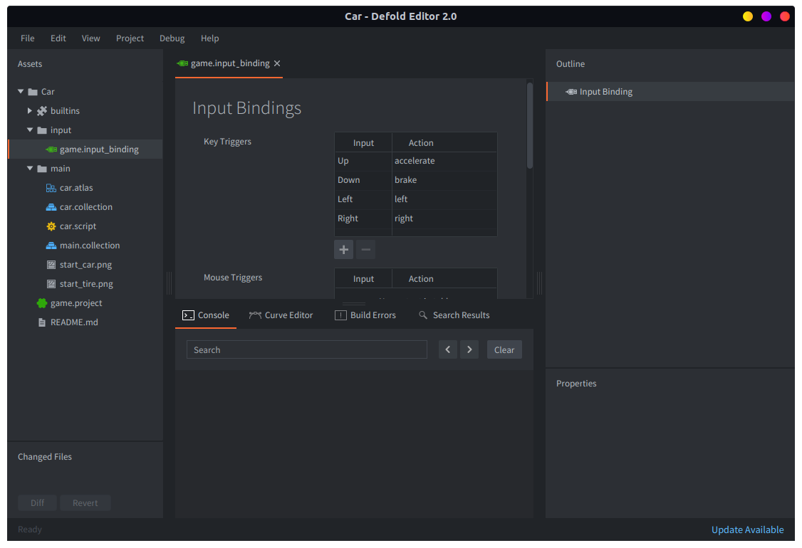

## Добавляем машину в игру

Теперь машина готова, но пока существует только внутри `car.collection`. В самой игре ее еще нет, потому что при запуске движок загружает `main.collection`. Это легко исправить: нужно добавить `car.collection` в `main.collection`.

Откройте `main.collection`, выберите корневой узел "Collection" в *Outline*, щелкните правой кнопкой и выберите <kbd>Add Collection From File</kbd>, затем укажите `car.collection` и нажмите *OK*. После этого содержимое `car.collection` будет добавлено в `main.collection` как новые экземпляры.

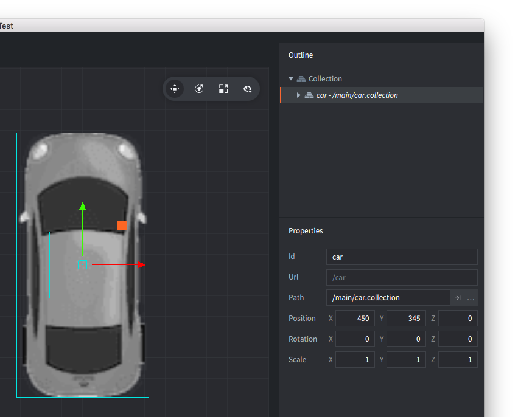

Теперь выберите <kbd>Project ▸ Build</kbd> и прокатитесь на своей машине.
Вы заметите, что управлять ею уже можно, но есть проблема: если отпустить клавиши, машина не останавливается. Исправим это.

## На помощь приходит сопротивление

Когда объект движется в реальном мире, на него действует сила сопротивления, которая замедляет его. Эта сила примерно пропорциональна квадрату скорости и может быть описана формулой `D = k * |V| * V`, где `k` — константа, `V` — скорость, а `|V|` — ее величина. Добавим это в код.

В секции констант вверху скрипта добавьте:

```lua
local drag = 1.1	        --the drag constant <1>
```

Затем в `update()`, чуть выше строки, где пересчитывается скорость, добавьте следующее:

```lua
function update(self, dt)
	...
  -- Calculate new velocity based on current acceleration
	self.velocity = self.velocity + self.acceleration * dt
	...
end
```

```lua
function update(self, dt)
	...
	-- Speed is the magnitude of the velocity
	local speed = vmath.length_sqr(self.velocity)

	-- Apply drag
	self.acceleration = self.acceleration - speed * self.velocity * drag

	-- Stop if we are already slow enough
	if speed < 0.5 then self.velocity = vmath.vector3(0) end
	...
end
```

1. Объявляем коэффициент сопротивления как константу.
2. Вычисляем текущую скорость движения.
3. Применяем сопротивление к ускорению.
4. Если машина уже движется очень медленно, полностью останавливаем ее.

## Полный скрипт машины

После всех шагов ваш `car.script` должен выглядеть так:

```lua
local turn_speed = 0.1                           				          	-- Slerp factor
local max_steer_angle_left = vmath.quat_rotation_z(math.pi / 6)	    -- 30 degrees
local max_steer_angle_right = vmath.quat_rotation_z(-math.pi / 6)   -- -30 degrees
local steer_angle_zero = vmath.quat_rotation_z(0)				          	-- Zero degrees
local wheels_vector = vmath.vector3(0, 72, 0)         				      -- Vector from center of back and front wheel pairs

local acceleration = 100 		                      									-- The acceleration of the car
local drag = 1.1                                                  	-- the drag constant

function init(self)
	-- Send a message to the render script (see builtins/render/default.render_script) to set the clear color.
	-- This changes the background color of the game. The vector4 contains color information
	-- by channel from 0-1: Red = 0.2. Green = 0.2, Blue = 0.2 and Alpha = 1.0
	msg.post("@render:", "clear_color", { color = vmath.vector4(0.2, 0.2, 0.2, 1.0) } )

	-- Acquire input focus so we can react to input
	msg.post(".", "acquire_input_focus")

	-- Some variables
	self.steer_angle = vmath.quat()
	self.direction = vmath.quat()

	-- Velocity and acceleration are car relative (not rotated)
	self.velocity = vmath.vector3()
	self.acceleration = vmath.vector3()

	-- Input vector. This is modified later in the on_input function
	-- to store the input.
	self.input = vmath.vector3()
end

function update(self, dt)
	-- Set acceleration to the y input
	self.acceleration.y = self.input.y * acceleration

	-- Calculate the new positions of front and back wheels
	local front_vel = vmath.rotate(self.steer_angle, self.velocity)
	local new_front_pos = vmath.rotate(self.direction, wheels_vector + front_vel)
	local new_back_pos = vmath.rotate(self.direction, self.velocity)

	-- Calculate the car's new direction
	local new_dir = vmath.normalize(new_front_pos - new_back_pos)
	self.direction = vmath.quat_rotation_z(math.atan2(new_dir.y, new_dir.x) - math.pi / 2)

	-- Speed is the magnitude of the velocity
	local speed = vmath.length(self.velocity)

	-- Apply drag
	self.acceleration = self.acceleration - speed * self.velocity * drag

	-- Stop if we are already slow enough
	if speed < 0.5 then self.velocity = vmath.vector3() end

	-- Calculate new velocity based on current acceleration
	self.velocity = self.velocity + self.acceleration * dt

	-- Update position based on current velocity and direction
	local pos = go.get_position()
	pos = pos + vmath.rotate(self.direction, self.velocity)
	go.set_position(pos)

	-- Interpolate the wheels using vmath.slerp
	if self.input.x > 0 then
		self.steer_angle = vmath.slerp(turn_speed, self.steer_angle, max_steer_angle_right)
	elseif self.input.x < 0 then
		self.steer_angle = vmath.slerp(turn_speed, self.steer_angle, max_steer_angle_left)
	else
		self.steer_angle = vmath.slerp(turn_speed, self.steer_angle, steer_angle_zero)
	end

	-- Update the wheel rotation
	go.set_rotation(self.steer_angle, "left_wheel")
	go.set_rotation(self.steer_angle, "right_wheel")

	-- Set the game object's rotation to the direction
	go.set_rotation(self.direction)

	-- reset acceleration and input
	self.acceleration = vmath.vector3()
	self.input = vmath.vector3()
end

function on_input(self, action_id, action)
	-- set the input vector to correspond to the key press
	if action_id == hash("left") then
		self.input.x = -1
	elseif action_id == hash("right") then
		self.input.x = 1
	elseif action_id == hash("accelerate") then
		self.input.y = 1
	elseif action_id == hash("brake") then
		self.input.y = -1
	end
end
```

## Пробуем готовую игру

Теперь выберите <kbd>Project ▸ Build</kbd> в главном меню и прокатитесь на своей новой машине.

На этом вводное руководство заканчивается. Вот несколько упражнений, которые можно попробовать самостоятельно:

1. Сейчас машина ускоряется одинаково вперед и назад. Измените это, чтобы назад она ехала медленнее.
2. Превратите некоторые константы, например acceleration, в `properties`, чтобы их можно было менять для разных экземпляров машины.
3. Добавьте звуки и заставьте машину рычать. ([Подсказка](manuals/sound/))

Теперь можно смело нырять глубже в Defold. У нас подготовлено много [мануалов и руководств](/learn), а если вы застрянете, вас всегда ждут на [форуме](//forum.defold.com).

Приятной работы в Defold!
