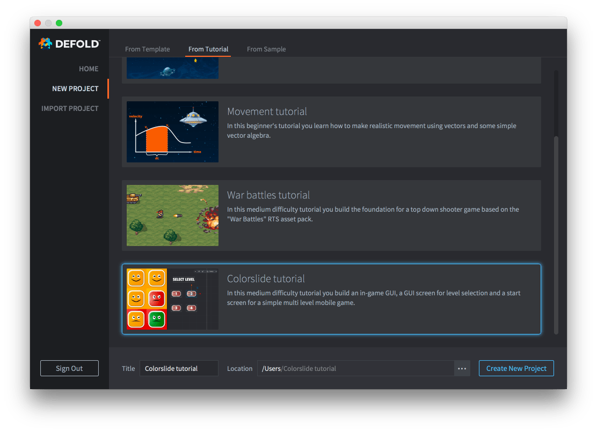

# Colorslide tutorial

In this medium difficulty tutorial you build an in-game GUI, a GUI screen for level selection and a start screen for a simple multi level mobile game.

The tutorial is integrated with the Defold editor and easily accessible:

1. Start Defold.
2. Select *New Project* on the left.
3. Select the *From Tutorial* tab.
4. Select the "Colorslide tutorial"
5. Select a location for the project on your local drive and click *Create New Project*.

{srcset="images/new-colorslide@2x.png 2x"}

The editor automatically opens the "README" file from the project root, containing the full tutorial text.

{.icon} [You can also read the full tutorial text on Github](https://github.com/defold/tutorial-colorslide)

If you get stuck, head over to the [Defold Forum](//forum.defold.com) where you will get help from the Defold team and many friendly users.

Happy Defolding!

