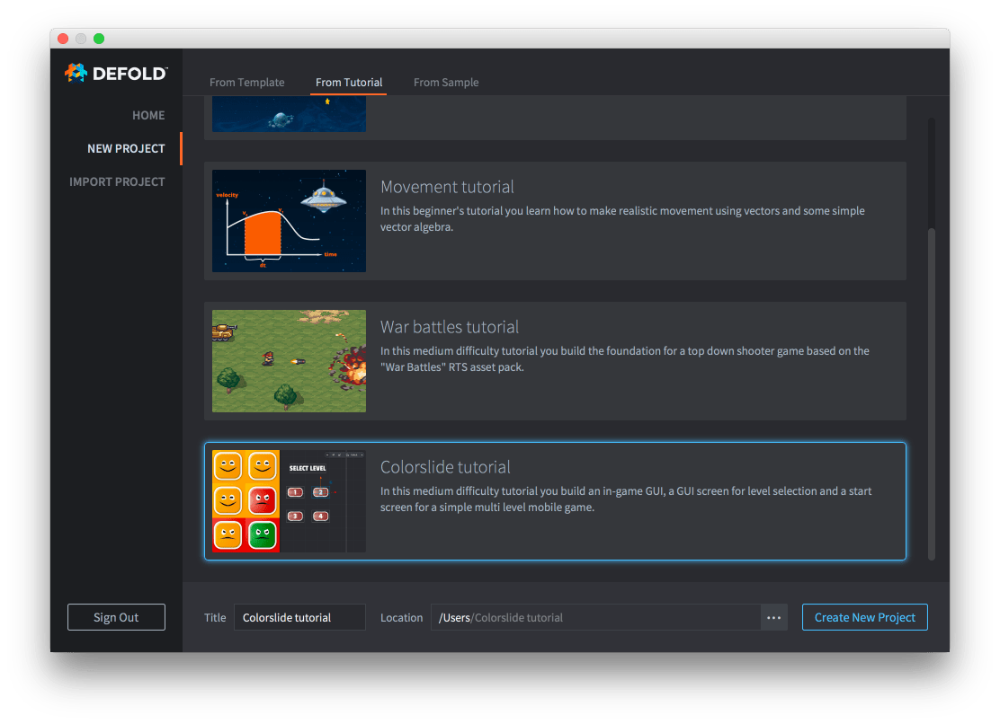

# Учебник Colorslide

В этом учебнике средней сложности вы создадите игровой GUI, экран выбора уровня и стартовый экран для простой мобильной игры с несколькими уровнями.

Учебник встроен в редактор Defold, и к нему легко получить доступ:

1. Запустите Defold.
2. Выберите слева *New Project*.
3. Откройте вкладку *From Tutorial*.
4. Выберите "Colorslide tutorial".
5. Выберите папку на локальном диске и нажмите *Create New Project*.

Редактор автоматически откроет файл "README" из корня проекта, в котором находится полный текст учебника.

{.icon} [Полный текст учебника также можно прочитать на Github](https://github.com/defold/tutorial-colorslide)

Если вы застрянете, загляните на [форум Defold](//forum.defold.com), где вам помогут команда Defold и многие дружелюбные пользователи.

Приятной работы с Defold!
