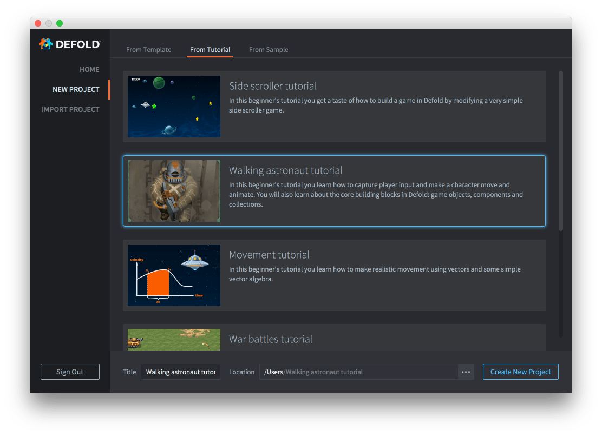
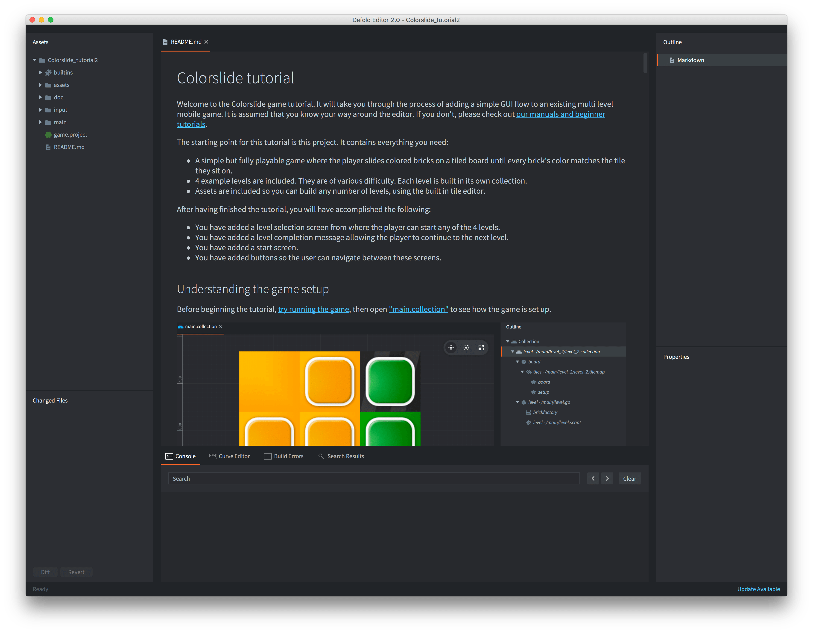
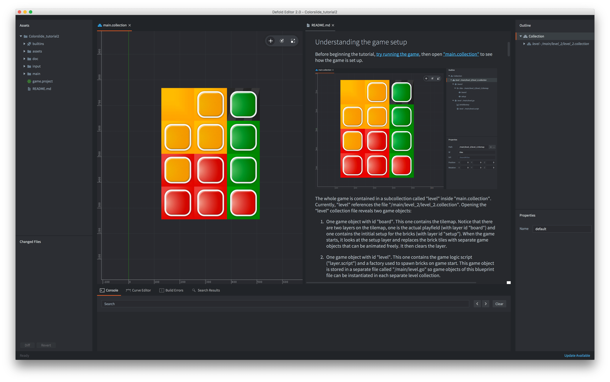

# Начало работы

Движок и редактор Defold предоставляют много возможностей и функций, которые нужно освоить. Чтобы вам было проще начать, мы подготовили набор учебников. Многие из них доступны прямо из редактора, поэтому приступить к работе очень легко.

## Запуск учебника из редактора

Когда вы запускаете редактор Defold, перед вами появляется экран выбора и создания проекта. Отсюда можно легко выбрать интересующий вас учебник:

1. Запустите Defold.
2. Выберите слева *New Project*.
3. Откройте вкладку *From Tutorial*.
4. Выберите учебник, который вам интересен.
5. Выберите папку на локальном диске.
6. Нажмите *Create New Project*.

Теперь редактор автоматически загрузит проект учебника, откроет его и покажет текст учебника (файл "README" в корне проекта).

Теперь просто следуйте инструкциям учебника. Если вам нужно снова открыть текст, <kbd>дважды щёлкните</kbd> по файлу "README" в панели *Assets*. Можно также <kbd>щёлкнуть правой кнопкой</kbd> по вкладке открытого файла и выбрать <kbd>Move to Other Tab Pane</kbd>, чтобы видеть текст учебника рядом с файлом, над которым вы работаете.

Если вы совсем новичок в Defold, вам также может пригодиться [введение в редактор](/manuals/editor).

Если вы застрянете, загляните на [форум Defold](//forum.defold.com), где вам помогут разработчики Defold и многие дружелюбные пользователи.

Приятной работы с Defold!
