# Руководство по grading

В этом руководстве мы создадим полноэкранный post effect для цветокоррекции. Базовый прием рендеринга, который здесь используется, подходит и для многих других пост-эффектов: blur, trails, glow, корректировки цвета и так далее.

Предполагается, что вы уже немного знакомы с редактором Defold и в общих чертах понимаете GL shaders и render pipeline движка. Если нет, сначала стоит посмотреть [руководство по Shader](/manuals/shader/) и [руководство по Render](/manuals/render/).

## Render targets

В стандартном render script каждый визуальный компонент — sprite, tilemap, particle effect, GUI и так далее — рисуется напрямую в *frame buffer* видеокарты. Дальше железо выводит изображение на экран. За отрисовку пикселей отвечает GL *shader program*. Для каждого типа компонента Defold поставляет стандартный шейдер, который просто выводит изображение без изменений.

Обычно это именно то, что нужно. Но если вы хотите, например, сделать всю игру черно-белой, модифицировать отдельный шейдер для каждого типа компонента неудобно. В Defold есть несколько встроенных материалов и наборов vertex/fragment-программ, и поддерживать это вручную быстро становится тяжело. Урок [Shadertoy tutorial](/tutorials/shadertoy) показывает, как делать подобные изменения в шейдерах.

Гораздо гибче разделить рендеринг на два шага:

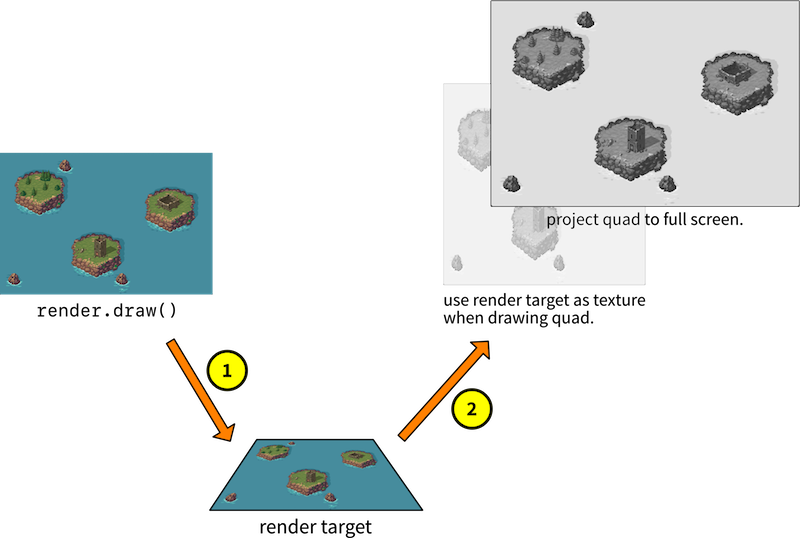

1. Сначала нарисовать все компоненты как обычно, но не в обычный frame buffer, а в отдельный off-screen buffer. Для этого используется *render target*.
2. Затем нарисовать квадрат на экран и использовать данные из render target как текстуру этого квадрата, растянув его на весь экран.

Так мы получаем возможность сначала собрать итоговую картинку, а затем модифицировать ее перед выводом на экран. Именно на этом шаге и удобно реализовывать полноэкранные эффекты.

## Настраиваем собственный renderer

Нам нужно изменить встроенный render script и добавить туда новую логику. Удобнее всего начать с копии стандартного:

1. Скопируйте `*/builtins/render/default.render_script*`: в *Asset view* щелкните по `default.render_script`, выберите <kbd>Copy</kbd>, затем вставьте копию в папку *main* и переименуйте, например, в `grade.render_script`.
2. Создайте новый render-файл `*/main/grade.render*` через <kbd>New ▸ Render</kbd>.
3. Откройте `grade.render` и укажите для свойства *Script* значение `/main/grade.render_script`.

   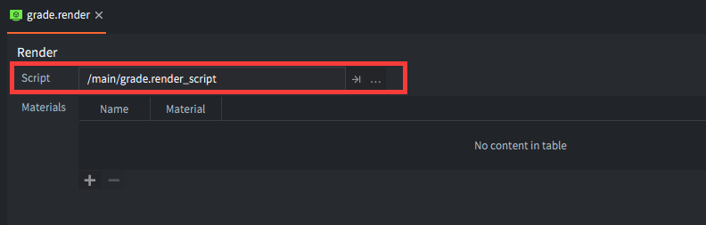

4. Откройте `game.project` и в поле *Render* укажите `/main/grade.render`.

   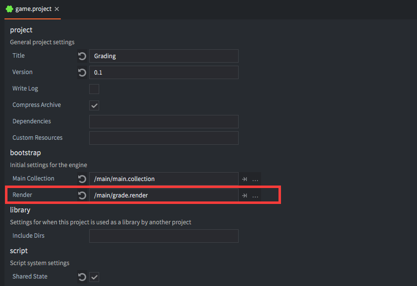

Теперь игра будет запускаться с новым render pipeline, который можно изменять. Чтобы быстро проверить, что движок использует именно ваш render script, можно временно отключить отрисовку tile/sprite и сделать hot reload:

```lua
...

render.set_projection(vmath.matrix4_orthographic(0, render.get_width(), 0, render.get_height(), -1, 1))

-- render.draw(self.tile_pred) -- <1>
render.draw(self.particle_pred)
render.draw_debug3d()

...
```
1. Закомментируйте отрисовку предиката `tile`, в который входят sprite и tilemap.

Если после этого спрайты и тайлы пропали, значит игра действительно использует вашу копию render script.

## Рисуем в off-screen target

Теперь изменим render script так, чтобы он рисовал в off-screen render target, а не сразу в frame buffer. Для начала target нужно создать:

```lua
function init(self)
    self.tile_pred = render.predicate({"tile"})
    self.gui_pred = render.predicate({"gui"})
    self.text_pred = render.predicate({"text"})
    self.particle_pred = render.predicate({"particle"})

    self.clear_color = vmath.vector4(0, 0, 0, 0)
    self.clear_color.x = sys.get_config("render.clear_color_red", 0)
    self.clear_color.y = sys.get_config("render.clear_color_green", 0)
    self.clear_color.z = sys.get_config("render.clear_color_blue", 0)
    self.clear_color.w = sys.get_config("render.clear_color_alpha", 0)

    self.view = vmath.matrix4()

    local color_params = { format = render.FORMAT_RGBA,
                       width = render.get_width(),
                       height = render.get_height() } -- <1>
    local target_params = {[render.BUFFER_COLOR_BIT] = color_params }

    self.target = render.render_target("original", target_params) -- <2>
end
```
1. Настраиваем color buffer для render target с разрешением текущей игры.
2. Создаем render target.

Теперь достаточно обернуть исходную отрисовку в `render.set_render_target()`:

```lua
function update(self)
  render.set_render_target(self.target) -- <1>

  render.set_depth_mask(true)
  render.set_stencil_mask(0xff)
  render.clear({[render.BUFFER_COLOR_BIT] = self.clear_color, [render.BUFFER_DEPTH_BIT] = 1, [render.BUFFER_STENCIL_BIT] = 0})

  render.set_viewport(0, 0, render.get_width(), render.get_height()) -- <2>
  render.set_view(self.view)
  ...

  render.set_render_target(render.RENDER_TARGET_DEFAULT) -- <3>
end
```
1. Включаем render target. Все вызовы `render.draw()` теперь рисуют в off-screen target.
2. Основной код отрисовки почти не меняется, только viewport должен соответствовать размеру target.
3. После завершения отрисовки возвращаемся к стандартному target.

Если запустить игру на этом этапе, на экране будет черный экран: теперь вся графика рисуется не напрямую на экран, а в off-screen buffer.

## Чем заполнить экран

Чтобы нарисовать содержимое color buffer render target на экране, нам нужен объект, который можно текстурировать этими пикселями. Для этого возьмем плоскую квадратную 3D-модель.

1. Откройте *`main.collection`* и создайте игровой объект `grade`.
2. Добавьте ему компонент Model.
3. Для свойства *Mesh* укажите файл *`quad.gltf`* из `builtins/assets/meshes`.

Оставьте объект в начале координат и без масштабирования. Позже мы настроим такую проекцию, чтобы quad заполнял весь экран. Но сначала нужны material и shader programs:

1. Создайте новый материал `grade.material`.
2. Создайте vertex shader `grade.vp` и fragment shader `grade.fp`.
3. Откройте `grade.material` и укажите в нем новые shader-файлы.
4. Добавьте *Vertex constant* `view_proj` типа `CONSTANT_TYPE_VIEWPROJ`.
5. Добавьте *Sampler* с именем `original`.
6. Добавьте *Tag* с именем `grade`.

   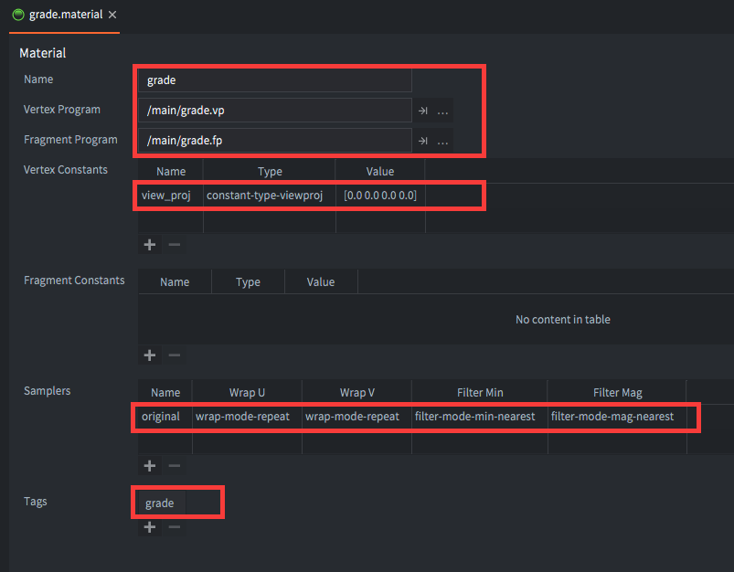

7. Откройте *`main.collection`*, выберите model-компонент объекта `grade` и задайте для него материал `/main/grade.material`.

   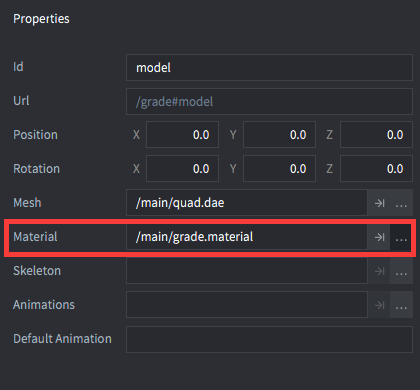

8. Vertex shader можно оставить почти стандартным:

    ```glsl
    // grade.vp
    uniform mediump mat4 view_proj;

    // positions are in world space
    attribute mediump vec4 position;
    attribute mediump vec2 texcoord0;

    varying mediump vec2 var_texcoord0;

    void main()
    {
      gl_Position = view_proj * vec4(position.xyz, 1.0);
      var_texcoord0 = texcoord0;
    }
    ```

9. Во fragment shader вместо прямого вывода sampled color временно сделаем простую десатурацию:

    ```glsl
    // grade.fp
    varying mediump vec4 position;
    varying mediump vec2 var_texcoord0;

    uniform lowp sampler2D original;

    void main()
    {
      vec4 color = texture2D(original, var_texcoord0.xy);
      // Desaturate the color sampled from the original texture
      float grey = color.r * 0.3 + color.g * 0.59 + color.b * 0.11;
      gl_FragColor = vec4(grey, grey, grey, 1.0);
    }
    ```

Теперь у нас есть quad-модель, material и shaders. Осталось нарисовать ее в frame buffer.

## Текстурируем из off-screen buffer

Добавим в render script новый predicate для quad-модели. Откройте *`grade.render_script`* и измените `init()` функцию:

```lua
function init(self)
    self.tile_pred = render.predicate({"tile"})
    self.gui_pred = render.predicate({"gui"})
    self.text_pred = render.predicate({"text"})
    self.particle_pred = render.predicate({"particle"})
    self.grade_pred = render.predicate({"grade"}) -- <1>

    ...
end
```
1. Новый predicate соответствует тегу `grade`, который мы задали в *`grade.material`*.

После того как render target будет заполнен, в `update()` нужно настроить view/projection так, чтобы quad занял весь экран, а color buffer target использовался как его texture:

```lua
function update(self)
  render.set_render_target(self.target)

  ...

  render.set_render_target(render.RENDER_TARGET_DEFAULT)

  render.clear({[render.BUFFER_COLOR_BIT] = self.clear_color}) -- <1>

  render.set_viewport(0, 0, render.get_window_width(), render.get_window_height()) -- <2>
  render.set_view(vmath.matrix4()) -- <3>
  render.set_projection(vmath.matrix4())

  render.enable_texture(0, self.target, render.BUFFER_COLOR_BIT) -- <4>
  render.draw(self.grade_pred) -- <5>
  render.disable_texture(0, self.target) -- <6>
end
```
1. Очищаем обычный frame buffer. Предыдущая очистка затрагивала render target, а не экран.
2. Устанавливаем viewport по размеру окна.
3. Используем identity matrix для view и projection, чтобы quad оказался растянут на весь экран.
4. Подключаем color buffer render target в texture slot `0`.
5. Рисуем predicate `grade`, то есть наш quad.
6. После отрисовки отключаем texture slot.

Запустите игру, и вы увидите результат:

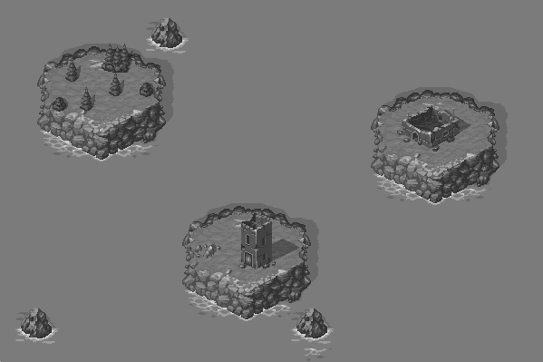

## Color grading

Цвет задается тремя компонентами: количеством красного, зеленого и синего. Все экранные цвета можно представить как точки внутри цветового куба:

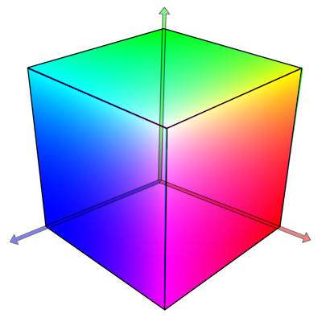

Идея color grading проста: взять такой цветовой куб, но с уже измененными цветами, и использовать его как 3D *lookup table*.

Для каждого пикселя:

1. Находим его позицию в цветовом кубе по значениям red, green и blue.
2. Читаем, какой цвет хранится в этой точке в модифицированном кубе.
3. Рисуем пиксель уже этим новым цветом.

В нашем fragment shader это означает:

1. Сэмплировать цвет из off-screen buffer.
2. Найти соответствующий цвет в color-graded lookup table.
3. Вывести этот цвет как результат.

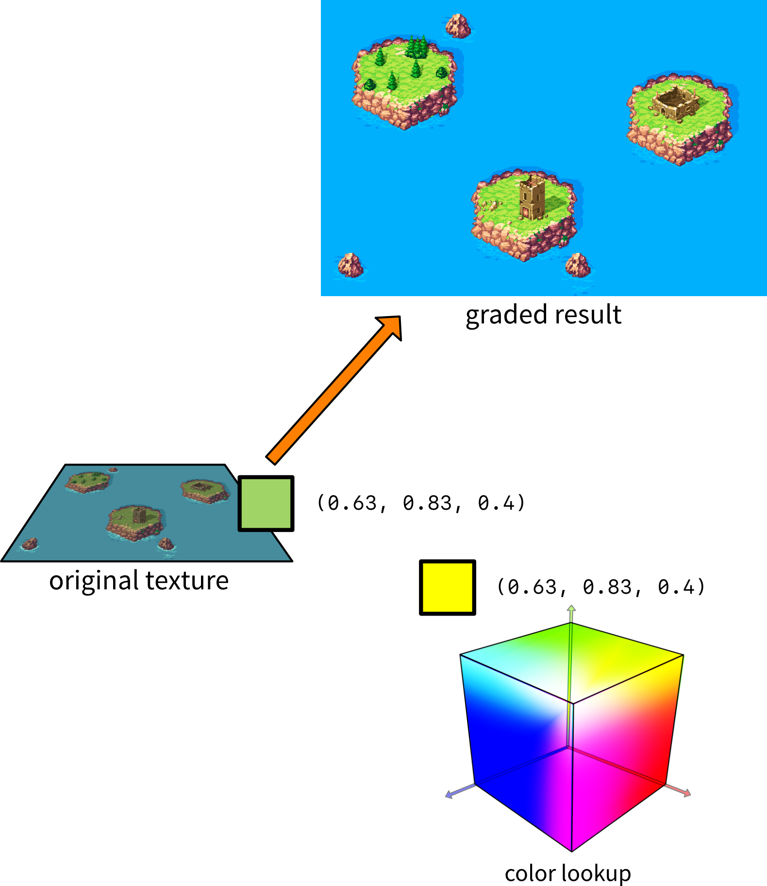

## Представление lookup table

Open GL ES 2.0 не поддерживает 3D textures, поэтому 3D color cube придется представить иначе. Обычно его режут на слои по оси Z (синий канал) и раскладывают эти слои рядом в двухмерной texture. Каждый из 16 слоев содержит сетку 16⨉16 пикселей:

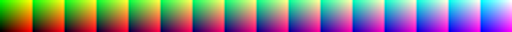

Получившаяся texture содержит 16 ячеек, по одной на каждый уровень синего, а внутри каждой ячейки по оси X идут красные значения, а по оси Y — зеленые. Формально это всего 4096 цветов, но благодаря линейной фильтрации видеокарта может восстановить намного лучшую точность.

## Поиск цветов

Чтобы найти нужный цвет, сначала смотрим на синий канал и определяем, в какой ячейке его искать:

```math
cell = \left \lfloor{B \times (N - 1)} \right \rfloor
```

Здесь `B` — значение синего компонента, а `N` — общее количество ячеек. В нашем случае номер ячейки будет в диапазоне `0`--`15`, где ячейка `0` содержит все цвета с синим компонентом `0`, а ячейка `15` — все цвета с синим компонентом `1`.

Например, RGB-цвет `(0.63, 0.83, 0.4)` находится в ячейке с синим значением `0.4`, то есть это ячейка 6. Дальше по значениям red и green можно вычислить окончательные texture coordinates:

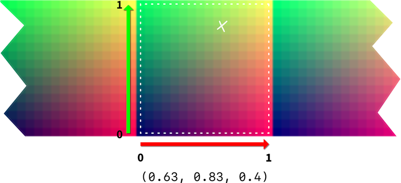

Важно читать значения `(0, 0)` как находящиеся в *центре* нижнего левого пикселя, а значения `(1.0, 1.0)` как находящиеся в *центре* верхнего правого пикселя, чтобы значения за пределами текущей ячейки не влияли на выборку. Подробнее о фильтрации ниже.

::: sidenote
Именно поэтому чтение ведется от центра нижнего левого пикселя до центра верхнего правого: так соседние ячейки не влияют на выборку.
:::

Когда мы семплируем в этих конкретных координатах, то оказываемся ровно между четырьмя пикселями. Так какое значение цвета выдаст GL в этой точке?

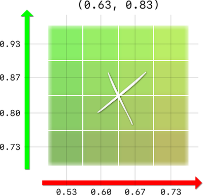

Ответ зависит от того, какую *filtering* мы указали для sampler в material.

- Если filtering = `NEAREST`, GL вернет значение ближайшего пикселя. В приведенном выше случае GL вернет значение в позиции `(0.60, 0.80)`. Для нашей lookup texture с `4 bit` это означает, что цвет будет квантован до `4096` значений.

- Если filtering = `LINEAR`, GL вернет *interpolated* значение. GL смешает цвет на основе расстояния до пикселей вокруг точки выборки. В приведенном выше случае GL вернет цвет, который на 25% состоит из каждого из 4 пикселей вокруг точки выборки.

Используя линейную фильтрацию, мы убираем квантование цвета и получаем очень хорошую точность даже из довольно небольшой lookup table.

## Реализуем lookup

Сделаем lookup прямо во fragment shader:

1. Откройте *`grade.material`*.
2. Добавьте второй sampler с именем `lut`.
3. Установите *`Filter min`* = `FILTER_MODE_MIN_LINEAR` и *`Filter mag`* = `FILTER_MODE_MAG_LINEAR`.

    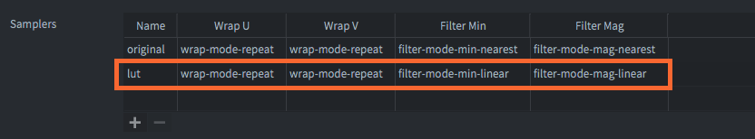

4. Скачайте текстуру lookup table `lut16.png` и добавьте ее в проект.

    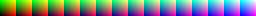

5. Откройте *`main.collection`* и укажите texture `lut` для модели.

    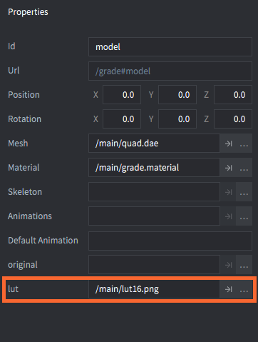

6. Затем откройте `grade.fp` и добавьте поддержку lookup:

    ```glsl
    varying mediump vec4 position;
    varying mediump vec2 var_texcoord0;

    uniform lowp sampler2D original;
    uniform lowp sampler2D lut; // <1>

    #define MAXCOLOR 15.0 // <2>
    #define COLORS 16.0
    #define WIDTH 256.0
    #define HEIGHT 16.0

    void main()
    {
        vec4 px = texture2D(original, var_texcoord0.xy); // <3>

        float cell = floor(px.b * MAXCOLOR); // <4>

        float half_px_x = 0.5 / WIDTH; // <5>
        float half_px_y = 0.5 / HEIGHT;

        float x_offset = half_px_x + px.r / COLORS * (MAXCOLOR / COLORS);
        float y_offset = half_px_y + px.g * (MAXCOLOR / COLORS); // <6>

        vec2 lut_pos = vec2(cell / COLORS + x_offset, y_offset); // <7>

        vec4 graded_color = texture2D(lut, lut_pos); // <8>

        gl_FragColor = graded_color; // <9>
    }
    ```
    1. Объявляем sampler `lut`.
    2. Константы для максимального значения цвета, количества цветов и размеров lookup texture.
    3. Считываем цвет пикселя `px` из исходной текстуры.
    4. По синему каналу определяем нужную ячейку.
    5. Считаем смещение до центра пикселя.
    6. По красному и зеленому каналам вычисляем координаты внутри ячейки.
    7. Получаем итоговую позицию в lookup texture.
    8. Считываем color graded значение.
    9. Выводим его.

Сейчас lookup texture просто возвращает те же цвета, что мы ищем, поэтому игра должна выглядеть как раньше:

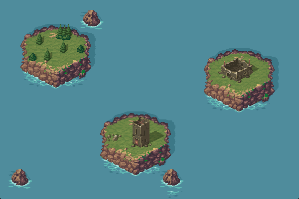

Но под поверхностью есть проблема. Посмотрите, что происходит, если добавить sprite с тестовым синим градиентом:

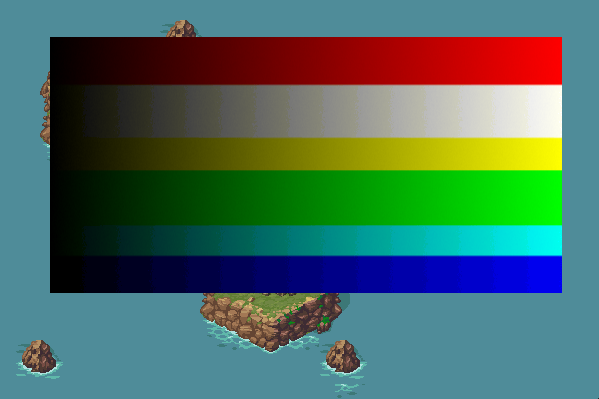

Появляются заметные полосы. Почему?

## Интерполяция синего канала

Проблема в том, что GL не может интерполировать синий канал при чтении цвета из texture. Мы заранее выбираем конкретную ячейку по синему значению, и на этом все. Например, если значение синего канала находится в диапазоне `0.400`--`0.466`, оно не имеет значения --- мы все равно будем брать финальный цвет из ячейки номер 6, где синий канал равен `0.400`.

Чтобы получить лучшее разрешение по синему каналу, мы можем реализовать интерполяцию сами. Если значение синего находится между значениями двух соседних ячеек, мы можем семплировать обе ячейки и затем смешать цвета. Например, если значение синего равно `0.420`, мы должны семплировать ячейку номер 6 *и* ячейку номер 7, а затем смешать цвета.

Значит, мы должны читать из двух ячеек:

```math
cell_{low} = \left \lfloor{B \times (N - 1)} \right \rfloor
```

и:

```math
cell_{high} = \left \lceil{B \times (N - 1)} \right \rceil
```

А затем смешивать результаты линейно:

```math
color = color_{low} \times (1 - C_{frac}) + color_{high} \times C_{frac}
```

Здесь `color`~low~ — это цвет, который мы сэмплировали из нижней (левой) ячейки, а `color`~high~ — цвет из верхней (правой) ячейки. Функция GLSL `mix()` выполняет эту линейную интерполяцию за нас.

Значение `C~frac~` выше — это дробная часть значения синего канала, масштабированная в диапазон `0`--`15` по цветам.

```math
C_{frac} = B \times (N - 1) - \left \lfloor{B \times (N - 1)} \right \rfloor
```

Снова есть GLSL-функция, которая дает дробную часть значения. Она называется `frac()`. Финальная реализация во fragment shader (*`grade.fp`*) довольно проста:

```glsl
varying mediump vec4 position;
varying mediump vec2 var_texcoord0;

uniform lowp sampler2D original;
uniform lowp sampler2D lut;

#define MAXCOLOR 15.0
#define COLORS 16.0
#define WIDTH 256.0
#define HEIGHT 16.0

void main()
{
  vec4 px = texture2D(original, var_texcoord0.xy);

    float cell = px.b * MAXCOLOR;

    float cell_l = floor(cell); // <1>
    float cell_h = ceil(cell);

    float half_px_x = 0.5 / WIDTH;
    float half_px_y = 0.5 / HEIGHT;
    float r_offset = half_px_x + px.r / COLORS * (MAXCOLOR / COLORS);
    float g_offset = half_px_y + px.g * (MAXCOLOR / COLORS);

    vec2 lut_pos_l = vec2(cell_l / COLORS + r_offset, g_offset); // <2>
    vec2 lut_pos_h = vec2(cell_h / COLORS + r_offset, g_offset);

    vec4 graded_color_l = texture2D(lut, lut_pos_l); // <3>
    vec4 graded_color_h = texture2D(lut, lut_pos_h);

    // <4>
    vec4 graded_color = mix(graded_color_l, graded_color_h, fract(cell));

    gl_FragColor = graded_color;
}
```

1. Вычисляем две соседние ячейки.
2. Для каждой считаем отдельную позицию в lookup texture.
3. Считываем оба цвета.
3. Смешиваем их в зависимости от дробной части значения `cell`.

Теперь при повторном запуске полосы на синем градиенте исчезают:


## Цветокоррекция lookup texture

На этом этапе настройка уже готова и можно сделать что-то действительно полезное:

1. Сделайте скриншот игры в исходном виде.
2. Откройте его в любом редакторе изображений.
3. Примените любые нужные корректировки цвета: brightness, contrast, curves, white balance, exposure и так далее.

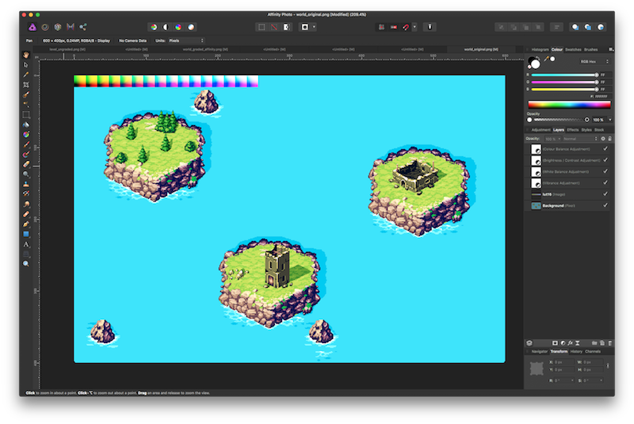

4. Примените те же корректировки к файлу lookup texture `lut16.png`.
5. Сохраните скорректированную lookup texture.
6. Замените `lut16.png` в вашем проекте на новую версию.
7. Запустите игру.

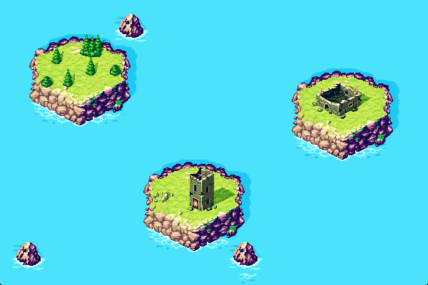

Готово.
