# Руководство по Magic Link

Эта игра — вариация на тему классических match-игр вроде _Bejeweled_ и _Candy Crush_. Игрок проводит пальцем и соединяет блоки одного цвета, чтобы убрать их с поля. Но цель игры здесь не в том, чтобы просто очищать поле или набирать очки. Нужно добиться того, чтобы особые "магические блоки", разбросанные по полю, соединились друг с другом.

Это пошаговое руководство строится на уже готовом дизайне. В реальной разработке на поиск удачной идеи и правил обычно уходит много времени, но здесь мы пропускаем этот этап и сразу собираем рабочую игру.

## Начало работы

Сначала создайте новый проект и импортируйте пакет с ресурсами:

* Создайте [новый проект](/manuals/project-setup/#creating-a-new-project) из шаблона "Empty Project".
* Скачайте полный проект ["Magic Link" (`magic-link.zip`)](https://github.com/defold/defold-examples/releases/latest) как справочный вариант. В нем уже есть все ресурсы, если захотите сравнить результат или собрать проект с нуля.

## Правила игры

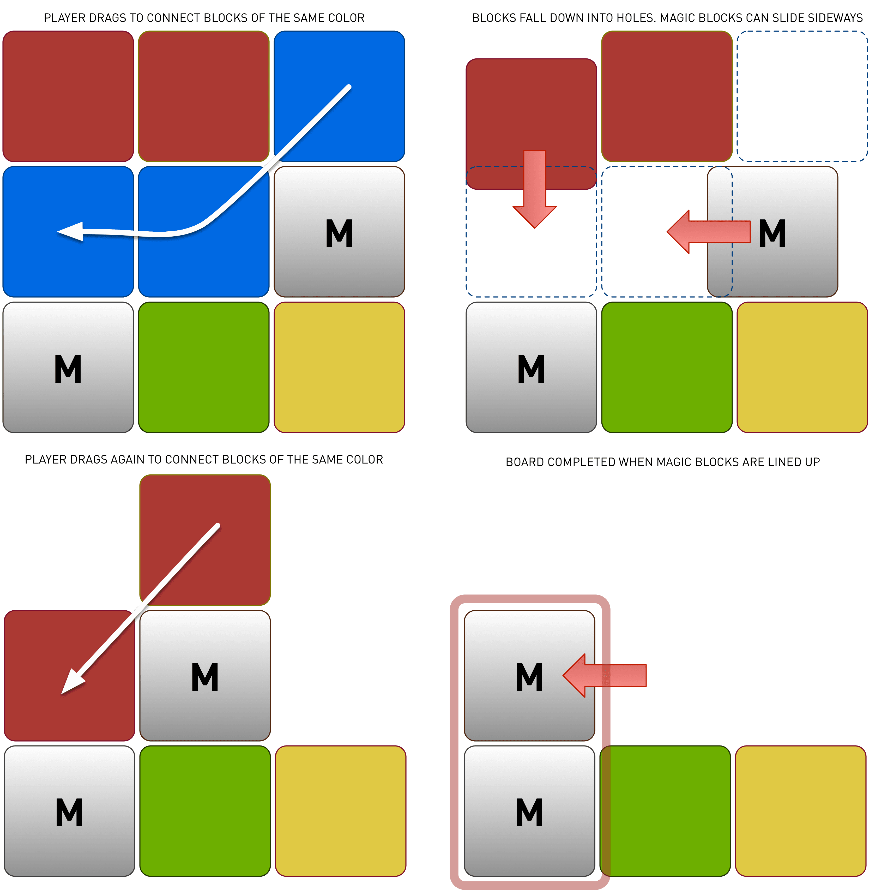

Каждый раунд поле случайно заполняется цветными блоками и набором магических блоков. Цветные блоки подчиняются таким правилам:

* Если игрок соединяет блоки одного цвета, они исчезают.
* Когда блоки исчезают, под ними появляются пустоты, и остальные цветные блоки падают строго вниз.
* Нижняя граница экрана не дает блокам падать дальше.

Магические блоки ведут себя иначе:

* Если слева или справа появляется свободное место, магический блок может _сдвинуться в сторону_.
* Если пустота появляется под ним, он падает вниз как обычный блок.

Игрок взаимодействует с полем так:

* Можно соединять соседние цветные блоки по горизонтали, вертикали и диагонали.
* Когда игрок отпускает палец, соединенная цепочка исчезает.
* Магические блоки нельзя соединять вручную.
* Но они автоматически соединяются, если оказываются рядом по горизонтали или вертикали.
* Уровень считается пройденным, когда все магические блоки на поле оказываются связаны.

Сложность определяет количество магических блоков.

## Обзор

Как и в любом проекте, здесь сначала нужно выбрать общую структуру. Теоретически игру можно было бы собрать целиком в GUI-системе, но для такой механики естественнее использовать игровые объекты и спрайты, а GUI оставить для интерфейса.

Так как файлов будет не слишком много, структура проекта может быть очень простой:

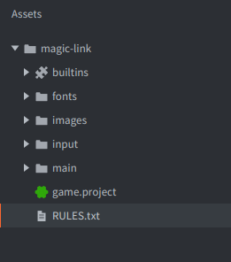

*main*
: Здесь будет вся игровая логика: scripts, game objects, collections, GUI-файлы и так далее.

*images*
: Все графические ресурсы.

*fonts*
: Шрифты для текста.

*input*
: Файл привязок ввода.

## Настройка проекта

В файле *game.project* можно оставить почти все настройки по умолчанию, но несколько параметров стоит задать сразу. В примере используется разрешение `640x960`, то есть родное разрешение iPhone 4. С ним удобно и тестировать на компьютере, и подгонять интерфейс.

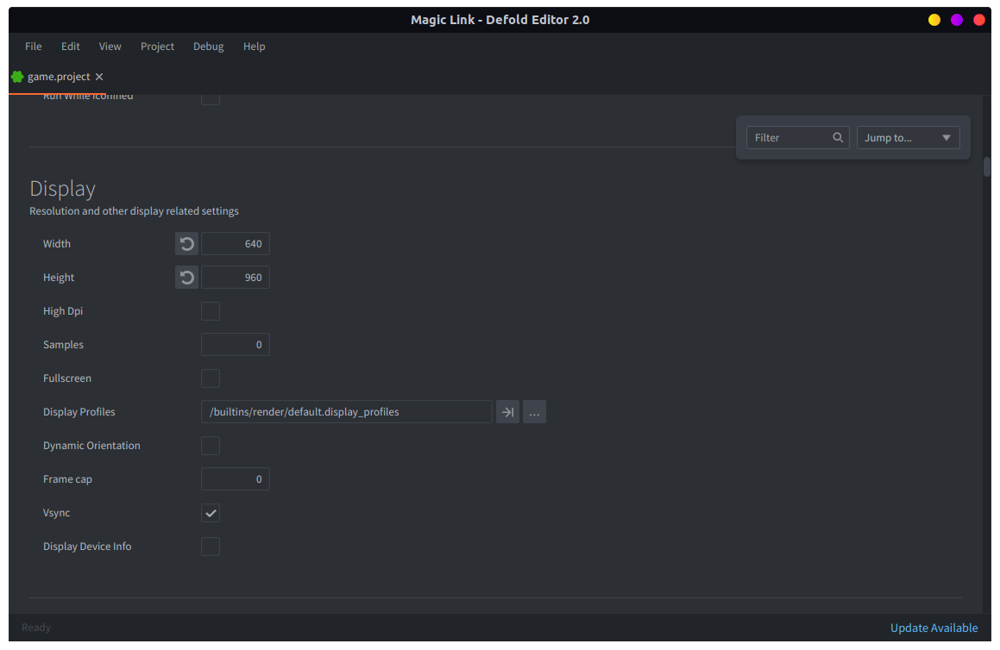

Еще один важный параметр — максимальное число спрайтов. Поле игры имеет размер `7x9`, а кроме самих блоков нам понадобятся эффекты, соединители и элементы GUI. На практике безопаснее сразу увеличить лимит до `512`, чтобы хватило даже в тот кадр, когда старые объекты еще не удалены, а новые уже созданы.

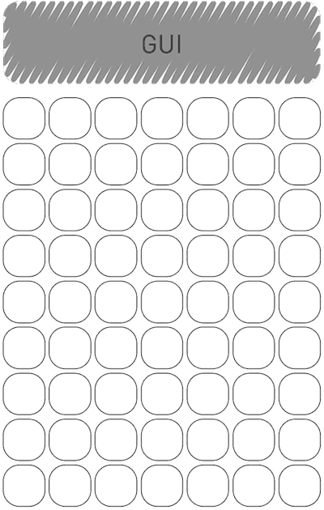

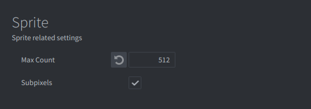

## Добавляем графические ресурсы

Все графические ресурсы для игры подготовлены заранее. Мы добавляем их как изображения `512x512`, а движок сам масштабирует их до рабочего размера.

::: sidenote
Если включить *hidpi* в настройках проекта, backbuffer станет высоким по разрешению, поэтому большие исходные изображения будут выглядеть особенно четко на retina-дисплеях.
:::

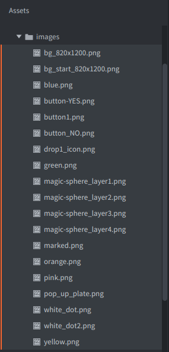

Кроме блоков нужны картинка соединителя, эффекты, фон игрового поля и фон главного меню. Добавьте все изображения в папку *images*, затем создайте atlas `sprites.atlas` и включите туда все игровые спрайты:

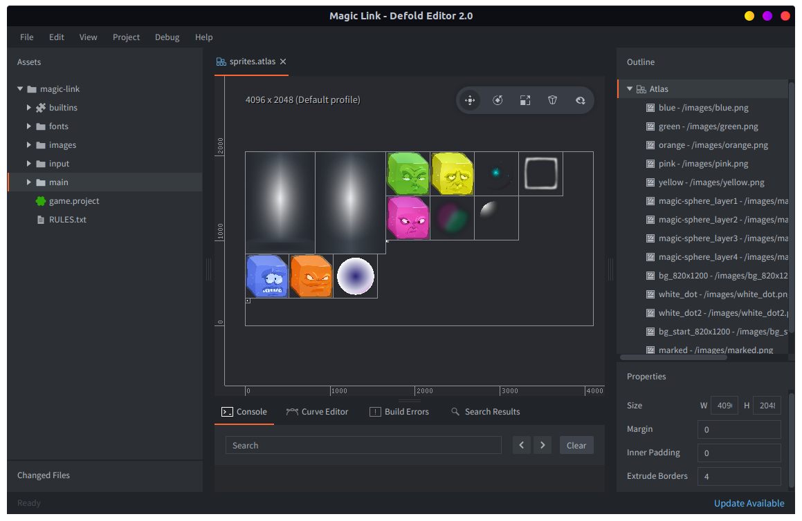

GUI-изображения лучше держать отдельно, в `gui.atlas`.

## Генерируем поле

Основная логика поля будет жить в своей коллекции. Создайте `board.collection` в папке *main*. Пока в ней достаточно script-компонента и factory, который будет создавать блоки. Для удобства можно временно поставить `/main/board.collection` как *Main Collection* в `game.project`, чтобы быстрее тестировать игру.

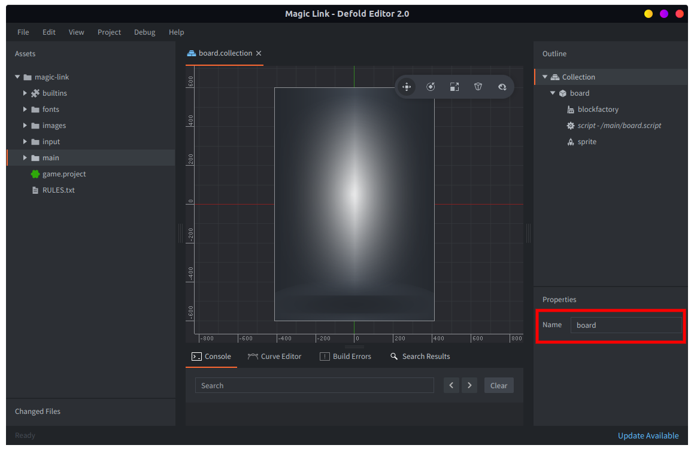

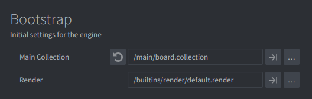

В `board.script` создадим базовую структуру поля, список блоков и временно будем запускать построение уровня из `start_level`:

```lua
-- board.script
go.property("timer", 0)     -- Use to time events
local blocksize = 80        -- Distance between block centers
local edge = 40             -- Left and right edge.
local bottom_edge = 50      -- Bottom edge.
local boardwidth = 7        -- Number of columns
local boardheight = 9       -- Number of rows
local centeroff = vmath.vector3(8, -8, 0) -- Center offset for connector gfx since there's shadow below in the block img
local dropamount = 3        -- The number of blocks dropped on a "drop"
local colors = { hash("orange"), hash("pink"), hash("blue"), hash("yellow"), hash("green") }

local function filter(func, tbl)
    local new = {}
    for i, v in pairs(tbl) do
        if func(v) then
            new[i] = v
        end
    end
    return new
end

local function build_blocklist(self)
    self.blocks = {}
    for x, l in pairs(self.board) do
        for y, b in pairs(self.board[x]) do
            table.insert(self.blocks, { id = b.id, color = b.color, x = b.x, y = b.y })
        end
    end
end

function init(self)
    self.board = {}
    self.blocks = {}
    self.chain = {}
    self.connectors = {}
    self.num_magic = 3
    self.drops = 1
    self.magic_blocks = {}
    self.dragging = false
    msg.post(".", "acquire_input_focus")
    msg.post("#", "start_level")
end

local function build_board(self)
    math.randomseed(os.time())
    local pos = vmath.vector3()
    local c
    for x = 0,boardwidth-1 do
        pos.x = edge + blocksize / 2 + blocksize * x
        self.board[x] = {}
        for y = 0,boardheight-1 do
            pos.y = bottom_edge + blocksize / 2 + blocksize * y
            pos.z = x * -0.1 + y * 0.01
            c = colors[math.random(#colors)]
            local id = factory.create("#blockfactory", pos, null, { color = c })
            self.board[x][y] = { id = id, color = c,  x = x, y = y }
        end
    end
    build_blocklist(self)
end

function on_message(self, message_id, message, sender)
    if message_id == hash("start_level") then
        build_board(self)
    end
end
```

Для самих блоков нужен отдельный game object со sprite и script:

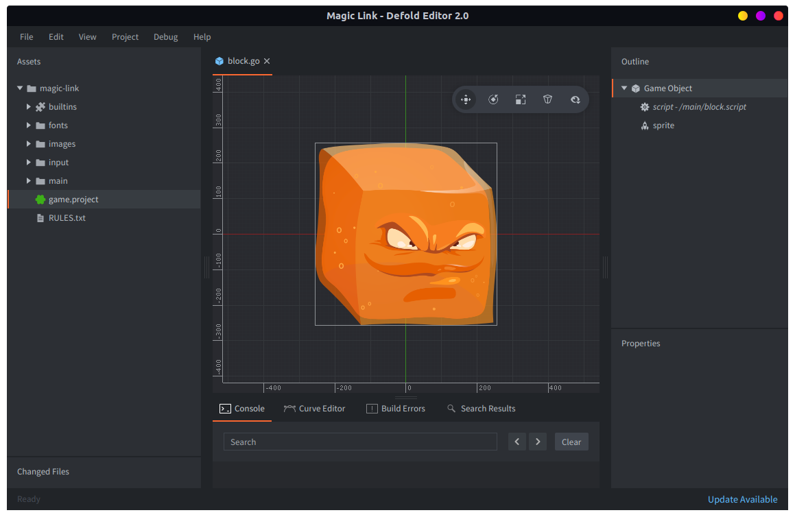

```lua
-- block.script
go.property("color", hash("none"))

function init(self)
    go.set_scale(0.18)

    if self.color ~= nil then
        sprite.play_flipbook("#sprite", self.color)
    else
        msg.post("#sprite", "disable")
    end
end
```

Подключите `block.go` к factory-компоненту:

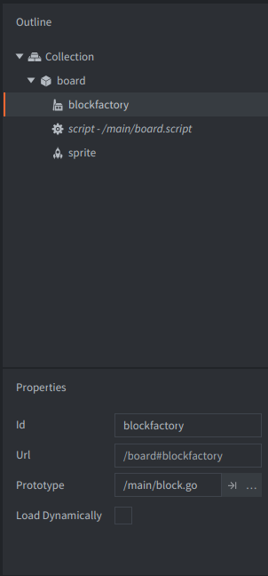

После этого поле уже можно запустить и увидеть набор случайно окрашенных блоков:

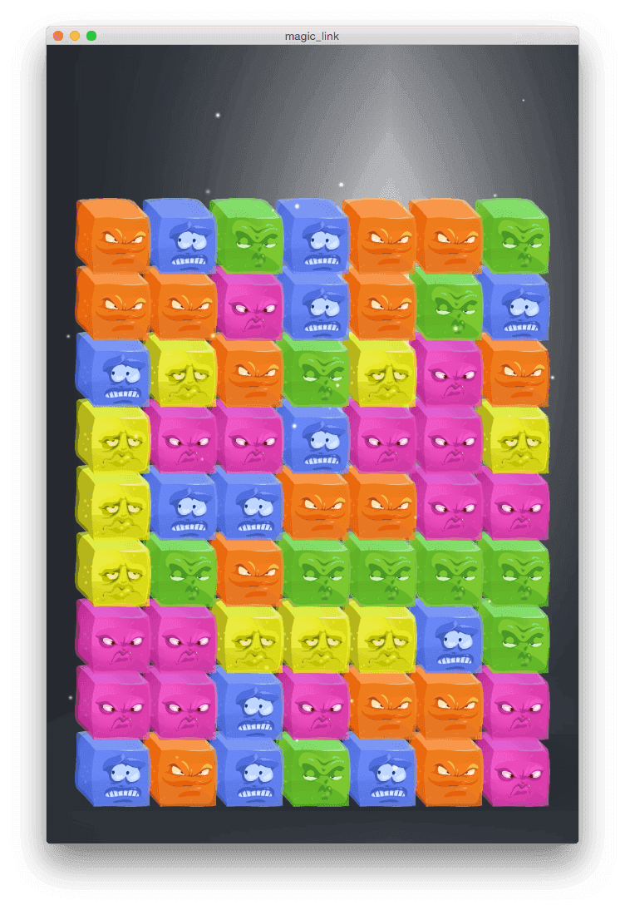

## Взаимодействия

Теперь добавим пользовательский ввод. В `game.input_binding` достаточно одного действия: `MOUSE_BUTTON_LEFT`, привязанного к имени `touch`. На настольной машине это будет левый клик мыши, а на мобильном устройстве — одиночное касание.

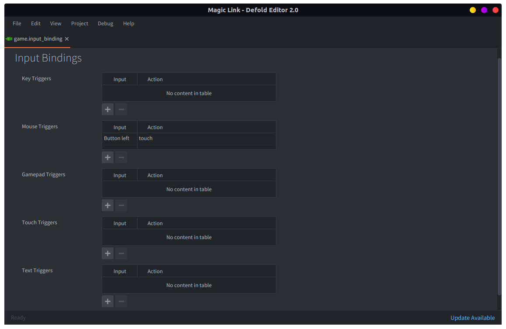

Логику обработки ввода добавим в `board.script`:

```lua
-- board.script
function on_input(self, action_id, action)
    if action_id == hash("touch") and action.value == 1 then
        local x = math.floor((action.x - edge) / blocksize)
        local y = math.floor((action.y - bottom_edge) / blocksize)

        if x < 0 or x >= boardwidth or y < 0 or y >= boardheight or self.board[x][y] == nil then
            return
        end

        if action.pressed then
            msg.post(self.board[x][y].id, "make_orange")
            self.dragging = true
        elseif self.dragging then
            msg.post(self.board[x][y].id, "make_green")
        end
    elseif action_id == hash("touch") and action.released then
        self.dragging = false
    end
end
```

А в `block.script` временно добавим обработку тестовых сообщений:

```lua
-- block.script
function on_message(self, message_id, message, sender)
    if message_id == hash("make_orange") then
        sprite.play_flipbook("#sprite", hash("orange"))
    elseif message_id == hash("make_green") then
        sprite.play_flipbook("#sprite", hash("green"))
    end
end
```

Так можно быстро убедиться, что попадание по блокам работает.

## Пометка цепочек

Следующий шаг — визуально показывать цепочку, которую игрок протягивает по полю. Для этого создадим объект `connector` со спрайтом-маркером и factory для таких объектов:

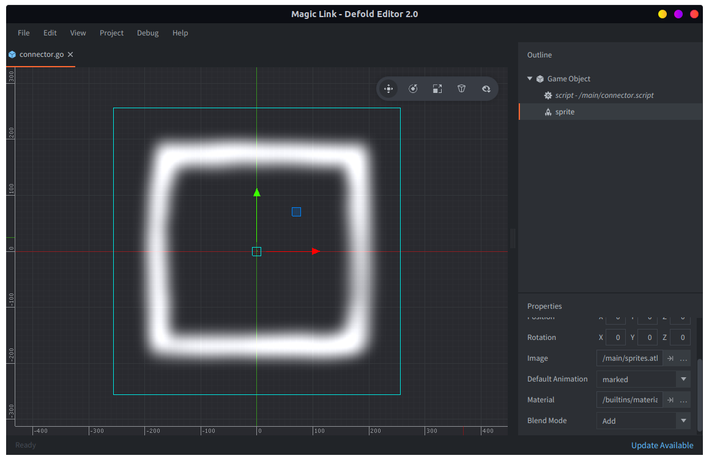

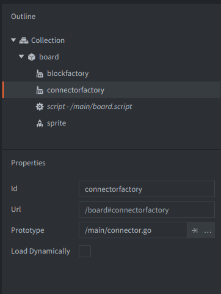

Скрипт у `connector` минимальный:

```lua
-- connector.script
function init(self)
    go.set_scale(0.18)
    go.set(".", "position.z", 1)
end
```

Дальше в `board.script` нужны:

* функция `same_color_neighbors()`, которая ищет соседние блоки того же цвета;
* функция `in_blocklist()`, которая проверяет, входит ли блок в список;
* доработка `on_input()`, которая собирает цепочку и создает connector-объекты поверх выбранных блоков.

```lua
-- board.script
local function same_color_neighbors(self, x, y)
    local f = function (v)
        return (v.id ~= self.board[x][y].id) and
               (v.x == x or v.x == x - 1 or v.x == x + 1) and
               (v.y == y or v.y == y - 1 or v.y == y + 1) and
               (v.color == self.board[x][y].color)
    end
    return filter(f, self.blocks)
end

local function in_blocklist(blocks, block)
    for i, b in pairs(blocks) do
        if b.id == block then
            return true
        end
    end
    return false
end
```

```lua
-- board.script
function on_input(self, action_id, action)
    ...

    if self.board[x][y].color == hash("magic") then
        return
    end

    if action.pressed then
        self.neighbors = same_color_neighbors(self, x, y)
        self.chain = {}
        table.insert(self.chain, self.board[x][y])

        p = go.get_position(self.board[x][y].id)
        local id = factory.create("#connectorfactory", p + centeroff)
        table.insert(self.connectors, id)

        self.dragging = true
    elseif self.dragging then
        if in_blocklist(self.neighbors, self.board[x][y].id) and not in_blocklist(self.chain, self.board[x][y].id) then
            table.insert(self.chain, self.board[x][y])
            self.neighbors = same_color_neighbors(self, x, y)

            p = go.get_position(self.board[x][y].id)
            local id = factory.create("#connectorfactory", p + centeroff)
            table.insert(self.connectors, id)
        end
    end
end
```

При отпускании ввода все connector-объекты удаляются:

```lua
-- board.script
function on_input(self, action_id, action)
    ...
    elseif action_id == hash("touch") and action.released then
        self.dragging = false
        for i, c in ipairs(self.connectors) do
            go.delete(c)
        end
        self.connectors = {}
    end
end
```

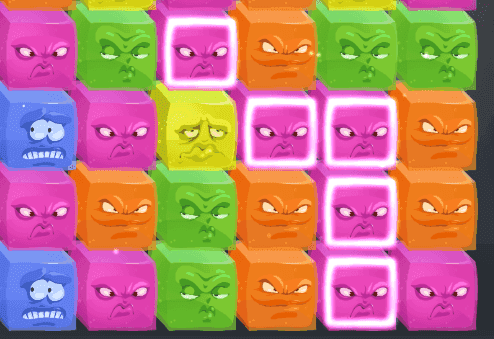

## Удаление связанных блоков

Когда цепочка уже собирается правильно, удалить ее просто. Важно только не ставить `nil` сразу, а сначала использовать промежуточное состояние `hash("removing")`, чтобы позже отличать "новые дыры" от давно пустых клеток.

```lua
-- board.script
local function remove_chain(self)
    for i, c in ipairs(self.chain) do
        self.board[c.x][c.y] = hash("removing")
        go.delete(c.id)
    end
    self.chain = {}
end

local function nilremoved(self)
    for y = 0,boardheight - 1 do
        for x = 0,boardwidth - 1 do
            if self.board[x][y] == hash("removing") then
                self.board[x][y] = nil
            end
        end
    end
end
```

Затем оставшиеся блоки нужно сдвинуть вниз:

```lua
-- board.script
local function slide_board(self)
    local dy = 0
    for x = 0,boardwidth - 1 do
        dy = 0
        for y = 0,boardheight - 1 do
            if self.board[x][y] ~= nil then
                if dy > 0 then
                    self.board[x][y - dy] = self.board[x][y]
                    self.board[x][y] = nil
                    self.board[x][y - dy].y = self.board[x][y - dy].y - dy
                    go.animate(self.board[x][y-dy].id, "position.y", go.PLAYBACK_ONCE_FORWARD, bottom_edge + blocksize / 2 + blocksize * (y - dy), go.EASING_OUTBOUNCE, 0.3)
                    go.set(self.board[x][y-dy].id, "position.z", x * -0.1 + (y-dy) * 0.01)
                end
            else
                dy = dy + 1
            end
        end
    end
    build_blocklist(self)
end
```

Вызываем это при отпускании ввода:

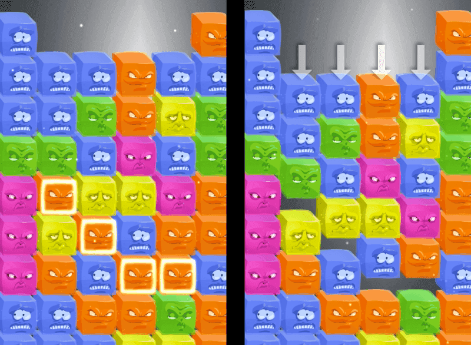

```lua
-- board.script
function on_input(self, action_id, action)
    ...
    elseif action_id == hash("touch") and action.released then
        self.dragging = false

        if #self.chain > 1 then
            remove_chain(self)
            nilremoved(self)
            slide_board(self)
        end

        for i, c in ipairs(self.connectors) do
            go.delete(c)
        end
        self.connectors = {}
    end
end
```

## Логика магических блоков

Теперь добавим главное отличие игры — магические блоки. Для них удобно сделать отдельный эффект `magic_fx.go`, который будет визуально оживлять блок.

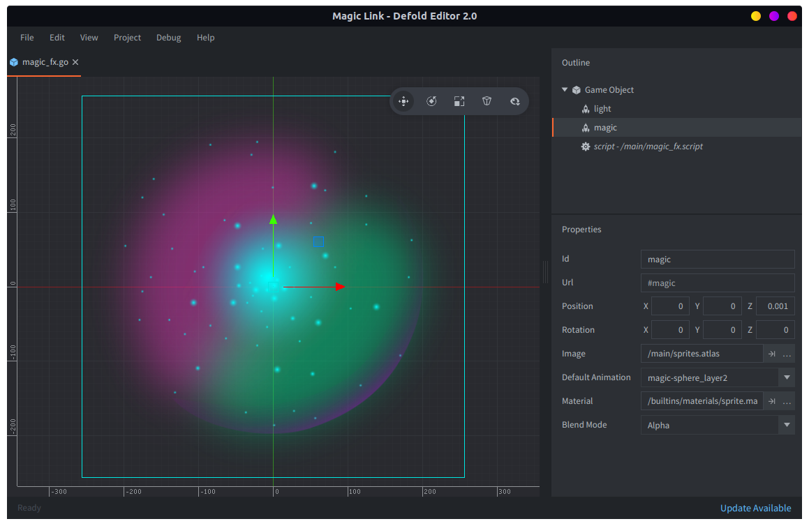

```lua
-- magic_fx.script
go.property("direction", hash("left"))

function init(self)
    msg.post("#", "lights_off")
    if self.direction == hash("left") then
        go.set(".", "euler.z", 0)
        go.animate(".", "euler.z", go.PLAYBACK_LOOP_FORWARD, 360,  go.EASING_LINEAR, 3 + math.random())
    else
        go.set(".", "euler.z", 0)
        go.animate(".", "euler.z", go.PLAYBACK_LOOP_FORWARD, -360,  go.EASING_LINEAR, 2 + math.random())
    end
end

function on_message(self, message_id, message, sender)
    if message_id == hash("lights_on") then
        msg.post("#light", "enable")
    elseif message_id == hash("lights_off") then
        msg.post("#light", "disable")
    end
end
```

Сам `block.go` нужно расширить дополнительным cover-спрайтом и factory-компонентом, чтобы он мог создавать два экземпляра `magic_fx.go`, вращающихся в разные стороны:

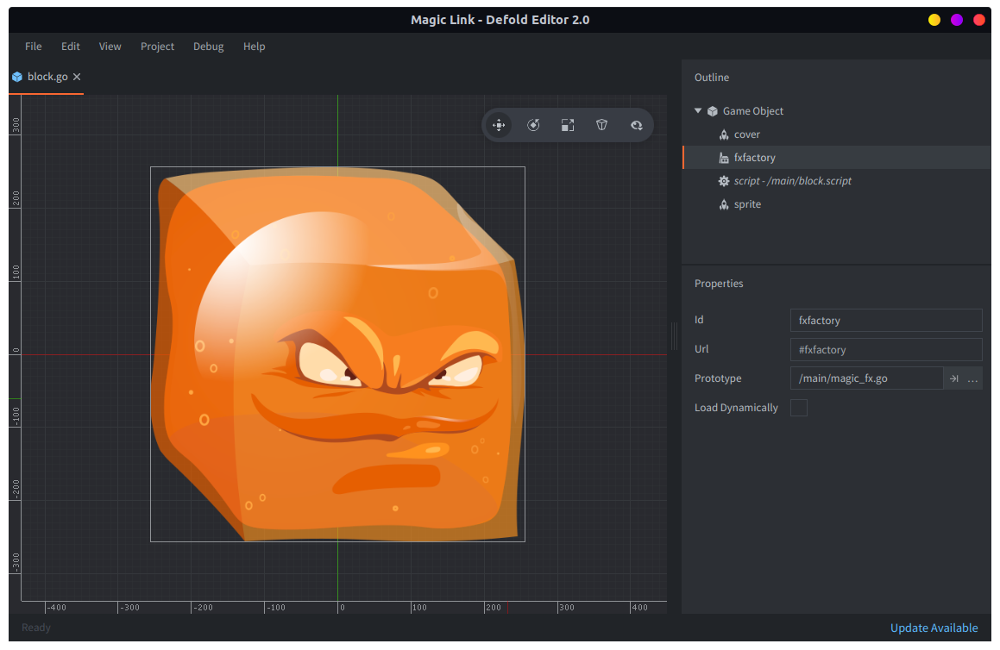

```lua
-- block.script
function init(self)
    go.set_scale(0.18) -- render scaled down

    self.fx1 = nil
    self.fx2 = nil

    msg.post("#cover", "disable")

    if self.color ~= nil then
        sprite.play_flipbook("#sprite", self.color)
    else
        msg.post("#sprite", "disable")
    end
end

function final(self)
    if self.fx1 ~= nil then
        go.delete(self.fx1)
    end

    if self.fx2 ~= nil then
        go.delete(self.fx2)
    end
end

function on_message(self, message_id, message, sender)
    if message_id == hash("make_magic") then
        self.color = hash("magic")
        msg.post("#cover", "enable")
        msg.post("#sprite", "enable")
        sprite.play_flipbook("#sprite", hash("magic-sphere_layer1"))

        self.fx1 = factory.create("#fxfactory", p, nil, { direction = hash("left") })
        self.fx2 = factory.create("#fxfactory", p, nil, { direction = hash("right") })

        go.set_parent(self.fx1, go.get_id())
        go.set_parent(self.fx2, go.get_id())

        go.set(self.fx1, "position.z", 0.01)
        go.set(self.fx1, "scale", 1)
        go.set(self.fx2, "position.z", 0.02)
        go.set(self.fx2, "scale", 1)
    elseif message_id == hash("lights_on") or message_id == hash("lights_off") then
        msg.post(self.fx1, message_id)
        msg.post(self.fx2, message_id)
    end
end
```

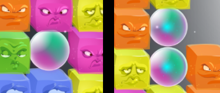

При построении поля теперь нужно распределять и магические блоки:

```lua
-- board.script
local function build_board(self)
    ...

    local rand_x = 0
    local rand_y
    for y = 0, boardheight - 1, boardheight / self.num_magic do
        local set = false
        while not set do
            rand_y = math.random(math.floor(y), math.min(boardheight - 1, math.floor(y + boardheight / self.num_magic)))
            rand_x = math.random(0, boardwidth - 1)
            if self.board[rand_x][rand_y].color ~= hash("magic") then
                msg.post(self.board[rand_x][rand_y].id, "make_magic")
                self.board[rand_x][rand_y].color = hash("magic")
                set = true
            end
        end
    end

    build_blocklist(self)
end
```

Главная механика магических блоков — горизонтальное скольжение в освободившиеся клетки. Для этого используется `slide_magic_blocks()`:

```lua
-- board.script
local function slide_magic_blocks(self)
    local row_m
    for y = 0,boardheight - 1 do
        row_m = {}
        for x = 0,boardwidth - 1 do
            if self.board[x][y] ~= nil and self.board[x][y] ~= hash("removing") and self.board[x][y].color == hash("magic") then
                table.insert(row_m, self.board[x][y])
            end
        end

        local mc = #row_m + 1
        while #row_m < mc do
            mc = #row_m
            for i, m in pairs(row_m) do
                local x = m.x
                if y > 0 and self.board[x][y-1] == hash("removing") then
                    row_m[i] = nil
                elseif x > 0 and self.board[x-1][y] == hash("removing") then
                    self.board[x-1][y] = self.board[x][y]
                    self.board[x-1][y].x = x - 1
                    go.animate(self.board[x][y].id, "position.x", go.PLAYBACK_ONCE_FORWARD, edge + blocksize / 2 + blocksize * (x - 1), go.EASING_OUTBOUNCE, 0.3)
                    go.set(self.board[x][y].id, "position.z", (x - 1) * -0.1 + y * 0.01)
                    self.board[x][y] = hash("removing")
                    row_m[i] = nil
                elseif x < boardwidth - 1 and self.board[x + 1][y] == hash("removing") then
                    self.board[x+1][y] = self.board[x][y]
                    self.board[x+1][y].x = x + 1
                    go.animate(self.board[x+1][y].id, "position.x", go.PLAYBACK_ONCE_FORWARD, edge + blocksize / 2 + blocksize * (x + 1), go.EASING_OUTBOUNCE, 0.3)
                    go.set(self.board[x+1][y].id, "position.z", (x + 1) * -0.1 + y * 0.01)
                    self.board[x][y] = hash("removing")
                    row_m[i] = nil
                end
            end
        end
    end
end
```

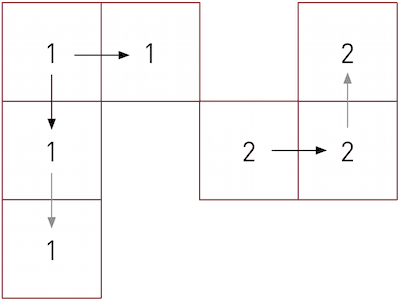

Чтобы определить победу, нужно отслеживать регионы связности магических блоков. Для этого удобно:

1. Собрать список всех магических блоков.
2. Найти соседние магические блоки.
3. Проставить им region id рекурсивно.
4. Посчитать число регионов. Если оно равно `1`, все магические блоки связаны.

```lua
-- board.script
local function magic_blocks(self)
    local magic = {}
    for x = 0,boardwidth - 1 do
        for y = 0,boardheight - 1 do
            if self.board[x][y] ~= nil and self.board[x][y].color == hash("magic") then
                table.insert(magic, self.board[x][y])
            end
        end
    end
    return magic
end

local function adjacent_magic_blocks(blocks, block)
    return filter(function (e)
        return (block.x == e.x and math.abs(block.y - e.y) == 1) or
            (block.y == e.y and math.abs(block.x - e.x) == 1)
    end, blocks)
end

local function mark_neighbors(blocks, block, region)
    local neighbors = adjacent_magic_blocks(blocks, block)
    for i, m in pairs(neighbors) do
        if m.region == nil then
            m.region = region
            mark_neighbors(blocks, m, region)
        end
    end
end

local function mark_magic_regions(self)
    local m_blocks = magic_blocks(self)
    for i, m in pairs(m_blocks) do
        m.region = nil
        local n = 0
        for _ in pairs(adjacent_magic_blocks(m_blocks, m)) do n = n + 1 end
        m.neighbors = n
    end

    local region = 1
    for i, m in pairs(m_blocks) do
        if m.region == nil then
            m.region = region
            mark_neighbors(m_blocks, m, region)
            region = region + 1
        end
    end
    return m_blocks
end
```

Дополнительно нужны функции для подсчета регионов и подсветки:

```lua
-- board.script
local function count_magic_regions(blocks)
    local maxr = 0
    for i, m in pairs(blocks) do
        if m.region > maxr then
            maxr = m.region
        end
    end
    return maxr
end

local function highlight_magic(blocks)
    for i, m in pairs(blocks) do
        if m.neighbors > 0 then
            msg.post(m.id, "lights_on")
        else
            msg.post(m.id, "lights_off")
        end
    end
end
```

При генерации поля нужно избегать случайной победы на старте. Если все магические блоки уже связаны, поле просто строится заново.

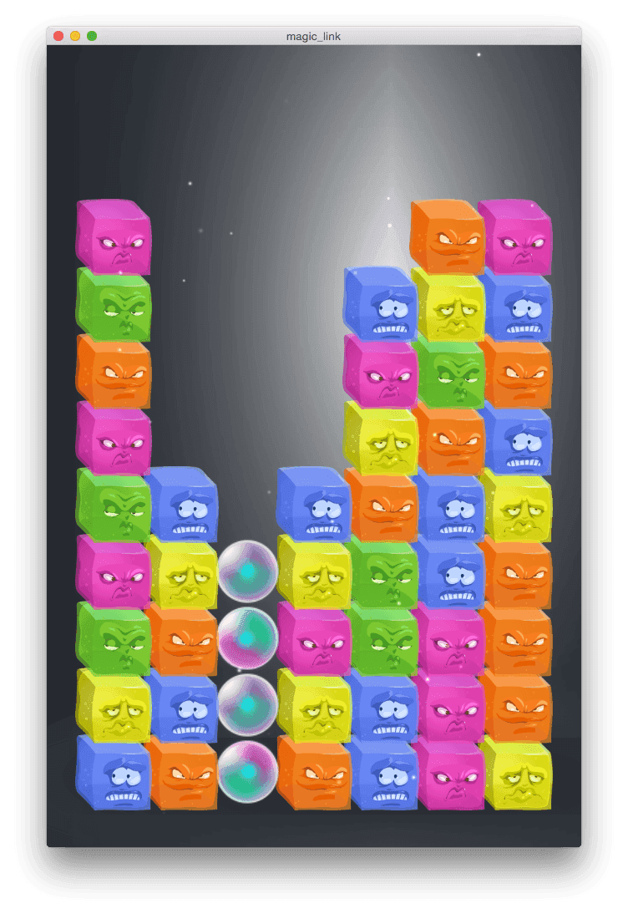

## Drop-механика

`DROP` — это простая механика прогрессии: игрок может ограниченное число раз сбросить сверху несколько новых случайных блоков. Изначально drop один, а после каждого пройденного уровня дается еще один.

```lua
-- board.script
local function dropspots(self)
    local spots = {}
    for x = 0, boardwidth - 1 do
        for y = 0, boardheight - 1 do
            if self.board[x][y] == nil then
                table.insert(spots, { x = x, y = y })
                break
            end
        end
    end
    for c = 1, #spots - dropamount do
        table.remove(spots, math.random(#spots))
    end
    return spots
end

local function drop(self, spots)
    for i, s in pairs(spots) do
        local pos = vmath.vector3()
        pos.x = edge + blocksize / 2 + blocksize * s.x
        pos.y = 1000
        c = colors[math.random(#colors)]
        local id = factory.create("#blockfactory", pos, null, { color = c })
        go.animate(id, "position.y", go.PLAYBACK_ONCE_FORWARD, bottom_edge + blocksize / 2 + blocksize * s.y, go.EASING_OUTBOUNCE, 0.5)
        go.set(id, "position.z", s.x * -0.1 + s.y * 0.01)

        self.board[s.x][s.y] = { id = id, color = c,  x = s.x, y = s.y }
    end

    build_blocklist(self)
end
```

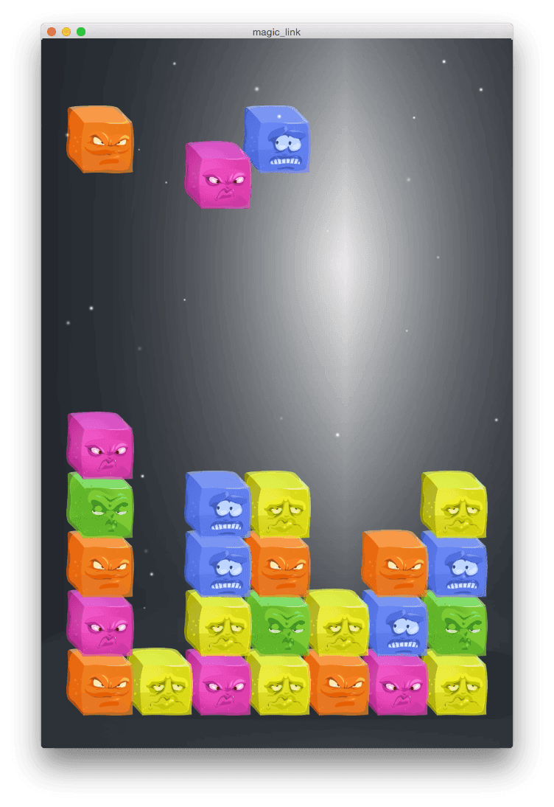

## Главное меню

Теперь можно собрать весь проект в законченную игру. Создайте `main_menu.gui` со стартовой кнопкой, заголовком и декоративными блоками. Скрипт `main_menu.gui_script` будет анимировать экран и отправлять сообщение `start_game` в главный script:

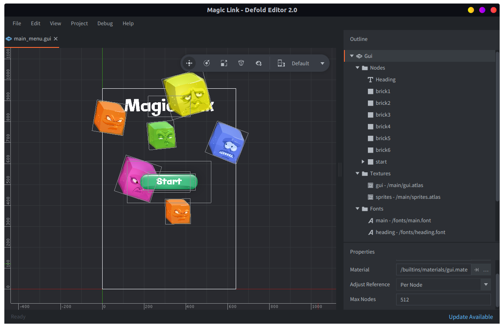

```lua
-- main_menu.gui_script
function init(self)
    msg.post(".", "acquire_input_focus")

    local bs = { "brick1", "brick2", "brick3", "brick4", "brick5", "brick6" }
    for i, b in ipairs(bs) do
        local n = gui.get_node(b)
        local rt = (math.random() * 3) + 1
        local a = math.random(-45, 45)
        gui.set_color(n, vmath.vector4(1, 1, 1, 0))

        gui.animate(n, "position.y", -100 - math.random(0, 50), gui.EASING_INSINE, 1 + rt, 0, nil, gui.PLAYBACK_LOOP_FORWARD)
        gui.animate(n, "color.w", 1, gui.EASING_INSINE, 1 + rt, 0, nil, gui.PLAYBACK_LOOP_FORWARD)
        gui.animate(n, "rotation.z", a, gui.EASING_INSINE, 1 + rt, 0, nil, gui.PLAYBACK_LOOP_FORWARD)
    end

    gui.animate(gui.get_node("start"), "color.x", 1, gui.EASING_INOUTSINE, 1, 0, nil, gui.PLAYBACK_LOOP_PINGPONG)
end

function on_input(self, action_id, action)
    if action_id == hash("touch") and action.pressed then
        local start = gui.get_node("start")

        if gui.pick_node(start, action.x, action.y) then
            msg.post("/main#script", "start_game")
        end
    end
end
```

Само поле теперь должно запускаться не из `board.script`, а через `Collection Proxy`. В `main.collection` нужен объект `main`, содержащий menu GUI, script и proxy, который будет загружать `board.collection`.

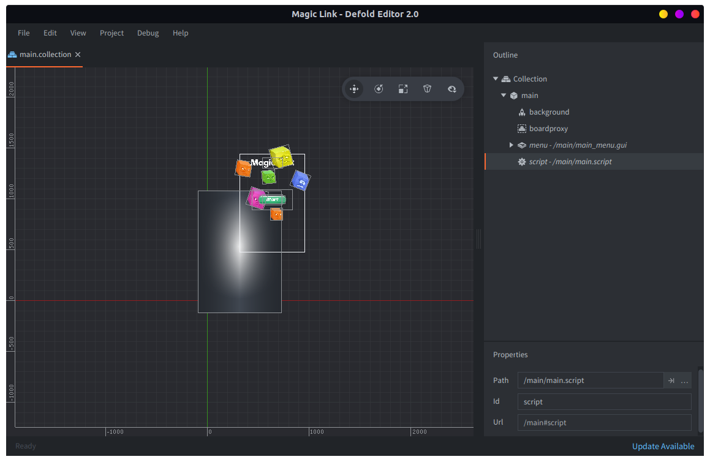

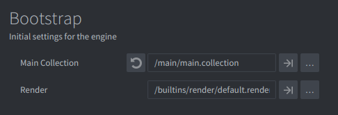

В `main.script` будет вся логика переключения между меню и игрой:

```lua
-- main.script
function init(self)
    msg.post("#", "to_main_menu")
    self.state = "MAIN_MENU"
end

function on_message(self, message_id, message, sender)
    if message_id == hash("to_main_menu") then
        if self.state ~= "MAIN_MENU" then
            msg.post("#boardproxy", "unload")
        end
        msg.post("main:/main#menu", "enable")
        self.state = "MAIN_MENU"
    elseif message_id == hash("start_game") then
        msg.post("#boardproxy", "load")
        msg.post("#menu", "disable")
    elseif message_id == hash("proxy_loaded") then
        msg.post(sender, "init")
        msg.post("board:/board#script", "start_level", { difficulty = 1 })
        msg.post(sender, "enable")
        self.state = "GAME_RUNNING"
    end
end
```

## Внутриигровой GUI

Теперь добавим GUI поверх игрового поля: кнопки *RESTART* и *DROP*, диалог подтверждения перезапуска, диалог завершения уровня, окно показа текущего уровня и сообщение о том, что для drop нет места.

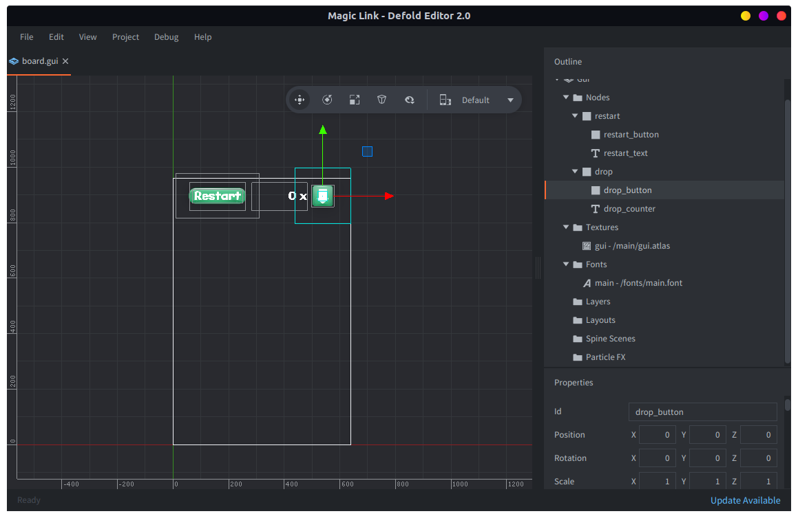

```lua
-- board.gui_script
function init(self)
    msg.post("#", "show")
    msg.post("/restart#gui", "hide")
    msg.post("/level_complete#gui", "hide")
end

function on_message(self, message_id, message, sender)
    if message_id == hash("hide") then
        msg.post("#", "disable")
    elseif message_id == hash("show") then
        msg.post("#", "enable")
    elseif message_id == hash("set_drop_counter") then
        local n = gui.get_node("drop_counter")
        gui.set_text(n, message.drops .. " x")
    end
end

function on_input(self, action_id, action)
    if action_id == hash("touch") and action.pressed then
        local restart = gui.get_node("restart")
        local drop = gui.get_node("drop")

        if gui.pick_node(restart, action.x, action.y) then
            msg.post("/restart#gui", "show")
            msg.post("#", "hide")
        elseif gui.pick_node(drop, action.x, action.y) then
            msg.post("/board#script", "drop")
        end
    end
end
```

Диалог перезапуска:

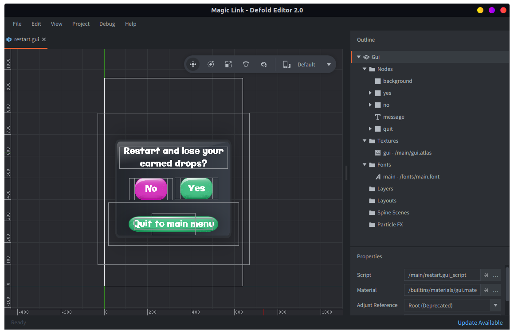

```lua
-- restart.gui_script
function on_message(self, message_id, message, sender)
    if message_id == hash("hide") then
        msg.post("#", "disable")
        msg.post(".", "release_input_focus")
    elseif message_id == hash("show") then
        msg.post("#", "enable")
        msg.post(".", "acquire_input_focus")
    end
end
```

Диалог завершения уровня:

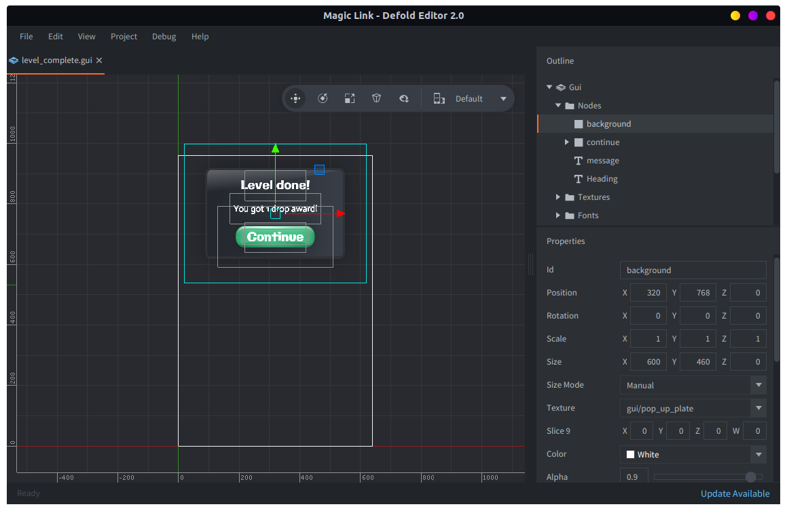

```lua
-- level_complete.gui_script
function init(self)
    msg.post("#", "hide")
end

function on_message(self, message_id, message, sender)
    if message_id == hash("hide") then
        msg.post("#", "disable")
        msg.post(".", "release_input_focus")
    elseif message_id == hash("show") then
        msg.post("#", "enable")
        msg.post(".", "acquire_input_focus")
    end
end
```

Окно показа уровня:

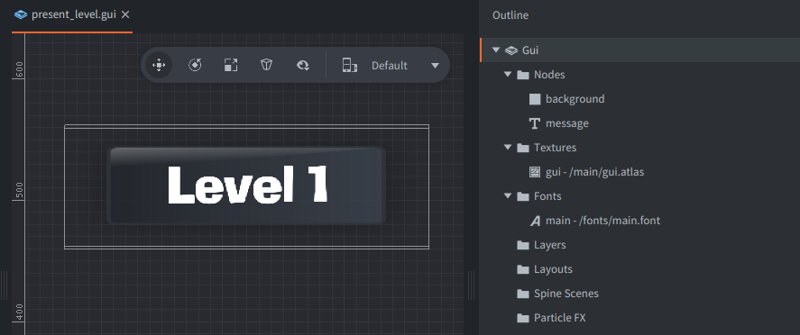

```lua
-- present_level.gui_script
function init(self)
    msg.post("#", "hide")
end

function on_message(self, message_id, message, sender)
    if message_id == hash("hide") then
        msg.post("#", "disable")
    elseif message_id == hash("show") then
        local n = gui.get_node("message")
        gui.set_text(n, "Level " .. message.level)
        msg.post("#", "enable")
    end
end
```

Сообщение о том, что drop сделать нельзя:

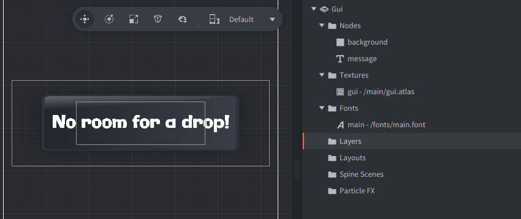

```lua
-- no_drop_room.gui_script
function init(self)
    msg.post("#", "hide")
    self.t = 0
end

function update(self, dt)
    if self.t < 0 then
        msg.post("#", "hide")
    else
        self.t = self.t - dt
    end
end

function on_message(self, message_id, message, sender)
    if message_id == hash("hide") then
        msg.post("#", "disable")
    elseif message_id == hash("show") then
        self.t = 1
        msg.post("#", "enable")
    end
end
```

Добавьте все GUI-компоненты в `board.collection`:

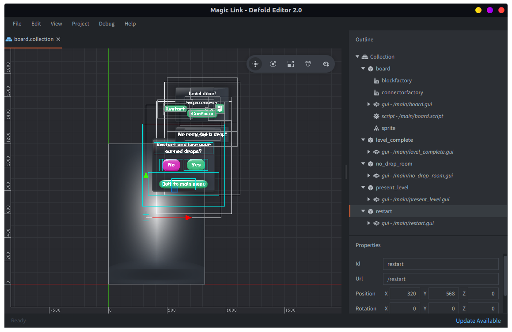

И завершите `board.script`, добавив обработку сообщений:

```lua
-- board.script
function on_message(self, message_id, message, sender)
    if message_id == hash("start_level") then
        self.num_magic = message.difficulty + 1
        build_board(self)

        msg.post("#gui", "set_drop_counter", { drops = self.drops } )

        msg.post("present_level#gui", "show", { level = message.difficulty } )
        go.animate("#", "timer", go.PLAYBACK_ONCE_FORWARD, 1, go.EASING_LINEAR, 2, 0, function ()
            msg.post("present_level#gui", "hide")
            msg.post(".", "acquire_input_focus")
        end)
    elseif message_id == hash("restart_level") then
        clear_board(self)
        build_board(self)
        self.drops = 1
        msg.post("#gui", "set_drop_counter", { drops = self.drops } )
        msg.post(".", "acquire_input_focus")
    elseif message_id == hash("level_completed") then
        msg.post(".", "release_input_focus")

        for i, m in ipairs(magic_blocks(self)) do
            go.set_scale(0.17, m.id)
            go.animate(m.id, "scale", go.PLAYBACK_LOOP_PINGPONG, 0.19, go.EASING_INSINE, 0.5, 0)
        end

        msg.post("level_complete#gui", "show")
    elseif message_id == hash("next_level") then
        clear_board(self)
        self.drops = self.drops + 1
        msg.post("#", "start_level", { difficulty = self.num_magic })
    elseif message_id == hash("drop") then
        s = dropspots(self)
        if #s == 0 then
            msg.post("no_drop_room#gui", "show")
        elseif self.drops > 0 then
            drop(self, s)
            self.drops = self.drops - 1
            msg.post("#gui", "set_drop_counter", { drops = self.drops } )
        end
    end
end
```

На этом игра и руководство собраны в завершенный вид.

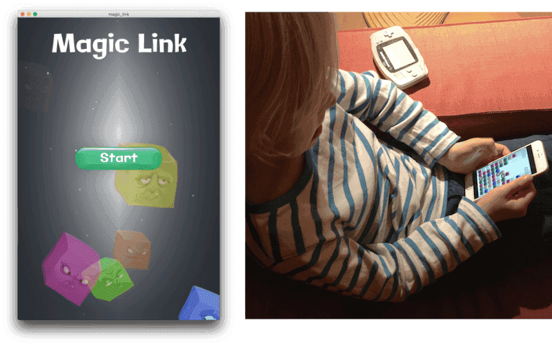

## Что можно сделать дальше

У этой игры много направлений для доработки. Попробуйте:

* улучшить читаемость взаимодействия для нового игрока;
* добавить звуки и музыку;
* автоматически определять game over;
* сделать high score с сохранением между запусками;
* полностью переосмыслить реализацию игры только на GUI API;
* придумать более устойчивую систему роста сложности, чем простое добавление одного магического блока на уровень;
* оптимизировать расход спрайтов и переиспользовать объекты вместо постоянного удаления и создания;
* сделать рендеринг полностью независимым от разрешения и aspect ratio.
