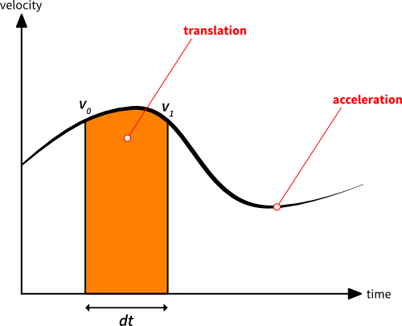
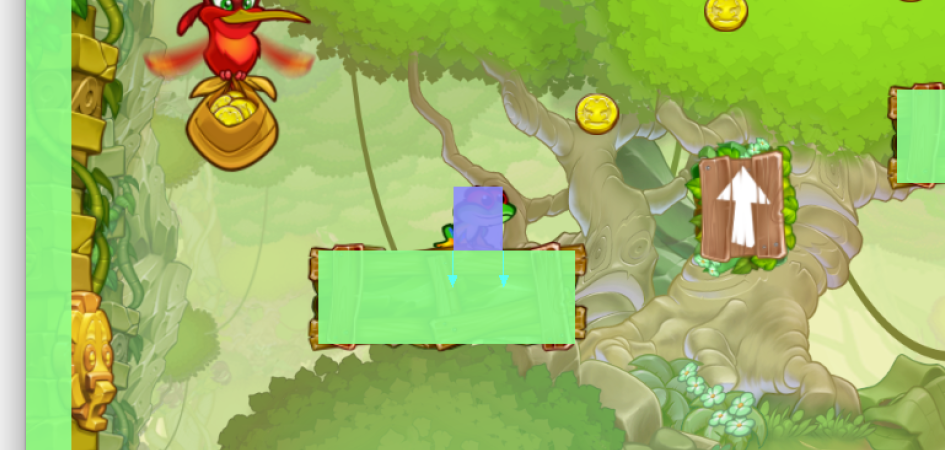
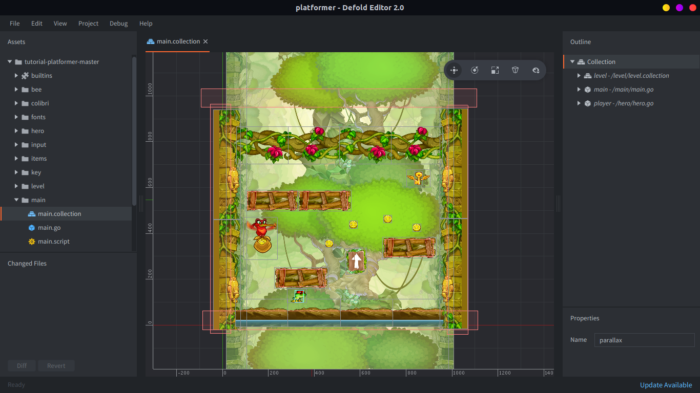
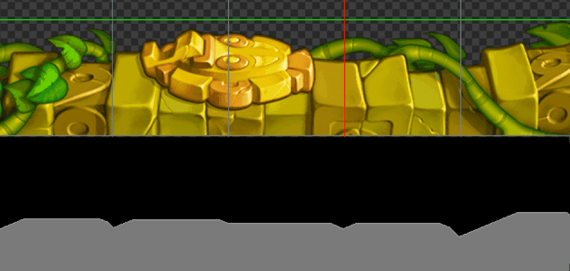

# Platformer

В этой статье мы разберём реализацию базового 2D-платформера на тайлах в Defold. Мы рассмотрим движение влево/вправо, прыжок и падение.

Платформер можно реализовать множеством разных способов. Родриго Монтейру написал очень подробный разбор этой темы, а также многое другое [здесь](http://higherorderfun.com/blog/2012/05/20/the-guide-to-implementing-2d-platformers/).

Мы настоятельно рекомендуем прочитать этот материал, если вы только начинаете делать платформеры, поскольку в нём много полезной информации. Мы чуть подробнее остановимся на нескольких описанных там методах и покажем, как реализовать их в Defold. При этом всё должно быть довольно легко перенести на другие платформы и языки (в Defold мы используем Lua).

Мы предполагаем, что вы немного знакомы с векторной математикой (линейной алгеброй). Если нет, стоит почитать об этом, потому что она невероятно полезна в разработке игр. Дэвид Розен из Wolfire написал очень хорошую серию на эту тему [здесь](http://blog.wolfire.com/2009/07/linear-algebra-for-game-developers-part-1/).

Если вы уже используете Defold, можно создать новый проект на основе шаблона _Platformer_ и экспериментировать с ним по ходу чтения этой статьи.

::: sidenote
Некоторые читатели отмечали, что предложенный нами метод невозможен с реализацией Box2D по умолчанию. Мы внесли несколько изменений в Box2D, чтобы это заработало:

Коллизии между кинематическими и статическими объектами игнорируются. Измените проверки в `b2Body::ShouldCollide` и `b2ContactManager::Collide`.

Кроме того, расстояние контакта (в Box2D оно называется separation) не передаётся в callback-функцию.
Добавьте поле distance в `b2ManifoldPoint` и убедитесь, что оно обновляется в функциях `b2Collide*`.
:::

## Обнаружение столкновений

Обнаружение столкновений нужно, чтобы игрок не проходил сквозь геометрию уровня.
Есть несколько способов сделать это, в зависимости от вашей игры и её требований.
Один из самых простых способов, если он вам подходит, это поручить эту задачу физическому движку.
В Defold для 2D-игр используется физический движок [Box2D](http://box2d.org/).
Стандартной реализации Box2D не хватает некоторых нужных нам возможностей, см. в конце этой статьи, как именно мы её изменили.

Физический движок хранит состояния физических объектов вместе с их формами, чтобы симулировать физическое поведение. Он также сообщает о столкновениях по мере симуляции, чтобы игра могла реагировать на них. В большинстве физических движков есть три типа объектов: _статические_, _динамические_ и _кинематические_ объекты (в других движках названия могут отличаться). Есть и другие типы, но пока их пропустим.

- *Static* объект никогда не двигается (например, геометрия уровня).
- *Dynamic* объект подвержен силам и моментам, которые в ходе симуляции преобразуются в скорости.
- *Kinematic* объект управляется логикой приложения, но всё равно влияет на другие динамические объекты.

В такой игре мы хотим получить что-то похожее на физическое поведение реального мира, но отзывчивое управление и хорошо настроенные механики гораздо важнее. Прыжок, который приятно ощущается, не обязан быть физически точным или подчиняться реальной гравитации. Тем не менее [этот](http://hypertextbook.com/facts/2007/mariogravity.shtml) анализ показывает, что гравитация в играх Mario в разных версиях приближается к 9.8 м/с<sup>2</sup>. :-)

Важно, чтобы у нас был полный контроль над происходящим, чтобы можно было проектировать и настраивать механику под нужный игровой опыт. Поэтому мы моделируем персонажа кинематическим объектом. Тогда мы можем перемещать героя как угодно, не имея дела с физическими силами. Это означает, что разделение персонажа и геометрии уровня нам придётся решать самостоятельно (об этом ниже), но это тот недостаток, который нас устраивает. В физическом мире мы будем представлять героя прямоугольной формой.

## Движение

Теперь, когда мы решили представлять героя кинематическим объектом, мы можем свободно перемещать его, задавая позицию. Начнём с движения влево/вправо.

Движение будет основано на ускорении, чтобы у персонажа ощущался вес. Как и у обычного транспортного средства, ускорение определяет, насколько быстро герой достигает максимальной скорости и меняет направление. Ускорение действует в течение временного шага кадра, обычно передаваемого в параметре `dt` (delta-`t`), после чего прибавляется к скорости. Точно так же скорость действует на протяжении кадра, а получившееся смещение прибавляется к позиции. В математике это называется [интегрированием по времени](http://en.wikipedia.org/wiki/Integral).



Две вертикальные линии обозначают начало и конец кадра. Высота линий показывает скорость героя в эти два момента времени. Назовём эти скорости `v0` и `v1`. `v1` получается применением ускорения (наклона кривой) на протяжении шага `dt`:


Оранжевая область — это смещение, которое мы должны применить к герою в текущем кадре. Геометрически мы можем приблизить эту площадь так:


Вот как мы интегрируем ускорение и скорость, чтобы перемещать персонажа в цикле обновления:

1. Определяем целевую скорость на основе ввода.
2. Вычисляем разницу между текущей и целевой скоростью.
3. Задаём ускорение в направлении этой разницы.
4. Вычисляем изменение скорости в текущем кадре (`dv` означает delta-velocity):

    ```lua
    local dv = acceleration * dt
    ```

5. Проверяем, не превышает ли `dv` требуемую разницу скоростей, и ограничиваем его, если превышает.
6. Сохраняем текущую скорость для дальнейшего использования (`self.velocity`, которая сейчас равна скорости из предыдущего кадра):

    ```lua
    local v0 = self.velocity
    ```

7. Вычисляем новую скорость, прибавляя изменение скорости:

    ```lua
    self.velocity = self.velocity + dv
    ```

8. Вычисляем смещение по X в этом кадре, интегрируя скорость:

    ```lua
    local dx = (v0 + self.velocity) * dt * 0.5
    ```

9. Применяем его к персонажу.

Если вы не уверены, как работать с вводом в Defold, об этом есть руководство [здесь](/manuals/input).

На этом этапе мы можем двигать персонажа влево и вправо, получая плавное и весомое ощущение управления. Теперь добавим гравитацию.

Гравитация тоже является ускорением, но действует на игрока по оси Y. Это значит, что её нужно применять тем же способом, что и ускорение движения, описанное выше. Если просто изменить приведённые выше вычисления на векторные и убедиться, что в шаге 3 мы включаем гравитацию в компонент `y` ускорения, всё заработает. Обожаем векторную математику! :-)

## Реакция на столкновения

Теперь наш персонаж умеет двигаться и падать, поэтому пора заняться реакцией на столкновения.
Очевидно, нам нужно уметь приземляться и двигаться вдоль геометрии уровня. Мы будем использовать точки контакта, которые предоставляет физический движок, чтобы гарантировать, что мы никогда не пересечёмся с препятствием.

Точка контакта содержит _нормаль_ контакта (она указывает наружу из объекта, с которым мы столкнулись, хотя в других движках это может быть иначе) и _расстояние_, которое показывает, насколько глубоко мы вошли в другой объект. Этого достаточно, чтобы отделить персонажа от геометрии уровня.
Поскольку мы используем прямоугольник, за один кадр можем получить несколько точек контакта. Это происходит, например, когда два угла прямоугольника пересекают горизонтальную поверхность, или когда игрок движется в угол.



Чтобы не выполнять одну и ту же коррекцию несколько раз, мы накапливаем коррекции в векторе, чтобы не перекомпенсировать столкновение. Иначе персонаж окажется слишком далеко от объекта, с которым столкнулся. На изображении выше видно, что сейчас у нас две точки контакта, показанные двумя стрелками (нормалями). Глубина проникновения одинакова для обеих точек, и если слепо применять её каждый раз, мы сдвинем игрока вдвое дальше, чем нужно.

::: sidenote
Важно сбрасывать накопленные коррекции в нулевой вектор каждый кадр.
Добавьте что-то вроде этого в конец функции `update()`:
`self.corrections = vmath.vector3()`
:::

Предположим, что есть callback-функция, вызываемая для каждой точки контакта. Вот как в ней можно выполнять разделение:

```lua
local proj = vmath.dot(self.correction, normal) -- <1>
local comp = (distance - proj) * normal -- <2>
self.correction = self.correction + comp -- <3>
go.set_position(go.get_position() + comp) -- <4>
```

1. Проецируем вектор коррекции на нормаль контакта (для первой точки контакта вектор коррекции равен нулю).
2. Вычисляем компенсацию, которую нужно применить для этой точки контакта.
3. Добавляем её к вектору коррекции.
4. Применяем компенсацию к персонажу.

Также нам нужно убрать из скорости ту часть, которая направлена в сторону точки контакта:

```lua
proj = vmath.dot(self.velocity, message.normal) -- <1>
if proj < 0 then
    self.velocity = self.velocity - proj * message.normal -- <2>
end
```
1. Проецируем скорость на нормаль.
2. Если проекция отрицательная, это означает, что часть скорости направлена в точку контакта; в этом случае убираем этот компонент.

## Прыжок

Теперь, когда мы умеем бегать по геометрии уровня и падать вниз, пора прыгать. Прыжок в платформере можно сделать множеством способов. В этой игре мы стремимся к ощущению, похожему на Super Mario Bros и Super Meat Boy. При прыжке персонаж получает импульс вверх, то есть фиксированную скорость.

Гравитация будет постоянно тянуть персонажа вниз, создавая красивую дугу прыжка. Находясь в воздухе, игрок всё ещё может управлять персонажем. Если отпустить кнопку прыжка до вершины дуги, скорость вверх уменьшается, и прыжок обрывается раньше.

1. Когда ввод нажат, делаем так:

    ```lua
    -- jump_takeoff_speed is a constant defined elsewhere
    self.velocity.y = jump_takeoff_speed
    ```

    Это нужно делать только в момент _нажатия_, а не каждый кадр, пока кнопка _удерживается_.

2. Когда ввод отпущен, делаем так:

    ```lua
    -- cut the jump short if we are still going up
    if self.velocity.y > 0 then
        -- scale down the upwards speed
        self.velocity.y = self.velocity.y * 0.5
    end
    ```

ExciteMike построил хорошие графики дуг прыжка для [Super Mario Bros 3](http://meyermike.com/wp/?p=175) и [Super Meat Boy](http://meyermike.com/wp/?p=160), на которые стоит посмотреть.

## Геометрия уровня

Геометрия уровня — это формы столкновения окружения, с которыми сталкивается персонаж (и, возможно, другие объекты). В Defold есть два способа создать такую геометрию.

Либо вы создаёте отдельные collision shape поверх собранных уровней. Этот метод очень гибкий и позволяет точно размещать графику. Он особенно полезен, если вам нужны плавные наклонные поверхности.
Игра [Braid](http://braid-game.com/) использовала именно этот подход, и так же построен пример уровня в этом учебнике. Вот как это выглядит в редакторе Defold:



Другой вариант — строить уровни из тайлов и позволить редактору автоматически генерировать физические формы на основе графики тайлов. Это значит, что геометрия уровня будет автоматически обновляться при изменении уровня, что может быть очень полезно.

Размещённые тайлы автоматически объединяют свои физические формы в одну, если они соприкасаются.
Это устраняет зазоры, из-за которых персонаж может застревать или подпрыгивать при скольжении по нескольким горизонтальным тайлам подряд. Для этого полигоны тайлов при загрузке заменяются в Box2D на edge shape.



На изображении выше показан пример, где мы создали пять соседних тайлов из фрагмента графики платформера. Видно, как размещённые тайлы (сверху) соответствуют одной единственной сшитой форме (нижний серый контур).

Подробнее смотрите в наших руководствах по [physics](/manuals/physics) и [tiles](/manuals/2dgraphics).

## Заключение

Если вам нужна ещё информация о механиках платформеров, вот впечатляюще большой материал о физике в [Sonic](http://info.sonicretro.org/Sonic_Physics_Guide).

Если вы попробуете наш шаблонный проект на устройстве iOS или с мышью, прыжок может показаться довольно неудобным.
Это просто наша скромная попытка сделать платформер с управлением одним касанием. :-)

Мы не обсуждали, как именно обрабатывали анимации в этой игре. Представление можно получить, посмотрев на *player.script* ниже, особенно на функцию `update_animations()`.

Надеемся, эта информация была вам полезна!
Сделайте отличный платформер, чтобы мы все могли в него сыграть! <3

## Код

Вот содержимое *player.script*:

```lua
-- player.script

-- these are the tweaks for the mechanics, feel free to change them for a different feeling
-- the acceleration to move right/left
local move_acceleration = 3500
-- acceleration factor to use when air-borne
local air_acceleration_factor = 0.8
-- max speed right/left
local max_speed = 450
-- gravity pulling the player down in pixel units
local gravity = -1000
-- take-off speed when jumping in pixel units
local jump_takeoff_speed = 550
-- time within a double tap must occur to be considered a jump (only used for mouse/touch controls)
local touch_jump_timeout = 0.2

-- prehashing ids improves performance
local msg_contact_point_response = hash("contact_point_response")
local msg_animation_done = hash("animation_done")
local group_obstacle = hash("obstacle")
local input_left = hash("left")
local input_right = hash("right")
local input_jump = hash("jump")
local input_touch = hash("touch")
local anim_run = hash("run")
local anim_idle = hash("idle")
local anim_jump = hash("jump")
local anim_fall = hash("fall")

function init(self)
    -- this lets us handle input in this script
    msg.post(".", "acquire_input_focus")

    -- initial player velocity
    self.velocity = vmath.vector3(0, 0, 0)
    -- support variable to keep track of collisions and separation
    self.correction = vmath.vector3()
    -- if the player stands on ground or not
    self.ground_contact = false
    -- movement input in the range [-1,1]
    self.move_input = 0
    -- the currently playing animation
    self.anim = nil
    -- timer that controls the jump-window when using mouse/touch
    self.touch_jump_timer = 0
end

local function play_animation(self, anim)
    -- only play animations which are not already playing
    if self.anim ~= anim then
        -- tell the sprite to play the animation
        sprite.play_flipbook("#sprite", anim)
        -- remember which animation is playing
        self.anim = anim
    end
end

local function update_animations(self)
    -- make sure the player character faces the right way
    sprite.set_hflip("#sprite", self.move_input < 0)
    -- make sure the right animation is playing
    if self.ground_contact then
        if self.velocity.x == 0 then
            play_animation(self, anim_idle)
        else
            play_animation(self, anim_run)
        end
    else
        if self.velocity.y > 0 then
            play_animation(self, anim_jump)
        else
            play_animation(self, anim_fall)
        end
    end
end

function update(self, dt)
    -- determine the target speed based on input
    local target_speed = self.move_input * max_speed
    -- calculate the difference between our current speed and the target speed
    local speed_diff = target_speed - self.velocity.x
    -- the complete acceleration to integrate over this frame
    local acceleration = vmath.vector3(0, gravity, 0)
    if speed_diff ~= 0 then
        -- set the acceleration to work in the direction of the difference
        if speed_diff < 0 then
            acceleration.x = -move_acceleration
        else
            acceleration.x = move_acceleration
        end
        -- decrease the acceleration when air-borne to give a slower feel
        if not self.ground_contact then
            acceleration.x = air_acceleration_factor * acceleration.x
        end
    end
    -- calculate the velocity change this frame (dv is short for delta-velocity)
    local dv = acceleration * dt
    -- check if dv exceeds the intended speed difference, clamp it in that case
    if math.abs(dv.x) > math.abs(speed_diff) then
        dv.x = speed_diff
    end
    -- save the current velocity for later use
    -- (self.velocity, which right now is the velocity used the previous frame)
    local v0 = self.velocity
    -- calculate the new velocity by adding the velocity change
    self.velocity = self.velocity + dv
    -- calculate the translation this frame by integrating the velocity
    local dp = (v0 + self.velocity) * dt * 0.5
    -- apply it to the player character
    go.set_position(go.get_position() + dp)

    -- update the jump timer
    if self.touch_jump_timer > 0 then
        self.touch_jump_timer = self.touch_jump_timer - dt
    end

    update_animations(self)

    -- reset volatile state
    self.correction = vmath.vector3()
    self.move_input = 0
    self.ground_contact = false

end

local function handle_obstacle_contact(self, normal, distance)
    -- project the correction vector onto the contact normal
    -- (the correction vector is the 0-vector for the first contact point)
    local proj = vmath.dot(self.correction, normal)
    -- calculate the compensation we need to make for this contact point
    local comp = (distance - proj) * normal
    -- add it to the correction vector
    self.correction = self.correction + comp
    -- apply the compensation to the player character
    go.set_position(go.get_position() + comp)
    -- check if the normal points enough up to consider the player standing on the ground
    -- (0.7 is roughly equal to 45 degrees deviation from pure vertical direction)
    if normal.y > 0.7 then
        self.ground_contact = true
    end
    -- project the velocity onto the normal
    proj = vmath.dot(self.velocity, normal)
    -- if the projection is negative, it means that some of the velocity points towards the contact point
    if proj < 0 then
        -- remove that component in that case
        self.velocity = self.velocity - proj * normal
    end
end

function on_message(self, message_id, message, sender)
    -- check if we received a contact point message
    if message_id == msg_contact_point_response then
        -- check that the object is something we consider an obstacle
        if message.group == group_obstacle then
            handle_obstacle_contact(self, message.normal, message.distance)
        end
    end
end

local function jump(self)
    -- only allow jump from ground
    -- (extend this with a counter to do things like double-jumps)
    if self.ground_contact then
        -- set take-off speed
        self.velocity.y = jump_takeoff_speed
        -- play animation
        play_animation(self, anim_jump)
    end
end

local function abort_jump(self)
    -- cut the jump short if we are still going up
    if self.velocity.y > 0 then
        -- scale down the upwards speed
        self.velocity.y = self.velocity.y * 0.5
    end
end

function on_input(self, action_id, action)
    if action_id == input_left then
        self.move_input = -action.value
    elseif action_id == input_right then
        self.move_input = action.value
    elseif action_id == input_jump then
        if action.pressed then
            jump(self)
        elseif action.released then
            abort_jump(self)
        end
    elseif action_id == input_touch then
        -- move towards the touch-point
        local diff = action.x - go.get_position().x
        -- only give input when far away (more than 10 pixels)
        if math.abs(diff) > 10 then
            -- slow down when less than 100 pixels away
            self.move_input = diff / 100
            -- clamp input to [-1,1]
            self.move_input = math.min(1, math.max(-1, self.move_input))
        end
        if action.released then
            -- start timing the last release to see if we are about to jump
            self.touch_jump_timer = touch_jump_timeout
        elseif action.pressed then
            -- jump on double tap
            if self.touch_jump_timer > 0 then
                jump(self)
            end
        end
    end
end
```
