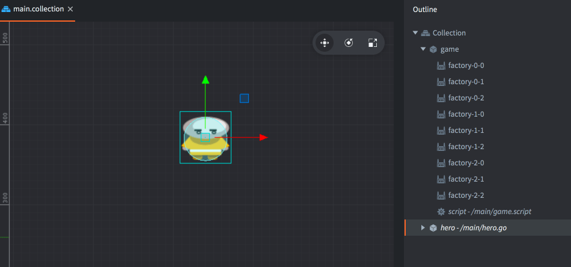
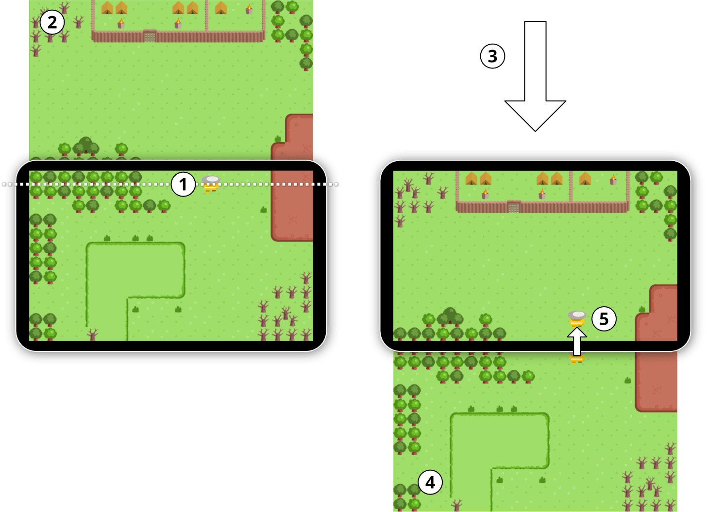
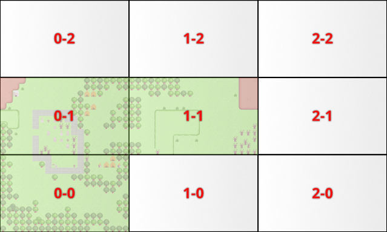
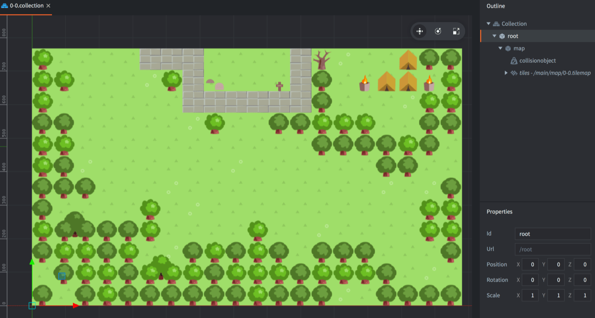
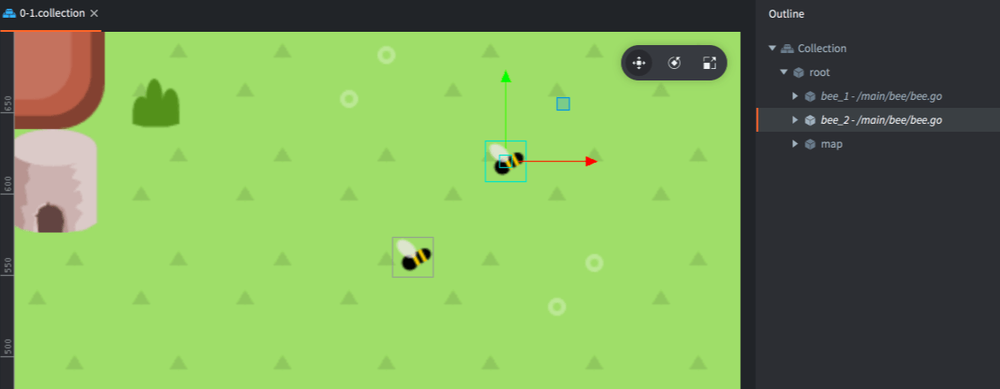
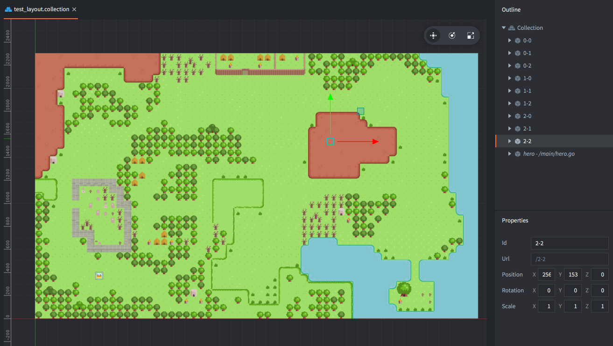
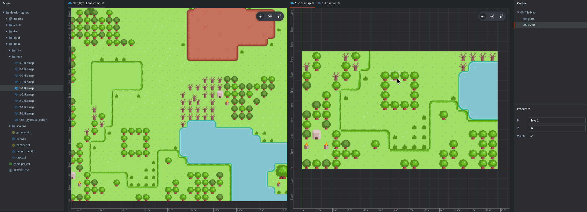

# RPG map — пример проекта

В этом примере проекта, который можно [открыть из редактора](/manuals/project-setup/) или [скачать с GitHub](https://github.com/defold/sample-rpgmap), мы показываем один из способов создания очень больших RPG-карт в Defold. Дизайн основан на следующих предположениях:

1. Мир показывается по одному экрану за раз. Это позволяет естественным образом ограничивать врагов и NPC рамками одного экрана. Дизайнер уровня полностью контролирует то, как мир отображается на экране игрока.
2. Игровой персонаж должен иметь возможность перемещаться сколь угодно далеко без проблем с точностью чисел с плавающей точкой. Иначе объекты часто начинают странно дрожать при удалении от начала координат.
3. Движение игрока ограничено препятствиями на карте, поэтому дизайнер уровня может направлять игрока между экранами с помощью деревьев, камней, воды и других преград.
4. Должна быть возможность свободно сочетать tilemap, sprite и другой визуальный контент.

Сначала запустите пример и пройдите по миру размером 3x3 экрана, чтобы почувствовать, как он устроен. Персонаж управляется клавишами со стрелками.

## Главная коллекция

Откройте "/main/main.collection", чтобы посмотреть стартовую коллекцию этого примера.

Главная коллекция содержит игровой объект персонажа, управляемого в 8 направлениях с помощью клавиш со стрелками, и второй игровой объект под названием "game", который управляет логикой игры. Объект "game" состоит из скрипта и одного collection factory для каждого экрана в игре. Factory названы в соответствии со схемой именования экранной сетки.

Скрипт "/main/game.script" отслеживает, на каком экране сейчас находится игрок. Он также реагирует на пользовательское сообщение "load_screen". Это сообщение загружает новый экран и меняет его местами с текущим экраном в направлении движения героя. Изначально экран загружается в центр экрана, и заменять пока нечего.

## Смена экранов

Герой управляется скриптом "/main/hero.script". Скрипт проверяет, не пересёк ли игровой объект героя верхнюю, нижнюю, левую или правую линию рядом с границей экрана:

1. Если герой подходит достаточно близко к краю экрана, в скрипт объекта "game" отправляется сообщение для загрузки следующего экрана.
2. Коллекция следующего экрана создаётся вызовом `factory.create()` у правильного компонента collectionfactory. Содержимое коллекции размещается за пределами экрана.
3. Следующий экран прокручивается в центр, а текущий экран прокручивается в противоположную сторону за пределы видимой области. Игровой персонаж также смещается на то же расстояние и с той же скоростью.
4. Старый текущий экран, который теперь находится вне видимой области, удаляется, а следующий экран становится новым текущим.
5. Герой анимированно появляется на новом экране, и игрок снова получает управление.

Всё это происходит меньше чем за секунду, поэтому переход выглядит плавным и не мешает игре.

## Экраны

Каждый экран игрового мира построен внутри отдельной коллекции, содержащей tilemap, collision object и другие игровые объекты, уникальные для этого экрана. Чтобы упростить управление и загрузку экранов, их коллекции названы по простой схеме:

Каждая коллекция экрана названа в соответствии со своим положением в сетке мира. Первое число обозначает координату X, второе — координату Y.

В панели *Assets* перейдите к коллекции "/main/screens/0-0.collection" и откройте её. Она описывает экран в левом нижнем углу карты:

Обратите внимание на игровой объект "root", который является родителем для всего содержимого экрана. Это ещё одна принятая в примере договорённость, и она очень важна: когда экран перемещается в видимую область, достаточно двигать только игровой объект "root". Все дочерние объекты автоматически перемещаются вместе с родителем. Если на экране есть специальные игровые объекты, их можно свободно анимировать, потому что их движение вычисляется относительно родителя root. Когда экран прокручивается внутрь или наружу, эти дочерние объекты перемещаются вместе с ним. Специальный код нужен только в том случае, если объект должен переходить между экранами.

Пчёлы на экране 0-1 — простой пример этой идеи:

## Редактирование экранов в контексте всего мира

У каждого экрана есть собственный tilemap, который можно редактировать во встроенном редакторе tilemap. Однако главный недостаток изолированного редактирования каждого экрана состоит в том, что сложно увидеть, как он соединяется с соседними экранами, а это важно для непрерывности игрового мира.

Поэтому была создана специальная коллекция. Откройте "/main/map/test_layout.collection", чтобы посмотреть коллекцию тестовой раскладки мира:

Единственное назначение этой коллекции — служить инструментом редактирования во время разработки. Если редактировать конкретный экран рядом с коллекцией test layout, вы получаете контекст для текущего экрана, и работать становится гораздо удобнее:

Любые изменения в tilemap экрана (здесь справа) сразу отражаются в тестовой коллекции (слева). Также обратите внимание, что коллекция test layout не добавлена в статическую иерархию, поэтому автоматически исключается из всех сборок.

## Итоги

Как вы увидели, этот пример построен под конкретные ограничения, связанные с игровым миром и тем, как герой перемещается по нему. Если вашей игре нужны другие свойства, вам, вероятно, придётся искать другое решение. Например, если камера должна плавно перемещаться по всей карте мира, понадобится иной способ разделения контента, другой механизм загрузки и другие инструменты для создания игрового мира.

На этом разбор примера RPG map завершён. Как всегда, вы можете использовать содержимое примера любым удобным способом. Чтобы узнать больше о Defold, загляните в [документацию](https://defold.com/learn), где есть примеры, учебники, руководства и API-документация.

Если у вас возникнут проблемы или вопросы, [заходите на наш форум](https://forum.defold.com/).

Приятной работы с Defold!
