# Учебник Runner

В этом учебнике мы начнём с пустого проекта и соберём полноценную игру-раннер с анимированным персонажем, физическими столкновениями, сбором предметов и подсчётом очков.

При изучении нового игрового движка нужно усвоить много нового, поэтому мы создали этот учебник как удобный старт. Это довольно полный разбор, который показывает, как работают движок и редактор. Мы предполагаем, что вы уже немного знакомы с программированием.

Если вам нужно введение в Lua, посмотрите наше [руководство Lua in Defold](/manuals/lua).

Если этот учебник кажется вам слишком сложным для первого знакомства, загляните на [страницу учебников](//www.defold.com/tutorials), где собраны материалы разной сложности.

Если вам удобнее смотреть видео, обратите внимание на [видеоверсию на Youtube](https://www.youtube.com/playlist?list=PLXsXu5srjNlxtYPQ_YJQSxJG2AN9OVS5b).

Мы используем игровые ресурсы из двух других учебников с небольшими изменениями. Учебник разбит на несколько шагов, и каждый из них заметно приближает нас к финальной игре.

В результате получится игра, где вы управляете героем, который бежит по окружению, собирает монеты и избегает препятствий. Герой движется с постоянной скоростью, а игрок управляет только прыжком одной кнопкой (или касанием экрана на мобильном устройстве). Уровень состоит из бесконечного потока платформ, по которым нужно прыгать, и монет, которые нужно собирать.

Если вы застрянете на любом этапе этого учебника или при создании своей игры, не стесняйтесь обращаться за помощью на [форум Defold](//forum.defold.com). Там можно обсуждать Defold, задавать вопросы команде Defold, смотреть, как другие разработчики решают свои задачи, и находить новое вдохновение.

::: sidenote
На протяжении учебника подробные объяснения отдельных концепций и приёмов помечаются такими абзацами. Если чувствуете, что эти секции уходят в слишком большую глубину, смело пропускайте их.
:::

Итак, начнём. Надеемся, вы получите удовольствие от прохождения этого учебника и он поможет вам уверенно начать работать с Defold.

> Скачать ресурсы для этого учебника можно [здесь](https://github.com/defold/sample-runner/tree/main/def-runner).

## ШАГ 1 — Установка и настройка

Первый шаг — [загрузить следующие файлы](https://github.com/defold/sample-runner/tree/main/def-runner).

Если редактор Defold у вас ещё не установлен, самое время это исправить:

:[install](../shared/install.md)

После установки и запуска редактора создайте новый проект и подготовьте его к работе. Создайте [новый проект](/manuals/project-setup/#creating-a-new-project) на основе шаблона "Empty Project".

::: sidenote
В этом учебнике используются возможности Spine, которые после Defold 1.2.188 были вынесены в отдельное расширение. Если вы используете более новую версию, добавьте [Spine Extension](https://github.com/defold/extension-spine) в раздел dependencies файла *game.project*.
:::

## Редактор

При первом запуске редактор открывается пустым, без загруженного проекта, поэтому выберите в меню <kbd>Open Project</kbd> и укажите только что созданный проект. Также редактор предложит создать для проекта "branch".

Теперь в панели *Assets* вы увидите все файлы проекта. Если дважды щёлкнуть по файлу "main/main.collection", он откроется в центральной области редактора:


Редактор состоит из следующих основных областей:

Assets pane
: Здесь показаны все файлы проекта. У разных типов файлов разные значки. Дважды щёлкните по файлу, чтобы открыть его в соответствующем редакторе. Специальная папка *builtins* доступна только для чтения и общая для всех проектов; в ней есть полезные вещи вроде стандартного render script, шрифта, материалов для различных компонентов и прочего.

Main Editor View
: В зависимости от того, какой тип файла вы редактируете, здесь будет показываться соответствующий редактор. Чаще всего используется редактор сцены, который вы видите здесь. Каждый открытый файл отображается на отдельной вкладке.

Changed Files
: Содержит список всех изменений, которые вы внесли в своей ветке после последней синхронизации. Если в этой панели есть элементы, значит у вас есть изменения, которых ещё нет на сервере. Через неё можно открыть текстовый diff и откатить изменения.

Outline
: Иерархическое представление содержимого текущего редактируемого файла. Через него можно добавлять, удалять, изменять и выбирать объекты и компоненты.

Properties
: Свойства, заданные для выбранного объекта или компонента.

Console
: Во время запуска игры здесь отображается вывод движка (логи, ошибки, отладочная информация и т. д.), а также ваши собственные сообщения `print()` и `pprint()` из скриптов. Если приложение или игра не запускается, в первую очередь стоит смотреть именно сюда. За вкладкой консоли находятся также вкладки с информацией об ошибках и редактор кривых, который используется при создании particle effects.

## Запуск игры

Шаблон проекта "Empty" на самом деле полностью пуст. Тем не менее выберите <kbd>Project ▸ Build</kbd>, чтобы собрать проект и запустить игру.

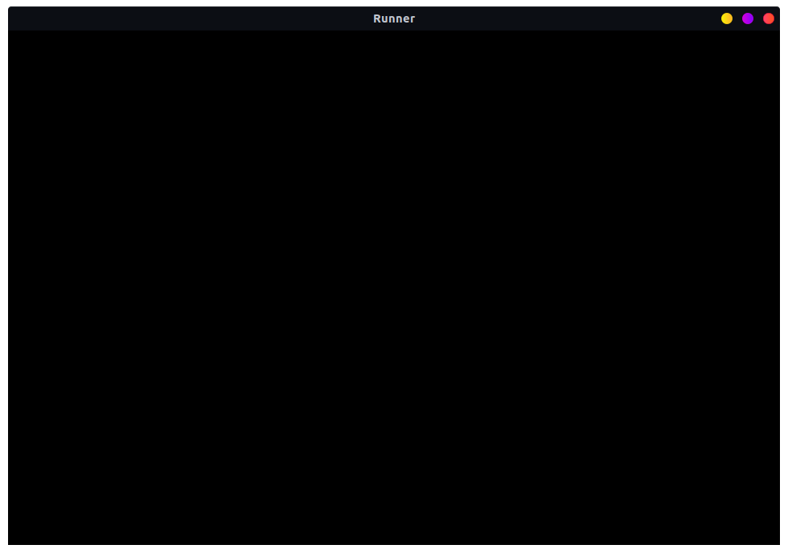

Чёрный экран — зрелище не самое захватывающее, но это уже работающее игровое приложение на Defold, и мы легко превратим его во что-то более интересное.

::: sidenote
Редактор Defold работает с файлами. Дважды щёлкнув по файлу в *Assets pane*, вы открываете его в подходящем редакторе и можете работать с его содержимым.

Когда вы заканчиваете редактирование файла, его нужно сохранить. Выберите <kbd>File ▸ Save</kbd> в главном меню. Редактор подсказывает это, добавляя звёздочку '\*' к имени файла на вкладке, если в файле есть несохранённые изменения.

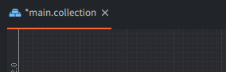
:::

## Настройка проекта

Прежде чем идти дальше, зададим несколько параметров проекта. Откройте ресурс *game.project* из `Assets Pane`, прокрутите до раздела Display и установите `width` и `height` в `1280` и `720`.

Также нужно добавить в проект расширение Spine, чтобы анимировать героя. Добавьте версию Spine extension, совместимую с вашей установленной версией редактора Defold. Доступные версии Spine можно посмотреть здесь:

[https://github.com/defold/extension-spine/releases](https://github.com/defold/extension-spine/releases)

Щёлкните правой кнопкой по ссылке на zip-файл нужного релиза:

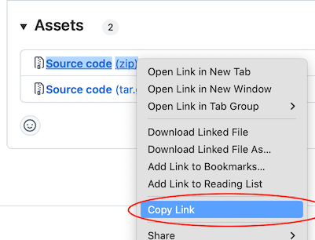

Добавьте ссылку на релиз в список [game.project dependencies](/manuals/libraries/#setting-up-library-dependencies). После добавления Spine extension редактор нужно перезапустить, чтобы активировать включённую в него интеграцию.


## ШАГ 2 — Создание земли

Начнём с самых первых шагов и создадим для персонажа окружение, а точнее — кусок прокручивающейся земли. Сделаем это поэтапно.

1. Импортируйте графику в проект, перетащив изображения "ground01.png" и "ground02.png" (из подпапки "level-images" в наборе ресурсов) в подходящее место проекта, например в папку "images" внутри папки "main".
2. Создайте новый файл *Atlas* для текстур земли (щёлкните правой кнопкой по подходящей папке, например по *main* в *Assets pane*, и выберите <kbd>New ▸ Atlas File</kbd>). Назовите файл *level.atlas*.

  ::: sidenote
  *Atlas* — это файл, который объединяет несколько отдельных изображений в одно большое. Это экономит место и повышает производительность. Подробнее об Atlas и других возможностях 2D-графики читайте в [документации по 2D graphics](/manuals/2dgraphics).
  :::

3. Добавьте изображения земли в новый atlas, щёлкнув правой кнопкой по корню atlas в *Outline* и выбрав <kbd>Add Images</kbd>. Выберите импортированные изображения и нажмите *OK*. Теперь каждое изображение в atlas доступно как одно-кадровая анимация (still image), которую можно использовать в sprites, particle effects и других визуальных элементах. Сохраните файл.

  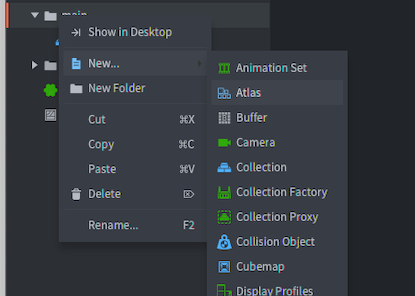

  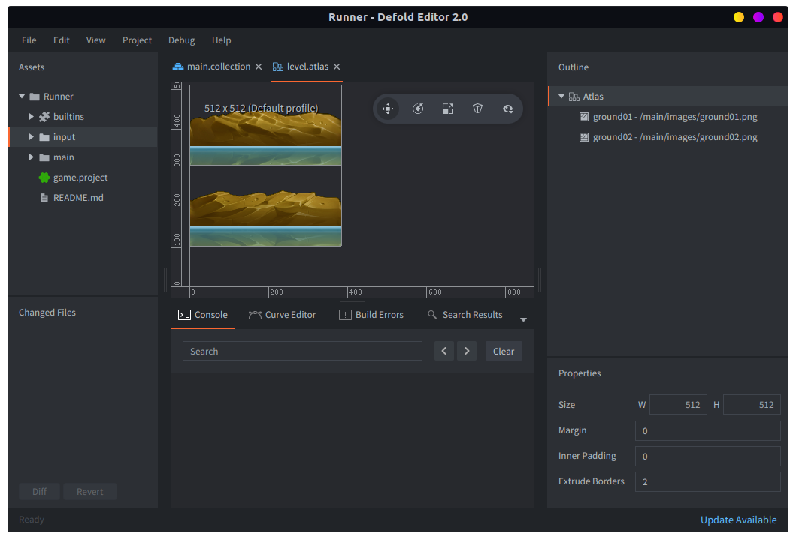

  ::: sidenote
  *Почему ничего не работает!?* Частая проблема у новичков в Defold — забыть сохранить файл. После добавления изображений в atlas нужно сохранить файл, прежде чем это изображение станет доступным для использования.
  :::

4. Создайте файл коллекции *ground.collection* для земли и добавьте в него 7 game object (щёлкните правой кнопкой по корню коллекции в *Outline* и выберите <kbd>Add Game Object</kbd>). Назовите объекты "ground0", "ground1", "ground2" и т. д., изменяя свойство *Id* в *Properties*. Обратите внимание: Defold автоматически назначает новым game object уникальный id.

5. Для каждого объекта добавьте компонент sprite (щёлкните правой кнопкой по game object в *Outline*, выберите <kbd>Add Component</kbd>, затем *Sprite* и *OK*), установите свойство *Image* этого sprite на только что созданный atlas и выберите одной из двух картинок земли в качестве default animation. Задайте X-позицию _компонента sprite_ (а не game object) равной 190 и Y-позицию равной 40. Поскольку ширина изображения — 380 пикселей, а мы смещаем его вбок на половину ширины, pivot game object окажется на левом краю изображения sprite.

  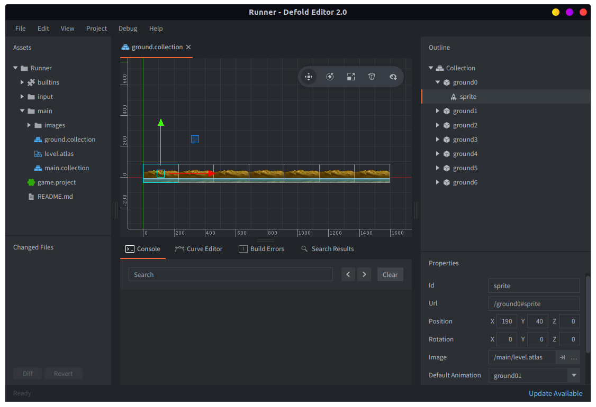

6. Используемая графика немного великовата, поэтому уменьшите каждый game object до 60% (масштаб 0.6 по X и Y, что даст куски земли шириной 228 пикселей).

  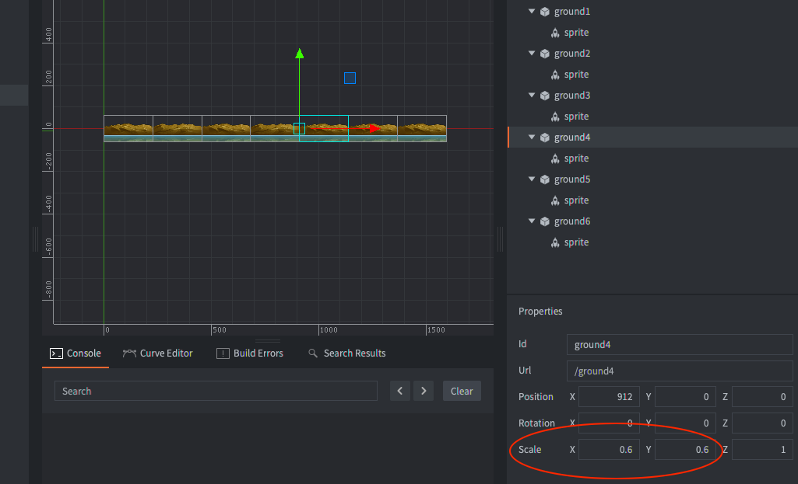

7. Расположите все _game object_ в ряд. Задайте X-позиции _game object_ (не sprite component) равными 0, 228, 456, 684, 912, 1140 и 1368 (кратные ширине 228 пикселей).

  ::: sidenote
  Проще всего, вероятно, собрать один полностью настроенный и масштабированный game object со sprite component, а затем копировать его. Выберите его в *Outline*, затем выполните <kbd>Edit ▸ Copy</kbd>, а потом <kbd>Edit ▸ Paste</kbd>.

  Обратите внимание: если вы захотите использовать более крупные или более мелкие тайлы, достаточно изменить масштаб. Но тогда также придётся изменить X-позиции всех ground game object, чтобы они соответствовали новой ширине.
  :::

8. Сохраните файл, затем добавьте *ground.collection* в *main.collection*: сначала откройте *main.collection*, затем щёлкните правой кнопкой по корневому объекту в *Outline* и выберите <kbd>Add Collection From File</kbd>. В диалоге выберите *ground.collection* и нажмите *OK*. Убедитесь, что размещаете *ground.collection* в позиции 0, 0, 0, иначе она будет визуально смещена. Сохраните.

9. Запустите игру (<kbd>Project ▸ Build</kbd>), чтобы убедиться, что всё на месте.

  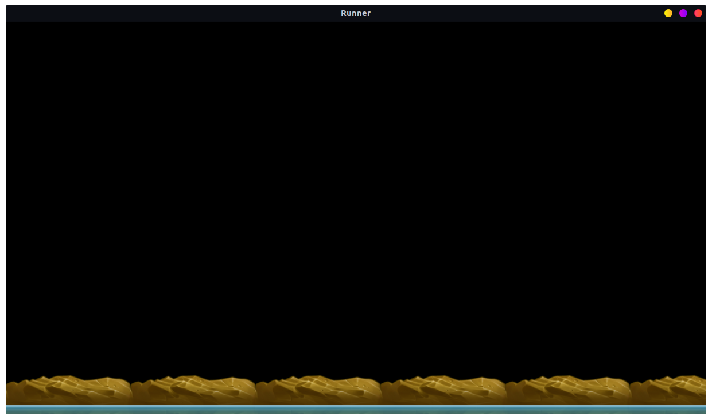

На этом этапе вы, возможно, уже задаётесь вопросом, что вообще представляют собой все эти вещи, которые мы создаём, поэтому давайте на минуту посмотрим на самые базовые строительные блоки любого проекта Defold:

Game objects
: Это сущности, которые существуют в работающей игре. У каждого game object есть положение в 3D-пространстве, поворот и масштаб. Он вовсе не обязан быть видимым. Game object может содержать любое количество _components_, которые добавляют ему возможности: графику (sprites, tilemaps, models, spine models и particle effects), звуки, физику, factories (для спауна) и многое другое. Можно также добавлять Lua _script components_, чтобы задавать поведение. Каждый game object в игре имеет свой *id*, который нужен для взаимодействия с ним через message passing.

Collections
: Collections сами по себе не существуют в работающей игре, но позволяют использовать статические имена game object и при этом поддерживать несколько экземпляров одного и того же объекта. На практике collections служат контейнерами для game object и других collections. Их можно использовать как своего рода прототипы (или "prefabs"/"blueprints" в других движках) сложных иерархий game object и collections. При запуске движок загружает главную коллекцию и оживляет всё, что вы в неё поместили. По умолчанию это файл *main.collection* в папке *main*, но это можно изменить в настройках проекта.

Пока этого описания, вероятно, достаточно. Однако гораздо более глубокий разбор есть в [руководстве Building blocks](/manuals/building-blocks). Позже к нему полезно вернуться, чтобы лучше понять, как работает Defold.

## ШАГ 3 — Заставляем землю двигаться

Теперь, когда все куски земли на месте, заставить их двигаться довольно просто. Идея такая: сдвигаем куски справа налево, а когда какой-то из них оказывается за левой границей экрана, переносим его в крайнее правое положение. Чтобы перемещать все эти game object, нужен Lua-скрипт, так что создадим его:

1. Щёлкните правой кнопкой по папке *main* в *Assets pane* и выберите <kbd>New ▸ Script File</kbd>. Назовите файл *ground.script*.
2. Дважды щёлкните по новому файлу, чтобы открыть редактор Lua-скриптов.
3. Удалите стандартное содержимое файла, вставьте следующий Lua-код и сохраните файл.

```lua
-- ground.script
local pieces = { "ground0", "ground1", "ground2", "ground3",
                    "ground4", "ground5", "ground6" } -- <1>

function init(self) -- <2>
    self.speed = 360  -- Speed in pixels/s
end

function update(self, dt) -- <3>
    for i, p in ipairs(pieces) do -- <4>
        local pos = go.get_position(p)
        if pos.x <= -228 then -- <5>
            pos.x = 1368 + (pos.x + 228)
        end
        pos.x = pos.x - self.speed * dt -- <6>
        go.set_position(pos, p) -- <7>
    end
end
```
1. Сохраняем id ground game object в Lua-таблице, чтобы по ним можно было итерироваться.
2. Функция `init()` вызывается, когда game object начинает существовать в игре. В ней мы инициализируем локальную переменную объекта, которая хранит скорость движения земли.
3. `update()` вызывается каждый кадр, обычно 60 раз в секунду. `dt` содержит количество секунд с момента предыдущего вызова.
4. Проходим по всем ground game object.
5. Сохраняем текущую позицию в локальной переменной и, если объект находится у левого края, переносим его к правому краю.
6. Уменьшаем текущую X-позицию на заданную скорость. Умножение на `dt` даёт независимую от частоты кадров скорость в пикселях в секунду.
7. Обновляем позицию объекта.

::: sidenote
Defold — это быстрый core-движок, который управляет вашими данными и game object. Любая логика и поведение, необходимые игре, пишутся на Lua. Lua — это быстрый и лёгкий язык, отлично подходящий для игровой логики. Есть много хороших ресурсов по изучению языка, например книга [Programming in Lua](http://www.lua.org/pil/) и официальный [Lua reference manual](http://www.lua.org/manual/5.3/).

Defold добавляет поверх Lua набор API, а также систему _message passing_, которая позволяет программировать взаимодействие между game object. Подробнее читайте в [руководстве Message passing](/manuals/message-passing).
:::

::: sidenote
Панели Assets Pane, Console и Outline в редакторе можно скрывать и показывать клавишами <kbd>F6</kbd>, <kbd>F7</kbd> и <kbd>F8</kbd> соответственно.
:::

Теперь, когда файл скрипта готов, нужно добавить ссылку на него как на компонент в game object. Тогда скрипт будет выполняться в рамках жизненного цикла объекта. Мы сделаем это, создав новый game object в *ground.collection* и добавив к нему *Script* component, который ссылается на только что созданный Lua-файл:

1. Щёлкните правой кнопкой по корню коллекции и выберите <kbd>Add Game Object</kbd>. Установите *id* объекта в "controller".
2. Щёлкните правой кнопкой по объекту "controller" и выберите <kbd>Add Component from file</kbd>, затем укажите файл *ground.script*.

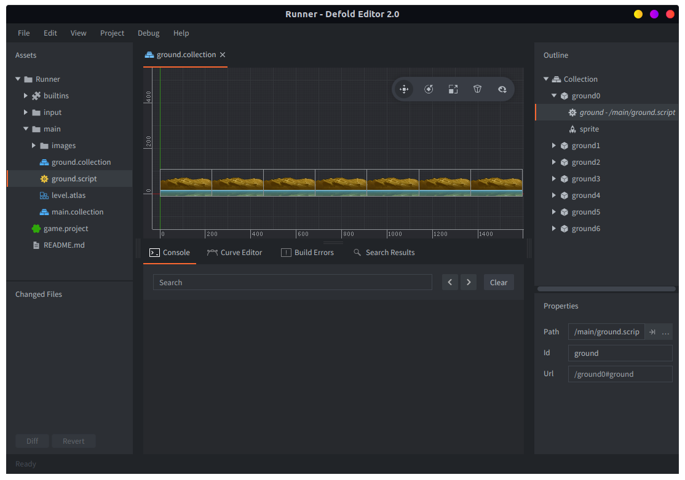

Теперь при запуске игры game object "controller" будет выполнять скрипт из своего *Script* component, и земля будет плавно прокручиваться по экрану.

## ШАГ 4 — Создание героя

Герой будет game object, состоящим из следующих компонентов:

A *Spine Model*
: Он даст нам маленького "бумажного" героя, части тела которого можно плавно (и дёшево) анимировать.

A *Collision Object*
: Он будет обнаруживать столкновения героя с объектами уровня: поверхностями, по которым можно бежать, опасными объектами и предметами, которые можно подобрать.

A *Script*
: Он будет получать пользовательский ввод, реагировать на него, заставлять героя прыгать, анимироваться и обрабатывать столкновения.

Начните с импорта изображений частей тела, затем добавьте их в новый atlas с именем *hero.atlas*:

1. Создайте новую папку, щёлкнув правой кнопкой в *Assets pane* и выбрав <kbd>New ▸ Folder</kbd>. Убедитесь, что перед этим не выбрана другая папка, иначе новая будет создана внутри неё. Назовите папку "hero".
2. Создайте новый atlas-файл: щёлкните правой кнопкой по папке *hero* и выберите <kbd>New ▸ Atlas File</kbd>. Назовите файл *hero.atlas*.
3. Создайте подпапку *images* в папке *hero*. Щёлкните правой кнопкой по *hero* и выберите <kbd>New ▸ Folder</kbd>.
4. Перетащите изображения частей тела из папки *hero-images* в наборе ресурсов в созданную папку *images* в *Assets pane*.
5. Откройте *hero.atlas*, щёлкните правой кнопкой по корневому узлу в *Outline* и выберите <kbd>Add Images</kbd>. Выберите все изображения частей тела и нажмите *OK*.
6. Сохраните atlas-файл.

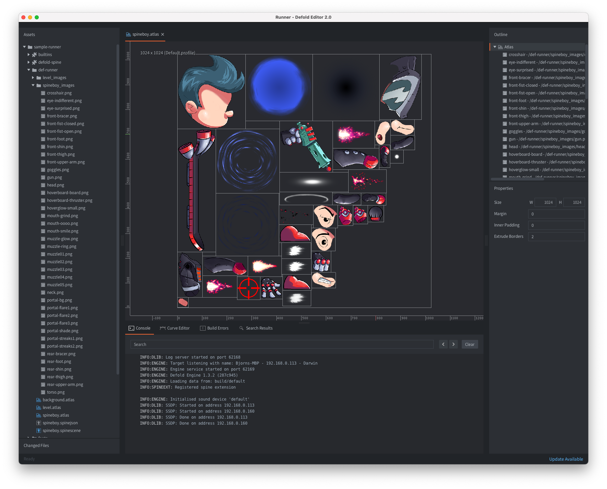

Также нужно импортировать анимационные данные Spine и создать для них *Spine Scene*:

1. Перетащите файл *hero.spinejson* (он входит в набор ресурсов) в папку *hero* в *Assets pane*.
2. Создайте файл *Spine Scene*. Щёлкните правой кнопкой по папке *hero* и выберите <kbd>New ▸ Spine Scene File</kbd>. Назовите файл *hero.spinescene*.
3. Дважды щёлкните по новому файлу, чтобы открыть и отредактировать *Spine Scene*.
4. Установите свойство *spine_json* на импортированный JSON-файл *hero.spinejson*. Щёлкните по свойству, затем по кнопке выбора ресурса *...*, чтобы открыть браузер ресурсов.
5. Установите свойство *atlas* так, чтобы оно ссылалось на файл *hero.atlas*.
6. Сохраните файл.

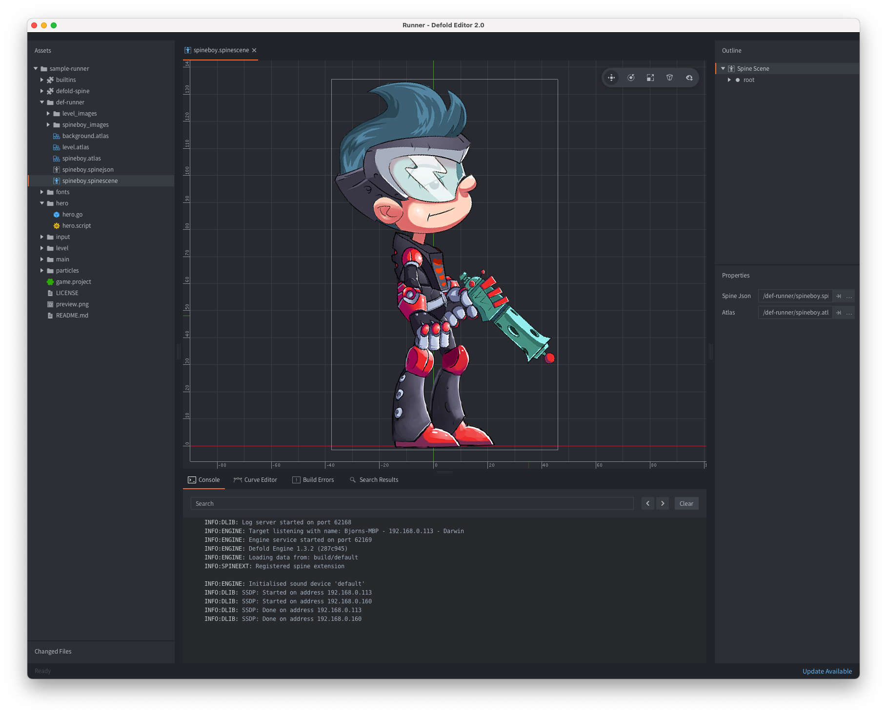

::: sidenote
Файл *hero.spinejson* экспортирован в формате Spine JSON. Чтобы создавать такие файлы, вам понадобится программа Spine. Если вы хотите использовать другое ПО для анимации, можно экспортировать анимации в виде sprite sheet и использовать их как flip-book анимации из ресурсов *Tile Source* или *Atlas*. Подробнее — в руководстве [Animation](/manuals/animation).
:::

### Сборка game object

Теперь можно приступать к сборке game object героя:

1. Создайте новый файл *hero.go* (щёлкните правой кнопкой по папке *hero* и выберите <kbd>New ▸ Game Object File</kbd>).
2. Откройте файл game object.
3. Добавьте в него компонент *Spine Model*. (Щёлкните правой кнопкой по корню в *Outline*, выберите <kbd>Add Component</kbd>, затем "Spine Model".)
4. Установите свойство *Spine Scene* этого компонента на файл *hero.spinescene*, который вы только что создали, и выберите "run_right" как default animation (позже мы настроим анимацию правильно).
5. Сохраните файл.

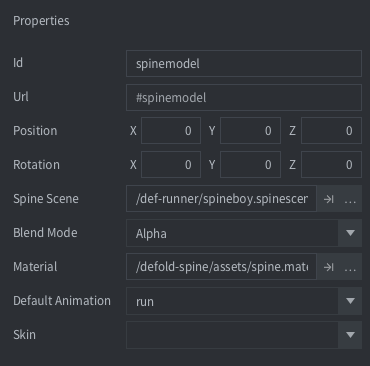

Теперь пора добавить физику, чтобы работали столкновения:

1. Добавьте к game object героя компонент *Collision Object*. (Щёлкните правой кнопкой по корню в *Outline* и выберите <kbd>Add Component</kbd>, затем "Collision Object".)
2. Щёлкните правой кнопкой по новому компоненту и выберите <kbd>Add Shape</kbd>. Добавьте две формы, чтобы покрыть тело персонажа. Подойдут sphere и box.
3. Выберите формы и с помощью *Move Tool* (<kbd>Scene ▸ Move Tool</kbd>) переместите их в подходящие позиции.
4. Выделите компонент *Collision Object* и установите свойство *Type* в "Kinematic".

::: sidenote
Коллизия "Kinematic" означает, что столкновения должны регистрироваться, но physics engine не будет автоматически разрешать их и симулировать объекты. Physics engine поддерживает несколько разных типов collision object. Подробнее о них читайте в [документации по Physics](/manuals/physics).
:::

Важно указать, с чем именно должен взаимодействовать collision object:

1. Установите свойство *Group* на новую collision group с именем "hero".
2. Установите свойство *Mask* на другую группу — "geometry", с которой этот collision object должен регистрировать столкновения. Обратите внимание: группа "geometry" пока ещё не существует, но скоро мы добавим collision object, принадлежащие ей.

В завершение создайте новый файл *hero.script* и добавьте его в game object.

1. Щёлкните правой кнопкой по папке *hero* в *Assets pane* и выберите <kbd>New ▸ Script File</kbd>. Назовите файл *hero.script*.
2. Откройте новый файл, скопируйте в него следующий код и сохраните. (Код довольно прямолинеен, за исключением solver, который отделяет collision shape героя от того, с чем он сталкивается. Этим занимается функция `handle_geometry_contact()`.)

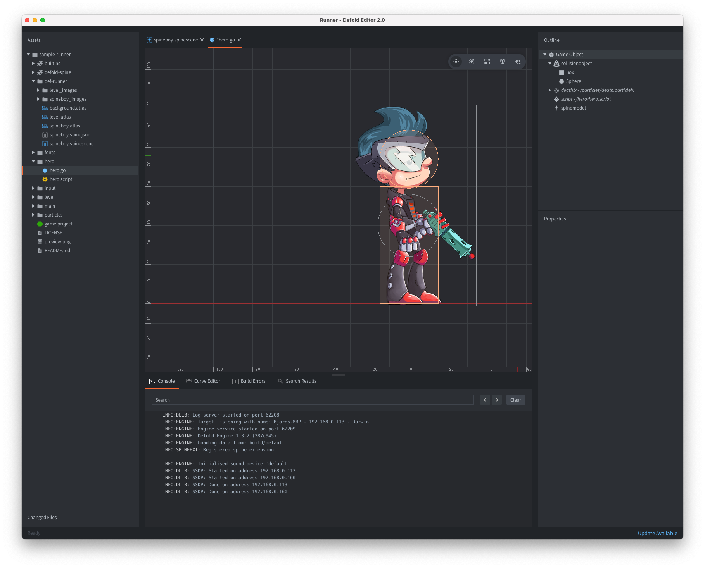

::: sidenote
Причина, по которой мы обрабатываем столкновения вручную, в том, что если вместо этого задать тип collision object персонажа как dynamic, движок будет выполнять ньютоновскую симуляцию задействованных тел. Для игры вроде этой такая симуляция далека от оптимума, поэтому вместо борьбы с physics engine через разные силы мы берём полный контроль на себя.

Чтобы сделать это и корректно обрабатывать столкновения, потребуется немного векторной математики. Подробное объяснение того, как решать kinematic collisions, есть в [документации Physics](/manuals/physics#resolving-kinematic-collisions).
:::

```lua
-- gravity pulling the player down in pixel units/sˆ2
local gravity = -20

-- take-off speed when jumping in pixel units/s
local jump_takeoff_speed = 900

function init(self)
    -- this tells the engine to send input to on_input() in this script
    msg.post(".", "acquire_input_focus")

    -- save the starting position
    self.position = go.get_position()

    -- keep track of movement vector and if there is ground contact
    self.velocity = vmath.vector3(0, 0, 0)
    self.ground_contact = false
end

function final(self)
    -- Return input focus when the object is deleted
    msg.post(".", "release_input_focus")
end

function update(self, dt)
    local gravity = vmath.vector3(0, gravity, 0)

    if not self.ground_contact then
        -- Apply gravity if there's no ground contact
        self.velocity = self.velocity + gravity
    end

    -- apply velocity to the player character
    go.set_position(go.get_position() + self.velocity * dt)

    -- reset volatile state
    self.correction = vmath.vector3()
    self.ground_contact = false
end

local function handle_geometry_contact(self, normal, distance)
    -- project the correction vector onto the contact normal
    -- (the correction vector is the 0-vector for the first contact point)
    local proj = vmath.dot(self.correction, normal)
    -- calculate the compensation we need to make for this contact point
    local comp = (distance - proj) * normal
    -- add it to the correction vector
    self.correction = self.correction + comp
    -- apply the compensation to the player character
    go.set_position(go.get_position() + comp)
    -- check if the normal points enough up to consider the player standing on the ground
    -- (0.7 is roughly equal to 45 degrees deviation from pure vertical direction)
    if normal.y > 0.7 then
        self.ground_contact = true
    end
    -- project the velocity onto the normal
    proj = vmath.dot(self.velocity, normal)
    -- if the projection is negative, it means that some of the velocity points towards the contact point
    if proj < 0 then
        -- remove that component in that case
        self.velocity = self.velocity - proj * normal
    end
end

function on_message(self, message_id, message, sender)
    if message_id == hash("contact_point_response") then
        -- check if we received a contact point message. One message for each contact point
        if message.group == hash("geometry") then
            handle_geometry_contact(self, message.normal, message.distance)
        end
    end
end

local function jump(self)
    -- only allow jump from ground
    if self.ground_contact then
        -- set take-off speed
        self.velocity.y = jump_takeoff_speed
    end
end

local function abort_jump(self)
    -- cut the jump short if we are still going up
    if self.velocity.y > 0 then
        -- scale down the upwards speed
        self.velocity.y = self.velocity.y * 0.5
    end
end

function on_input(self, action_id, action)
    if action_id == hash("jump") or action_id == hash("touch") then
        if action.pressed then
            jump(self)
        elseif action.released then
            abort_jump(self)
        end
    end
end
```

1. Добавьте скрипт как компонент *Script* в объект героя (щёлкните правой кнопкой по корню *hero.go* в *Outline*, выберите <kbd>Add Component from File</kbd>, затем укажите *hero.script*).

Если хотите, можно временно добавить героя в основную коллекцию и запустить игру, чтобы увидеть, как он падает сквозь мир.

Последнее, что нужно герою для работоспособности, — это ввод. Скрипт выше уже содержит функцию `on_input()`, которая реагирует на действия "jump" и "touch" (для сенсорных экранов). Добавим input bindings для этих действий.

1. Откройте "input/game.input_bindings".
2. Добавьте key trigger для "KEY_SPACE" и назовите действие "jump".
3. Добавьте touch trigger для "TOUCH_MULTI" и назовите действие "touch". (Названия действий произвольные, но должны совпадать с теми, что используются в скрипте. Обратите внимание: одно и то же имя действия нельзя использовать на нескольких triggers.)
4. Сохраните файл.

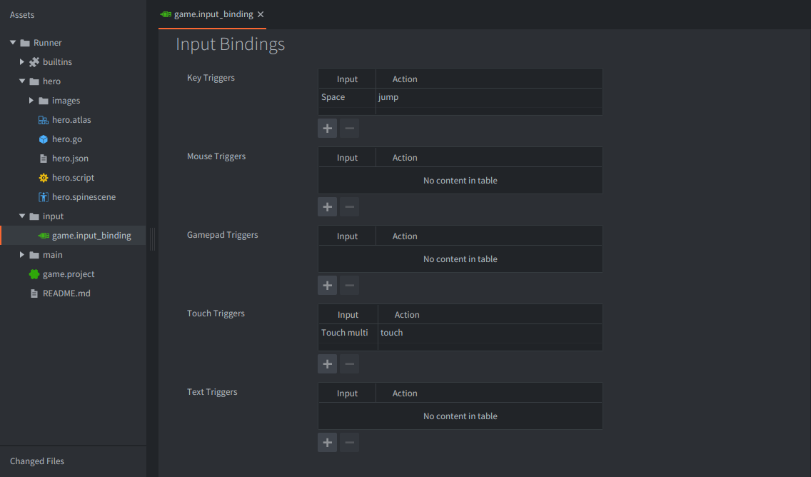

## ШАГ 5 — Рефакторинг уровня

Теперь, когда герой настроен и столкновения работают, нужно добавить столкновения и к земле, чтобы герою было с чем взаимодействовать (или по чему бежать). Мы займёмся этим через секунду, но сначала немного порефакторим структуру и вынесем всё, относящееся к уровню, в отдельную collection:

1. Создайте новый файл *level.collection* (щёлкните правой кнопкой по *main* в *Assets pane* и выберите <kbd>New ▸ Collection File</kbd>).
2. Откройте новый файл, щёлкните правой кнопкой по корню в *Outline*, выберите <kbd>Add Collection from File</kbd> и укажите *ground.collection*.
3. В *level.collection* щёлкните правой кнопкой по корню в *Outline* и выберите <kbd>Add Game Object File</kbd>, затем укажите *hero.go*.
4. Теперь создайте новую папку *level* в корне проекта (щёлкните правой кнопкой по пустому месту под *game.project* и выберите <kbd>New ▸ Folder</kbd>), затем переместите туда все созданные к этому моменту ресурсы уровня: файлы *level.collection*, *level.atlas*, папку "images" с изображениями atlas уровня, а также *ground.collection* и *ground.script*.
5. Откройте *main.collection*, удалите *ground.collection* и вместо неё добавьте *level.collection* (щёлкните правой кнопкой и выберите <kbd>Add Collection from File</kbd>), которая теперь уже содержит *ground.collection*. Убедитесь, что размещаете collection в позиции 0, 0, 0.

::: sidenote
Как вы, возможно, уже заметили, иерархия файлов в *Assets pane* не зависит напрямую от структуры содержимого, которое вы строите в collections. Отдельные файлы используются по ссылкам из collection- и game object-файлов, но их физическое расположение на диске может быть любым.

Если нужно переместить файл в новое место, Defold помогает автоматически обновлять ссылки на него (refactoring). При разработке сложного проекта, вроде игры, очень полезно иметь возможность менять структуру по мере роста проекта. Defold это поощряет и делает процесс плавным, так что не бойтесь перемещать файлы.
:::

Также стоит добавить game object-контроллер со script component в level collection:

1. Создайте новый script file. Щёлкните правой кнопкой по папке *level* в *Assets pane* и выберите <kbd>New ▸ Script File</kbd>. Назовите файл *controller.script*.
2. Откройте script file, вставьте следующий код и сохраните его:

    ```lua
    -- controller.script
    go.property("speed", 360) -- <1>

    function init(self)
        msg.post("ground/controller#ground", "set_speed", { speed = self.speed })
    end
    ```
    1. Это script property. Мы задаём ему значение по умолчанию, но любой экземпляр скрипта, размещённый в editor, может переопределить это значение прямо через properties view.

3. Откройте файл *level.collection*.
4. Щёлкните правой кнопкой по корню в *Outline* и выберите <kbd>Add Game Object</kbd>.
5. Установите *Id* = "controller".
6. Щёлкните правой кнопкой по game object "controller" в *Outline*, выберите <kbd>Add Component from File</kbd> и укажите файл *controller.script* из папки *level*.
7. Сохраните файл.

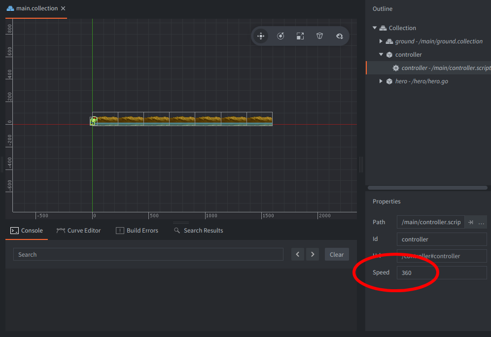

::: sidenote
Game object "controller" не существует в отдельном файле, а создаётся прямо внутри level collection. Это значит, что экземпляр объекта создаётся из in-place данных. Для одноцелевых объектов вроде этого это вполне нормально. Если же вам нужны несколько экземпляров какого-то объекта и вы хотите иметь возможность менять общий prototype/template, просто создайте game object file и добавляйте объект в collection из файла. Тогда game object будет ссылаться на файл как на prototype/template.

Назначение game object "controller" — управлять всем, что относится к запущенному уровню. Скоро этот скрипт будет отвечать за спаун платформ и монет, но пока он будет только задавать скорость уровня.
:::

В функции `init()` level controller script отправляет сообщение script component объекта ground controller, адресуя его по id:

```lua
msg.post("ground/controller#controller", "set_speed", { speed = self.speed })
```

Идентификатор game object controller равен `"ground/controller"`, поскольку он живёт внутри коллекции "ground". После символа `"#"` мы добавляем id компонента — `"controller"`, чтобы отделить object id от component id. Обратите внимание: ground script пока не умеет реагировать на сообщение `set_speed`, поэтому нужно добавить в *ground.script* функцию `on_message()` и соответствующую логику.

1. Откройте *ground.script*.
2. Добавьте следующий код и сохраните файл:

```lua
-- ground.script
function on_message(self, message_id, message, sender)
    if message_id == hash("set_speed") then -- <1>
        self.speed = message.speed -- <2>
    end
end
```
1. Все сообщения при отправке хешируются внутренне, поэтому сравнивать их нужно с хешированным значением.
2. Данные сообщения — это Lua-таблица с теми данными, которые были отправлены.

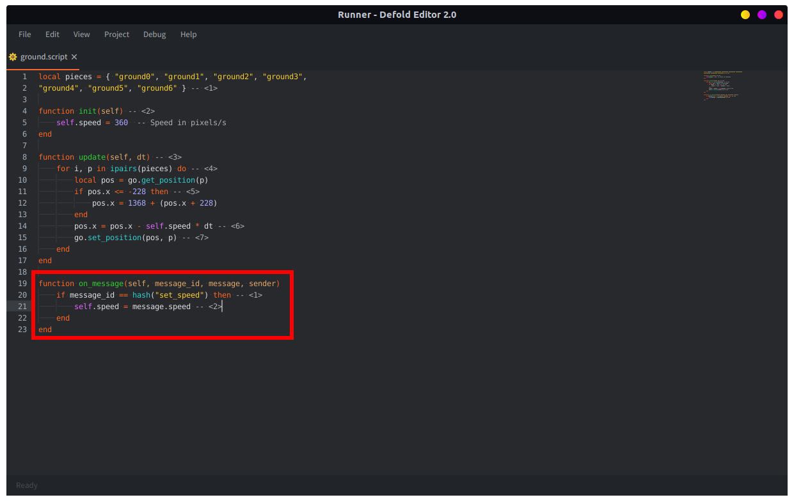

## ШАГ 6 — Физика земли и платформы

На этом этапе нужно добавить физические столкновения для земли:

1. Откройте файл *ground.collection*.
2. Добавьте новый компонент *Collision Object* к подходящему game object. Поскольку ground script не обрабатывает столкновения (вся логика для этого находится в hero script), компонент можно положить в любой _неподвижный_ game object (tile-объекты земли не неподвижны, поэтому их лучше не использовать). Хороший кандидат — объект "controller", но можно создать отдельный объект специально для этого. Щёлкните по game object правой кнопкой, выберите <kbd>Add Component</kbd> и затем *Collision Object*.
3. Добавьте форму box: щёлкните правой кнопкой по *Collision Object* и выберите <kbd>Add Shape</kbd>, затем *Box*.
4. С помощью *Move Tool* и *Scale Tool* (<kbd>Scene ▸ Move Tool</kbd> и <kbd>Scene ▸ Scale Tool</kbd>) сделайте так, чтобы box покрывал все тайлы земли.
5. Установите свойство *Type* collision object в "Static", поскольку физика земли двигаться не будет.
6. Установите *Group* collision object в "geometry", а *Mask* — в "hero". Теперь collision object героя и земли будут регистрировать столкновения между собой.
7. Сохраните файл.

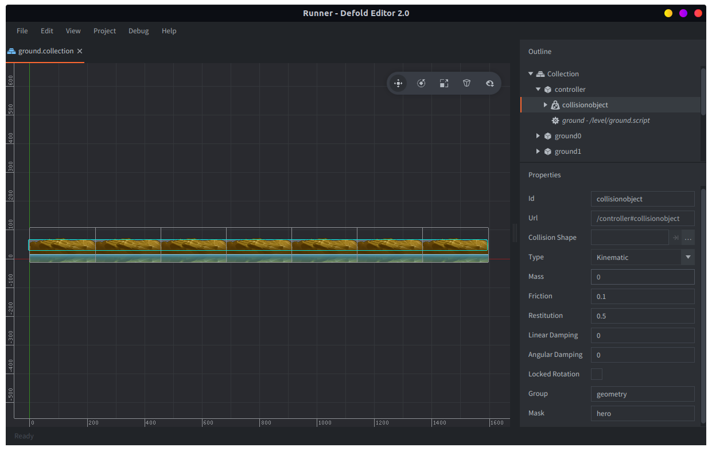

Теперь можно попробовать запустить игру (<kbd>Project ▸ Build</kbd>). Герой должен бежать по земле, и должна появиться возможность прыгать клавишей <kbd>Space</kbd>. Если запускать игру на мобильном устройстве, прыгать можно касанием экрана.

Чтобы мир не был таким скучным, добавим платформы, на которые можно прыгать.

1. Перетащите файл изображения *rock_planks.png* из набора ресурсов в подпапку *level/images*.
2. Откройте *level.atlas* и добавьте в него новое изображение (щёлкните правой кнопкой по корню в *Outline* и выберите <kbd>Add Images</kbd>).
3. Сохраните файл.
4. Создайте новый *Game Object* file с именем *platform.go* в папке *level*. (Щёлкните правой кнопкой по *level*
 в *Assets pane*, затем выберите <kbd>New ▸ Game Object File</kbd>.)
5. Добавьте к game object компонент *Sprite* (щёлкните правой кнопкой по корню в *Outline* и выберите <kbd>Add Component</kbd>, затем *Sprite*).
6. Установите свойство *Image* на файл *level.atlas*, а *Default Animation* на "rock_planks". Для удобства можно хранить объекты уровня в подпапке "level/objects".
7. Добавьте к game object компонент *Collision Object* (щёлкните правой кнопкой по корню в *Outline* и выберите <kbd>Add Component</kbd>).
8. Установите *Type* = "Kinematic", а *Group* и *Mask* = "geometry" и "hero" соответственно.
9. Добавьте *Box Shape* к компоненту *Collision Object*. (Щёлкните правой кнопкой по компоненту в *Outline*, выберите <kbd>Add Shape</kbd>, затем *Box*.)
10. Используйте *Move Tool* и *Scale Tool* (<kbd>Scene ▸ Move Tool</kbd> и <kbd>Scene ▸ Scale Tool</kbd>), чтобы форма collision object покрывала платформу.
11. Создайте файл *Script* под названием *platform.script* (щёлкните правой кнопкой в *Assets pane*, затем <kbd>New ▸ Script File</kbd>) и вставьте в него следующий код, после чего сохраните:

    ```lua
    -- platform.script
    function init(self)
        self.speed = 540      -- Default speed in pixels/s
    end

    function update(self, dt)
        local pos = go.get_position()
        if pos.x < -500 then
            go.delete() -- <1>
        end
        pos.x = pos.x - self.speed * dt
        go.set_position(pos)
    end

    function on_message(self, message_id, message, sender)
        if message_id == hash("set_speed") then
            self.speed = message.speed
        end
    end
    ```
    1. Просто удаляем платформу, когда она уходит за левый край экрана.

12. Откройте *platform.go* и добавьте новый скрипт как component (щёлкните правой кнопкой по корню в *Outline* и выберите <kbd>Add Component From File</kbd>, затем укажите *platform.script*).
13. Скопируйте *platform.go* в новый файл (щёлкните правой кнопкой по файлу в *Assets pane* и выберите <kbd>Copy</kbd>, затем снова щёлкните правой кнопкой и выберите <kbd>Paste</kbd>) и назовите новый файл *platform_long.go*.
14. Откройте *platform_long.go* и добавьте второй компонент *Sprite* (щёлкните правой кнопкой по корню в *Outline* и выберите <kbd>Add Component</kbd>). Либо можно просто скопировать существующий *Sprite*.
15. С помощью *Move Tool* (<kbd>Scene ▸ Move Tool</kbd>) разместите *Sprite* component рядом друг с другом.
16. С помощью *Move Tool* и *Scale Tool* растяните форму в *Collision Object*, чтобы она покрывала обе платформы.

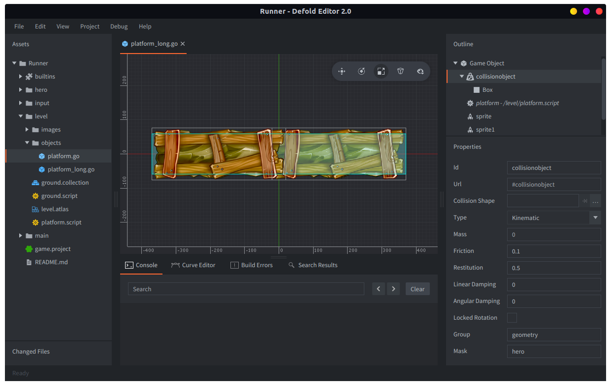

::: sidenote
Обратите внимание: и *platform.go*, и *platform_long.go* содержат *Script* component, которые ссылаются на один и тот же script file. Это хорошо, потому что любые изменения script file повлияют на поведение и обычных, и длинных платформ.
:::

## Спавн платформ

По задумке игра должна быть простым бесконечным раннером. Это означает, что platform game object нельзя просто разместить в collection через editor. Вместо этого их нужно спаунить динамически:

1. Откройте *level.collection*.
2. Добавьте два компонента *Factory* к game object "controller" (щёлкните по нему правой кнопкой, выберите <kbd>Add Component</kbd>, затем *Factory*).
3. Установите *Id* компонентов в "platform_factory" и "platform_long_factory".
4. Установите *Prototype* компонента "platform_factory" на файл */level/objects/platform.go*.
5. Установите *Prototype* компонента "platform_long_factory" на файл */level/objects/platform_long.go*.
6. Сохраните файл.
7. Откройте *controller.script*, который управляет уровнем.
8. Измените скрипт так, чтобы он содержал следующее, затем сохраните:

```lua
-- controller.script
go.property("speed", 360)

local grid = 460
local platform_heights = { 100, 200, 350 } -- <1>

function init(self)
    msg.post("ground/controller#controller", "set_speed", { speed = self.speed })
    self.gridw = 0
end

function update(self, dt) -- <2>
    self.gridw = self.gridw + self.speed * dt

    if self.gridw >= grid then
        self.gridw = 0

        -- Maybe spawn a platform at random height
        if math.random() > 0.2 then
            local h = platform_heights[math.random(#platform_heights)]
            local f = "#platform_factory"
            if math.random() > 0.5 then
                f = "#platform_long_factory"
            end

            local p = factory.create(f, vmath.vector3(1600, h, 0), nil, {}, 0.6)
            msg.post(p, "set_speed", { speed = self.speed })
        end
    end
end
```
1- Предопределённые значения Y-позиции, на которых можно спаунить платформы.
2- Функция `update()` вызывается каждый кадр, и мы используем её, чтобы через определённые интервалы (во избежание перекрытий) и на определённых высотах решать, спаунить обычную или длинную платформу. Легко поэкспериментировать с другими алгоритмами спауна и получить разный геймплей.

Теперь запустите игру (<kbd>Project ▸ Build</kbd>).

Неплохо, уже почти похоже на что-то играбельное…

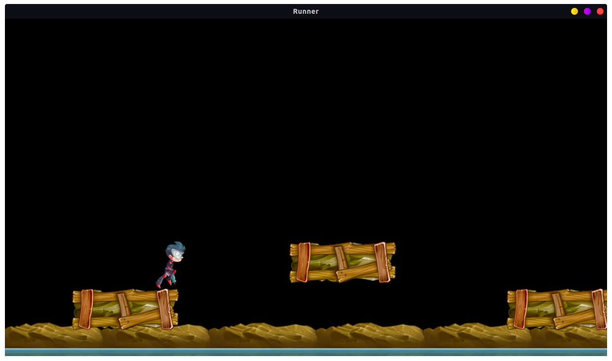

## ШАГ 7 — Анимация и смерть

Первое, что мы сейчас сделаем, — оживим героя. Пока бедняга застрял в бесконечном цикле бега и никак не реагирует на прыжки и вообще на происходящее. Spine-файл, который мы добавили из набора ресурсов, на самом деле уже содержит набор нужных анимаций.

1. Откройте файл *hero.script* и добавьте следующие функции _перед_ существующей функцией `update()`:

```lua
    -- hero.script
    local function play_animation(self, anim)
        -- only play animations which are not already playing
        if self.anim ~= anim then
            -- tell the spine model to play the animation
            local anim_props = { blend_duration = 0.15 }
            spine.play_anim("#spinemodel", anim, go.PLAYBACK_LOOP_FORWARD, anim_props)
            -- remember which animation is playing
            self.anim = anim
        end
    end

    local function update_animation(self)
        -- make sure the right animation is playing
        if self.ground_contact then
            play_animation(self, hash("run"))
        else
            play_animation(self, hash("jump"))

        end
    end
```

2. Найдите функцию `update()` и добавьте вызов `update_animation`:

```lua
    ...
    -- apply it to the player character
    go.set_position(go.get_position() + self.velocity * dt)

    update_animation(self)
    ...
  ```

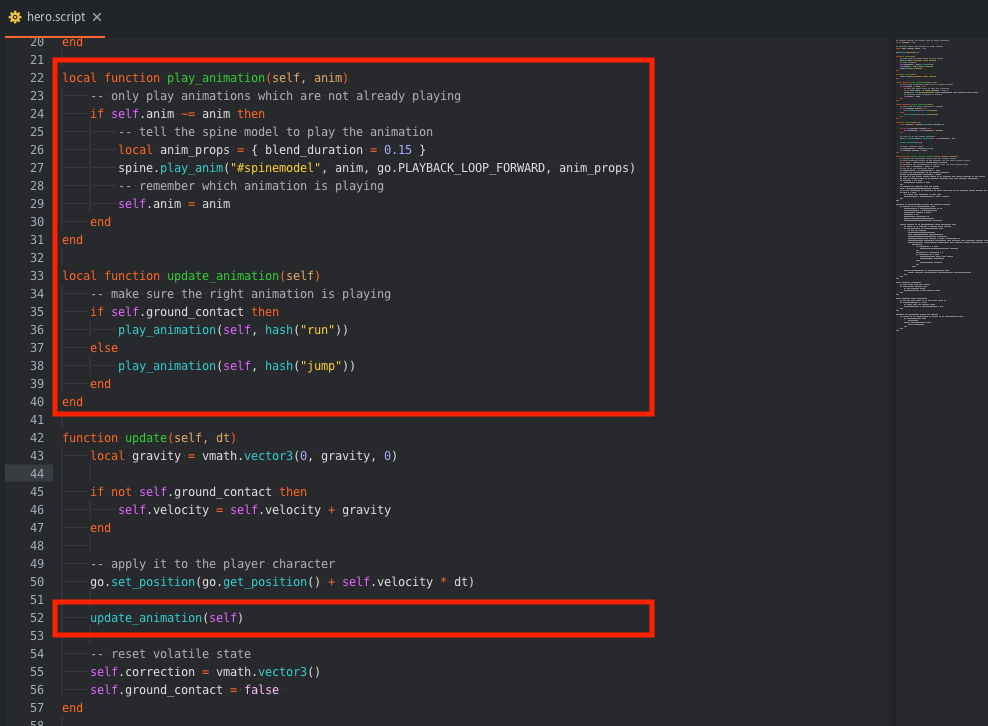

::: sidenote
Lua использует "lexical scope" для локальных переменных и чувствителен к порядку, в котором объявлены `local` functions. Функция `update()` вызывает локальные функции `update_animation()` и `play_animation()`, а значит runtime должен уже знать о них, чтобы можно было их вызвать. Поэтому эти функции нужно разместить до `update()`. Если поменять порядок, вы получите ошибку. Заметьте, это касается только `local` variables. Подробнее о правилах области видимости Lua и локальных функциях можно прочитать на http://www.lua.org/pil/6.2.html
:::

Этого достаточно, чтобы добавить герою анимации прыжка и падения. Если запустить игру, вы заметите, что играть уже гораздо приятнее. Возможно, вы также увидите, что платформы могут столкнуть героя за пределы экрана. Это побочный эффект обработки столкновений, но решение простое — добавим немного насилия и сделаем края платформ опасными.

1. Перетащите *spikes.png* из набора ресурсов в папку "level/images" в *Assets pane*.
2. Откройте *level.atlas* и добавьте изображение (щёлкните правой кнопкой и выберите <kbd>Add Images</kbd>).
3. Откройте *platform.go* и добавьте несколько компонентов *Sprite*. Установите *Image* = *level.atlas*, а *Default Animation* = "spikes".
4. Используйте *Move Tool* и *Rotate Tool*, чтобы разместить шипы по краям платформы.
5. Чтобы шипы рисовались за платформой, установите *Z*-позицию их sprite в -0.1.
6. Добавьте к платформам новый компонент *Collision Object* (щёлкните правой кнопкой по корню в *Outline* и выберите <kbd>Add Component</kbd>). Установите *Group* = "danger". Также задайте *Mask* = "hero".
7. Добавьте box shape к *Collision Object* (щёлкните правой кнопкой и выберите <kbd>Add Shape</kbd>) и с помощью *Move Tool* (<kbd>Scene ▸ Move Tool</kbd>) и *Scale Tool* расположите форму так, чтобы герой сталкивался с объектом "danger", когда ударяется о платформу сбоку или снизу.
8. Сохраните файл.

    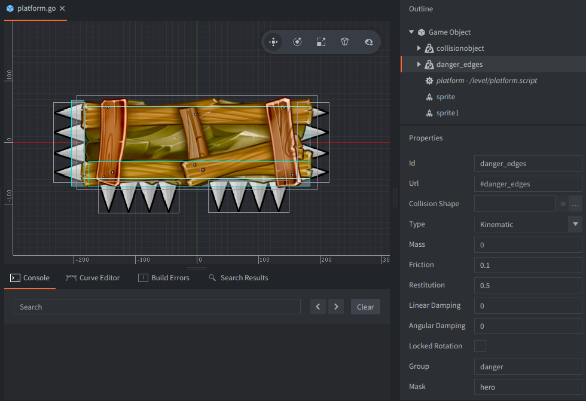

9. Откройте *hero.go*, выделите *Collision Object* и добавьте имя "danger" в свойство *Mask*. Затем сохраните файл.

    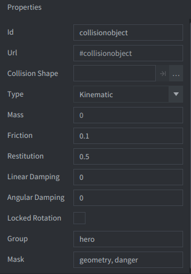

10. Откройте *hero.script* и измените функцию `on_message()`, чтобы герой реагировал на столкновение с "danger"-краем:

    ```lua
    -- hero.script
    function on_message(self, message_id, message, sender)
        if message_id == hash("reset") then
            self.velocity = vmath.vector3(0, 0, 0)
            self.correction = vmath.vector3()
            self.ground_contact = false
            self.anim = nil
            go.set(".", "euler.z", 0)
            go.set_position(self.position)
            msg.post("#collisionobject", "enable")

        elseif message_id == hash("contact_point_response") then
            -- check if we received a contact point message
            if message.group == hash("danger") then
                -- Die and restart
                play_animation(self, hash("death"))
                msg.post("#collisionobject", "disable")
                -- <1>
                go.animate(".", "euler.z", go.PLAYBACK_ONCE_FORWARD, 160, go.EASING_LINEAR, 0.7)
                go.animate(".", "position.y", go.PLAYBACK_ONCE_FORWARD, go.get_position().y - 200, go.EASING_INSINE, 0.5, 0.2,
                    function()
                        msg.post("#", "reset")
                    end)
            elseif message.group == hash("geometry") then
                handle_geometry_contact(self, message.normal, message.distance)
            end
        end
    end
    ```
    1. Добавляем вращение и падение героя в момент смерти. Это, конечно, ещё можно значительно улучшить.

11. Измените функцию `init()`, чтобы она отправляла сообщение "reset" для инициализации объекта, затем сохраните файл:

    ```lua
    -- hero.script
    function init(self)
        -- this lets us handle input in this script
        msg.post(".", "acquire_input_focus")
        -- save position
        self.position = go.get_position()
        msg.post("#", "reset")
    end
    ```

## ШАГ 8 — Сброс уровня

Если сейчас попробовать игру, быстро становится ясно, что механизм reset не работает как надо. Сброс героя в порядке, но можно легко переродиться так, что герой тут же снова упадёт на край платформы и умрёт. Нам нужно корректно сбрасывать весь уровень при смерти. Поскольку уровень у нас — это просто цепочка заспавненных платформ, достаточно отслеживать все созданные платформы и удалять их при reset:

1. Откройте *controller.script* и измените код так, чтобы он сохранял id всех заспавненных платформ:

    ```lua
    -- controller.script
    go.property("speed", 360)

    local grid = 460
    local platform_heights = { 100, 200, 350 }

    function init(self)
        msg.post("ground/controller#controller", "set_speed", { speed = self.speed })
        self.gridw = 0
        self.spawns = {} -- <1>
    end

    function update(self, dt)
        self.gridw = self.gridw + self.speed * dt

        if self.gridw >= grid then
            self.gridw = 0

            -- Maybe spawn a platform at random height
            if math.random() > 0.2 then
                local h = platform_heights[math.random(#platform_heights)]
                local f = "#platform_factory"
                if math.random() > 0.5 then
                    f = "#platform_long_factory"
                end

                local p = factory.create(f, vmath.vector3(1600, h, 0), nil, {}, 0.6)
                msg.post(p, "set_speed", { speed = self.speed })
                table.insert(self.spawns, p) -- <1>
            end
        end
    end

    function on_message(self, message_id, message, sender)
        if message_id == hash("reset") then -- <2>
            -- Tell the hero to reset.
            msg.post("hero#hero", "reset")
            -- Delete all platforms
            for i,p in ipairs(self.spawns) do
                go.delete(p)
            end
            self.spawns = {}
        elseif message_id == hash("delete_spawn") then -- <3>
            for i,p in ipairs(self.spawns) do
                if p == message.id then
                    table.remove(self.spawns, i)
                    go.delete(p)
                end
            end
        end
    end
    ```
    1. Мы используем таблицу для хранения всех заспавненных платформ.
    2. Сообщение "reset" удаляет все платформы, сохранённые в таблице.
    3. Сообщение "delete_spawn" удаляет конкретную платформу и убирает её из таблицы.

2. Сохраните файл.
3. Откройте *platform.script* и измените его так, чтобы вместо простого удаления платформы, дошедшей до левого края, скрипт отправлял сообщение level controller с просьбой удалить платформу:

    ```lua
    -- platform.script
    ...
    if pos.x < -500 then
        msg.post("/level/controller#controller", "delete_spawn", { id = go.get_id() })
    end
    ...
    ```

    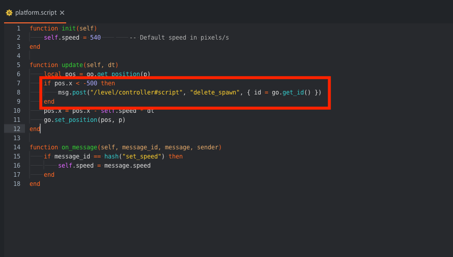

4. Сохраните файл.
5. Откройте *hero.script*. Теперь последнее, что нужно сделать, — сообщить уровню о необходимости сброса. Мы перенесли сообщение, которое просит сбросить героя, в level controller script. Имеет смысл централизовать управление reset именно так, потому что это позволит, например, проще добавить более длинную и сложную death sequence:

```lua
-- hero.script
...
go.animate(".", "position.y", go.PLAYBACK_ONCE_FORWARD, go.get_position().y - 200, go.EASING_INSINE, 0.5, 0.2,
    function()
        msg.post("controller#controller", "reset")
    end)
...
```

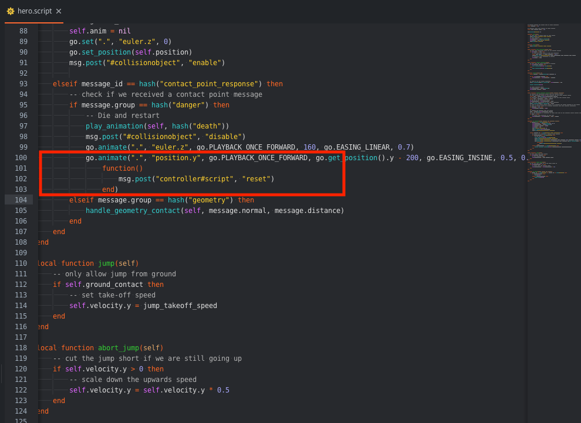

И теперь основной цикл "умер — перезапустился — снова умер" готов.

Дальше — то, ради чего стоит жить: монеты.

## ШАГ 9 — Монеты для сбора

Идея в том, чтобы разместить в уровне монеты, которые игрок сможет собирать. Первый вопрос: как именно их добавить в уровень? Например, можно разработать алгоритм спауна, как-то связанный с алгоритмом спауна платформ. Но в итоге мы выбрали гораздо более простой вариант и позволили самим платформам создавать монеты:

1. Перетащите изображение *coin.png* из набора ресурсов в папку "level/images" в *Assets pane*.
2. Откройте *level.atlas* и добавьте изображение (щёлкните правой кнопкой и выберите <kbd>Add Images</kbd>).
3. Создайте *Game Object* file с именем *coin.go* в папке *level* (щёлкните правой кнопкой по *level* в *Assets pane* и выберите <kbd>New ▸ Game Object File</kbd>).
4. Откройте *coin.go* и добавьте *Sprite* component (щёлкните правой кнопкой и выберите <kbd>Add Component</kbd> в *Outline*). Установите *Image* = *level.atlas*, а *Default Animation* = "coin".
5. Добавьте *Collision Object* (щёлкните правой кнопкой в *Outline* и выберите <kbd>Add Component</kbd>)
и добавьте *Sphere* shape, покрывающую изображение (щёлкните правой кнопкой по компоненту и выберите <kbd>Add Shape</kbd>).
6. Используйте *Move Tool* (<kbd>Scene ▸ Move Tool</kbd>) и *Scale Tool*, чтобы сфера покрывала изображение монеты.
7. Установите *Type* collision object в "Kinematic", *Group* в "pickup", а *Mask* в "hero".
8. Откройте *hero.go* и добавьте "pickup" в свойство *Mask* компонента *Collision Object*, затем сохраните файл.
9. Создайте новый script file *coin.script* (щёлкните правой кнопкой по *level* в *Assets pane* и выберите <kbd>New ▸ Script File</kbd>). Замените шаблонный код следующим:

    ```lua
    -- coin.script
    function init(self)
        self.collected = false
    end

    function on_message(self, message_id, message, sender)
        if self.collected == false and message_id == hash("collision_response") then
            self.collected = true
            msg.post("#sprite", "disable")
        elseif message_id == hash("start_animation") then
            pos = go.get_position()
            go.animate(go.get_id(), "position.y", go.PLAYBACK_LOOP_PINGPONG, pos.y + 24, go.EASING_INOUTSINE, 0.75, message.delay)
        end
    end
    ```

10. Добавьте script file как *Script* component к объекту coin (щёлкните правой кнопкой по корню в *Outline* и выберите <kbd>Add Component from File</kbd>).

    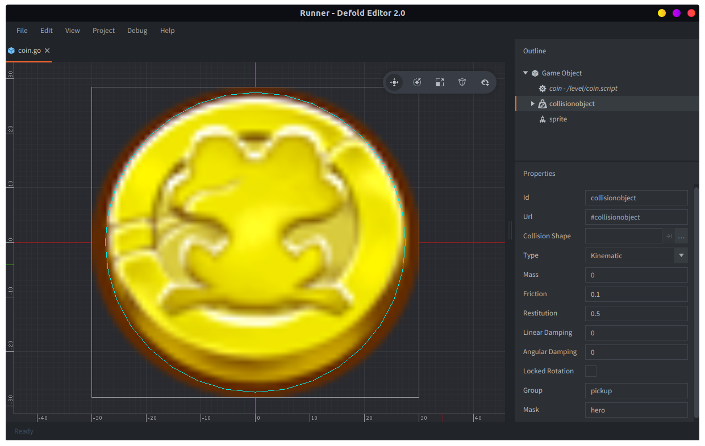

План такой: монеты будут спауниться из объектов платформ, поэтому нужно добавить factories для монет в *platform.go* и *platform_long.go*.

1. Откройте *platform.go* и добавьте компонент *Factory* (щёлкните правой кнопкой в *Outline* и выберите <kbd>Add Component</kbd>).
2. Установите *Id* этого *Factory* в "coin_factory", а *Prototype* — в файл *coin.go*.
3. Теперь откройте *platform_long.go* и создайте такой же компонент *Factory*.
4. Сохраните оба файла.

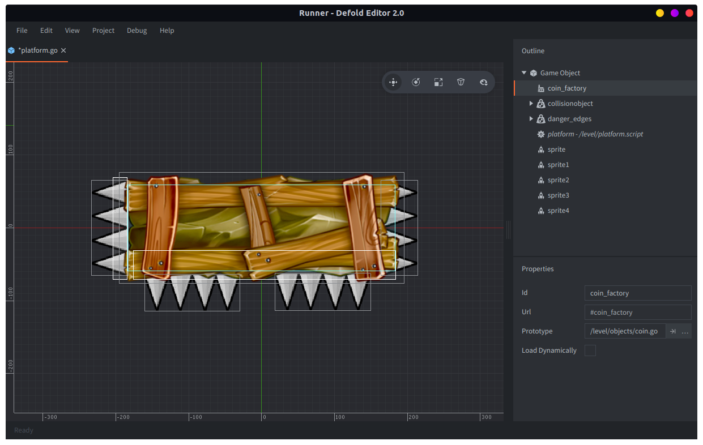

Теперь нужно изменить *platform.script*, чтобы он создавал и удалял монеты:

```lua
-- platform.script
function init(self)
    self.speed = 540     -- Default speed in pixels/s
    self.coins = {}
end

function final(self)
    for i,p in ipairs(self.coins) do
        go.delete(p)
    end
end

function update(self, dt)
    local pos = go.get_position()
    if pos.x < -500 then
        msg.post("/level/controller#controller", "delete_spawn", { id = go.get_id() })
    end
    pos.x = pos.x - self.speed * dt
    go.set_position(pos)
end

function create_coins(self, params)
    local spacing = 56
    local pos = go.get_position()
    local x = pos.x - params.coins * (spacing*0.5) - 24
    for i = 1, params.coins do
        local coin = factory.create("#coin_factory", vmath.vector3(x + i * spacing , pos.y + 64, 1))
        msg.post(coin, "set_parent", { parent_id = go.get_id() }) -- <1>
        msg.post(coin, "start_animation", { delay = i/10 }) -- <2>
        table.insert(self.coins, coin)
    end
end

function on_message(self, message_id, message, sender)
    if message_id == hash("set_speed") then
        self.speed = message.speed
    elseif message_id == hash("create_coins") then
        create_coins(self, message)
    end
end
```
1. Если сделать spawned coin дочерним объектом платформы, он будет перемещаться вместе с платформой.
2. Эта анимация заставляет монеты подпрыгивать вверх-вниз относительно платформы, которая теперь является их родителем.

::: sidenote
Отношения родитель-потомок — это исключительно модификация _scene graph_. Дочерний объект будет трансформироваться (перемещаться, масштабироваться или вращаться) вместе с родителем. Если вам нужны дополнительные отношения "владения" между game object, их нужно отдельно отслеживать в коде.
:::

Последний шаг в этом учебнике — добавить несколько строк в *controller.script*:

```lua
-- controller.script
...
local platform_heights = { 100, 200, 350 }
local coins = 3 -- <1>
...
```
1. Количество монет, создаваемых на обычной платформе.

```lua
-- controller.script
...
local coins = coins
if math.random() > 0.5 then
    f = "#platform_long_factory"
    coins = coins * 2 -- Twice the number of coins on long platforms
end
...
```

```lua
-- controller.script
...
msg.post(p, "set_speed", { speed = self.speed })
msg.post(p, "create_coins", { coins = coins })
table.insert(self.spawns, p)
...
```

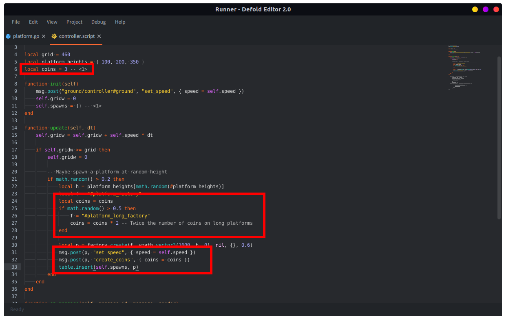

И теперь у нас есть простая, но работающая игра. Если вы дошли до этого момента, можно продолжить самостоятельно и добавить, например, следующее:

1. Счёт и счётчики жизней.
2. Particle effects для подбора предметов и смерти.
3. Красивый фон.

> Скачать завершённую версию проекта можно [здесь](images/runner/sample-runner.zip)

На этом вводный учебник заканчивается. Дальше погружайтесь в Defold самостоятельно. У нас подготовлено множество [manuals и tutorials](//www.defold.com/learn), которые помогут вам двигаться дальше, а если возникнут трудности — добро пожаловать на [форум](//forum.defold.com).

Приятной работы с Defold!
