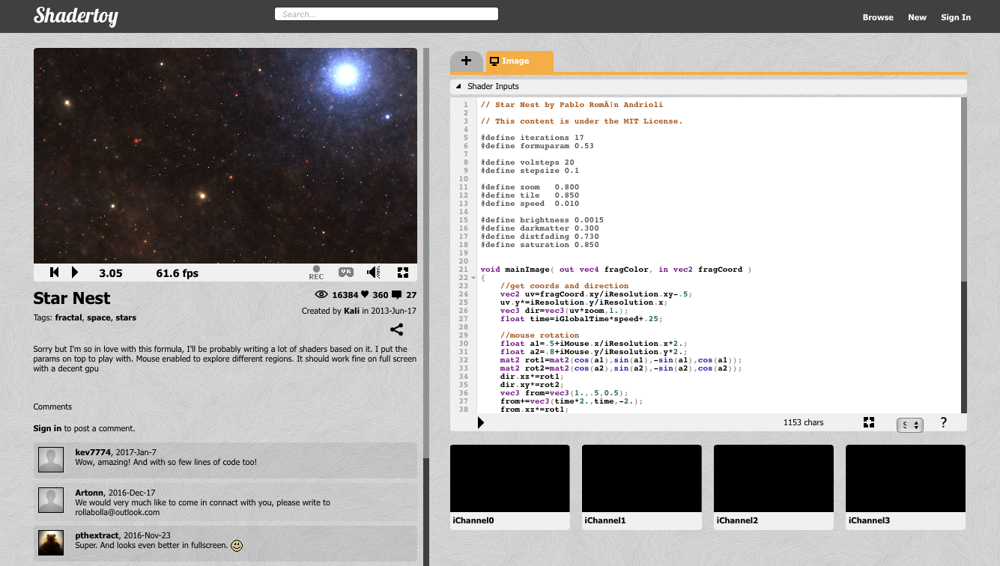
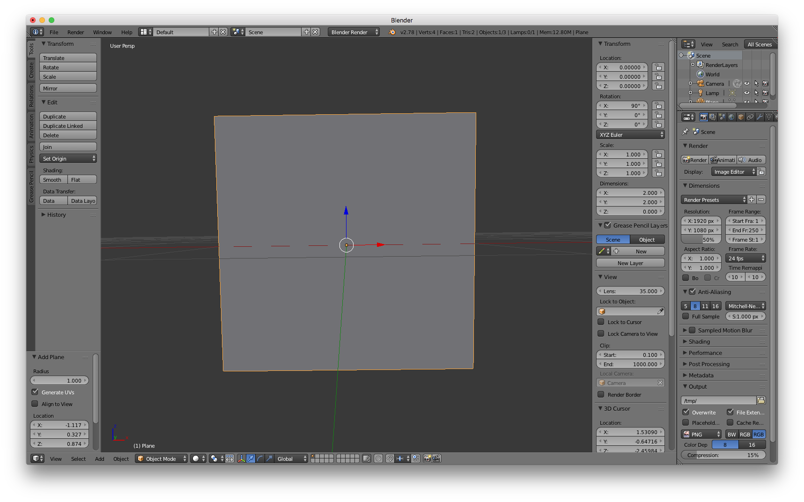
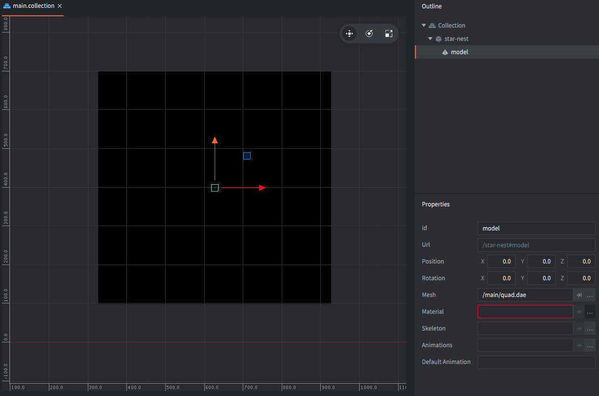
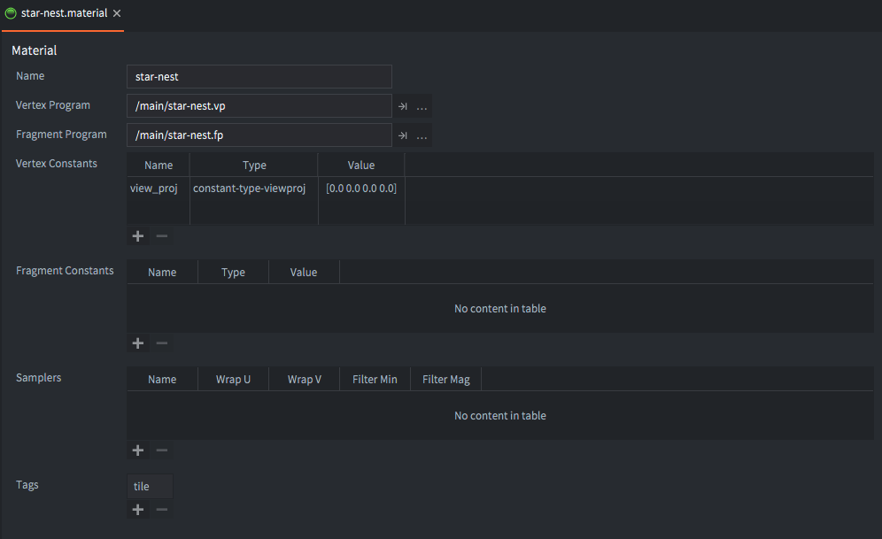
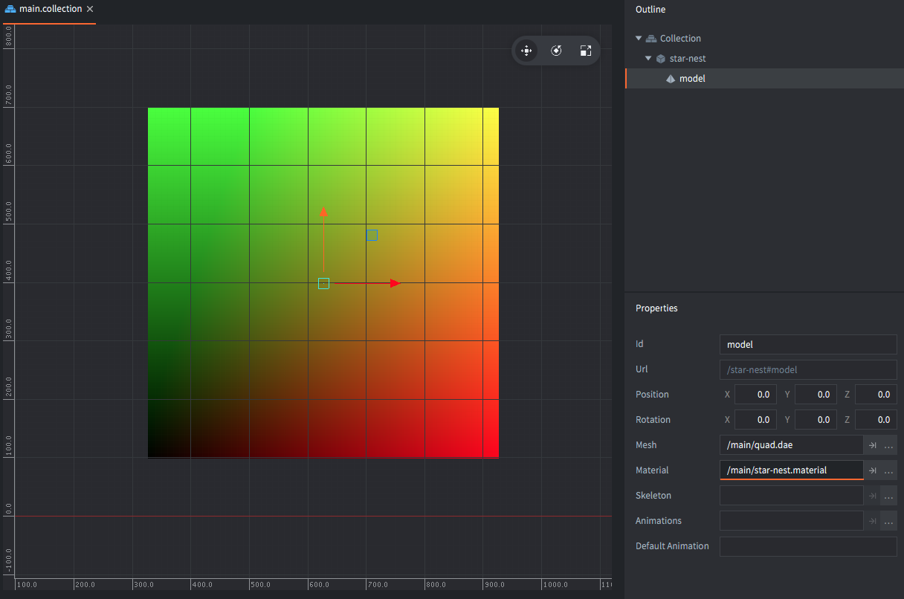
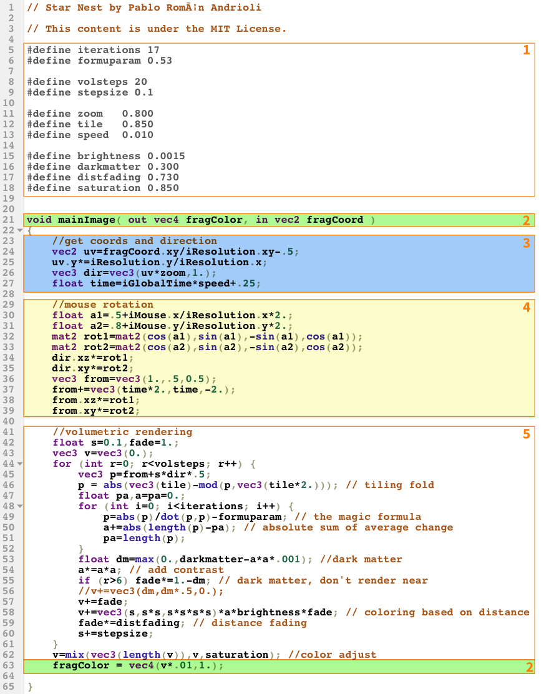
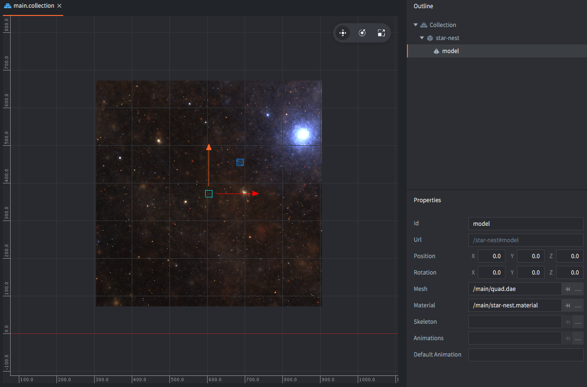
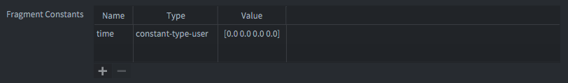
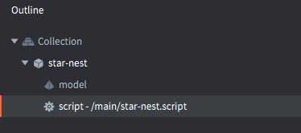

# Учебник Shadertoy

[Shadertoy.com](https://www.shadertoy.com/) — это сайт, где собраны пользовательские GL-шейдеры. Это отличный источник шейдерного кода и вдохновения. В этом учебнике мы возьмём шейдер из Shadertoy и заставим его работать в Defold. Предполагается базовое понимание шейдеров. Если вам нужно освежить тему, хорошим началом будет [руководство по Shader](/manuals/shader/).

В качестве примера мы будем использовать шейдер [Star Nest](https://www.shadertoy.com/view/XlfGRj) от Pablo Andrioli (пользователь "Kali" на Shadertoy). Это полностью процедурный фрагментный шейдер на математической чёрной магии, который рисует очень эффектное звёздное поле.



Шейдер занимает всего 65 строк довольно сложного GLSL-кода, но не беспокойтесь. Мы будем относиться к нему как к чёрному ящику, который делает своё дело на основе нескольких простых входных параметров. Наша задача — изменить шейдер так, чтобы он взаимодействовал с Defold, а не с Shadertoy.

## Что будем текстурировать

Шейдер Star Nest — это чистый фрагментный шейдер, поэтому нам нужен лишь объект, который он будет текстурировать. Вариантов несколько: sprite, tilemap, GUI или model. В этом учебнике мы будем использовать простую 3D-модель. Причина в том, что так мы легко можем превратить рендеринг модели в полноэкранный эффект, что полезно, например, для постобработки.

Начнём с создания квадратной плоскости в Blender (или любой другой программе для 3D-моделирования). Для удобства 4 вершины должны иметь координаты -1 и 1 по оси X и -1 и 1 по оси Y. В Blender по умолчанию ось Z направлена вверх, поэтому нужно повернуть меш на 90° вокруг оси X. Также убедитесь, что для меша созданы корректные UV-координаты. В Blender выберите меш, перейдите в *Edit Mode*, затем выполните <kbd>Mesh ▸ UV unwrap... ▸ Unwrap</kbd>.


[Скачать quad.dae](https://github.com/defold/template-basic-3d/blob/master/assets/meshes/quad.dae)


::: sidenote
Blender — бесплатная 3D-программа с открытым исходным кодом, её можно скачать с [blender.org](https://www.blender.org).
:::



1. Откройте файл "main.collection" в Defold и создайте новый игровой объект "star-nest".
2. Добавьте к "star-nest" компонент *Model*.
3. Установите свойство *Mesh* на файл *`quad.gltf`* из `builtins/assets/meshes`.
4. Модель маленькая (2⨉2 единицы), поэтому нужно увеличить игровой объект "star-nest" до разумного размера. Подойдёт 600⨉600, так что задайте масштаб X и Y равным 300.

Модель должна появиться в редакторе сцены, но она будет полностью чёрной. Это потому, что материал ещё не задан:



## Создание материала

Создайте новый файл материала *`star-nest.material`*, вершинный шейдер *`star-nest.vp`* и фрагментный шейдер *`star-nest.fp`*:

1. Откройте *star-nest.material*.
2. Установите *Vertex Program* на `star-nest.vp`.
3. Установите *Fragment Program* на `star-nest.fp`.
4. Добавьте *Vertex Constant* и назовите его "`view_proj`" (сокращение от "view projection").
5. Установите для него *Type* = `CONSTANT_TYPE_VIEWPROJ`.
6. Добавьте тег "tile" в *Tags*. Это нужно, чтобы квадрат включался в проход рендеринга, когда рисуются спрайты и тайлы.

    

7. Откройте файл вершинного шейдера *`star-nest.vp`*. Он должен содержать следующий код. Оставьте его без изменений.

    ```glsl
    // star-nest.vp
    uniform mediump mat4 view_proj;

    // positions are in world space
    attribute mediump vec4 position;
    attribute mediump vec2 texcoord0;

    varying mediump vec2 var_texcoord0;

    void main()
    {
        gl_Position = view_proj * vec4(position.xyz, 1.0);
        var_texcoord0 = texcoord0;
    }
    ```

8. Откройте файл фрагментного шейдера *`star-nest.fp`* и измените код так, чтобы цвет фрагмента задавался на основе X и Y координат UV (`var_texcoord0`). Мы делаем это, чтобы убедиться, что модель настроена правильно:

    ```glsl
    // star-nest.fp
    varying mediump vec2 var_texcoord0;

    void main()
    {
        gl_FragColor = vec4(var_texcoord0.xy, 0.0, 1.0);
    }
    ```

9. Установите этот материал на компонент model игрового объекта "star-nest".

Теперь редактор должен отрисовывать модель новым шейдером, и мы сможем ясно увидеть, верны ли UV-координаты: нижний левый угол должен быть чёрным (0, 0, 0), верхний левый — зелёным (0, 1, 0), верхний правый — жёлтым (1, 1, 0), а нижний правый — красным (1, 0, 0):



## Шейдер star nest

Теперь всё готово, чтобы заняться собственно кодом шейдера. Сначала посмотрим на оригинал. Он состоит из нескольких частей:



1. Строки 5--18 задают набор констант. Их можно оставить как есть.

2. Строки 21 и 63 содержат входные экранные координаты фрагмента (`in vec2 fragCoord`) и выходной цвет фрагмента (`out vec4 fragColor`).

    В Defold входные текстурные координаты передаются из вершинного шейдера как UV-координаты (в диапазоне 0--1) через varying-переменную `var_texcoord0`. Выходной цвет фрагмента задаётся во встроенной переменной `gl_FragColor`.

3. Строки 23--27 задают размеры текстуры, направление движения и масштабированное время. Разрешение viewport/texture передаётся в шейдер как `uniform vec3 iResolution`. Шейдер вычисляет UV-подобные координаты с правильным aspect ratio на основе координат фрагмента и разрешения. Также выполняется небольшое смещение, чтобы кадрирование выглядело лучше.

    В версии для Defold эти вычисления нужно изменить так, чтобы использовать UV-координаты из `var_texcoord0`.

    Здесь же задаётся время. Оно передаётся в шейдер как `uniform float iGlobalTime`. Defold в данный момент не поддерживает uniform типа `float`, поэтому нам придётся передавать время через `vec4`.

4. Строки 29--39 задают вращение объёмного рендеринга, на которое влияет положение мыши. Координаты мыши передаются в шейдер как `uniform vec4 iMouse`.

    В этом учебнике мы пропустим ввод мыши.

5. Строки 41--62 — это ядро шейдера. Этот код можно оставить без изменений.

## Модифицированный шейдер star nest

Если пройтись по описанным выше разделам и внести необходимые изменения, получится следующий шейдер. Он немного приведён в порядок для лучшей читаемости. Отличия между версиями Defold и Shadertoy отмечены:

```glsl
// Star Nest by Pablo Román Andrioli
// This content is under the MIT License.

#define iterations 17
#define formuparam 0.53

#define volsteps 20
#define stepsize 0.1

#define zoom   0.800
#define tile   0.850
#define speed  0.010

#define brightness 0.0015
#define darkmatter 0.300
#define distfading 0.730
#define saturation 0.850

varying mediump vec2 var_texcoord0; // <1>

void main() // <2>
{
    // get coords and direction
    vec2 res = vec2(1.0, 1.0); // <3>
    vec2 uv = var_texcoord0.xy * res.xy - 0.5;
    vec3 dir = vec3(uv * zoom, 1.0);
    float time = 0.0; // <4>

    float a1=0.5; // <5>
    float a2=0.8;
    mat2 rot1=mat2(cos(a1),sin(a1),-sin(a1),cos(a1));
    mat2 rot2=mat2(cos(a2),sin(a2),-sin(a2),cos(a2));
    dir.xz*=rot1;
    dir.xy*=rot2;
    vec3 from = vec3(1.0, 0.5, 0.5);
    from += vec3(time * 2.0, time, -2.0);
    from.xz *= rot1;
    from.xy *= rot2;

    //volumetric rendering
    float s = 0.1, fade = 1.0;
    vec3 v = vec3(0.0);
    for(int r = 0; r < volsteps; r++) {
        vec3 p = from + s * dir * 0.5;
        // tiling fold
        p = abs(vec3(tile) - mod(p, vec3(tile * 2.0)));
        float pa, a = pa = 0.0;
        for (int i=0; i < iterations; i++) {
            // the magic formula
            p = abs(p) / dot(p, p) - formuparam;
            // absolute sum of average change
            a += abs(length(p) - pa);
            pa = length(p);
        }
        //dark matter
        float dm = max(0.0, darkmatter - a * a * 0.001);
        a *= a * a;
        // dark matter, don't render near
        if(r > 6) fade *= 1.0 - dm;
        v += fade;
        // coloring based on distance
        v += vec3(s, s * s, s * s * s * s) * a * brightness * fade;
        fade *= distfading;
        s += stepsize;
    }
    // color adjust
    v = mix(vec3(length(v)), v, saturation);
    gl_FragColor = vec4(v * 0.01, 1.0); // <6>
}
```
1. Вершинный шейдер задаёт varying `var_texcoord0` с UV-координатами. Нам нужно его объявить.
2. В Shadertoy входная точка имеет вид `void mainImage(out vec4 fragColor, in vec2 fragCoord)`. В Defold функция `main()` не получает параметров. Поэтому вместо этого мы читаем varying `var_texcoord0` и пишем результат в `gl_FragColor`.
3. В этом учебнике мы задаём статическое разрешение для рендеринга. Сейчас модель квадратная, поэтому можно использовать `vec2 = vec2(1.0, 1.0);`. Если бы модель была прямоугольной, размером 1280⨉720, мы бы вместо этого задали `vec2 res = vec2(1.78, 1.0);` и умножали UV-координаты на него, чтобы получить правильное соотношение сторон.
4. Пока что `time` устанавливается в ноль. На следующем этапе мы добавим время.
5. Чтобы упростить учебник, мы полностью убираем `iMouse`. Обратите внимание, что расчёты поворота всё равно сохраняются, чтобы уменьшить визуальную симметрию объёмного рендеринга.
6. Наконец, задаём итоговый цвет фрагмента.

Сохраните файл фрагментного шейдера. Теперь модель должна красиво отображаться в редакторе сцены со звёздным полем:




## Анимация

Последний кусочек пазла — добавление времени, чтобы звёзды двигались. Чтобы передать время в шейдер, нам нужна шейдерная константа, uniform. Чтобы добавить новую константу:

1. Откройте *star-nest.material*.
2. Добавьте *Fragment Constant* и назовите её "time".
3. Установите *Type* = `CONSTANT_TYPE_USER`. Оставьте компоненты x, y, z и w равными 0.



Теперь нужно изменить код шейдера, чтобы он объявлял и использовал новую константу:

```glsl
...
varying mediump vec2 var_texcoord0;
uniform lowp vec4 time; // <1>

void main()
{
    //get coords and direction
    vec2 res = vec2(2.0, 1.0);
    vec2 uv = var_texcoord0.xy * res.xy - 0.5;
    vec3 dir = vec3(uv * zoom, 1.0);
    float time = time.x * speed + 0.25; // <2>
    ...
```
1. Объявляем новый uniform типа `vec4` с именем "time". Для него достаточно точности `lowp` (низкая точность).
2. Читаем компонент `x` uniform-переменной времени и используем его для вычисления значения времени.

Последний шаг — передать значение времени в шейдер:

1. Создайте новый файл скрипта *`star-nest.script`*.
2. Вставьте следующий код:

```lua
function init(self)
    self.t = 0 -- <1>
end

function update(self, dt)
    self.t = self.t + dt -- <2>
    go.set("#model", "time", vmath.vector4(self.t, 0, 0, 0)) -- <3>
end
```
1. Сохраняем значение `t` в компоненте скрипта (`self`) и инициализируем его нулём.
2. Каждый кадр увеличиваем `self.t` на количество секунд, прошедших с предыдущего кадра. Это значение доступно в параметре `dt` (delta time) и равно 1/60 (`update()` вызывается 60 раз в секунду).
3. Устанавливаем константу "time" у компонента model. Константа имеет тип `vector4`, поэтому для времени мы используем компонент `x`.
4. В завершение добавьте *star-nest.script* как компонент script к игровому объекту "star-nest":

    

И всё. Готово!

Хорошее продолжение в качестве упражнения — добавить в шейдер исходный ввод движения мыши. Это должно быть довольно просто, если вы понимаете, как обрабатывать ввод.

Приятной работы с Defold!
