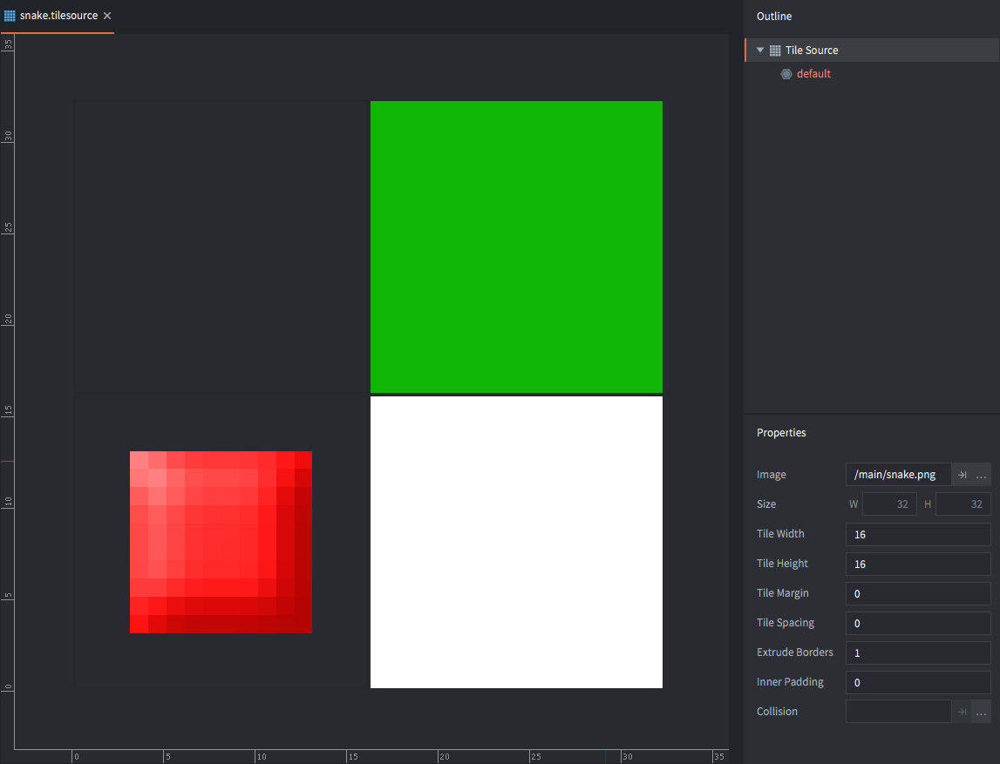
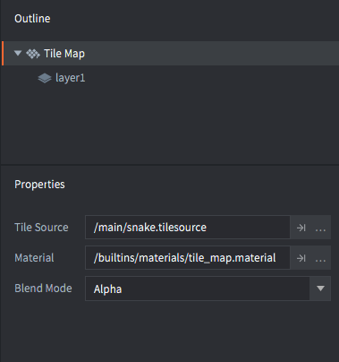
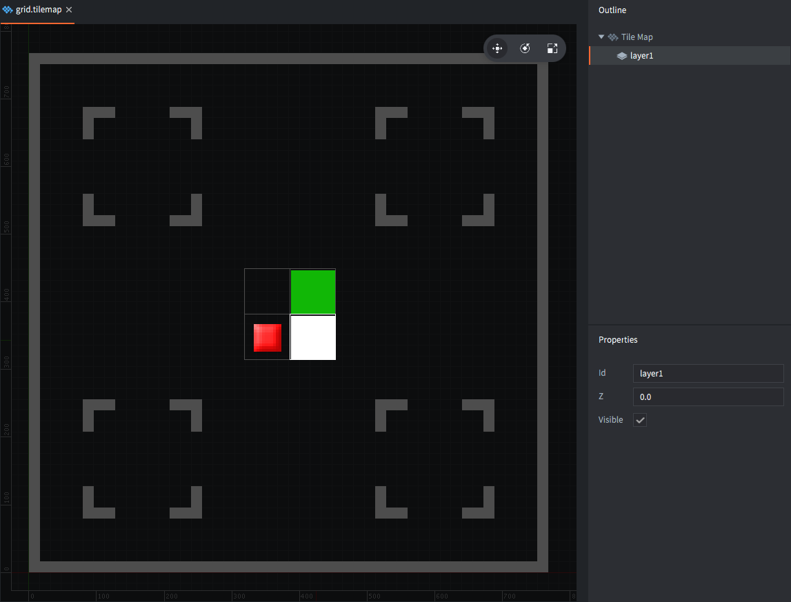
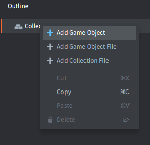
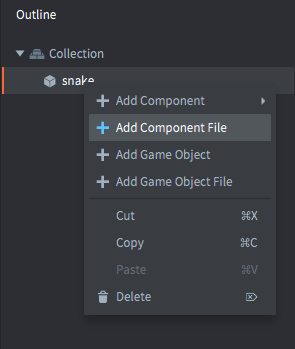
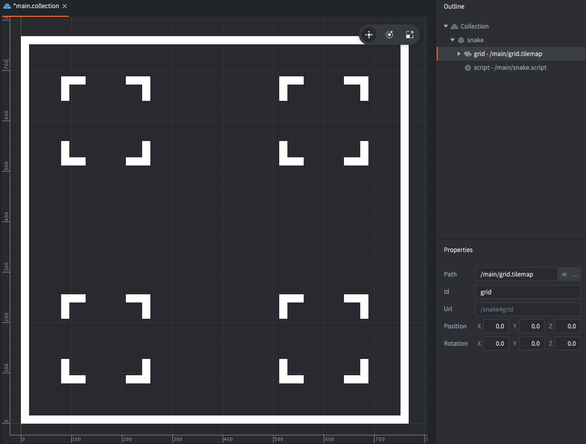
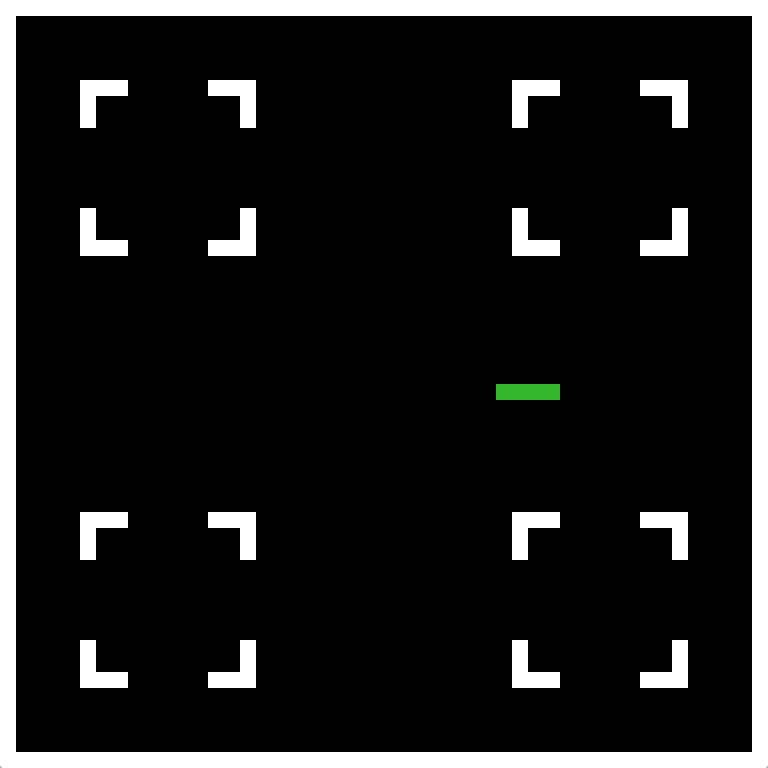
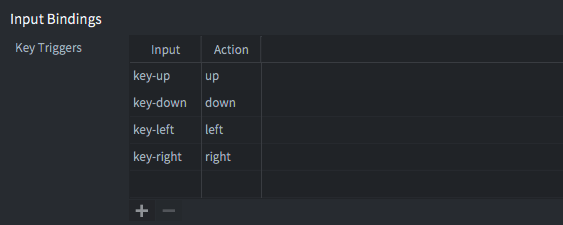

# Snake

В этом учебнике мы шаг за шагом создадим одну из самых классических игр, которые только можно попробовать воссоздать. У этой игры существует множество вариаций; в нашей версии есть змейка, которая ест "еду" и растёт только тогда, когда её съедает. Кроме того, эта змейка ползает по игровому полю с препятствиями.

## Создание проекта

1. Запустите Defold.
2. Выберите слева *New Project*.
3. Откройте вкладку *From Template*.
4. Выберите *Empty Project*.
5. Выберите папку на локальном диске.
6. Нажмите *Create New Project*.

Откройте файл настроек *game.project* и задайте размеры игры 768⨉768 или любое другое число, кратное 16. Это нужно потому, что игра будет рисоваться по сетке, где каждый сегмент имеет размер 16x16 пикселей, и тогда экран не будет обрезать частичные сегменты.

## Добавление графики

С точки зрения графики здесь нужно совсем немного: один сегмент 16x16 для змейки, один для препятствий и один для еды. Это единственный ресурс, который вам нужен. <kbd>Щёлкните правой кнопкой</kbd> по изображению, сохраните его локально и перетащите в папку проекта.


В Defold есть встроенный компонент *Tilemap*, который мы будем использовать для создания игрового поля. Tilemap позволяет устанавливать и читать отдельные тайлы, что идеально подходит для этой игры. Поскольку tilemap берёт графику из *Tilesource*, сначала нужно создать его:

<kbd>Щёлкните правой кнопкой</kbd> по папке *main* и выберите <kbd>New ▸ Tile Source</kbd>. Назовите новый файл "snake" (редактор сохранит его как "snake.tilesource").

Установите свойство *Image* на графический файл, который вы только что импортировали.

Свойства *Width* и *Height* должны оставаться равными 16. Это разделит изображение размером 32⨉32 пикселя на 4 тайла с номерами 1–4.



Обратите внимание, что свойство *Extrude Borders* установлено в 1 пиксель. Это предотвращает визуальные артефакты вокруг тайлов, у которых графика доходит до самого края.

## Создание tilemap игрового поля

Теперь, когда tilesource готов, пора создать компонент tilemap для игрового поля:

<kbd>Щёлкните правой кнопкой</kbd> по папке *main* и выберите <kbd>New ▸ Tile Map</kbd>. Назовите новый файл "grid" (редактор сохранит его как "grid.tilemap").



Установите свойство *Tile Source* нового tilemap на "snake.tilesource".

Defold хранит только ту часть tilemap, которая реально используется, поэтому вам нужно добавить достаточно тайлов, чтобы заполнить границы экрана.

Выберите слой "layer1".

В меню выберите <kbd>Edit ▸ Select Tile...</kbd>, чтобы открыть палитру тайлов, затем щёлкните по тайлу, который хотите использовать при рисовании.

Нарисуйте рамку по краю экрана и несколько препятствий.



Когда закончите, сохраните tilemap.

## Добавление tilemap и скрипта в игру

Теперь откройте *main.collection*. Это стартовая коллекция, которая загружается при запуске движка. <kbd>Щёлкните правой кнопкой</kbd> по корню в *Outline* и выберите <kbd>Add Game Object</kbd> — так создаётся новый игровой объект в коллекции, которая загружается при старте игры.



Затем <kbd>щёлкните правой кнопкой</kbd> по новому игровому объекту и выберите <kbd>Add Component File</kbd>. Укажите файл "grid.tilemap", который вы только что создали.



<kbd>Щёлкните правой кнопкой</kbd> по папке *main* в браузере *Assets* и выберите <kbd>New ▸ Script</kbd>. Назовите новый файл скрипта "snake" (он сохранится как "snake.script"). В этом файле будет вся игровая логика.

Вернитесь к *main.collection* и <kbd>щёлкните правой кнопкой</kbd> по игровому объекту, который содержит tilemap. Выберите <kbd>Add Component File</kbd> и укажите файл "snake.script".

Теперь tilemap и скрипт на месте. Если запустить игру, вы должны увидеть игровое поле именно таким, каким вы его нарисовали в tilemap.



## Игровой скрипт: инициализация

Скрипт, который вы сейчас напишете, будет управлять всей игрой. Идея такова:

1. Скрипт хранит список позиций тайлов, которые в данный момент занимает змейка.
2. Если игрок нажимает клавишу направления, сохраняется направление, в котором должна двигаться змейка.
3. Через регулярный интервал времени змейка делает один шаг в текущем направлении.

Откройте *snake.script* и найдите функцию `init()`. Эта функция вызывается движком при инициализации скрипта во время запуска игры. Измените код следующим образом.

```lua
function init(self)
    self.segments = {
        {x = 7, y = 24},
        {x = 8, y = 24},
        {x = 9, y = 24},
        {x = 10, y = 24} } -- <1>
    self.dir = {x = 1, y = 0} -- <2>
    self.speed = 7.0 -- <3>

    self.t = 0 -- <4>
end
```
1. Сохраняем сегменты змейки как Lua-таблицу, содержащую список таблиц, каждая из которых хранит позицию X и Y одного сегмента.
2. Сохраняем текущее направление как таблицу с компонентами X и Y.
3. Сохраняем текущую скорость движения в тайлах в секунду.
4. Сохраняем значение таймера, которое будет использоваться для отслеживания скорости движения.

Код выше написан на Lua. Вот несколько важных моментов:

- В Defold зарезервирован набор встроенных callback-*functions*, которые вызываются в течение жизненного цикла script component. Это *не* методы, а обычные функции. Runtime передаёт ссылку на текущий экземпляр script component через параметр `self`. Эта ссылка используется для хранения данных экземпляра.
- Литералы Lua-таблиц записываются в фигурных скобках. Записями таблицы могут быть пары ключ/значение (`{x = 10, y = 20}`), вложенные Lua-таблицы (`{ {a = 1}, {b = 2} a}`) или другие типы данных.
- Ссылку `self` можно использовать как Lua-таблицу для хранения данных. Просто применяйте точечную нотацию так же, как и с любой другой таблицей: `self.data = "value"`. Эта ссылка действительна на протяжении всего времени жизни скрипта, в данном случае — с запуска игры до её завершения.

Если вы не до конца поняли всё вышесказанное — не переживайте. Просто продолжайте, экспериментируйте и дайте себе время: со временем всё станет понятнее.

## Игровой скрипт: update

Функция `init()` вызывается ровно один раз, когда script component создаётся в работающей игре. А вот функция `update()` вызывается каждый кадр, 60 раз в секунду. Поэтому она идеально подходит для игровой логики в реальном времени.

Идея обновления такова:

1. Через заданный интервал делаем следующее:
2. Смотрим на голову змейки, затем создаём новую голову, смещённую относительно текущей головы в сторону текущего направления движения. То есть, если змейка движется с X=-1 и Y=0, а текущая голова находится в точке X=32 и Y=10, новая голова должна оказаться в точке X=31 и Y=10.
3. Добавляем новую голову в список сегментов, образующих змейку.
4. Удаляем хвост из таблицы сегментов.
5. Очищаем тайл хвоста.
6. Рисуем сегменты змейки.

Найдите функцию `update()` в *snake.script* и замените код следующим:

```lua
function update(self, dt)
    self.t = self.t + dt -- <1>
    if self.t >= 1.0 / self.speed then -- <2>
        local head = self.segments[#self.segments] -- <3>
        local newhead = {x = head.x + self.dir.x, y = head.y + self.dir.y} -- <4>

        table.insert(self.segments, newhead) -- <5>

        local tail = table.remove(self.segments, 1) -- <6>
        tilemap.set_tile("#grid", "layer1", tail.x, tail.y, 0) -- <7>

        for i, s in ipairs(self.segments) do -- <8>
            tilemap.set_tile("#grid", "layer1", s.x, s.y, 2) -- <9>
        end

        self.t = 0 -- <10>
    end
end
```
1. Продвигаем таймер на время (в секундах), прошедшее с прошлого вызова `update()`.
2. Если таймер накопил достаточно времени.
3. Получаем текущий сегмент головы. `#` — это оператор, который возвращает длину таблицы, если она используется как массив; здесь это именно так, потому что все сегменты — это значения таблицы без явных ключей.
4. Создаём новый сегмент головы на основе текущей позиции головы и направления движения (`self.dir`).
5. Добавляем новую голову в конец таблицы сегментов.
6. Удаляем хвост из начала таблицы сегментов.
7. Очищаем тайл в позиции удалённого хвоста.
8. Проходим по элементам таблицы сегментов. На каждой итерации `i` содержит позицию в таблице (начиная с 1), а `s` — текущий сегмент.
9. Устанавливаем тайл в позиции сегмента в значение 2 (зелёный тайл змейки).
10. После завершения сбрасываем таймер в ноль.

Если сейчас запустить игру, вы увидите, как змейка из 4 сегментов ползёт слева направо по игровому полю.



## Ввод игрока

Прежде чем добавлять код для реакции на ввод игрока, нужно настроить сами input connections. Найдите файл *input/game.input_binding* в браузере *Assets* и <kbd>дважды щёлкните</kbd> по нему, чтобы открыть. Добавьте набор привязок *Key Trigger* для движения вверх, вниз, влево и вправо.



Файл input binding сопоставляет реальный пользовательский ввод (клавиши, движение мыши и т. д.) с *именами* действий, которые затем передаются в скрипты, запросившие ввод. Когда привязки готовы, откройте *snake.script* и добавьте следующий код:

```lua
function init(self)
    msg.post(".", "acquire_input_focus") -- <1>

    self.segments = {
        {x = 7, y = 24},
        {x = 8, y = 24},
        {x = 9, y = 24},
        {x = 10, y = 24} }
    self.dir = {x = 1, y = 0}
    self.speed = 7.0

    self.t = 0
end
```
1. Отправляем сообщение текущему игровому объекту ("." — сокращение для текущего игрового объекта), чтобы он начал получать ввод от движка.

```lua
function on_input(self, action_id, action)
    if action_id == hash("up") and action.pressed then -- <1>
        self.dir.x = 0 -- <2>
        self.dir.y = 1
    elseif action_id == hash("down") and action.pressed then
        self.dir.x = 0
        self.dir.y = -1
    elseif action_id == hash("left") and action.pressed then
        self.dir.x = -1
        self.dir.y = 0
    elseif action_id == hash("right") and action.pressed then
        self.dir.x = 1
        self.dir.y = 0
    end
end
```
1. Если получено действие "up", как оно задано в input bindings, и в таблице `action` поле `pressed` равно `true` (игрок нажал клавишу), то:
2. Устанавливаем направление движения.

Снова запустите игру и проверьте, что вы можете управлять змейкой.

Теперь обратите внимание: если нажать две клавиши одновременно, это приведёт к двум вызовам `on_input()`, по одному на каждое нажатие. В том коде, который приведён выше, на направление змейки повлияет только тот вызов, который произошёл последним, потому что последующие вызовы `on_input()` перезапишут значения в `self.dir`.

Также заметьте, что если змейка движется влево и вы нажмёте <kbd>right</kbd>, она врежется сама в себя. *На первый взгляд* очевидное решение — добавить дополнительные условия в `if`-ветки функции `on_input()`:

```lua
if action_id == hash("up") and self.dir.y ~= -1 and action.pressed then
    ...
elseif action_id == hash("down") and self.dir.y ~= 1 and action.pressed then
    ...
```

Однако если змейка движется влево, а игрок *быстро* нажимает сначала <kbd>up</kbd>, а затем <kbd>right</kbd> до следующего шага змейки, сработает только нажатие <kbd>right</kbd>, и змейка всё равно повернёт в себя. А с добавленными выше условиями в `if`-ветках ввод просто будет проигнорирован. *Плохо!*

Правильное решение — хранить ввод в очереди и извлекать элементы из этой очереди по мере движения змейки:

```lua
function init(self)
    msg.post(".", "acquire_input_focus")

    self.segments = {
        {x = 7, y = 24},
        {x = 8, y = 24},
        {x = 9, y = 24},
        {x = 10, y = 24} }
    self.dir = {x = 1, y = 0}
    self.dirqueue = {} -- <1>
    self.speed = 7.0

    self.t = 0
end

function update(self, dt)
    self.t = self.t + dt
    if self.t >= 1.0 / self.speed then
        local newdir = table.remove(self.dirqueue, 1) -- <2>
        if newdir then
            local opposite = newdir.x == -self.dir.x or newdir.y == -self.dir.y -- <3>
            if not opposite then
                self.dir = newdir -- <4>
            end
        end

        local head = self.segments[#self.segments]
        local newhead = {x = head.x + self.dir.x, y = head.y + self.dir.y}

        table.insert(self.segments, newhead)

        local tail = table.remove(self.segments, 1)
        tilemap.set_tile("#grid", "layer1", tail.x, tail.y, 0)

        for i, s in ipairs(self.segments) do
            tilemap.set_tile("#grid", "layer1", s.x, s.y, 2)
        end

        self.t = 0
    end
end

function on_input(self, action_id, action)
    if action_id == hash("up") and action.pressed then
        table.insert(self.dirqueue, {x = 0, y = 1}) -- <5>
    elseif action_id == hash("down") and action.pressed then
        table.insert(self.dirqueue, {x = 0, y = -1})
    elseif action_id == hash("left") and action.pressed then
        table.insert(self.dirqueue, {x = -1, y = 0})
    elseif action_id == hash("right") and action.pressed then
        table.insert(self.dirqueue, {x = 1, y = 0})
    end
end
```
1. Инициализируем пустую таблицу, которая будет хранить очередь направлений ввода.
2. Извлекаем первый элемент из очереди направлений.
3. Если элемент есть (`newdir` не равен null), проверяем, направлен ли он противоположно `self.dir`.
4. Устанавливаем новое направление только в том случае, если оно не противоположно текущему.
5. Вместо прямой записи в `self.dir` добавляем новое направление в очередь.

Запустите игру и проверьте, что теперь она ведёт себя правильно.

## Еда и столкновения с препятствиями

Змейке нужна еда на карте, чтобы она могла становиться длиннее и быстрее. Добавим её.

```lua
local function put_food(self) -- <1>
    self.food = {x = math.random(2, 47), y = math.random(2, 47)} -- <2>
    tilemap.set_tile("#grid", "layer1", self.food.x, self.food.y, 3) -- <3>
end

function init(self)
    msg.post(".", "acquire_input_focus")

    self.segments = {
        {x = 7, y = 24},
        {x = 8, y = 24},
        {x = 9, y = 24},
        {x = 10, y = 24} }
    self.dir = {x = 1, y = 0}
    self.dirqueue = {}
    self.speed = 7.0
    self.t = 0

    math.randomseed(socket.gettime()) -- <4>
    put_food(self) -- <5>
end
```
1. Объявляем новую функцию `put_food()`, которая размещает еду на карте.
2. Сохраняем случайные X и Y в переменной `self.food`.
3. Устанавливаем тайл по этим координатам в значение 3, то есть графику еды.
4. Перед использованием `math.random()` нужно задать seed генератора случайных чисел, иначе каждый раз будет генерироваться одна и та же последовательность. Делать это нужно только один раз.
5. Вызываем `put_food()` при старте игры, чтобы игрок начинал уже с одним кусочком еды на карте.

Теперь определение столкновения змейки с чем-либо сводится к чтению того, что находится в tilemap в точке, куда движется змейка, и реакции на это. Добавим переменную, отслеживающую, жива ли змейка:

```lua
function init(self)
    msg.post(".", "acquire_input_focus")

    self.segments = {
        {x = 7, y = 24},
        {x = 8, y = 24},
        {x = 9, y = 24},
        {x = 10, y = 24} }
    self.dir = {x = 1, y = 0}
    self.dirqueue = {}
    self.speed = 7.0
    self.alive = true -- <1>
    self.t = 0

    math.randomseed(socket.gettime())
    put_food(self)
end
```
1. Флаг, который показывает, жива ли змейка.

Затем добавьте логику проверки столкновений со стеной/препятствием и едой:

```lua
function update(self, dt)
    self.t = self.t + dt
    if self.t >= 1.0 / self.speed and self.alive then -- <1>
        local newdir = table.remove(self.dirqueue, 1)

        if newdir then
            local opposite = newdir.x == -self.dir.x or newdir.y == -self.dir.y
            if not opposite then
                self.dir = newdir
            end
        end

        local head = self.segments[#self.segments]
        local newhead = {x = head.x + self.dir.x, y = head.y + self.dir.y}

        table.insert(self.segments, newhead)

        local tile = tilemap.get_tile("#grid", "layer1", newhead.x, newhead.y) -- <2>

        if tile == 2 or tile == 4 then
            self.alive = false -- <3>
        elseif tile == 3 then
            self.speed = self.speed + 1 -- <4>
            put_food(self)
        else
            local tail = table.remove(self.segments, 1) -- <5>
            tilemap.set_tile("#grid", "layer1", tail.x, tail.y, 1)
        end

        for i, s in ipairs(self.segments) do
            tilemap.set_tile("#grid", "layer1", s.x, s.y, 2)            
        end

        self.t = 0
    end
end
```
1. Продвигаем змейку только если она жива.
2. Прежде чем рисовать в tilemap, считываем, что находится в позиции, куда должна прийти новая голова змейки.
3. Если тайл — это препятствие или другая часть змейки, игра окончена.
4. Если тайл — еда, увеличиваем скорость и размещаем новую еду.
5. Обратите внимание: хвост удаляется только если не было столкновения. Это значит, что при поедании еды змейка вырастет на один сегмент, потому что в этот ход хвост не удаляется.

Теперь попробуйте игру и убедитесь, что всё работает как надо.

На этом учебник заканчивается, но обязательно продолжайте экспериментировать с игрой и попробуйте выполнить упражнения ниже.

## Полный скрипт

Вот полный код скрипта для справки:

```lua
local function put_food(self)
    self.food = {x = math.random(2, 47), y = math.random(2, 47)}
    tilemap.set_tile("#grid", "layer1", self.food.x, self.food.y, 3)        
end

function init(self)
    msg.post(".", "acquire_input_focus")

    self.segments = {
        {x = 7, y = 24},
        {x = 8, y = 24},
        {x = 9, y = 24},
        {x = 10, y = 24} }
    self.dir = {x = 1, y = 0}
    self.dirqueue = {}
    self.speed = 7.0
    self.alive = true
    self.t = 0

    math.randomseed(socket.gettime())
    put_food(self)
end

function update(self, dt)
    self.t = self.t + dt
    if self.t >= 1.0 / self.speed and self.alive then
        local newdir = table.remove(self.dirqueue, 1)

        if newdir then
            local opposite = newdir.x == -self.dir.x or newdir.y == -self.dir.y
            if not opposite then
                self.dir = newdir
            end
        end

        local head = self.segments[#self.segments]
        local newhead = {x = head.x + self.dir.x, y = head.y + self.dir.y}

        table.insert(self.segments, newhead)

        local tile = tilemap.get_tile("#grid", "layer1", newhead.x, newhead.y)

        if tile == 2 or tile == 4 then
            self.alive = false
        elseif tile == 3 then
            self.speed = self.speed + 1
            put_food(self)
        else
            local tail = table.remove(self.segments, 1)
            tilemap.set_tile("#grid", "layer1", tail.x, tail.y, 1)
        end

        for i, s in ipairs(self.segments) do
            tilemap.set_tile("#grid", "layer1", s.x, s.y, 2)            
        end

        self.t = 0
    end
end

function on_input(self, action_id, action)
    if action_id == hash("up") and action.pressed then
        table.insert(self.dirqueue, {x = 0, y = 1})
    elseif action_id == hash("down") and action.pressed then
        table.insert(self.dirqueue, {x = 0, y = -1})
    elseif action_id == hash("left") and action.pressed then
        table.insert(self.dirqueue, {x = -1, y = 0})
    elseif action_id == hash("right") and action.pressed then
        table.insert(self.dirqueue, {x = 1, y = 0})
    end
end
```

## Упражнения

В играбельной версии игры в начале этого учебника есть ещё несколько улучшений. Полезно попробовать реализовать их самостоятельно:

1. Добавьте систему очков и счётчик очков.
2. Функция `put_food()` не учитывает текущую позицию змейки и местоположение препятствий. Исправьте это.
3. Если игра окончена, показывайте сообщение "game over", а затем дайте игроку попробовать ещё раз.
4. Дополнительные очки: добавьте змейку для второго игрока.
