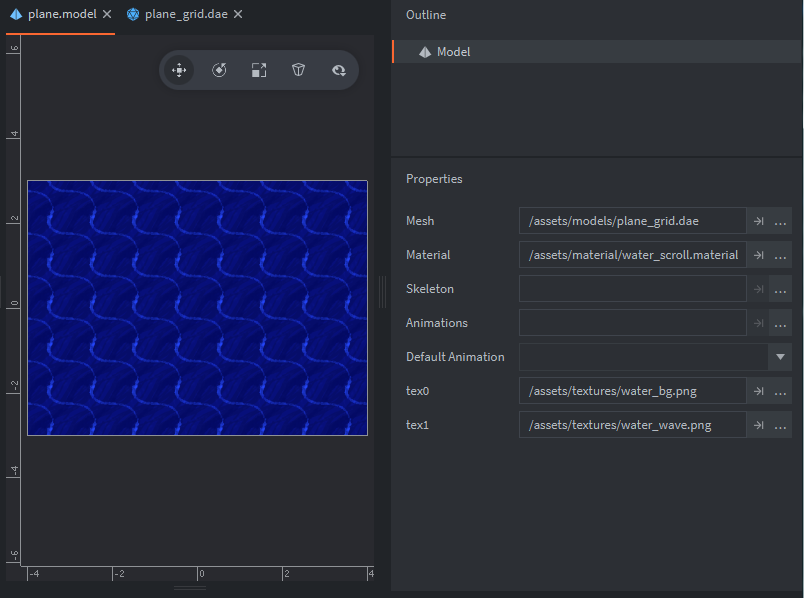
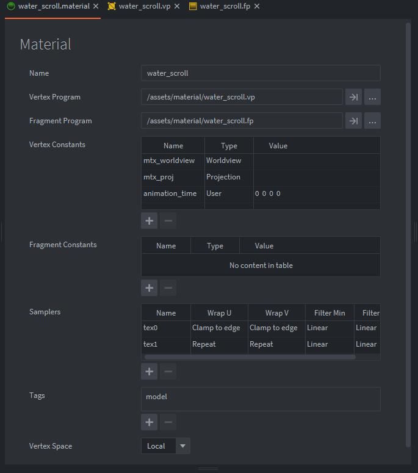

Автор материала: пользователь форума MasterMind ([оригинальный пост на форуме](https://forum.defold.com/t/texture-scrolling-shader-tutorial-example/71553)).

# Руководство по прокрутке текстуры через шейдер

Прокрутка текстур с помощью шейдера — это базовый прием во многих шейдерных эффектах. Давайте сделаем его сами. Используйте [пример проекта](https://github.com/FlexYourBrain/Texture_Scrolling_Example), чтобы повторять шаги и пробовать все на практике. В этом материале используется смещение UV-координат с помощью константы в шейдере.

Также есть [демо примерного проекта на itch.io](https://flexyourbrain.itch.io/texture-scrolling-in-defold), если вы хотите сначала посмотреть на результат этого короткого руководства:


## Настройка

Проект устроен так:

* Одна subdivided 3D plane (`.dae`), которая будет отображать прокручиваемую текстуру.
* Один model component с назначенной этой 3D plane (`.dae`).
* Две текстуры размером 64x64 (`water_bg.png` и `water_wave.png`), созданные так, чтобы бесшовно повторяться, и назначенные в свойствах `.model`.
* Один шейдер (Material + Vertex Program + Fragment Program), назначенный модели плоскости.
* Одна константа, заданная в материале и шейдере.
* Один script component, прикрепленный к игровому объекту модели для запуска цикла анимации.



_Примечание: `water_bg` назначен в слот `tex0`, а `water_wave` — в слот `tex1`. В свойствах samplers материала, показанных ниже, настроены два sampler-слота._



_Сейчас именно `tex1` будет прокручиваться, поэтому для Wrap U и V установлено значение Repeat._

Это базовая настройка, и теперь можно перейти к программам `water_scroll.vp` (vertex) и `water_scroll.fp` (fragment). На изображении выше видно, что они назначены материалу.


## Код шейдера

Хорошей практикой считается не выполнять слишком много вычислений во fragment program, если этого можно избежать, поэтому мы вычисляем смещение UV в vertex program еще до того, как координаты будут переданы во fragment program. Мы также создаем константу `animation_time` с типом `user` в свойствах vertex constants материала, как показано выше. Это вектор 4, но мы используем только первое значение. Если обозначить этот vector 4 как `vector4(x,y,z,w)`, то в шейдере ниже используется только `x`.


```glsl
// water_scroll.vp

// UV / Texture Scroll
attribute highp vec4 position;
attribute mediump vec2 texcoord0;

uniform mediump mat4 mtx_worldview;
uniform mediump mat4 mtx_proj;
uniform mediump vec4 animation_time; // vertex constant, настроенная в материале как type user.

varying mediump vec2 var_texcoord0; // настройка var texcoord 0
varying mediump vec2 var_texcoord1; // настройка var texcoord 1

void main()
{
    vec4 p = mtx_worldview * vec4(position.xyz, 1.0);
    var_texcoord0 = texcoord0;
    var_texcoord1 = vec2(texcoord0.x - animation_time.x, texcoord0.y); // вычисляем UV-смещение для var texcoord 1 по оси U(x) перед передачей во fragment program
    gl_Position = mtx_proj * p;
}
```

Модель предоставляет атрибут `texcoord0`, то есть наши UV-координаты текстуры. Мы объявляем uniform `vec4` с именем `animation_time`, а также два varying `vec2`: `var_texcoord0` и `var_texcoord1`, которые передаем во fragment program после присваивания им UV-координат атрибута `texcoord0` внутри `void main()`. Как видно, `var_texcoord1` отличается тем, что мы смещаем его перед передачей во fragment program. Мы задаем `vec2`, чтобы при необходимости можно было использовать `animation_time` для осей x и y по отдельности. В данном случае мы берем только `texcoord0.x` и вычитаем нашу константу `animation_time.x`, которая при анимации будет давать смещение по отрицательной оси U (влево по горизонтали), а `texcoord0.y` оставляем без изменений.


```glsl
// water_scroll.fp

varying mediump vec2 var_texcoord0; // var texcoord 0 используется с sampler water_bg
varying mediump vec2 var_texcoord1; // var texcoord 1 используется с sampler water_waves, расчет UV-анимации сделан в vertex program

uniform lowp sampler2D tex0; // Material sampler slot 0 = фон воды / задается в plane.model
uniform lowp sampler2D tex1; // Material sampler slot 1 = волны воды / задается в plane.model

void main()
{
    vec4 water_bg = texture2D(tex0, var_texcoord0.xy);
    vec4 water_waves = texture2D(tex1, var_texcoord1.xy);
    
    gl_FragColor = vec4(water_bg.rgb + water_waves.rgb ,1.0); // добавляем волны к фону через сложение(+), alpha = 1.0, так как прозрачность не используется
}
```

Теперь перейдем к fragment program. Здесь все устроено просто. Есть два входящих varying `vec2`, которые были переданы из vertex program: `var_texcoord0` и `var_texcoord1`, а также uniforms для sampler-текстур, которые мы настроили в модели и материале, с именами `tex0` и `tex1`. Затем в `void main()` мы создаем `vec4` для присваивания нашим текстурам через `texture2D()`. Изображения используют формат каналов RGBA (red, green, blue, alpha). Мы передаем имя sampler и координаты текстуры, которые нужно использовать. Как видно на примере выше, для "water_waves" используется `var_texcoord1`. Именно эта текстура анимируется и прокручивается, а для `water_bg` используется `var_texcoord0`, который мы оставили без изменений. Для глобальной зарезервированной переменной `gl_FragColor` задается цвет пикселя в том же формате `vec4(r,g,b,a)`. Нам нужно объединить две текстуры, поэтому мы складываем их RGB-каналы, а значение alpha ставим равным `1.0`, то есть полной непрозрачности.


## Скрипт анимации шейдера

```lua
-- animate_shader.script
local animate = 1.0
-- локальное float-значение будет использоваться для установки константы animation_time в scroll material,
-- в шейдере используется только x-компонента, поэтому vector 4 создавать не нужно

function init(self)
	go.animate("/scroll#plane", "animation_time.x", go.PLAYBACK_LOOP_FORWARD, animate, go.EASING_LINEAR, 4.0)
end
```

Есть несколько способов анимировать значения констант. Можно вычислять шаги по delta time и обновлять константу из render script или обычного script, если это нужно. В данном случае мы анимируем только один шейдер, а если бы вам понадобился шаг времени для нескольких шейдеров, возможно, удобнее было бы делать расчет в `update()`. Однако здесь мы используем `go.animate()`, потому что он дает много полезных возможностей. С его помощью можно анимировать только x-значение нашей константы через `"animation_time.x"`. Также доступны duration, delay и easing. Можно настроить циклическое воспроизведение, однократный запуск и при необходимости отмену анимации. Все это очень удобно при анимации шейдеров.

Значение `local animate`, равное 1.0, является целевым значением для анимации `"animation_time.x"`. В шейдерах мы чаще всего работаем с нормализованными значениями с плавающей точкой от 0.0 до 1.0. Обратите внимание, что значение константы `animation_time` по умолчанию в материале равно `(0,0,0,0)`, и мы анимируем первый ноль от 0.0 до 1.0. Это означает, что наши смещенные UV-координаты будут постепенно доходить до края, после чего начинать цикл заново, а именно этого мы и хотим.


## Что можно сделать дальше

В качестве упражнения попробуйте анимировать координаты текстуры `water_bg` в противоположном направлении, как это сделано в демо.

Надеюсь, это поможет. Если сделаете что-то интересное со скроллингом, обязательно поделитесь.

/ MasterMind
