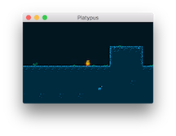
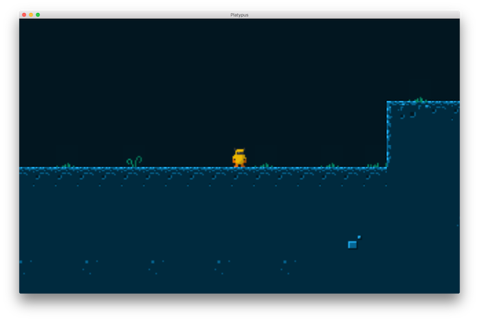
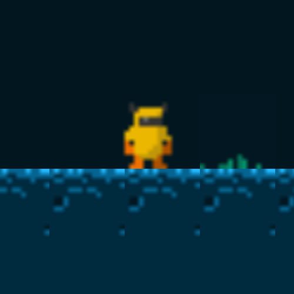
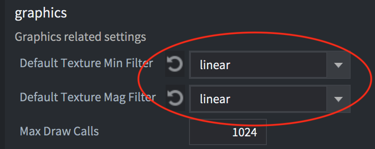
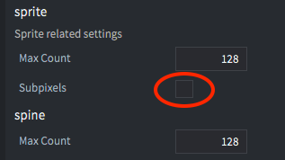
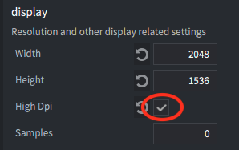

# 介绍

当适配游戏和图像到不同的屏幕尺寸时，要考虑一些事情:

* 这是个低分辨率的像素对齐的复古游戏还是高分辨率的现代游戏?
* 不同屏幕全屏模式下玩的时候游戏应该如何应对?
  * 玩家应该在高分辨率屏幕中看到更多的游戏内容还是图像自适应缩放来显示同样多的内容?
* 要是屏幕的长宽比跟在game.project中设置的不一样游戏该怎么办?
  * 玩家看到更多的游戏内容? 还是显示黑边? 还是重新调整GUI大小?
* 你需要什么样的菜单和屏幕gui组件，他们怎么适应各种屏幕大小与方向?
  * 当屏幕方向改变，菜单和屏幕gui组件应该改变布局还是不管什么方向都不动?

本手册将探讨这些事情然后提供建议.


## 内容渲染的方法如何改变

Defold 渲染脚本提供整个渲染管线的全部控制. 渲染脚本控制着显示什么，怎么显示以及显示的顺序. 默认渲染脚本总是显示 *game.project* 文件里定义的长，宽的一块区域, 不管窗口缩放和屏幕大小匹配. 如果窗口大小，比例改变，将会造成内容的拉伸. 有些游戏可能能接受, 但通常当屏幕分辨率或比例改变，应该适当让游戏内容显示的多些或少些, 或者至少在不改变窗口比例的条件下缩放游戏内容. 要改变内容拉伸的现象详情请见 [Render manual](https://www.defold.com/manuals/render/#default-view-projection).


## 复古/8比特图像

复古/8比特图像游戏模拟了老式游戏机或者低分辨率低调色盘的电脑游戏. 比如任天堂红白机 (NES) 就是分辨率 256x240 的, Commodore 64 是 320x200 的， Gameboy 是 160x144 的, 这些屏幕分辨率赶不上当前屏幕的零头. 为了在当今高分辨率屏幕上模拟这种风格的游戏需要把屏幕缩放好几倍. 一个简单的方法是先显示低分辨率图像然后再在渲染时放大. 这在Defold中使用渲染脚本就能做到，[固定映射](/manuals/render/#fixed-projection) 可以设置一个合适的放大值.

比如使用这个瓷砖图集和角色 ([source](https://ansimuz.itch.io/grotto-escape-game-art-pack)) 来模拟一个8位 320x200 分辨率游戏:


在 *game.project* 文件中设置分辨率 320x200  然后编译，游戏看起来是这样:



对于现代分辨率屏幕来说窗口也太小了! 把窗口拖动放大到 1280x800 还舒服些:


现在窗口感觉好多了，我们还需调整图像，因为太小了难以看清游戏内容. 我们用渲染脚本来设置一个固定放大的映射:

```Lua
msg.post("@render:", "use_fixed_projection", { zoom = 4 })
```

结果会变成这样:



好多了. 窗口和图像都可以, 但是仔细看会发现一个明显的问题:



图像模糊了! 因为GPU渲染纹理时放大了图形采样. 默认 *game.project* 文件里 Graphics 部分设置是 *linear*:



现在改成 *nearest* 试试:


现在我们的游戏图像是像素对齐的了. 还可以想想其他办法, 比如在*game.project*的sprite里关闭 sub-pixels:



当Subpixels选项关闭后所有 sprites 就不会渲染在半个像素上而是永远像素对齐.

## 高分辨率图像

处理高分辨率图像我们需要使用复古游戏不同的方法. 做位图时就要做成高分辨率屏幕下 1:1 大小的图.

同样也需要更改渲染脚本. 这次我们需要按原始比例显示图像:

```Lua
msg.post("@render:", "use_fixed_fit_projection")
```

This will make sure that the screen will resize to always show the same amount of content as specified in the *game.project* file, possibly with additional content shown above and below or to the sides, depending on if the aspect ratio differs or not.

You should configure the width and height in the *game.project* file to a size that allows you to show your game content unscaled.

### High DPI setting and retina screens

If you also wish to support high resolution retina screens you can enable this in the *game.project* file in the Display section:



This will create a high dpi back buffer on displays that support it. The game will render in double the resolution than what is set in the Width and Height settings, which will still be the logical resolution used in scripts and properties. This means that all measurements stay the same and any content that is rendered at 1x scale will look the same. But if you import high res images and scale them to 0.5x they will be high dpi on screen.


## Creating an adaptive GUI

The system for creating GUI components is built around a number of basic building blocks, or [nodes](/manuals/gui/#node-types), and while it may seem overly simple it can be used to create anything from buttons to complex menus and popups. The GUIs that you create can be configured to automatically adapt to screen size and orientation changes. You can for instance keep nodes anchored to the top, bottom or sides of the screen and nodes can either keep their size or stretch. The relationship between nodes as well as their size and appearance can also be configured to change when the screen size or orientation changes.

### Node properties

Each node in a gui has a pivot point, a horizontal and vertical anchor as well as an adjust mode.

* The pivot point defines the center point of a node.
* The anchor mode controls how the node’s vertical and horizontal position is altered when the scene boundaries, or the parent node’s boundaries are stretched to fit the physical screen size.
* The adjust mode setting controls what happens to a node when the scene boundaries, or the parent node’s boundaries, are adjusted to fit the physical screen size.

You can learn more about these properties [in the GUI manual](/manuals/gui/#node-properties).

### Layouts

Defold supports GUIs that automatically adapt to screen orientation changes on mobile devices. By using this feature you can design a GUI that can adapt to the orientation and aspect ratio of a range of screen sizes. It is also possible to create layouts that match particular device models. You can learn more about this system in the [GUI Layouts manual](/manuals/gui-layouts/)


## Testing different screen sizes

The Debug menu contains an option to simulate the resolution of either a certain device model resolution or a custom resolution. While the application is running you can select <kbd>Debug->Simulate Resolution</kbd> and pick one of the device models from the list. The running application window will resize and you'll be able to see how your game looks in a different resolution or with a different aspect ratio.


