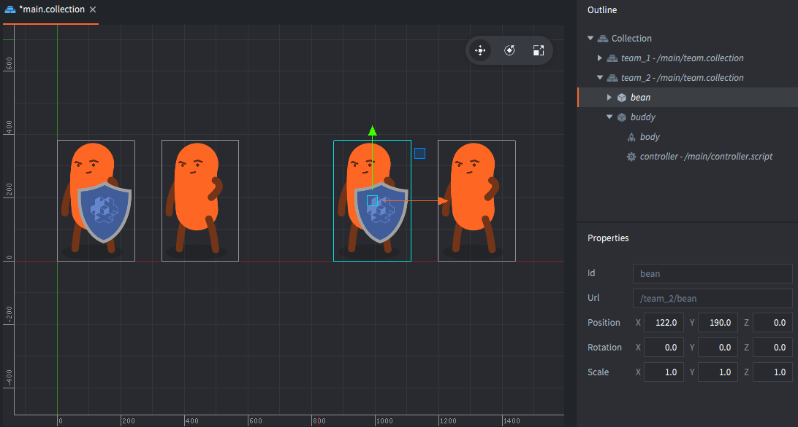
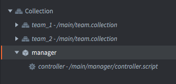
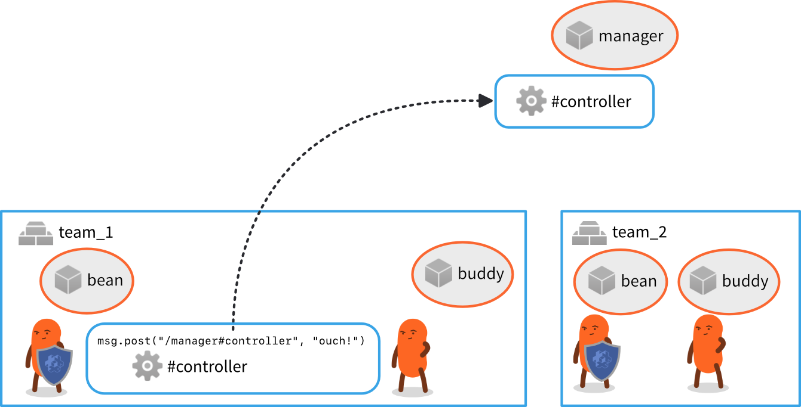

# 寻址

控制运行游戏的代码必须能够到达每个对象和组件，以便移动、缩放、制作动画、删除和操作玩家看到和听到的内容。Defold的寻址机制使这成为可能。

## 标识符

Defold使用地址（或URL，但我们暂时忽略这一点）来引用游戏对象和组件。这些地址由标识符组成。以下是Defold如何使用地址的所有示例。通过本手册，我们将详细研究它们的工作原理：

```lua
local id = factory.create("#enemy_factory")
label.set_text("my_gameobject#my_label", "Hello World!")

local pos = go.get_position("my_gameobject")
go.set_position(pos, "/level/stuff/other_gameobject")

msg.post("#", "hello_there")
local id = go.get_id(".")
```

让我们从一个非常简单的例子开始。假设你有一个带有单个精灵组件的游戏对象。你还有一个脚本组件来控制这个游戏对象。编辑器中的设置看起来会像这样：


现在你想在游戏开始时禁用精灵，以便稍后让它出现。这可以通过在"controller.script"中放入以下代码轻松完成：

```lua
function init(self)
    msg.post("#body", "disable") -- <1>
end
```
1. 如果你对'#'字符感到困惑，不用担心，我们很快会讲到它。

这将按预期工作。当游戏启动时，脚本组件*通过其标识符"body"寻址*到精灵组件，并使用该地址向其发送一条带有"disable"的*消息*。这个特殊引擎消息的效果是精灵组件隐藏精灵图形。从示意图上看，设置如下：


设置中的标识符是任意的。在这里，我们选择给游戏对象命名为"bean"，其精灵组件命名为"body"，而控制角色的脚本组件命名为"controller"。

::: sidenote
如果你不选择名称，编辑器会为你选择。每当你在编辑器中创建新的游戏对象或组件时，会自动设置一个唯一的*Id*属性。

- 游戏对象自动获得一个名为"go"的id，后面跟着枚举器（"go2"、"go3"等）。
- 组件获得一个对应于组件类型的id（"sprite"、"sprite2"等）。

如果你愿意，可以坚持使用这些自动分配的名称，但我们鼓励你将标识符改为好的、描述性的名称。
:::

现在，让我们添加另一个精灵组件并给豆子一个盾牌：


新组件必须在游戏对象内唯一标识。如果你给它命名为"body"，脚本代码将不清楚应该向哪个精灵发送"disable"消息。因此我们选择了唯一（且描述性）的标识符"shield"。现在我们可以随意启用和禁用"body"和"shield"精灵。


::: sidenote
如果你确实尝试多次使用同一标识符，编辑器会发出错误信号，因此在实践中这永远不会成为问题：


:::

现在，让我们看看如果添加更多游戏对象会发生什么。假设你想将两个"豆子"配对成一个小队。你决定将其中一个豆子游戏对象命名为"bean"，另一个命名为"buddy"。此外，当"bean"闲置一段时间后，它应该告诉"buddy"开始跳舞。这是通过从"bean"中的"controller"脚本组件向"buddy"中的"controller"脚本发送一个名为"dance"的自定义消息来完成的：


::: sidenote
有两个名为"controller"的独立组件，每个游戏对象中一个，但这是完全合法的，因为每个游戏对象都创建了一个新的命名上下文。
:::

由于消息的接收者在发送消息的游戏对象（"bean"）之外，代码需要指定哪个"controller"应该接收消息。它需要指定目标游戏对象id以及组件id。组件的完整地址变为`"buddy#controller"`，这个地址由两个独立部分组成。

- 首先是目标游戏对象的标识（"buddy"），
- 然后是游戏对象/组件分隔符（"#"），
- 最后你写上目标组件的标识（"controller"）。

回到前面只有一个游戏对象的例子，我们看到通过省略目标地址的游戏对象标识符部分，代码可以寻址*当前游戏对象*中的组件。

例如，`"#body"`表示当前游戏对象中组件"body"的地址。这非常有用，因为这段代码可以在*任何*游戏对象中工作，只要存在"body"组件。

## 集合

集合使得创建游戏对象的组或层次结构，并以受控方式重用它们成为可能。当你在游戏中填充内容时，可以在编辑器中使用集合文件作为模板（或"原型"或"预制件"）。

假设你想要创建大量的bean/buddy团队。一个好的方法是在一个新的*集合文件*中创建一个模板（命名为"team.collection"）。在集合文件中构建团队游戏对象并保存它。然后将该集合文件内容的实例放入你的主引导集合中，并给该实例一个标识符（命名为"team_1"）：


有了这种结构，"bean"游戏对象仍然可以通过地址`"buddy#controller"`引用"buddy"中的"controller"组件。


如果你添加"team.collection"的第二个实例（命名为"team_2"），在"team_2"脚本组件中运行的代码将同样工作良好。来自集合"team_2"的"bean"游戏对象实例仍然可以通过地址`"buddy#controller"`寻址"buddy"中的"controller"组件。



## 相对寻址

地址`"buddy#controller"`对两个集合中的游戏对象都有效，因为它是一个*相对*地址。每个集合"team_1"和"team_2"都创建了一个新的命名上下文，或者如果你愿意，可以称为"命名空间"。Defold通过考虑集合创建的命名上下文来避免命名冲突：


- 在命名上下文"team_1"中，游戏对象"bean"和"buddy"被唯一标识。
- 类似地，在命名上下文"team_2"中，游戏对象"bean"和"buddy"也被唯一标识。

相对寻址通过在解析目标地址时自动添加当前命名上下文来工作。这再次非常有用和强大，因为你可以创建带有代码的游戏对象组，并在整个游戏中高效地重用它们。

### 简化符

Defold提供了两个方便的简化符，你可以使用它们来发送消息而无需指定完整的URL：

:[Shorthands](../shared/url-shorthands.md)

## 游戏对象路径

为了正确理解命名机制，让我们看看当你构建和运行项目时会发生什么：

1. 编辑器读取引导集合（"main.collection"）及其所有内容（游戏对象和其他集合）。
2. 对于每个静态游戏对象，编译器创建一个标识符。这些被构建为从引导根开始，沿着集合层次结构到对象的"路径"。每层都添加一个'/'字符。

对于我们上面的示例，游戏将运行以下4个游戏对象：

- /team_1/bean
- /team_1/buddy
- /team_2/bean
- /team_2/buddy

::: sidenote
标识符存储为哈希值。运行时还存储每个集合标识符的哈希状态，用于将相对字符串哈希到绝对id。
:::

在运行时，集合分组不存在。无法找出特定游戏对象在编译前属于哪个集合。也不可能一次操作集合中的所有对象。如果你需要执行此类操作，你可以在代码中轻松地自己进行跟踪。每个对象的标识符是静态的，保证在整个对象生命周期内保持不变。这意味着你可以安全地存储对象的标识符并在以后使用它。

## 绝对寻址

在寻址时可以使用上述的完整标识符。在大多数情况下，相对寻址是首选的，因为它允许内容重用，但在某些情况下，绝对寻址变得必要。

例如，假设你想要一个AI管理器来跟踪每个豆子对象的状态。你希望豆子向管理器报告它们的活跃状态，管理器根据它们的状态做出战术决策并向豆子下达命令。在这种情况下，创建一个带有脚本组件的单个管理器游戏对象并将其与团队集合一起放在引导集合中是完全合理的。



然后每个豆子负责向管理器发送状态消息：如果发现敌人则发送"contact"，如果被击中并受到伤害则发送"ouch!"。为了使这个工作，豆子控制器脚本使用绝对寻址向"manager"中的"controller"组件发送消息。

任何以'/'开头的地址将从游戏世界的根解析。这对应于游戏启动时加载的*引导集合*的根。

管理器脚本的绝对地址是`"/manager#controller"`，这个绝对地址将解析到正确的组件，无论它在哪里使用。




## 哈希标识符

引擎将所有标识符存储为哈希值。所有以组件或游戏对象为参数的函数接受字符串、哈希或URL对象。我们已经在上文看到了如何使用字符串进行寻址。

当你获取游戏对象的标识符时，引擎将总是返回一个哈希化的绝对路径标识符：

```lua
local my_id = go.get_id()
print(my_id) --> hash: [/path/to/the/object]

local spawned_id = factory.create("#some_factory")
print(spawned_id) --> hash: [/instance42]
```

你可以在字符串id的地方使用这样的标识符，或者自己构造一个。但请注意，哈希id对应于对象的路径，即绝对地址：

::: sidenote
相对地址必须作为字符串给出，因为引擎将基于当前命名上下文（集合）的哈希状态，通过将给定字符串添加到哈希中来计算新的哈希id。
:::

```lua
local spawned_id = factory.create("#some_factory")
local pos = vmath.vector3(100, 100, 0)
go.set_position(pos, spawned_id)

local other_id = hash("/path/to/the/object")
go.set_position(pos, other_id)

-- 这样无法工作! 相对地址必须使用字符串.
local relative_id = hash("my_object")
go.set_position(pos, relative_id)
```

## URL

为了完整理解，让我们看看Defold地址的完整格式：URL。

URL是一个对象，通常写为特殊格式的字符串。通用URL由三部分组成：

`[socket:][path][#fragment]`

socket
: 标识目标的游戏世界。在使用[集合代理](/manuals/collection-proxy)时这很重要，然后用于标识_动态加载的集合_。

path
: URL的这部分包含目标游戏对象的完整id。

fragment
: 指定游戏对象内目标组件的标识。

正如我们在上面看到的，在大多数情况下，你可以省略部分或大部分信息。你几乎不需要指定socket，你经常（但不总是）需要指定路径。在你确实需要寻址另一个游戏世界中的事物的情况下，你需要指定URL的socket部分。例如，上面"manager"游戏对象中"controller"脚本的完整URL字符串是：

`"main:/manager#controller"`

而team_2中的buddy控制器是：

`"main:/team_2/buddy#controller"`

我们可以向它们发送消息：

```lua
-- Send "hello" to the manager script and team buddy bean
msg.post("main:/manager#controller", "hello_manager")
msg.post("main:/team_2/buddy#controller", "hello_buddy")
```

## 构建URL对象

URL对象也可以在Lua代码中以编程方式构造：

```lua
-- Construct URL object from a string:
local my_url = msg.url("main:/manager#controller")
print(my_url) --> url: [main:/manager#controller]
print(my_url.socket) --> 786443 (internal numeric value)
print(my_url.path) --> hash: [/manager]
print(my_url.fragment) --> hash: [controller]

-- Construct URL from parameters:
local my_url = msg.url("main", "/manager", "controller")
print(my_url) --> url: [main:/manager#controller]

-- Build from empty URL object:
local my_url = msg.url()
my_url.socket = "main" -- specify by valid name
my_url.path = hash("/manager") -- specify as string or hash
my_url.fragment = "controller" -- specify as string or hash

-- Post to target specified by URL
msg.post(my_url, "hello_manager!")
```
