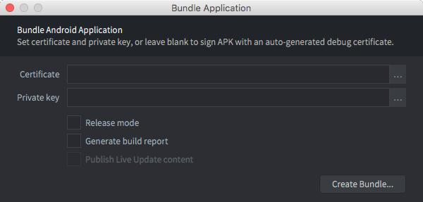
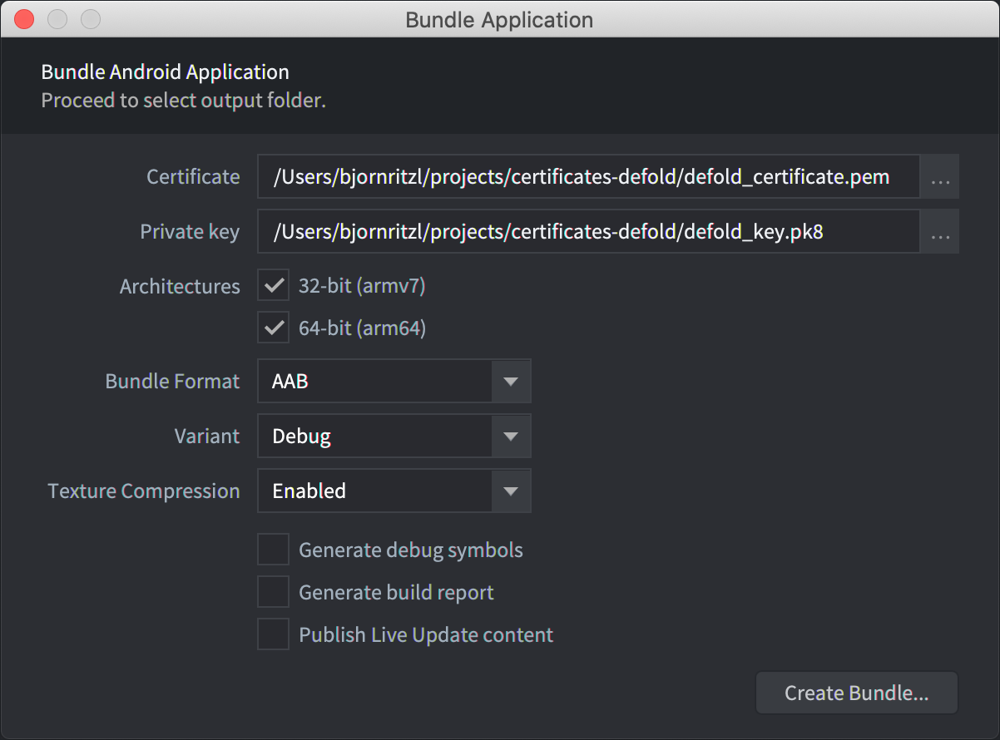
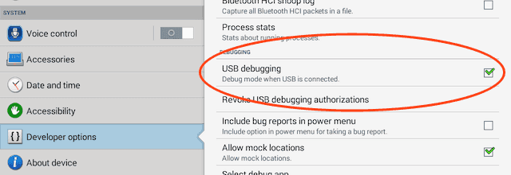

# Android 开发

Android 设备允许自由允许你开发的应用. 可以很容易地编译好游戏拷贝到 Android 设备上. 本手册介绍了对于 Android 游戏的打包步骤. 推荐开发时, 从 [开发应用](/manuals/dev-app) 上运行游戏因为可以通过无线连接设备进行代码和内容的热重载.

## Android 和 Google Play 签名

Android 需要安装的应用都进行数字签名. 不像 iOS 证书都需要由 Apple 签发, Android 允许开发者自己创建证书和密匙来对应用签名.

创建证书和密匙的过程看似复杂但是开发阶段 Defold 对此有自动化功能.你可以在打包 Android应用时指定证书和密匙. 不指定的话, Defold 会自动创建证书和密匙打包 *.apk* (Android Application Package) 文件.

注意如果要把应用上传至 Google Play, 就需要用自己的证书和密匙签名应用. 因为后续应用更新时, _新版本 *.apk* 文件签名需要与老版本保持一致_. 如果不一致, Google Play 会拒绝 *.apk* 更新上架, 除非作为全新应用发布.

详情请见 [Google Play 开发者中心](https://play.google.com/apps/publish/).

## 创建证书和密匙

基于 *.pem*-格式创建证书, 基于 *.pk8*-格式创建密匙. 二者的创建都可以使用 `openssl` 工具:

```sh
$ openssl genrsa -out key.pem 2048
$ openssl req -new -key key.pem -out request.pem
$ openssl x509 -req -days 9999 -in request.pem -signkey key.pem -out certificate.pem
$ openssl pkcs8 -topk8 -outform DER -in key.pem -inform PEM -out key.pk8 -nocrypt
```

这样就生成了 *certificate.pem* 和 *key.pk8* 文件可以用来签名应用包.

::: 注意
注意保存好证书和密匙文件. 一点丢失就 _不能_ 上传 *.apk* 更新文件到 Google Play 了.
:::

## 创建 Android 应用包

使用编辑器可以很容易地进行应用打包. Before bundling you can specify what icon(s) to use for the app, set version code etc in the "game.project" [project settings file](/manuals/project-settings/#android). To bundle select <kbd>Project ▸ Bundle... ▸ Android Application...</kbd> from the menu.

If you want the editor to automatically create random debug certificates, leave the *Certificate* and *Private key* fields empty:



If you want to sign your bundle with a particular certificate and key, specify the *.pem* and *.pk8* files:



Press <kbd>Create Bundle</kbd> and you will then be prompted to specify where on your computer the bundle will be created.


### Installing an Android application bundle

The editor writes an *.apk* file which is an Android application bundle. This file can be copied to your device with the `adb` tool (see below), or to Google Play via the [Google Play developer console](https://play.google.com/apps/publish/).

```
$ adb install Defold\ examples.apk
4826 KB/s (18774344 bytes in 3.798s)
  pkg: /data/local/tmp/my_app.apk
Success
```

## Permissions

The Defold engine requires a number of different permissions for all engine features to work. The permissions are defined in the `AndroidManifest.xml`, specified in the "game.project" [project settings file](/manuals/project-settings/#android). You can read more about Android permissions in [the official docs](https://developer.android.com/guide/topics/permissions/overview). The following permissions are requested in the default manifest:

### android.permission.INTERNET and android.permission.ACCESS_NETWORK_STATE (Protection level: normal)
Allows applications to open network sockets and access information about networks. These permission are needed for internet access. ([Android official docs](https://developer.android.com/reference/android/Manifest.permission#INTERNET)) and ([Android official docs](https://developer.android.com/reference/android/Manifest.permission#ACCESS_NETWORK_STATE)).

### android.permission.WRITE_EXTERNAL_STORAGE (Protection level: dangerous)
Allows an application to write to external storage. Starting in API level 19, this permission is not required to read/write files in your application-specific directories returned by Context.getExternalFilesDir(String) and Context.getExternalCacheDir(). This permission is needed if you intend to save/load files from disk (using io.* or sys.save/load) outside of the folder provided by [sys.get_save_file()](/ref/sys/#sys.get_save_file:application_id-file_name) and have `android:minSdkVersion` set to less than 19 in the Android manifest. ([Android official docs](https://developer.android.com/reference/android/Manifest.permission#WRITE_EXTERNAL_STORAGE)).

### android.permission.WAKE_LOCK (Protection level: normal)
Allows using PowerManager WakeLocks to keep processor from sleeping or screen from dimming. This permission is needed to temporarily prevent the device from sleeping while receiving a push notification. ([Android official docs](https://developer.android.com/reference/android/Manifest.permission#WAKE_LOCK))


## Android Debug Bridge

The `adb` command line tool is an easy to use and versatile program that is used to interact with Android devices. You can download and install `adb` as part of the Android SDK Platform-Tools, for Mac, Linux or Windows.

Download the Android SDK Platform-Tools from: https://developer.android.com/studio/releases/platform-tools. You find the *adb* tool in */platform-tools/*. Alternatively, platform specific packages can be installed through respective package managers.

On Ubuntu Linux:

```
$ sudo apt-get install android-tools-adb
```

On Fedora 18/19:

```
$ sudo yum install android-tools
```

On Mac OS X (Homebrew)

```
$ brew cask install android-platform-tools
```

You can veryfy that `adb` works by connecting your Android device to your computer via USB and issue the following command:

```
$ adb devices
List of devices attached
31002535c90ef000    device
```

If your device does not show up, verify that you have enabled *USB debugging* on the Android device. Open the device *Settings* and look for *Developer options* (or *Development*).



## Debugging an application bundle

A bundle built with the debug mode version of the engine (i.e. "Debug" selected as variant during bundling) will send all its console output to the Android system log. Access the log with the `adb` tool and give the `logcat` command. You probably want to filter the output by a tag (`-s [tagname]`):

```
$ adb logcat -s "defold"
--------- beginning of /dev/log/system
--------- beginning of /dev/log/main
I/defold  ( 6210): INFO:DLIB: SSDP started (ssdp://192.168.0.97:58089, http://0.0.0.0:38637)
I/defold  ( 6210): INFO:ENGINE: Defold Engine 1.2.50 (8d1b912)
I/defold  ( 6210): INFO:ENGINE: Loading data from:
I/defold  ( 6210): INFO:ENGINE: Initialised sound device 'default'
I/defold  ( 6210):
D/defold  ( 6210): DEBUG:SCRIPT: Hello there, log!
...
```

## Troubleshooting

I'm getting "Failure [INSTALL_PARSE_FAILED_INCONSISTENT_CERTIFICATES]" when installing
: Android detects that you try to install the app with a new certificate. When bundling debug builds, each build will be signed with a temporary certificate. Uninstall the old app before installing the new version:

  ```
  $ adb uninstall com.defold.examples
  Success
  $ adb install Defold\ examples.apk
  4826 KB/s (18774344 bytes in 3.798s)
          pkg: /data/local/tmp/Defold examples.apk
  Success
  ```
