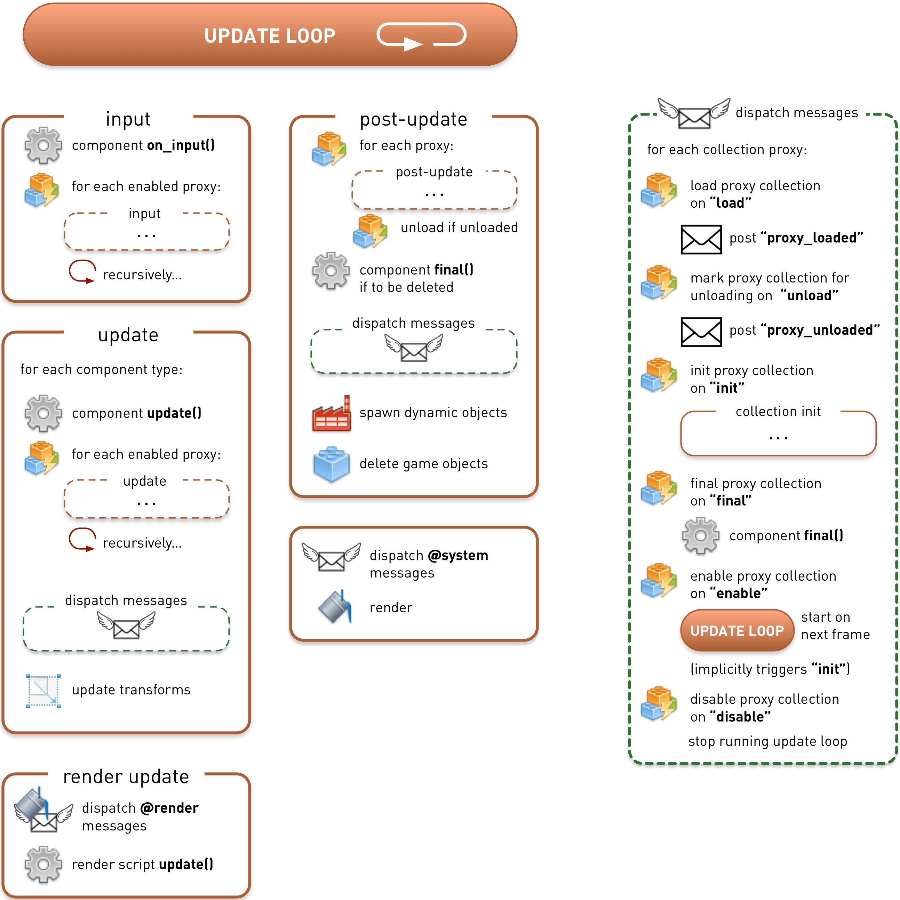

# 应用生命周期

Defold 应用或者游戏的生命周期相当简单. 引擎切换运行三种状态: 初始化, 更新循环 (游戏主要耗时状态) 以及析构.


通常对于 Defold 的内部运作机制稍作了解就足够了. 然而, 有时了解 Defold 内部的运行顺序还是有必要的. 本教程介绍了 Defold 应用从始至终是按什么顺序运行的.

引擎一开始进行初始化操作. 载入启动集合然后在所有组件上调用 [`init()`](/ref/go#init) 函数 (包括脚本组件和GUI脚本). 这个函数用于进行用户自定义初始化操作.

接下来就是应用主要耗时环节更新循环. 每一帧, 每个游戏对象及其组件都会进行更新操作. 脚本和GUI脚本的 [`update()`](/ref/go#update) 函数被调用. 与此同时消息机制开始运作, 播放声音和渲染图像的程序开始运行.

应用最后会结束运行. 应用退出之前引擎会退出更新循环进入析构阶段. 准备删除所有被加载的游戏对象. 所有对象的 [`final()`](/ref/go#final) 函数被调用, 用于进行用户自定义析构操作. 然后删除所有游戏对象以及启动集合.

## 初始化

下图包含了初始化的分解步骤. 其中 "dispatch messages" 阶段 (在 "spawn dynamic objects" 上方) 单独在右侧图表进行详细分解.


其实初始化阶段启动集合被加载之前引擎还做了许多别的工作. 内存分析, 接口, 图像, HID (输入设备), 声音, 物理等等的初始化. 应用配置文件 ("game.project") 也在此时被加载.

最开始的用户可控的操作, 是在引擎初始化结束后, 对于渲染脚本 `init()` 函数的调用.

然后启动集合被加载和初始化. 对其中所有游戏对象及其子对象设置位移 (位置, 旋转和缩放). 所有组件的 `init()` 函数被调用.

::: 注意
每个 `init()` 函数调用顺序不确定. 调用顺序和集合里所处位置无关.
:::

因为 `init()` 代码里可以有消息发布, 工厂创建对象, 删除对象等等操作, 引擎接下来会进入 "post-update" 阶段. 此时消息被发布出去, 工厂实际创建对象, 需要删除的对象进行删除操作. 注意 post-update 阶段包含的 "dispatch messages" 序列不仅发送消息队列还会处理发送给集合代理的消息. 代理子队列 (开启关闭, 载入和标记卸载) 等步骤在此时进行处理.

也就是说在 `init()` 里进行 [集合工厂](/manuals/collection-proxy) 加载操作是完全可行的, 集合初始化, 从代理卸载集合---这些都能在第一个 `update()` 被调用之前进行, 也就是在引擎退出初始化进入更新循环之前进行:

```lua
function init(self)
    print("init()")
    msg.post("#collectionproxy", "load")
end

function update(self, dt)
    -- 运行到这里时代理集合已经被卸载了.
    print("update()")
end

function on_message(self, message_id, message, sender)
    if message_id == hash("proxy_loaded") then
        print("proxy_loaded. Init, enable and then unload.")
        msg.post("#collectionproxy", "init")
        msg.post("#collectionproxy", "enable")
        msg.post("#collectionproxy", "unload")
        -- 代理集合 init() 和 final() 函数
        -- 会在 update() 调用之前完成
    end
end
```

## 更新循环

每帧都会循环更新长长的序列. 下图展示了更新循环的详细步骤. "Dispatch messages" 阶段还是单独在右侧独立详细展示:



## 输入

从可用设备中读取输入数据, 通过映射 [输入绑定表](/manuals/input) 把输入派发出去. 获得输入焦点的游戏对象里每个组件的 `on_input()` 函数都会获得输入数据. 不管是脚本组件还是GUI脚本 `on_input()` 函数都会被调用---只要它们被定义了而且获得了输入焦点.

获得输入焦点并且包含集合代理组件的游戏对象会把输入发送到代理集合内部去. 这个过程在被开启的代理间递归进行下去.

## 更新

启动集合每个游戏对象组件都会被遍历到. 只要它们定义了 `update()` 函数, 就会在更新时被调用. 对于集合代理组件, 其内部 "update" 过程会递归进行下去.

::: 注意
如果 [物理模拟使用了固定时间步](/manuals/physics/#physics-updates) 则每个脚本里的 `fixed_update()` 也可能会被自动调用. 这有助于物理模拟使用固定时间间隔而产生稳定模拟效果.
:::

::: 注意
每个 `update()` 函数调用顺序不确定. 调用顺序和集合里所处位置无关.
:::

下个阶段所有消息被发送出去. 接收者的 `on_message()` 代码也可能包含消息发送, 所以消息会持续发送直至全部发送完成. 但是, 有一个发送消息最大轮数的限制. 详见 [消息传递教程](/manuals/message-passing).

对于碰撞对象组件, 物理消息 (collisions, triggers, ray_cast 响应等) 会被发送给所有含有 `on_message()` 函数的组件.

然后进行位移操作, 对每个游戏对象及其子对象应用位置移动, 旋转和缩放.

## 渲染更新

渲染更新阶段发送消息到 `@render` 接口 (摄像机组件 `set_view_projection` 消息, `set_clear_color` 消息等). 渲染脚本的 `update()` 函数被调用.

## 后更新

更新过程结束后, 一个后更新过程开始启动. 此时被标记为卸载的集合代理会从内存中卸载 (在 "dispatch messages" 阶段). 被标记为删除的游戏对象调用 `final()` 函数. 通常 `final()` 还包含消息发送代码所以接下来又是一轮 "dispatch messages" 阶段.

然后工厂实际创建对象. 最后, 被标记为删除的游戏对象被删除.

更新循环的最后一步是向 `@system` 发送消息 (`exit`, `reboot` 消息, 开关分析器, 开始结束视频捕获等等). 图像开始渲染. 与此同时, 视频捕获完成, 可视分析器渲染完成 (见 [调试教程](/manuals/debugging).)

## 帧率和集合时间步

每秒帧数 (即每秒更新循环运行次数) 可以在项目配置里设置, 或者通过发送 `set_update_frequency` 消息到 `@system` 接口手动设置. 而且, 可以通过发送 `set_time_step` 消息给代理来为集合单独设置 _时间步_. 修改集合时间步不影响帧率. 它影响的是物理时间步与发送到 `update()` 函数中的 `dt` 值. 注意修改时间步不影响 `update()` 调用的频率---永远是每帧调用一次.

(See the [Collection proxy manual](/manuals/collection-proxy) and [`set_time_step`](/ref/collectionproxy#set-time-step) for details)

## 析构

应用退出时, 完成最后一次更新循环, 卸载所有集合代理: 析构和删除集合代理里的所有游戏对象.

然后引擎进入析构阶段处理启动集合里的内容:


组件的 `final()` 函数被调用. 后跟一轮消息传递. 最后, 所有游戏对象被删除, 启动集合被卸载.

引擎还会继续做后续子系统处理: 删除项目配置, 关闭内存分析, 等等.

至此应用正式退出.

