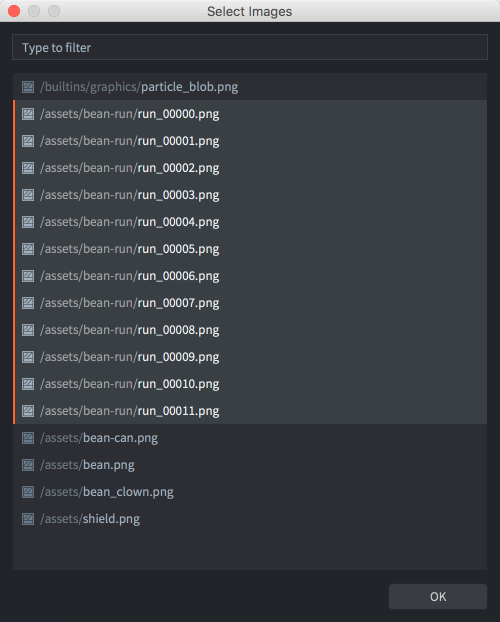
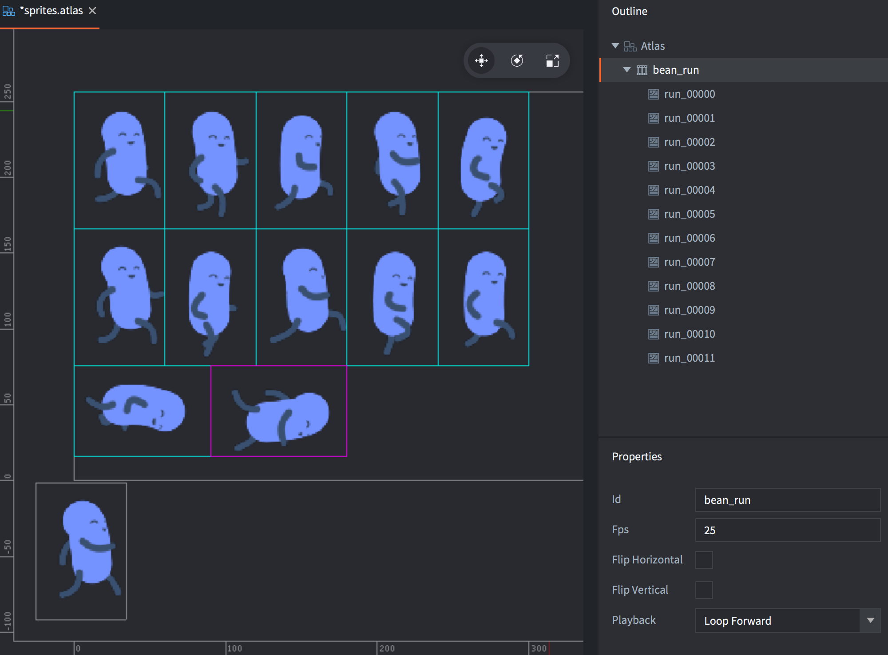
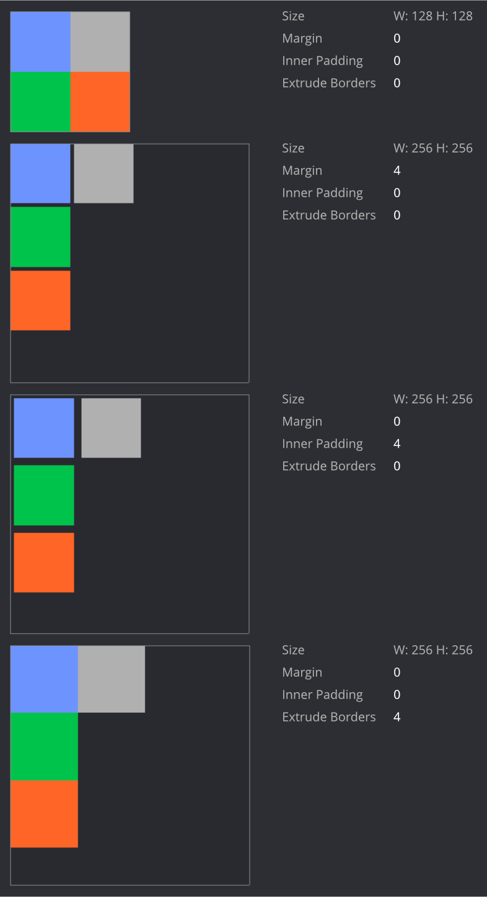

# Atlas

sprites 通常使用单个的小图片, 但是处于性能考虑, 最好把小图片合并成大图, 称为图集. 相比桌面设备和游戏机，手机这种性能不太高的地方，合并小图的做法就十分必要了.

在 Defold 中, 图集资源由一系列单个图片组成, 这些小图最终会自动合并成大图.

## 创建图集

在 *Assets* 浏览器右键菜单中选择 <kbd>New... ▸ Atlas</kbd>. 命名图集文件. 图集编辑器会自动打开.
*Properties* 面板会显示出图集的可编辑属性 (详见下文).

先要向图集里填入图片或者动画才能在 Sprites 和 ParticleFX 之类的可视组件里使用.

确保你需要的图片都存在项目里 (把图片文件拖放到 *Assets* 浏览器的适当位置).

加入单张图片
: 在 *Outline* 面板上 <kbd>右键点击</kbd> 图集根节点.
  
  从弹出菜单中选择 <kbd>Add Images</kbd> 来加入单张图片.

  此时会弹出选择图片的菜单. 注意此菜单支持文件名过滤和多选功能.

  {srcset="images/atlas/add@2x.png 2x"}

  被加入的图片会显示在 *Outline* 列表里，而且编辑器里也会显示出图片合成的图集. 可以按 <kbd>F键</kbd> (菜单栏 <kbd>View ▸ Frame Selection</kbd>) 来居中显示.

  {srcset="images/atlas/single_images@2x.png 2x"}

加入逐帧动画
: 在 *Outline* 面板上 <kbd>右键点击</kbd> 图集根节点.

  从弹出菜单中选择 <kbd>Add Animation Group</kbd> 来加入逐帧动画.

  一个默认命名为 ("New Animation") 的新建空动画组就被加入图集了.

  <kbd>右键点击</kbd> 动画组，选择 <kbd>Add Images</kbd> 加入来图片.

  同样会弹出选择图片菜单，选择的图片都会被加入到动画组.
  
  {srcset="images/atlas/add_animation@2x.png 2x"}

  选中动画组后按 <kbd>空格键</kbd> 即可预览动画. 动画 *Properties* 可以自由修改 (见下文).

  {srcset="images/atlas/animation_group@2x.png 2x"}

选中图片后按 <kbd>Alt + Up/down</kbd> 可以更改顺序. 也可以拷贝粘贴任意图片 (通过 <kbd>Edit</kbd> 菜单栏, 右键菜单或者快捷键).

## 图集属性

图集资源有一系列属性. 在 *Outline* 视图中选中图集后属性出现在 *Properties* 面板中.

Size
: 图集空间占用大小. 宽高取2的整数幂. 注意如果开启了纹理压缩, 某些格式需要纹理为正方形. 非正方形纹理将加入空白以建立正方形. 详情请见 [Texture profiles 教程](/manuals/texture-profiles/).

Margin
: 每两个图片之间的间隙.

Inner Padding
: 每个图片四周加入的空白.

Extrude Borders
: 每个图片四周的边缘挤出. 片元着色器采样图片边缘的时候, 相邻图片 (同个图集) 边缘可能会被采集到. 挤出边缘就可以解决这个问题.

这里用四个 64x64 正方形图片做图集不同属性设置的演示. 注意这里图集一旦超过 128x128 就会跳到 256x256, 从而造成了资源浪费.

{srcset="images/atlas/atlas_properties@2x.png 2x"}

## 动画属性

动画组除了组成动画的图片, 还提供了一些属性:

Id
: 动画名称.

Fps
: 动画播放速率, 以帧每秒 (FPS) 表示.

Flip horizontal
: 动画水平翻转.

Flip vertical
: 动画垂直翻转.

Playback
: 设置动画播放方式:

  - `None` 不播放，只显示第一张图片.
  - `Once Forward` 从第一张图片到最后一张图片播放一次.
  - `Once Backward` 从最后一张图片到第一张图片播放一次.
  - `Once Ping Pong` 从第一张图片播放到最后一张图片再反向播放一次.
  - `Loop Forward` 从第一张图片到最后一张图片循环播放.
  - `Loop Backward` 从最后一张图片到第一张图片循环播放.
  - `Loop Ping Pong` 从第一张图片播放到最后一张图片再反向循环播放.
