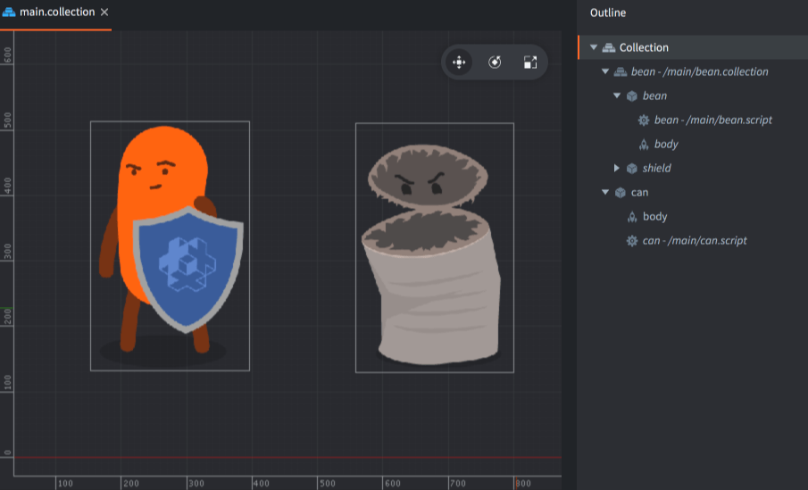
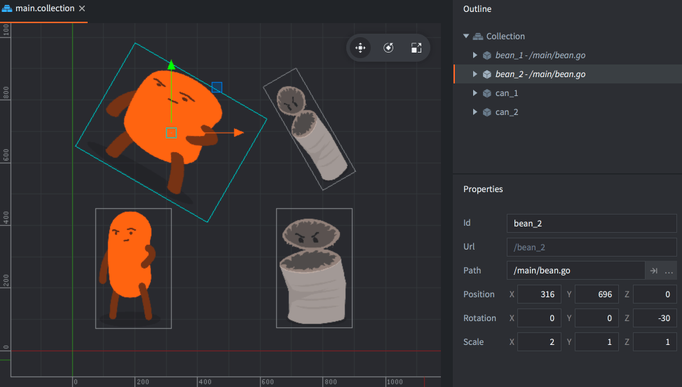
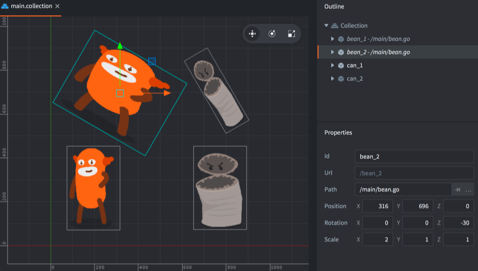

#  构成

理解 Defold 核心设计中的各种概念是很重要的. 本教程介绍了 Defold 游戏的各个组成部分. 看完本教程后, 可以去参考 [定位教程](/manuals/addressing) 和 [消息传递教程](/manuals/message-passing). 编辑器中提供了一些 [教程](/tutorials/getting-started) 也可以帮助学习理解.


Defold 游戏主要由三大部分组成:

Collection
: 集合文件构成了你的游戏. 集合可以包含具有嵌套关系的游戏对象与其他集合. 可以用来构建诸如关卡, 敌人队伍, 多个游戏对象嵌套组成的一个角色之类的各种内容.

Game object
: 游戏对象是一个带 id 的容器, 具有位置, 旋转和缩放. 用来容纳组件. 可以用来构建主角, 子弹, 游戏逻辑或者资源加载/卸载程序.

Component
: 组件被放置在游戏对象中用来产生游戏里可视, 可听, 可运行的东西. 可以用来构建 sprite, 脚本, 音效或者粒子特效.

## 集合

集合是包含嵌套游戏对象和其他集合的树形结构. 通常集合作为文件保存于项目中.

Defold 游戏引擎启动时, 首先导入一个 *game.project* 配置文件中指定的 _启动集合_. 启动集合一般叫做 "main.collection",  当然也可以根据喜好随意设置.

集合可以包含游戏对象和其他集合 (通过引用子集合文件), 它们可以随意嵌套. 下面是一个 "main.collection" 集合示例. 它包含了一个游戏对象 (id 叫做 "can") 和一个子集合 (id 叫做 "bean"). 这个子集合, 又包含了两个游戏对象: "bean" 和 "shield".



注意这个 id 叫做 "bean" 的子集合也是一个集合文件, 路径是 "/main/bean.collection", 这个文件被 "main.collection" 引用:


运行时无法用集合的 id 对 "main" 和 "bean" 这样的集合定位. 但是, 使用 _路径_ 引用游戏对象时可能会用到集合的 id (详情请见 [定位教程](/manuals/addressing)):

```lua
-- file: can.script
-- 定位 "bean" 集合的 "bean" 对象
local pos = go.get_position("bean/bean")
```

集合只能用文件引用的方式添加到其他集合中:

在 *Outline* 视图中 <kbd>右键点击</kbd> 选择 <kbd>Add Collection File</kbd>.

## 游戏对象

游戏对象在游戏运行时有自己的生命周期. 游戏对象有位置, 旋转和缩放. 这些属性可以在运行时进行控制也可用于属性动画.

```lua
-- 将 "can" 游戏对象的 X 坐标位置创建属性动画 
go.animate("can", "position.x", go.PLAYBACK_LOOP_PINGPONG, 100, go.EASING_LINEAR, 1.0)
```

游戏对象可以是空的 (比如作为位置标记) 但通常包含各种组件, 比如 sprite, 声音, 脚本, 模型, 工厂什么的. 游戏对象可以使用编辑器进行创建, 放入集合, 或者在运行时使用 _factory_ 组件动态生成.

游戏对象可以直接放入集合, 或者作为文件被集合引用:

在 *Outline* 视图中 <kbd>右键点击</kbd> 集合选择 <kbd>Add Game Object</kbd> (直接放入) 或者 <kbd>Add Game Object File</kbd> (作为文件引用).


## 组件

:[components](../shared/components.md)

可用组件列表详见 [组件概述](/manuals/components/).

## 直接放入还是作为文件引用

创建集合, 游戏对象或者组件 _文件_ 的时候, 实际上是创建了一个蓝图, 或者称为原型. 原型文件保存于项目中, 而不是游戏里. 要在游戏里使用这些原型的实例就需要在集合中把原型实例化.

在大纲视图中可以看到各个实例是基于哪个原型的. 下例中 "main.collection" 包含了3个基于文件的实例:

1. "bean" 子集合.
2. "bean" 子集合里 "bean" 对象的 "bean" 脚本组件.
3. "can" 游戏对象的 "can" 脚本组件.


如果你有许多游戏对象或者集合的实例, 这种基于文件的设计就很方便:



修改了原型文件, 那么它的所有实例都能一同被修改.


这里原型的 sprite 图片被更改, 同时所有使用该文件的实例都被更新:



## 游戏对象层级

在集合文件中, 可以将游戏对象设置成父子层级关系. 只需要 <kbd>拖拽</kbd> 游戏对象到父级对象 <kbd>放开鼠标</kbd> 即可完成父子层级的建立:


这种动态的父子关系影响了它们的变化方式. 不论是在编辑器还是运行时, 父级的各种变化 (包括位置, 旋转和缩放) 都会自动应用到它的所有子级上:


反过来说, 子级的变化都基于父级的坐标空间. 在编辑器中, 你可以使用 <kbd>Edit ▸ World Space</kbd> (默认设置) 或者 <kbd>Edit ▸ Local Space</kbd> 来设置一个对象变化基于的坐标空间.

运行时可以通过发送 `set_parent` 消息改变对象的父级.

```lua
local parent = go.get_id("bean")
msg.post("child_bean", "set_parent", { parent_id = parent })
```

::: important
一个常见的误解是对象层级改变了那么它的定位地址也会改变. 但是, 这其实是两码事. 父子关系改变的是场景的层级. 集合嵌套关系才决定对象地址. 在对象整个生命周期中, 地址是不会变化的.
:::
