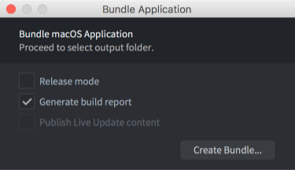

# 打包应用

开发项目时常常需要在目标平台上进行测试. 开发中越早发现性能问题越好解决. 同样鼓励在各平台间做测试以便发现诸如shader之类的兼容问题. 在做手机开发时可以使用 [手机开发应用](/manuals/dev-app/) 把内容推送到手机上, 避免反复的安装和卸载.

你可以在 Defold 编辑器中生成其支持的所有平台应用, 不需要外界工具辅助. 也可以在控制台使用命令行工具打包应用. 如果应用里包含 [原生扩展](/manuals/extensions) 的话打包时需要网络连接.

## 从编辑器中打包

使用 Project 菜单的 Bundle 选项进行打包:

选择不同的打包平台会出现不同的对话窗.

### 编译报告

有一个编译选项控制编译时是否生成报告. 从报告中可以方便检查游戏包中各个资源占用的空间. 在编译时打开 *Generate build report* 选项即可.

{srcset="images/profiling/build_report@2x.png 2x"}

关于编译报告详情请见 [调试教程](/manuals/profiling/#编译报告).

### Android

建立安卓应用 (.apk 文件) 详见 [安卓教程](/manuals/android/#安卓应用打包).

### iOS

建立苹果移动应用 (.ipa 文件) 详见 [iOS 教程](/manuals/ios/#iOS应用打包).

### macOS

建立Mac系统应用 (.app 文件) 详见 [macOS 教程](/manuals/macos).

### Linux

建立Linux应用无需特别设置.

### Windows

建立Windows应用 (.exe 文件) 详见 [Windows 教程](/manuals/windows).

### HTML5

建立HTML5应用及其参数设置详见 [HTML5 教程](/manuals/html5/#HTML5游戏打包).

#### Facebook Instant Games

可以为 Facebook Instant Games 打包成 HTML5 应用的一种特殊版本. 这一过程详见 [Facebook Instant Games 教程](/manuals/instant-games/).

## 命令行打包

编辑器使用命令行工具 [Bob](/manuals/bob/) 进行应用打包.

日常开发中一般使用 Defold 编辑器编译和打包应用. 如果需要自动生成机制, 比如发布新版本时批处理所有平台或者使用持续集成环境持续生成最新版本. 可以使用 [Bob 命令行工具](/manuals/bob/) 编译和打包.

## Bundle 结构

Bundle 的逻辑结构是这样的:

Bundle 会被输出到一个文件夹. 不同平台位置各异, 还有可能作为 zip 文件包含进 `.apk` 或者 `.ipa` 中.
Bundle 文件夹的内容每个平台也不一样.

除了可执行文件, 打包过程中也会收集相关平台所必须的资源 (比如安卓平台用的 .xml 资源文件).

通过 [bundle_resources](https://defold.com/manuals/project-settings/#bundle-resources) 项, 设置应打包进 bundle 里的资源.
可以针对不同平台分别设置.

游戏资源被保存在 `game.arcd` 文件中, 使用 LZ4 算法逐个压缩.
通过 [custom_resources](https://defold.com/manuals/project-settings/#custom-resources) 项, 设置应打包 (同时也被压缩) 进 game.arcd 里的资源.
这类资源可以使用 [sys.load_resource()](https://defold.com/ref/sys/#sys.load_resource) 函数来进行访问.

## Release 与 Debug

打包游戏时有个选项允许选择创建 debug 还是 release 应用. 这两种应用包类似但是要记得两者存在如下区别:

* Release 包不包含 [性能分析器](/manuals/profiling)
* Release 包不包含 [屏幕录制器](/ref/stable/sys/#start_record)
* Release 不输出调用 `print()` 产生的信息也不输出原生扩展产生的任何信息
* Release 包的 `sys.get_engine_info()` 中的 `is_debug` 被设置为 `false`
* Release 包调用 `tostring()` 时不会反查 `hash` 值. 也就是说对于一个类型为 `url` 或 `hash` 值的 `tostring()` 不会返回原值字符串而是返回一个数字表示的字符串 (`'hash: [/camera_001]'` 对比 `'hash: [11844936738040519888 (unknown)]'`)
* Release 包不支持编辑器中设置的用于 [热重载](/manuals/hot-reload) 和类似功能的 target

