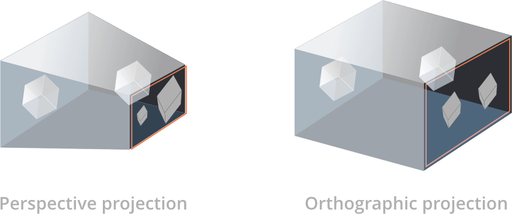

# 摄像机

Defold 的摄像机组件控制游戏世界的视口与映射. 摄像机组件定义了透视和平视的视口与映射矩阵用于渲染脚本进行渲染.

透视摄像机一般服务于 3D 游戏, 摄像机视口与物体透视基于视锥体, 摄像机到游戏物体的距离和视角.

平视摄像机一般服务于 2D 游戏. 摄像机视口不是基于视锥体, 而是基于视立方体. 平视摄像机中的物体不因距离远近而缩放. 1000米远的物体和摄像机面前的物体是等大的.



## 创建摄像机

要创建摄像机, 在游戏对象上 <kbd>右键点击</kbd> 选择 <kbd>Add Component ▸ Camera</kbd>. 或者先创建组件文件再链接到游戏对象上.


摄像机有以下属性用以建立 *视锥* (透视摄像机可用):


Id
: 组件id

Aspect Ratio
: (**透视摄像机可用**) - 视锥宽高比. 1.0 代表正方形视口.  4:3 显示器 1024x768 这样的分辨率用 1.33. 16:9 的显示器用 1.78. 如果设置了 *Auto Aspect Ratio* 则此属性无效.

Fov
: (**透视摄像机可用**) - 以 _弧度_ 表示的摄像机 *垂直* 视域. 视域越宽, 摄像机看到的内容越多. 注意目前默认值 (45) 有点误导. 要 45 度的视域, 要设置值为 0.785 (`π / 4`).

Near Z
: (**透视摄像机可用**) - 近端裁剪平面z值.

Far Z
: (**透视摄像机可用**) - 远端裁剪平面z值.

Auto Aspect Ratio
: (**透视摄像机可用**) - 自动设置宽高比.

Orthographic Projection
: 切换摄像机为平视摄像机 (见下文).

Orthographic Zoom
: (**基于平视摄像机**) - 正交透视倍数 (> 1 = 放大, < 1 = 缩小).


## 使用摄像机

通过发送 `acquire_camera_focus` 消息, 激活摄像机并填充视口同时向渲染脚本提供映射矩阵:

```lua
msg.post("#camera", "acquire_camera_focus")
```

被激活的摄像机, 会在每一帧向 "@render" 接口发送 `set_view_projection` 消息, 也就是说渲染脚本会接收此消息:

```lua
-- builtins/render/default.render_script
--
function on_message(self, message_id, message)
    if message_id == hash("set_view_projection") then
        self.view = message.view                    -- [1]
        self.projection = message.projection
    end
end
```
1. 这个消息中包含一个视口矩阵和一个映射矩阵.

摄像机组件支持基于摄像机属性 *Orthographic Projection* 的, 使用透视或者平视透视矩阵的渲染脚本.

::: 注意
出于向后兼容性的原因，默认渲染脚本会忽略相机提供的透视，并始终使用平视透视. 关于渲染脚本, 视口和透视矩阵更多详情参见 [渲染教程](/manuals/render/#default-view-projection).
:::

可以用以下代码告诉渲染脚本使用摄像机提供的透视:

```lua
msg.post("@render:", "use_camera_projection")
```


### 摄像机平移

平移摄像机所在游戏对象就相当于平移摄像机. 摄像机会根据当前x和y坐标更新视口矩阵.

### 摄像机缩放

延 z 轴移动透视摄像机所在游戏对象就相当于缩放摄像机. 摄像机会根据当前z坐标更新视口矩阵.

可以通过设置平视摄像机的 *Orthographic Zoom* 属性来进行缩放:

```lua
go.set("#camera", "orthographic_zoom", 2)
```

### 摄像机跟随

把摄像机对象放在要跟随的游戏对象子级就能实现摄像机跟随:


或者自己写脚本每帧更新摄像机位置也可以.

### 鼠标位置转换为世界坐标

摄像机平移缩放后 `on_input()` 函数提供的鼠标位置就不再与世界坐标匹配了. 此时需要进行手动矫正. 默认渲染脚本里把鼠标/屏幕坐标转换为世界坐标的代码如下:

::: 注意
[本教程第三方摄像机解决方案部分](/manuals/camera/#第三方摄像机解决方案) 提供了坐标转换方法.
:::

```Lua
-- builtins/render/default.render_script
--
local function screen_to_world(x, y, z)
	local inv = vmath.inv(self.projection * self.view)
	x = (2 * x / render.get_width()) - 1
	y = (2 * y / render.get_height()) - 1
	z = (2 * z) - 1
	local x1 = x * inv.m00 + y * inv.m01 + z * inv.m02 + inv.m03
	local y1 = x * inv.m10 + y * inv.m11 + z * inv.m12 + inv.m13
	local z1 = x * inv.m20 + y * inv.m21 + z * inv.m22 + inv.m23
	return x1, y1, z1
end
```


## 运行时控制
可以通过一些消息和属性控制运行时的摄像机 (用法参考 [API 文档](/ref/camera/)).

摄像机的一些属性可以通过 `go.get()` 和 `go.set()` 控制:

`fov`
: 摄像机视野 (`number`).

`near_z`
: 摄像机近端Z值 (`number`).

`far_z`
: 摄像机远端Z值 (`number`).

`orthographic_zoom`
: 平视摄像机缩放 (`number`).


## 第三方摄像机解决方案

有一些第三方库实现了诸如游戏对象跟随, 屏幕抖动, 屏幕与世界坐标转换等摄像机功能. 可以在 Defold 社区资源库找到:

- [Rendercam](https://defold.com/assets/rendercam/) (2D 和 3D) 由 Ross Grams 开发.
- [Ortographic camera](https://defold.com/assets/orthographic/) (仅 2D) 由 Björn Ritzl 开发.
