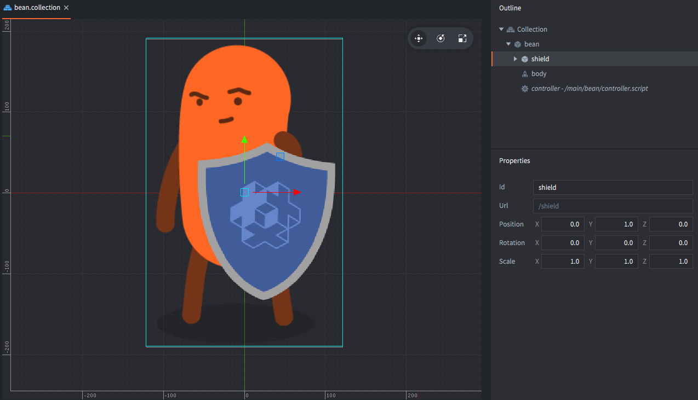
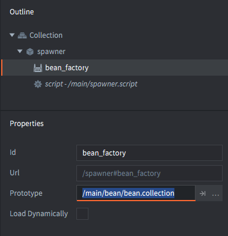

# 集合工厂

集合工厂组件用于在游戏运行时创建一组保存于集合之中的嵌套的游戏对象.

Defold 提供了集合或者称为 "prefabs" 的可重用模板机制 . 关于集合概述, 请见 [Defold 组成](/manuals/building-blocks#collections). 使用集合可以在编辑器, 或者在运行时动态插入游戏内容.

使用集合工厂可以依照一个集合文件向游戏世界插入内容. 这与游戏对象工厂的做法类似只不过集合工厂能创建一组含有父子嵌套层级关系的游戏对象. 典型用法比如动态生成一组敌人 (敌人对象和其武器对象的组合).

## 创建集合

假设有一个角色对象, 在它的子集有个盾牌对象. 我们就可以把这种含嵌套层级关系的组合保存为一个集合文件 "bean.collection".

::: 注意
*集合代理* 组件用于创建基于集合的游戏世界, 里面可以包含独立的物理世界. 通过新建一个接口, 集合中的所有内容通过集合代理加载. 这样可以实现诸如切换关卡之类的功能. 游戏世界通常包含很多东西, 如果加载少量内容, 不要使用集合代理. 详情请见 [集合代理教程](/manuals/collection-proxy).
:::



把 *集合工厂* 加入游戏对象然后设置其 *原型* 为 "bean.collection":



这样只需调用 `collectionfactory.create()` 函数即可创建角色加盾牌的组合了:

```lua
local bean_ids = collectionfactory.create("#bean_factory")
```

此函数有5个参数:

`url`
: 要使用的集合工厂组件的id.

`[position]`
: (可选) 新建游戏对象组合的世界坐标位置. 以 `vector3` 表示. 如果不指定位置, 默认位置是集合工厂所在游戏对象的位置.

`[rotation]`
: (可选) 新创建游戏对象组合的世界坐标旋转. 以 `quat` 表示.

`[properties]`
: (可选) 新创建游戏对象组合的 `id`-`table` 属性初始化 Lua 表. 关于此表结果见下文.

`[scale]`
: (可选) 新创建游戏对象组合的等比缩放. 以 `number` (大于 0) 表示. 或者以 `vector3` 表示每个坐标轴上的非等比缩放.

`collectionfactory.create()` 返回一个包含每个新建对象id的表. 表的内容是集合内每个对象id对应运行时每个对象id:

::: 注意
"bean" 与 "shield" 的父子层级关系 *不会* 在表里反应出来. 只能从运行时画面看出这种层级关系, 即做变化时两个对象同时变化. 改变层级关系与游戏对象id无关.
:::

```lua
local bean_ids = collectionfactory.create("#bean_factory")
go.set_scale(0.5, bean_ids[hash("/bean")])
pprint(bean_ids)
-- DEBUG:SCRIPT:
-- {
--   hash: [/shield] = hash: [/collection0/shield], -- <1>
--   hash: [/bean] = hash: [/collection0/bean],
-- }
```
1. 前缀 `/collection[N]/` 中, `[N]` 是计数器, 以确保每个id的唯一性:

## 属性

创建集合的对象时, 可以把属性表作为参数传给集合工厂. 表里的键是对象id, 值是这个对象需要设置的属性表.

```lua
local props = {}
props[hash("/bean")] = { shield = false }
local ids = collectionfactory.create("#bean_factory", nil, nil, props)
```

假设 "bean.collection" 里的 "bean" 对象有一个叫 "shield" 的脚本属性. 关于脚本属性详情请见 [脚本属性教程](/manuals/script-properties).

```lua
-- bean/controller.script
go.property("shield", true)

function init(self)
    if not self.shield then
        go.delete("shield")
    end     
end
```

## 工厂资源的动态加载

开启工厂属性的 *Load Dynamically*, 工厂资源将会被延迟加载.


关闭动态加载, 则加载集合工厂组件时会同时加载其需要的资源以便工厂可以尽快创建新游戏对象.

开启动态加载, 有两种用法:

同步加载
: 调用 [`collectionfactory.create()`](/ref/collectionfactory/#collectionfactory.create:url-[position]-[rotation]-[properties]-[scale]) 函数创建新对象时. 资源会同步加载, 这意味着游戏可能会卡一下, 加载完成后再创建新对象.

  ```lua
  function init(self)
      -- 集合工厂父级集合加载时
      -- 集合工厂资源不会被加载. 调用 create 函数
      -- 会把资源进行同步加载.
      self.go_ids = collecionfactory.create("#collectionfactory")
  end

  function final(self)  
      -- 删掉游戏对象, 资源引用计数减少
      -- 本例中集合工厂资源也会被卸载
      -- 因为集合工厂组件不包含对资源的引用.
      go.delete(self.go_ids)

      -- 因为集合工厂组件不包含对资源的引用
      -- 所以对集合工厂调用 unload 没有意义
      collectionfactory.unload("#factory")
  end
  ```

异步加载
: 调用 [`collectionfactory.load()`](/ref/collectionfactory/#collectionfactory.load:[url]-[complete_function]) 函数进行资源的异步加载. 资源加载完毕后, 回调用回调函数.

  ```lua
  function load_complete(self, url, result)
      -- 资源加载完成, 可以新建对象
      self.go_ids = collectionfactory.create(url)
  end

  function init(self)
      -- 集合工厂父级集合加载时
      -- 集合工厂资源不被加载. 调用 load 函数进行资源异步加载.
      collectionfactory.load("#factory", load_complete)
  end

  function final(self)
      -- 删掉游戏对象, 资源引用计数减少
      -- 本例中集合工厂资源不会被卸载
      -- 因为集合工厂组件包含对资源的引用.
      go.delete(self.go_ids)

      -- 调用 unload 函数, 集合工厂对资源引用被释放,
      -- 这样资源才会被卸载.
      collectionfactory.unload("#factory")
  end
  ```
