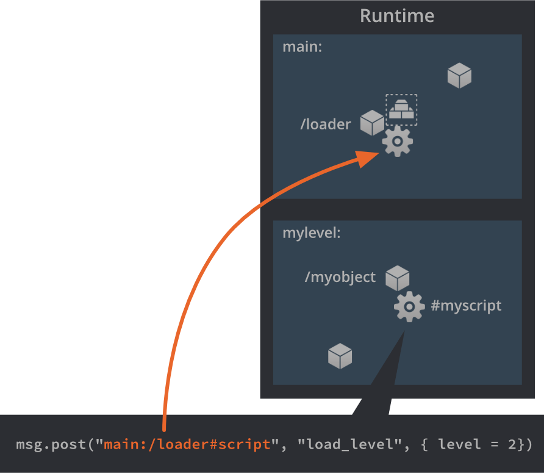

# 集合代理

集合代理组件用于基于集合文件内容动态加载卸载新的游戏 "世界". 可以用来实现切换关卡, GUI 屏幕, 在关卡里加载卸载插播 "场景", 加载卸载迷你游戏等等功能.

Defold 把所有游戏对象组织在集合里. 集合可以包含游戏对象和其他集合 (即子集合). 集合代理可以让你把内容拆分到各个集合然后用脚本动态加载卸载这些集合.

集合代理不像 [集合工厂组件](/manuals/collection-factory/). 集合工厂用于在当前游戏世界创建集合. 集合代理用于运行时创建全新游戏世界, 它们用处不同.

## 创建集合代理组件

1. 把一个集合代理组件加入到游戏对象上 <kbd>右键点击</kbd> 并从上下文菜单中选择 <kbd>Add Component ▸ Collection Proxy</kbd>.

2. 设置 *Collection* 属性来引用一个集合, 就是你希望动态加载进运行环境的集合. 这些引用是静态的, 所以确保把游戏所需的各个部分都通过集合引用到.

{srcset="images/collection-proxy/create_proxy@2x.png 2x"}

(也可以编译时排除一部分内容需要的时候用代码下载而不使用 *Exclude* 选项和 [热更新功能](/manuals/live-update/).)

## 启动集合

当 Defold 引擎开始工作最先把 *启动集合* 导入运行环境并对其中的所有游戏对象进行初始化. 然后开启游戏对象和它们的组件. 在 [项目配置](/manuals/project-settings) 里设置把哪个集合作为启动集合使用. 依照惯例启动集合都叫做 "main.collection".

{srcset="images/collection-proxy/bootstrap@2x.png 2x"}

To fit the game objects and their components the engine allocates the memory needed for the whole "game world" into which the contents of the bootstrap collection are instanciated. A separate physics world is also created for any collision objects and physics simulation.

Since script components need to be able to address all objects in the game, even from outside the bootstrap world, it is given a unique name: the *Name* property that you set in the collection file:

{srcset="images/collection-proxy/collection_id@2x.png 2x"}

If the collection that is loaded contains collection proxy components, the collections that those refer to are *not* loaded automatically. You need to control the loading of these resources through scripts.

## Loading a collection

Dynamically loading a collection via proxy is done by sending a message called `"load"` to the proxy component from a script:

```lua
-- Tell the proxy "myproxy" to start loading.
msg.post("#myproxy", "load")
```

{srcset="images/collection-proxy/proxy_load@2x.png 2x"}

The proxy component will instruct the engine to allocate space for a new world. A separate runtime physics world is also created and all the game objects in the collection "mylevel.collection" are instantiated.

The new world gets its name from the *Name* property in the collection file, in this example it is set to "mylevel". The name has to be unique. If the *Name* set in the collection file is already used for a loaded world, the engine will signal a name collision error:

```txt
ERROR:GAMEOBJECT: The collection 'default' could not be created since there is already a socket with the same name.
WARNING:RESOURCE: Unable to create resource: build/default/mylevel.collectionc
ERROR:GAMESYS: The collection /mylevel.collectionc could not be loaded.
```

When the engine has finished loading the collection, the collection proxy component will send a message named `"proxy_loaded"` back to the script that sent the `"load"` message. The script can then initialize and enable the collection as a reaction to the message:

```lua
function on_message(self, message_id, message, sender)
    if message_id == hash("proxy_loaded") then
        -- New world is loaded. Init and enable it.
        msg.post(sender, "init")
        msg.post(sender, "enable")
        ...
    end
end
```

`"load"`
: This message tells the collection proxy component to start loading its collection into a new world. The proxy will send back a message called `"proxy_loaded"` when it's done.

`"async_load"`
: This message tells the collection proxy component to start background loading its collection into a new world. The proxy will send back a message called `"proxy_loaded"` when it's done.

`"init"`
: This message tells the collection proxy component that all the game objects and components that has been instantiated should be initialized. All script `init()` functions are called at this stage.

`"enable"`
: This message tells the collection proxy component that all the game objects and components should be enabled. All sprite components begin to draw when enabled, for instance.

## Addressing into the new world

The *Name* set in the collection file properties is used to address game objects and components in the loaded world. If you, for instance, create a loader object in the bootstrap collection you may need to communicate with it from any loaded collection:

```lua
-- tell the loader to load the next level:
msg.post("main:/loader#script", "load_level", { level_id = 2 })
```

{srcset="images/collection-proxy/message_passing@2x.png 2x"}

## Unloading a world

To unload a loaded collection, you send messages corresponding to the converse steps of the loading:

```lua
-- unload the level
msg.post("#myproxy", "disable")
msg.post("#myproxy", "final")
msg.post("#myproxy", "unload")
```

`"disable"`
: This message tells the collection proxy component to disable all the game object and components in the world. Sprites stop being rendered at this stage.

`"final"`
: This message tells the collection proxy component to finalize all the game object and components in the world. All scripts' `final()` functions are called at this stage.

`"unload"`
: This message tells the collection proxy to remove the world completely from memory.

If you don’t need the finer grained control, you can send the `"unload"` message directly without first disabling and finalizing the collection. The proxy will then automatically disable and finalize the collection before it’s unloaded.

When the collection proxy has finished unloading the collection it will send a `"proxy_unloaded"` message back to the script that sent the `"unload"` message:

```lua
function on_message(self, message_id, message, sender)
    if message_id == hash("proxy_unloaded") then
        -- Ok, the world is unloaded...
        ...
    end
end
```


## Time step

Collection proxy updates can be scaled by altering the _time step_. This means that even though the game ticks at a steady 60 FPS, a proxy can update at a higher or lower pace, affecting physics and the `dt` variable passed to `update()`. You can also set the update mode, which allows you to control if the scaling should be performed discretely (which only makes sense with a scale factor below 1.0) or continuously.

You control the scale factor and the scaling mode by sending the proxy a `set_time_step` message:

```lua
-- update loaded world at one-fifth-speed.
msg.post("#myproxy", "set_time_step", {factor = 0.2, mode = 1}
```

To see what's happening when changing the time step, we can create an object with the following code in a script component and put it in the collection we're altering the timestep of:

```lua
function update(self, dt)
    print("update() with timestep (dt) " .. dt)
end
```

With a time step of 0.2, we get the following result in the console:

```txt
INFO:DLIB: SSDP started (ssdp://192.168.0.102:54967, http://0.0.0.0:62162)
INFO:ENGINE: Defold Engine 1.2.37 (6b3ae27)
INFO:ENGINE: Loading data from: build/default
DEBUG:SCRIPT: update() with timestep (dt) 0
DEBUG:SCRIPT: update() with timestep (dt) 0
DEBUG:SCRIPT: update() with timestep (dt) 0
DEBUG:SCRIPT: update() with timestep (dt) 0
DEBUG:SCRIPT: update() with timestep (dt) 0.016666667535901
DEBUG:SCRIPT: update() with timestep (dt) 0
DEBUG:SCRIPT: update() with timestep (dt) 0
DEBUG:SCRIPT: update() with timestep (dt) 0
DEBUG:SCRIPT: update() with timestep (dt) 0
DEBUG:SCRIPT: update() with timestep (dt) 0.016666667535901
```

`update()` is still called 60 times a second, but the value of `dt` changes. We see that only 1/5 (0.2) of the calls to `update()` will have a `dt` of 1/60 (corresponding to 60 FPS)---the rest is zero. All physics simulations will also be updated according to that dt and advance only in one fifth of the frames.

See [`set_time_step`](/ref/collectionproxy#set_time_step) for more details.

## Caveats and common issues

Physics
: Through collection proxies it is possible to load more than one top level collection, or *game world* into the engine. When doing so it is important to know that each top level collection is a separate physical world. Physics interactions (collisions, triggers, ray-casts) only happen between objects belonging to the same world. So even if the collision objects from two worlds visually sits right on top of each other, there cannot be any physics interaction between them.

Memory
: Each loaded collection creates a new game world which comes with a relatively large memory footprint. If you load dozens of collections simultaneously through proxies, you might want to reconsider your design. To spawn many instances of game object hierarchies, [collection factories](/manuals/collection-factory) are more suitable.

Input
: If you have objects in your loaded collection that require input actions, you need to make sure that the game object that contains the collection proxy acquires input. When the game object receives input messages these are propagated to the components of that object, i.e. the collection proxies. The input actions are sent via the proxy into the loaded collection.
