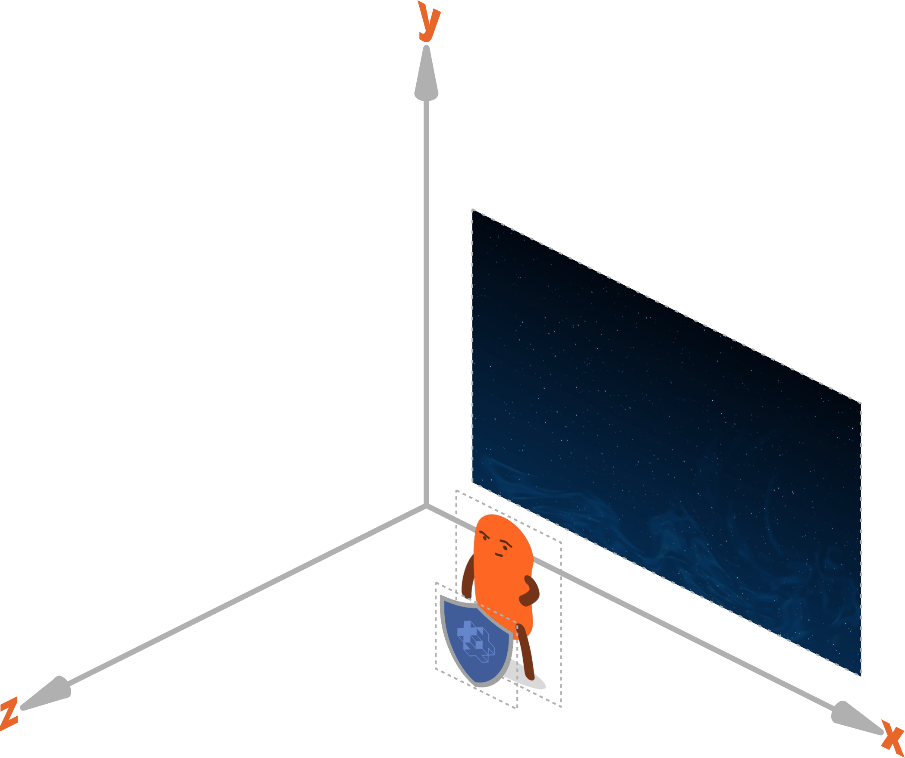

# 组件

:[组件](../shared/components.md)

## 组件类型

Defold 提供以下组件类型:

* [Collection factory](/manuals/collection-factory) - 创建集合实例
* [Collection proxy](/manuals/collection-proxy) - 加载卸载集合
* [Collision object](/manuals/physics) - 2D 和 3D 物理
* [Camera](/manuals/camera) - 修改游戏世界的视口和映射
* [Factory](/manuals/factory) - 创建游戏对象实例
* [GUI](/manuals/gui) - 渲染图形用户界面
* [Label](/manuals/label) - 渲染文本
* [Mesh](/manuals/mesh) - 显示3D网格 (同时具有实时创建和维护功能)
* [Model](/manuals/model) 显示3D模型 (可以带动画)
* [Particle FX](/manuals/particlefx) -  创建粒子
* [Script](/manuals/script) - 添加游戏逻辑
* [Sound](/manuals/sound) - 播放音效音乐
* [Sprite](/manuals/sprite) - 显示2D图像 (可以带逐帧动画)
* [Tilemap](/manuals/tilemap) - 显示一组瓷砖图

其他组件可以通过载入扩展插件的方式导入项目:

* [Rive model](/extension-rive) - 渲染 Rive 动画
* [Spine model](/extension-spine) - 渲染 Spine 动画


## 开启关闭组件

游戏对象在创建时其组件是开启的. 如果需要关闭组件可以给组件发送 [`disable`](/ref/go/#disable) 消息:

```lua
-- 把此脚本所在的游戏对象上 id 为 'weapon' 的组件关闭
msg.post("#weapon", "disable")

-- 关闭 'enemy' 游戏对象上 id 为 'shield' 的所有组件
msg.post("enemy#shield", "disable")

-- 关闭当前游戏对象上的所有组件
msg.post(".", "disable")

-- 关闭 'enemy' 游戏对象上的所有组件
msg.post("enemy", "disable")
```

需要开启组件可以给组件发送 [`enable`](/ref/go/#enable) 消息:

```lua
-- 开启 id 为 'weapon' 的组件
msg.post("#weapon", "enable")
```

## 组件属性

Defold 组件属性各不相同.在 [Outline 面板](/manuals/editor/#Outline 面板) 中当前选中的组件属性会显示在编辑器的 [Properties 面板](/manuals/editor/#Properties 面板) 中. 可用组件的详细属性详情请见API教程.

## 位置, 旋转和缩放

可视组件通常含有位置, 旋转以及缩放属性. 这些属性可以在编辑器里修改但是绝大多数情况下不能在运行时修改 (sprite 和 label 的缩放属性是例外情况).

如果需要在运行时修改组件的而不是组件所在游戏对象的位置, 旋转和缩放. 有个副作用就是游戏对象所有组件都会受影响. 如果你想维护游戏对象上的一个组件而不是多个, 建议将该组件移入另一个游戏对象并作为原来那个游戏对象的子对象.

## 组件渲染顺序

可视组件的渲染顺序取决于两个方面:

### 渲染脚本的渲染优先级
每个组件都有 [材质](/manuals/material/) 而且每个材质都有一个或多个标签. 渲染脚本依次定义一系列优先级, 每个优先级匹配一个或多个材质标签. 渲染脚本在 *update()* 函数里 [按优先级依次渲染](/manuals/render/#渲染优先级) , 匹配优先级标签的组件会被显示出来. 默认渲染脚本先绘制 sprites 和 tilemaps, 再渲染粒子特效, 二者都使用世界坐标系. 最后渲染脚本会在屏幕坐标系中渲染 GUI 组件.

### 组件z值
所有游戏对象都使用一个 vector3 作为其在 3D 空间中的位置. 如果是 2D 游戏, 则 X 和 Y 表示其在 "横向" 和 "纵向" 轴上的位置, 而 Z 值表示其在 "深度" 轴上的位置. 使用Z值可以操控游戏对象之间的层叠关系: Z 值是 1 的总是显示在 Z 值是 0 的对象上面. 默认情况下, Defold 使用 Z 值范围是 -1 到 1:



匹配某个优先级的组件在一起渲染, 它们之间的渲染顺序取决于组件的 z 值. 组件的最终z值是由组件的z值, 游戏对象和其父级游戏对象的z值之和.

::: sidenote
各个 GUI 组件的渲染顺序 **不是** 由 GUI 组件的z值决定的. GUI 组件的渲染顺序由 [gui.set_render_order()](/ref/gui/#gui.set_render_order:order) 函数控制.
:::

例如: 两个游戏对象 A 和 B. B 是 A 的子集. B 有一个sprite组件.

| 元素      | z值     |
|----------|---------|
| A        | 2       |
| B        | 1       |
| B#sprite | 0.5     |


在上述定义中 B 的sprite组件最终z值是 2 + 1 + 0.5 = 3.5.

::: sidenote
如果两个组件 z 值相同则可能造成两个组件来回穿梭闪烁或者不同平台顺序不同的结果.

渲染脚本为 z 值定义了极近端和极远端平面. z值在此范围之外的组件不会被渲染. 默认范围是 -1 到 1 但是 [可以任意修改](/manuals/render/#默认视口映射).
Z 值得极近与极远坐标范围是 -1 到 1 的话, 需要很高的数值精度. 在处理 3D 资源时, 可能需要在你的自定义渲染脚本中修改极近和极远的坐标范围. 详情请见 [渲染教程](/manuals/render/).
:::

:[组件最大数配置](../shared/component-max-count-optimizations.md)