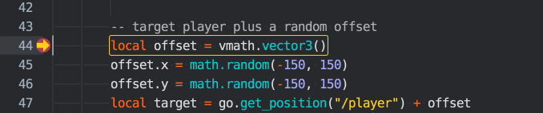
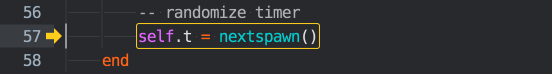
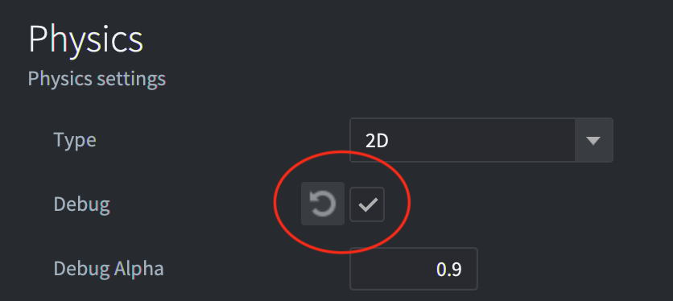

# 调试游戏逻辑

Defold 包含一个带有检查功能的集成 Lua 调试器。与内置的[分析工具](/manuals/profiling)一起，它是一个强大的工具，可以帮助您找到游戏逻辑中错误的原因或帮助分析性能问题。

## 打印和可视化调试

在 Defold 中调试游戏的最简单方法是使用[打印调试](http://en.wikipedia.org/wiki/Debugging#Techniques)。使用 `print()` 或 [`pprint()`](/ref/builtins#pprint) 语句来观察变量或指示执行流程。如果一个没有脚本的游戏对象表现异常，您可以只附加一个脚本，其唯一目的是调试。使用任何打印函数都会在编辑器的*控制台*视图和[游戏日志](/manuals/debugging-game-and-system-logs)中打印。

除了打印之外，引擎还可以在屏幕上绘制调试文本和直线。这是通过向 `@render` 套接字发布消息来完成的：

```lua
-- 在屏幕上用调试文本绘制 "my_val" 的值
msg.post("@render:", "draw_text", { text = "My value: " .. my_val, position = vmath.vector3(200, 200, 0) })

-- 在屏幕上绘制彩色文本
local color_green = vmath.vector4(0, 1, 0, 1)
msg.post("@render:", "draw_debug_text", { text = "Custom color", position = vmath.vector3(200, 180, 0), color = color_green })

-- 在屏幕上绘制玩家和敌人之间的调试线
local start_p = go.get_position("player")
local end_p = go.get_position("enemy")
local color_red = vmath.vector4(1, 0, 0, 1)
msg.post("@render:", "draw_line", { start_point = start_p, end_point = end_p, color = color_red })
```

可视化调试消息向渲染管线添加数据，并作为常规渲染管线的一部分进行绘制。

* `"draw_line"` 添加使用渲染脚本中的 `render.draw_debug3d()` 函数渲染的数据。
* `"draw_text"` 使用 `/builtins/fonts/debug/always_on_top.font` 字体渲染，该字体使用 `/builtins/fonts/debug/always_on_top_font.material` 材质。
* `"draw_debug_text"` 与 `"draw_text"` 相同，但它以自定义颜色渲染。

请注意，您可能希望每帧更新此数据，因此在 `update()` 函数中发布这些消息是个好主意。

## 运行调试器

要运行调试器，选择 <kbd>Debug ▸ Start/Attach</kbd>，这将以附加的调试器启动游戏或将调试器附加到已经运行的游戏上。


一旦调试器附加，您就可以通过控制台中的调试器控制按钮或通过 <kbd>Debug</kbd> 菜单控制游戏的执行：

Break
: {width=60px .left}
  立即中断游戏执行。游戏将在其当前点中断。您现在可以检查游戏状态，逐步推进游戏，或继续运行直到下一个断点。当前执行点在代码编辑器中标记：

  

Continue
: {width=60px .left}
  继续运行游戏。游戏代码将继续运行，直到您按下暂停或执行遇到您设置的断点。如果执行在设置的断点处中断，则执行点在代码编辑器中断点标记上方标记：

  

Stop
: {width=60px .left}
  停止调试器。按下此按钮将立即停止调试器，将其从游戏中断开并终止正在运行的游戏。

Step Over
: {width=60px .left}
  将程序执行推进一个步骤。如果执行涉及运行另一个 Lua 函数，执行_不会进入该函数_，而是继续运行并停止在函数调用下方的下一行。在此示例中，如果用户按下"step over"，调试器将执行代码并停止在调用 `nextspawn()` 函数的行下方的 `end` 语句处：

  

::: sidenote
一行 Lua 代码并不对应单个表达式。在调试器中步进是一次推进一个表达式，这意味着目前您可能需要多次按下步进按钮才能推进到下一行。
:::

Step Into
: {width=60px .left}
  将程序执行推进一个步骤。如果执行涉及运行另一个 Lua 函数，执行_将进入该函数_。调用该函数会在调用堆栈中添加一个条目。您可以单击调用堆栈列表中的每个条目来查看该闭包中的入口点和所有变量的内容。在这里，用户已经进入了 `nextspawn()` 函数：

  

Step Out
: {width=60px .left}
  继续执行直到从当前函数返回。如果您已经将执行步入一个函数，按下"step out"按钮将继续执行直到函数返回。

设置和清除断点
: 您可以在 Lua 代码中设置任意数量的断点。当游戏在附加了调试器的情况下运行时，它将在遇到的下一个断点处停止执行，并等待您的进一步交互。

  

  要设置或清除断点，请在代码编辑器中行号右侧的列中单击。您也可以从菜单中选择 <kbd>Edit ▸ Toggle Breakpoint</kbd>。

设置条件断点
: 您可以将断点配置为包含需要评估为 true 才能触发断点的条件。该条件可以访问代码执行期间在该行可用的局部变量。

  

  要编辑断点条件，请在代码编辑器中行号右侧的列中右键单击，或从菜单中选择 <kbd>Edit ▸ Edit Breakpoint</kbd>。

评估 Lua 表达式
: 在调试器附加且游戏在断点处停止的情况下，可以使用带有当前上下文的 Lua 运行时。在控制台底部键入 Lua 表达式并按 <kbd>Enter</kbd> 来评估它们：

  

  目前无法通过评估器修改变量。

分离调试器
: 选择 <kbd>Debug ▸ Detach Debugger</kbd> 将调试器从游戏中分离。它将立即继续运行。

## Lua 调试库

Lua 附带一个在某些情况下有用的调试库，特别是如果您需要检查 Lua 环境的内部。您可以在 [Lua 手册中关于调试库的章节](http://www.lua.org/pil/contents.html#23) 中找到更多相关信息。

## 调试检查清单

如果您遇到错误或您的游戏行为不符合预期，这里有一个调试检查清单：

1. 检查控制台输出并验证没有运行时错误。

2. 向代码中添加 `print` 语句以验证代码确实在运行。

3. 如果代码没有运行，请检查您是否已在编辑器中完成了代码运行所需的正确设置。脚本是否添加到正确的游戏对象？您的脚本是否获取了输入焦点？输入触发器是否正确？着色器代码是否添加到材质？等等。

4. 如果您的代码依赖于变量的值（例如在 if 语句中），要么在使用或检查这些变量的位置 `print` 这些值，要么使用调试器检查它们。

有时查找错误可能是一个困难和耗时的过程，需要您逐位检查代码，检查所有内容并缩小有问题的代码范围并消除错误源。这最好通过称为"分而治之"的方法来完成：

1. 确定哪一半（或更少）的代码必须包含错误。
2. 再次确定那一半中的哪一半必须包含错误。
3. 继续缩小必须导致错误的代码范围，直到找到它为止。

祝您调试愉快！

## 调试物理问题

如果您在物理方面遇到问题，碰撞没有按预期工作，建议启用物理调试。在 *game.project* 文件的 *Physics* 部分中勾选 *Debug* 复选框：



当此复选框启用时，Defold 将绘制所有碰撞形状和碰撞接触点：


