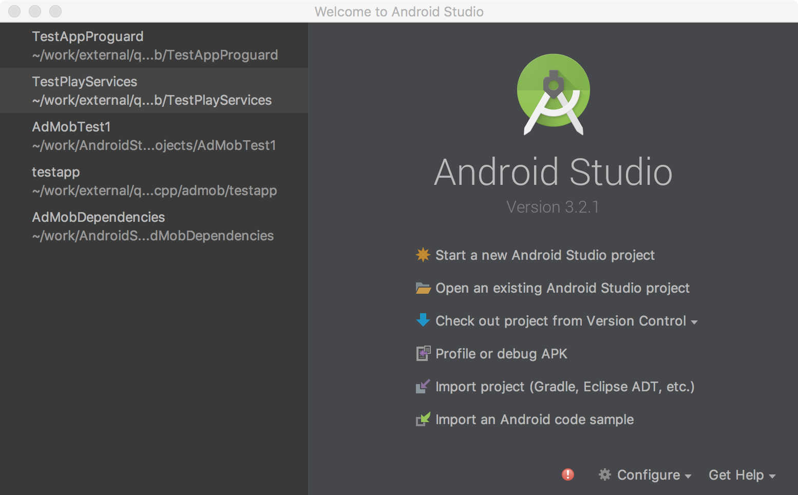
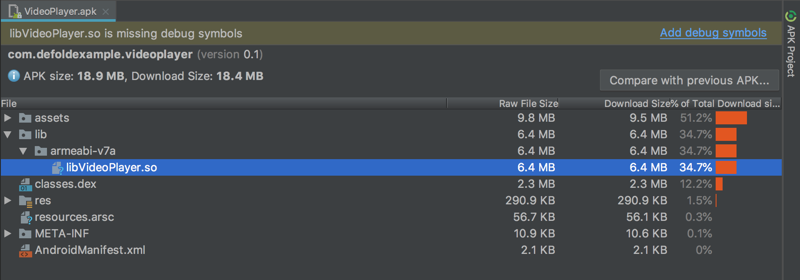
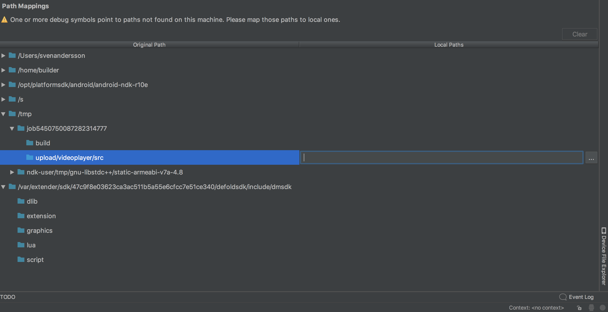
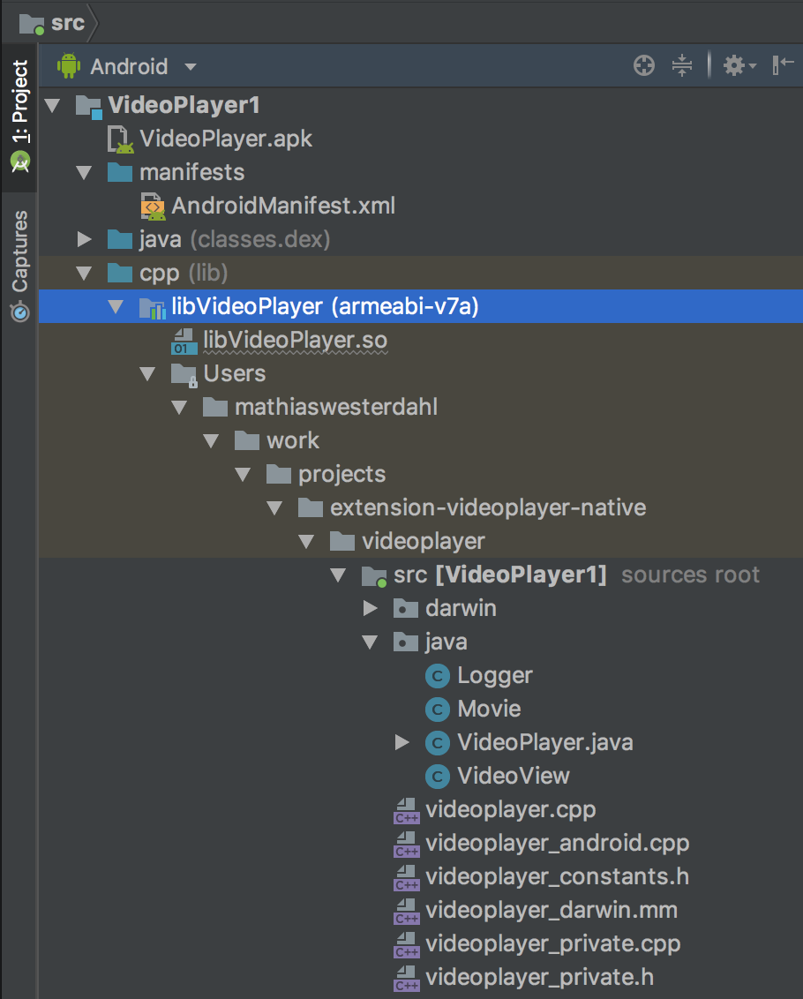
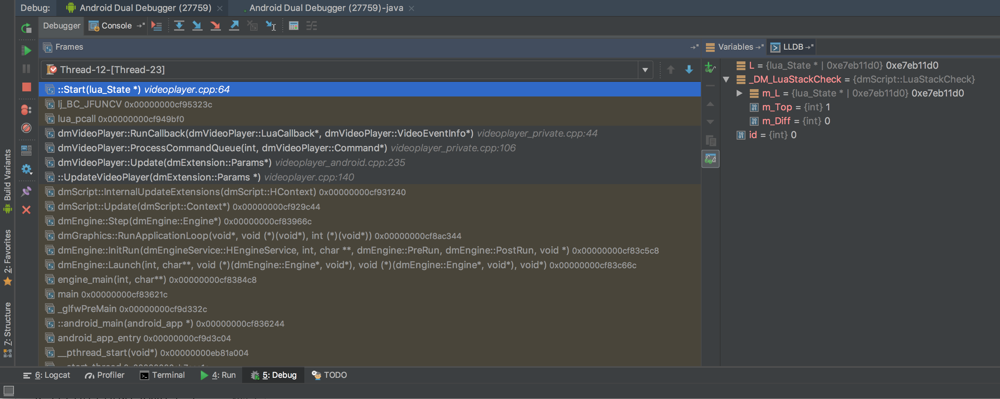

# Android 平台调试

下面介绍了如何使用 [Android Studio](https://developer.android.com/studio/), 即 Google 的 Android 操作系统的官方 IDE, 来调试游戏的方法.

## Android Studio

* 在 *game.project* 中设置 `android.debuggable`

	

* 在 debug 模式下打包游戏

	

* 启动 [Android Studio](https://developer.android.com/studio/)

* 选择 `Profile or debug APK`

	

* 选择刚刚输出的apk文件

	

* 选择主 `.so` 文件, 确保里面含有调试信息

	

* 没有的话可以上传完整 `.so` 文件. (文件大约 20mb)

* 路径映射帮助建立从编译 (在云端) 到本地文件夹的文件对应关系.

* 选择 .so 文件, 添加路径映射

	

	

* 要是动过引擎源码, 也要对引擎代码添加路径映射

* 注意一定要获取与你所用版本完全一致的引擎版本

	defold$ git checkout 1.2.148

* 点击 `Apply changes`

* 这时路径映射已经生效

	

* 加断点

	

* 点击 `Run` -> `Debug "Appname"` 然后运行断点处的程序

	

* 步进可用, 变量和调用堆栈一目了然

## 注意

### 原生扩展 job 文件夹

目前, 开发流程有点麻烦. 因为job文件夹名是随机的, 每次编译都不一样.

但是还是有办法使用的.

路径映射保存于 Android Studio 项目的 <project>.iml 文件中.

运行下列命令就能得到job文件夹名

	$ arm-linux-androideabi-readelf --string-dump=.debug_str build/armv7-android/libdmengine.so | grep /job

类似 `job1298751322870374150` 这样的名字, 后面的数字每次编译都不相同.

