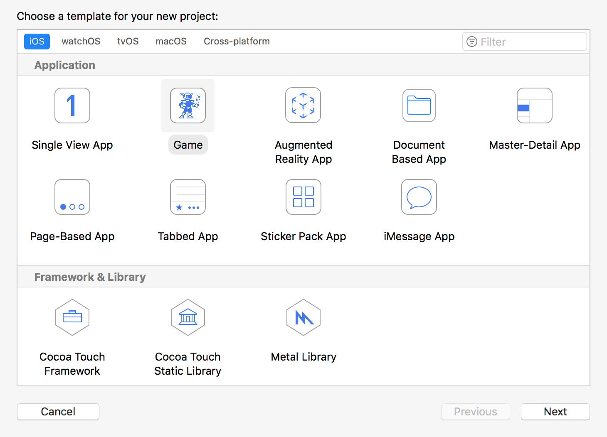
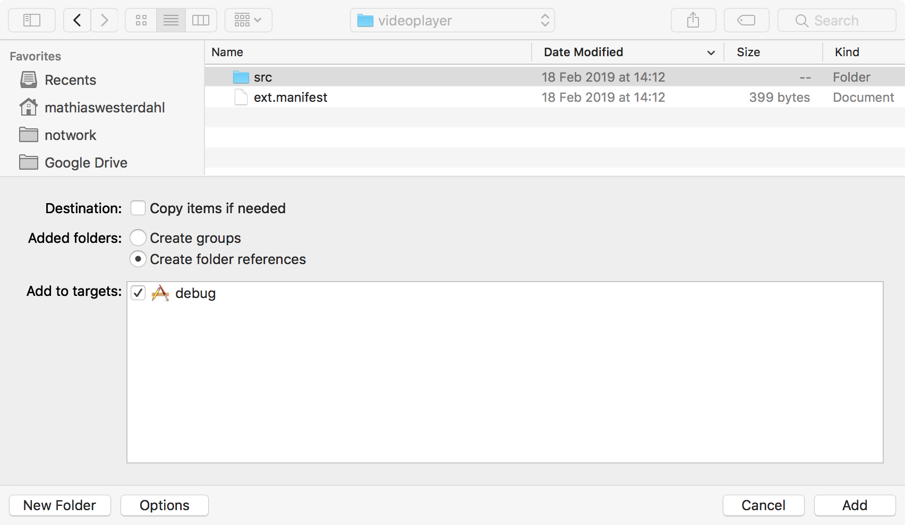
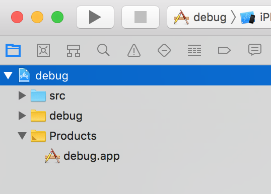
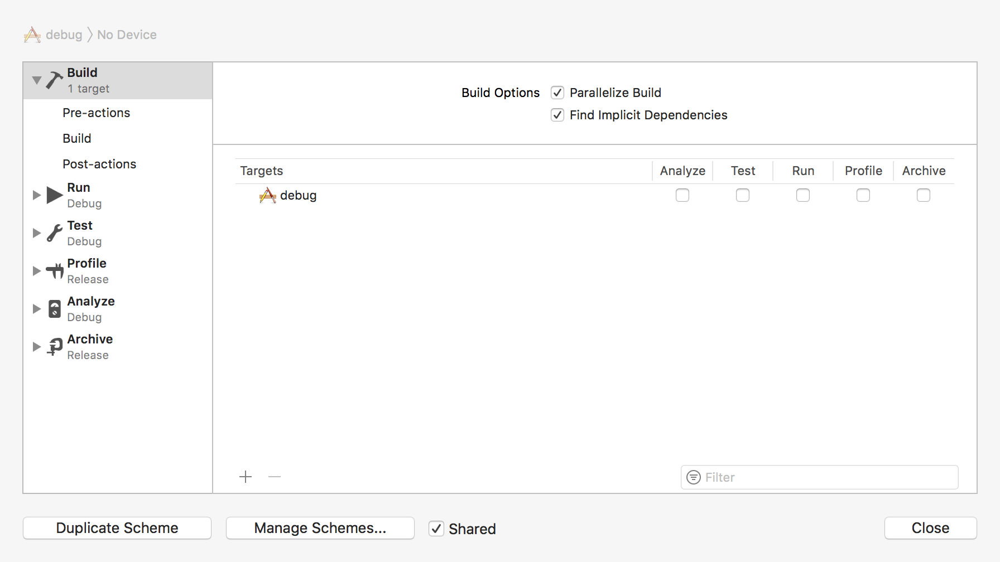
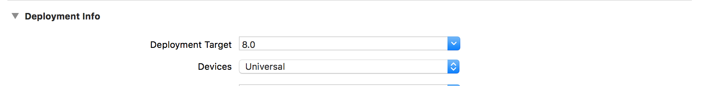
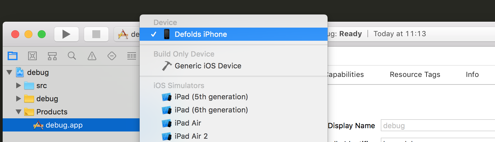
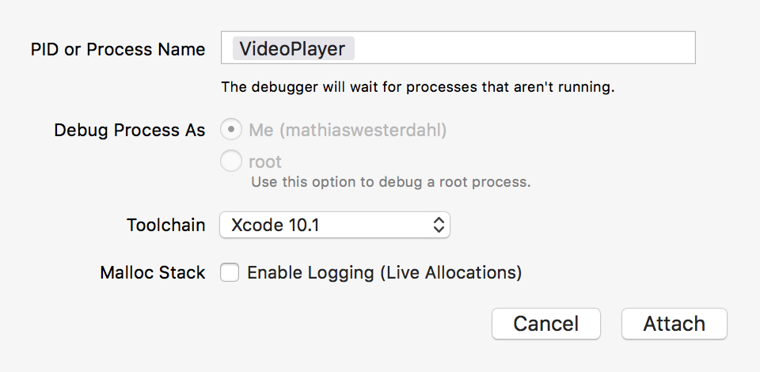
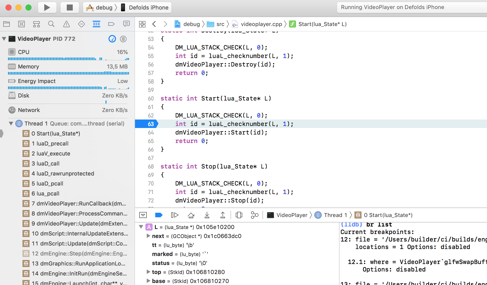

# 在 iOS/macOS 中调试

这里我们描述如何使用 [Xcode](https://developer.apple.com/xcode/)（Apple 的 macOS 和 iOS 首选 IDE）来调试构建版本。

## Xcode

* 使用 bob，通过 `--with-symbols` 选项打包应用 ([更多信息](/manuals/debugging-native-code/#symbolicate-a-callstack))：

```sh
$ cd myproject
$ wget http://d.defold.com/archive/<sha1>/bob/bob.jar
$ java -jar bob.jar --platform armv7-darwin build --with-symbols --variant debug --archive bundle -bo build/ios -mp <app>.mobileprovision --identity "iPhone Developer: Your Name (ID)"
```

* 安装应用，可以通过 `Xcode`、`iTunes` 或 [ios-deploy](https://github.com/ios-control/ios-deploy)

```sh
$ ios-deploy -b <AppName>.ipa
```

* 获取 `.dSYM` 文件夹（即调试符号）

	* 如果没有使用原生扩展，可以从 [d.defold.com](http://d.defold.com) 下载 `.dSYM` 文件

	* 如果您正在使用原生扩展，那么在使用 [bob.jar](https://www.defold.com/manuals/bob/) 构建时会生成 `.dSYM` 文件夹。只需要构建（不需要打包或捆绑）：

```sh
$ cd myproject
$ unzip .internal/cache/arm64-ios/build.zip
$ mv dmengine.dSYM <AppName>.dSYM
$ mv <AppName>.dSYM/Contents/Resources/DWARF/dmengine <AppName>.dSYM/Contents/Resources/DWARF/<AppName>
```


### 创建项目

要正确调试，我们需要有一个项目和映射的源代码。
我们不是使用这个项目来构建东西，只是用于调试。

* 创建新的 Xcode 项目，选择 `Game` 模板

	

* 选择一个名称（例如 `debug`）和默认设置

* 选择一个文件夹来保存项目

* 将您的代码添加到应用中

	

* 确保 "Copy items if needed" 未被选中。

	

* 这是最终结果

	


* 禁用 `Build` 步骤

	

	

* 设置 `Deployment target` 版本，使其大于您设备的 iOS 版本

	

* 选择目标设备

	


### 启动调试器

您有几种选项来调试应用

1. 选择 `Debug` -> `Attach to process...` 并从那里选择应用

2. 或者选择 `Attach to process by PID or Process name`

	

3. 在设备上启动应用

4. 在 `Edit Scheme` 中将 <AppName>.app 文件夹添加为可执行文件

### 调试符号

**要使用 lldb，执行必须暂停**

* 将 `.dSYM` 路径添加到 lldb

```
(lldb) add-dsym <PathTo.dSYM>
```

	

* 验证 `lldb` 是否成功读取了符号

```
(lldb) image list <AppName>
```

### 路径映射

* 添加引擎源代码（根据您的需求进行相应更改）

```
(lldb) settings set target.source-map /Users/builder/ci/builds/engine-ios-64-master/build /Users/mathiaswesterdahl/work/defold
(lldb) settings append target.source-map /private/var/folders/m5/bcw7ykhd6vq9lwjzq1mkp8j00000gn/T/job4836347589046353012/upload/videoplayer/src /Users/mathiaswesterdahl/work/projects/extension-videoplayer-native/videoplayer/src
```

* 可以从可执行文件获取作业文件夹。作业文件夹命名为 `job1298751322870374150`，每次都有随机数。

```sh
$ dsymutil -dump-debug-map <executable> 2>&1 >/dev/null | grep /job
```

* 验证源代码映射

```
(lldb) settings show target.source-map
```

您可以使用以下命令检查符号源自哪个源文件

```
(lldb) image lookup -va <SymbolName>
```


### 断点

* 在项目视图中打开一个文件，并设置断点

	

## 注意事项

### 检查二进制文件的 UUID

为了让调试器接受 `.dSYM` 文件夹，UUID 需要与正在调试的可执行文件的 UUID 匹配。您可以像这样检查 UUID：

```sh
$ dwarfdump -u <PathToBinary>
```
