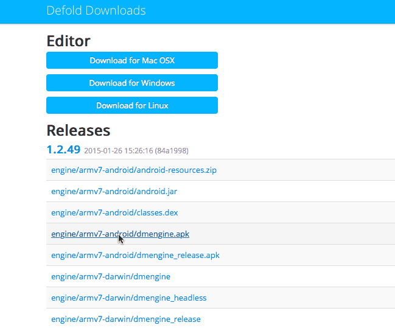
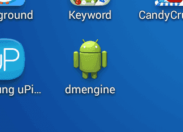
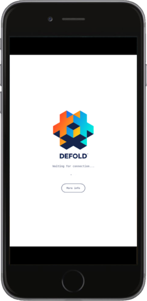

# 移动端开发用app

开发用app 让你可以通过wifi把内容推送到设备上. 这样进行修改测试的时候就不用反复打包安装了. 只需要在设备上安装开发用app, 打开app然后在编辑器里选择设备作为推送目标即可.

## 安装开发用app

使用引擎Debug打包的应用都可以用作开发用app. Android 上我们以及提供了 Defold 引擎的开发用app,  但是在 iOS 上的开发用app需要你使用自己的 signing identity 和 provisioning profile 手动打包并签名.

### 在 iOS 上安装

打包成 Debug 变体的 iOS 应用可以用作开发用app. 推荐就使用你当前的项目打包成 Debug 变体就好. 这样可以保证你的应用使用了正确的项目设置和 [原生扩展](/manuals/extensions/). 关于如何打包ios应用详情请见 [iOS 教程](/manuals/ios/#iOS应用打包). 记得使用 Debug 变体!

### 在 Android 上安装

对ios的建议同样适用于 Android. 然而我们已经编译好了一个开发用 *.apk* 文件.

::: 注意
只有在不使用 [原生扩展](/manuals/extensions/) 的项目可以使用我们提供的开发用apk. 否则你需要自己手动打debug包并且加入你所使用的原生扩展.
:::
* 访问 http://d.defold.com Defold下载网站.
* 从列表中选择所需引擎版本.
* 选择 *engine/armv7-android/dmengine.apk* Android开发用app (Armv7).



下载此文件, 在下载存放目录下输入以下 `adb` 命令安装 *.apk*:

```sh
$ adb install dmengine.apk
4445 KB/s (8706017 bytes in 1.912s)
    pkg: /data/local/tmp/dmengine.apk
Success
```

此时 "dmengine" 应用已安装好.



## 启动游戏

要在设备上启动游戏, 应用与编辑器之间需要互联, 可以使用 wifi 也可以使用 USB 线缆 (见下文).

1. 确保编辑器处于运行中.
2. 在设备上启动开发用app.
3. 在编辑器的 <kbd>Project ▸ Targets</kbd> 中选择设备.
4. 选择 <kbd>Project ▸ Build</kbd> 运行游戏. 如果用网络连接的话可能需要等一小会儿.
5. 游戏运行时, 就可以照常使用 [热重载](/manuals/hot-reload/) 功能了.



### 在 Windows 上使用 USB 连接 iOS 设备

要在 Windows 上使用 USB 连接运行于 iOS 设备上的app, 首先 [安装 iTunes](https://www.apple.com/lae/itunes/download/). 安装完之后还需从iOS设备的设置菜单里 [开启 Personal Hotspot](https://support.apple.com/en-us/HT204023). 如果跳出 "Trust This Computer?" 则选择 Trust. 这样设备就会出现在 <kbd>Project ▸ Targets</kbd> 列表中了.

### 在 Linux 上使用 USB 连接 iOS 设备

Linux 上同样开启 Personal Hotspot 然后 "Trust This Computer".

### 在 macOS 上使用 USB 连接 iOS 设备

当设备与 macOS 通过 USB 连线时, 新版本 iOS 能自动开启连接,  <kbd>Project ▸ Targets</kbd> 会自动显示出设备.

老iOS设备还是同样开启 Personal Hotspot 然后 "Trust This Computer".

### 在 macOS 上使用 USB 连接 Android 设备

当设备处于 USB 共享模式时,  可以通过 USB 连接设备与 macOS. 在 macOS 上需要安装 [HoRNDIS](https://joshuawise.com/horndis#available_versions) 这类的第三方驱动程序. 当 HoRNDIS 安装好后还需要在 Security & Privacy 设置里允许其运行. 设备上开启 USB 共享模式后就会出现在 <kbd>Project ▸ Targets</kbd> 列表中了.

### 在 Windows 或 Linux 上使用 USB 连接 Android 设备

同样在设备上开启 USB 共享模式后就会出现在 <kbd>Project ▸ Targets</kbd> 列表中了.

## 故障排除

无法下载应用
: 确保你的设备 UDID 包含在手机应用签名 provisioning 中.

Targets 菜单没有设备
: 无线连接时确保设备和计算机处于相同子网.

弹出消息说版本不匹配
: 这是由于更新了编辑器没更新应用. 用新编辑器重新编译安装应用即可.
