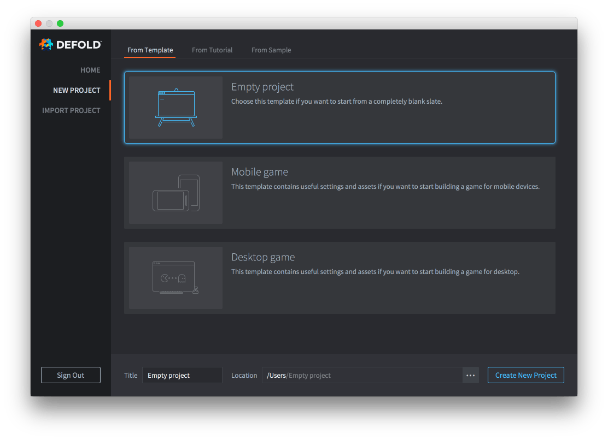
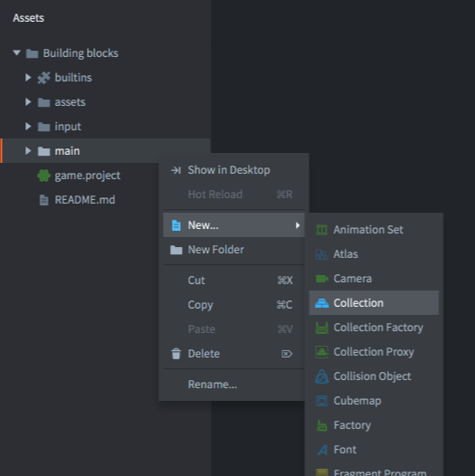
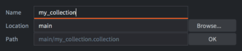

# 编辑器概述

编辑器在布局排版, 切换导航上设计得尽量让游戏开发更有效率. 编辑各个视图里的文件时都会有适当的编辑器自动弹出以方便使用.

## 打开编辑器

打开 Defold 编辑器, 首先呈现的是一个项目选择和新建窗口. 通过点选上面的按钮可以:

Home
: 显示最近编辑的项目以便快速打开. 这是默认视图.

New Project
: 创建新的项目, 然后会让你 (从 *Template* 窗口) 选择是否需要基于模板创建新项目, 还可以选择是否要参考 (*Tutorial* 窗口) 里的教程, 或者学习 (*Sample* 窗口) 里的示例项目.

  {srcset="images/editor/new_project@2x.png 2x"}

  新建项目完成后所有项目文件都保存在了本地硬盘上.

详情请见 [项目设立教程](https://www.defold.com/manuals/project-setup/).

## 编辑器面板

Defold 编辑器被划分为许多面板, 或称视图, 以展示和编辑数据.


*Assets* 面板
: 展示项目的所有文件. 点选和滚动鼠标滚轮可以在面板上滑动. 在这个视图上可以做的操作有:

   - <kbd>双击</kbd> 文件会根据文件类型启动相应的编辑器打开文件.
   - <kbd>拖放</kbd> 文件可以向项目中添加资源或者移动资源到想要的位置.
   - <kbd>右键单击</kbd> 会弹出 _上下文菜单_ , 可以用来进行新建文件/文件夹, 重命名, 删除, 查看文件依赖等操作.

*Editor* 面板

: 中间的视图显示当前打开的文件. 所有可视视图都可以进行如下操作:

- 平移: <kbd>Alt + 鼠标左键</kbd>.
- 缩放: <kbd>Alt + 鼠标右键</kbd> 或者使用鼠标滚轮.
- 旋转: <kbd>Ctrl + 鼠标左键</kbd>.

场景试图右上角的工具栏里也有这些功能按钮: *平移*, *旋转* 和 *缩放*.

{srcset="images/editor/toolbar@2x.png 2x"}

*Outline* 面板
: 这个视图以一个树形结构展示当前打开文件的内容. 大纲树的内容与场景视图内容是一一对应的, 可以方便操作:
   - <kbd>单击</kbd> 选中一个物体. 按住 <kbd>Shift</kbd> 或 <kbd>Option</kbd> 键可以进行多选.
   - <kbd>拖放</kbd> 移动物体. 在集合里把一个游戏对象拖放到另一个游戏对象上可以建立父子关系.
   - <kbd>右键单击</kbd> 弹出 _上下文菜单_ 以便进行添加, 删除选中的物体等操作.

*Properties* 面板
: 这个视图显示出当前选中物体的属性, 比如位置, 旋转, 动画等等.

*Tools* 面板
: 这个视图分为几个组. *Console* 组显示游戏输出和报错信息. 旁边是显示 *编译错误*, *查找结果* 和编辑粒子曲线数据时用到的 *曲线编辑器*. 同时工具面板也负责与调试器进行交互.

*Changed Files* 面板
: 如果项目使用 Git 做版本控制, 这个视图会列出项目中被修改, 添加或者删除的文件. 同步机制会把你的本地项目文件与 Git 托管项目进行同步, 这种机制方便团队合作开发, 而且云端备份可以保证项目不易损坏丢失. 相关操作:

   - <kbd>双击</kbd> 文件显示版本区别窗口. 同样, 编辑器会根据文件类型选择合适的显示窗口.
   - <kbd>右键点击</kbd> 文件弹出的上下文菜单中, 可以进行显示版本区别窗口, 回退文件的更改, 打开文件系统浏览器显示文件位置等操作.

## 同时编辑

如果同时打开了多个文件, 编辑器视图上方就会出现多个标签. 要想两个视图对照着同时进行编辑工作. <kbd>右键点击</kbd> 想要移动的视图标签, 然后选择 <kbd>Move to Other Tab Pane</kbd>.

{srcset="images/editor/2-panes@2x.png 2x"}

使用视图标签还可以让两个视图交换位置或者把多个面板合为一组.

## 场景编辑器

双击集合文件或者游戏对象文件就会打开 *场景编辑器*:


选择物体
: 在主视图中点选可以选中单个物体. 框选可以选中绿色方框套住的多个物体. 被选中的物体则在 *大纲* 视图中被高亮显示.

  大纲中还可以:

  - <kbd>点击左键拖拉</kbd> 框选中多个物体.
  - <kbd>单击</kbd> 选中单个物体.

  按住 <kbd>Shift</kbd> 或 <kbd>⌘</kbd> (Mac) / <kbd>Ctrl</kbd> (Win/Linux) 键可以在已选中物体的基础上增选物体.

移动工具
: {.left}
  使用 *移动工具* 来移动物体. 移动工具位于场景编辑器右上角的工具栏内, 快捷键是 <kbd>W</kbd>.

  

  被选中的物体会显示出坐标轴 (方块和箭头). 拖拽绿方块可以在屏幕空间内任意移动这个物体, 拖拽箭头则是让这个物体在 X, Y 或 Z 轴上进行移动. 拖拽别的方块则可以让这个物体在 X-Y 平面上 (在3D视图中可见) 移动或者在 X-Z , Y-Z 平面上移动.

旋转工具
: {.left}
  使用 *旋转工具* 来旋转物体. 旋转工具位于场景编辑器右上角的工具栏内, 快捷键是 <kbd>E</kbd>.

  

  旋转工具的坐标轴显示为圆形. 拖拽橙色的圆可以在屏幕空间内任意旋转这个物体, 可以沿着 X, Y 和 Z 轴旋转. 因为 X 和 Y 轴的位置关系, 在2D视图上仅显示为穿过物体的两条线.

缩放工具
: {.left}
  使用 *缩放工具* 来缩放物体. 缩放工具位于场景编辑器右上角的工具栏内, 快捷键是 <kbd>R</kbd>.

  

  缩放工具坐标轴显示为一组方块. 拖拽中间的方块可以将物体等比缩放 (包括Z轴). 同样也可以沿着 X, Y 和 Z 轴方向, 以及 X-Y , X-Z 和 Y-Z 平面上进行缩放.

## 新建文件

新建资源文件有两种方法, 通过点选菜单栏 <kbd>File ▸ New...</kbd> 按钮, 或者使用上下文菜单:

在 *资源* 浏览器目标位置 <kbd>右键单击</kbd> , 选择 <kbd>New... ▸ [file type]</kbd> 按钮:

{srcset="images/editor/create_file@2x.png 2x"}

为新文件取一个有意义的名字. 完整文件名包括类型扩展名会显示在 *路径* 对话框内:

{srcset="images/editor/create_file_name@2x.png 2x"}

## 向项目添加资源文件

要向项目添加资源 (图片, 声音, 模型等) 文件, 只需把文件拖放到 *资源* 浏览器里适当的位置上. 这样做实际上是把文件系统中的资源文件 _拷贝_ 到项目中来. 详情请见 [导入资源教程](/manuals/importing-assets/).

{srcset="images/editor/import@2x.png 2x"}

## 快捷键

### 默認快捷鍵

| Command | Windows | macOS | Linux |
|---------|---------|-------|-------|
| Add | <kbd>A</kbd> | <kbd>A</kbd> | <kbd>A</kbd> |
| Add secondary | <kbd>Shift</kbd>+<kbd>A</kbd> | <kbd>Shift</kbd>+<kbd>A</kbd> | <kbd>Shift</kbd>+<kbd>A</kbd> |
| Backwards tab trigger | <kbd>Shift</kbd>+<kbd>Tab</kbd> | <kbd>Shift</kbd>+<kbd>Tab</kbd> | <kbd>Shift</kbd>+<kbd>Tab</kbd> |
| Beginning of file | <kbd>Ctrl</kbd>+<kbd>Home</kbd> | <kbd>Cmd</kbd>+<kbd>Up</kbd> | <kbd>Ctrl</kbd>+<kbd>Home</kbd> |
| Beginning of line |  | <kbd>Ctrl</kbd>+<kbd>A</kbd> |  |
| Beginning of line text | <kbd>Home</kbd> | <kbd>Home</kbd> | <kbd>Home</kbd> |
| Build | <kbd>Ctrl</kbd>+<kbd>B</kbd> | <kbd>Cmd</kbd>+<kbd>B</kbd> | <kbd>Ctrl</kbd>+<kbd>B</kbd> |
| Close | <kbd>Ctrl</kbd>+<kbd>W</kbd> | <kbd>Cmd</kbd>+<kbd>W</kbd> | <kbd>Ctrl</kbd>+<kbd>W</kbd> |
| Close all | <kbd>Shift</kbd>+<kbd>Ctrl</kbd>+<kbd>W</kbd> | <kbd>Shift</kbd>+<kbd>Cmd</kbd>+<kbd>W</kbd> | <kbd>Shift</kbd>+<kbd>Ctrl</kbd>+<kbd>W</kbd> |
| Continue | <kbd>F5</kbd> | <kbd>F5</kbd> | <kbd>F5</kbd> |
| Copy | <kbd>Ctrl</kbd>+<kbd>C</kbd> | <kbd>Cmd</kbd>+<kbd>C</kbd> | <kbd>Ctrl</kbd>+<kbd>C</kbd> |
| Cut | <kbd>Ctrl</kbd>+<kbd>X</kbd> | <kbd>Cmd</kbd>+<kbd>X</kbd> | <kbd>Ctrl</kbd>+<kbd>X</kbd> |
| Delete | <kbd>Delete</kbd> | <kbd>Delete</kbd> | <kbd>Delete</kbd> |
| Delete backward | <kbd>Backspace</kbd> | <kbd>Backspace</kbd> | <kbd>Backspace</kbd> |
| Delete line |  | <kbd>Ctrl</kbd>+<kbd>D</kbd> |  |
| Delete next word | <kbd>Ctrl</kbd>+<kbd>Delete</kbd> | <kbd>Alt</kbd>+<kbd>Delete</kbd> | <kbd>Ctrl</kbd>+<kbd>Delete</kbd> |
| Delete prev word | <kbd>Ctrl</kbd>+<kbd>Backspace</kbd> | <kbd>Alt</kbd>+<kbd>Backspace</kbd> | <kbd>Ctrl</kbd>+<kbd>Backspace</kbd> |
| Delete to end of line | <kbd>Shift</kbd>+<kbd>Ctrl</kbd>+<kbd>Delete</kbd> | <kbd>Cmd</kbd>+<kbd>Delete</kbd> | <kbd>Shift</kbd>+<kbd>Ctrl</kbd>+<kbd>Delete</kbd> |
| Documentation | <kbd>F1</kbd> | <kbd>F1</kbd> | <kbd>F1</kbd> |
| Down | <kbd>Down</kbd> | <kbd>Down</kbd> | <kbd>Down</kbd> |
| End of file | <kbd>Ctrl</kbd>+<kbd>End</kbd> | <kbd>Cmd</kbd>+<kbd>Down</kbd> | <kbd>Ctrl</kbd>+<kbd>End</kbd> |
| End of line | <kbd>End</kbd> | <kbd>Ctrl</kbd>+<kbd>E</kbd> | <kbd>End</kbd> |
| Enter | <kbd>Enter</kbd> | <kbd>Enter</kbd> | <kbd>Enter</kbd> |
| Erase tool | <kbd>Shift</kbd>+<kbd>E</kbd> | <kbd>Shift</kbd>+<kbd>E</kbd> | <kbd>Shift</kbd>+<kbd>E</kbd> |
| Escape | <kbd>Esc</kbd> | <kbd>Esc</kbd> | <kbd>Esc</kbd> |
| Find next | <kbd>Ctrl</kbd>+<kbd>G</kbd> | <kbd>Cmd</kbd>+<kbd>G</kbd> | <kbd>Ctrl</kbd>+<kbd>G</kbd> |
| Find prev | <kbd>Shift</kbd>+<kbd>Ctrl</kbd>+<kbd>G</kbd> | <kbd>Shift</kbd>+<kbd>Cmd</kbd>+<kbd>G</kbd> | <kbd>Shift</kbd>+<kbd>Ctrl</kbd>+<kbd>G</kbd> |
| Find text | <kbd>Ctrl</kbd>+<kbd>F</kbd> | <kbd>Cmd</kbd>+<kbd>F</kbd> | <kbd>Ctrl</kbd>+<kbd>F</kbd> |
| Frame selection | <kbd>F</kbd> | <kbd>F</kbd> | <kbd>F</kbd> |
| Goto line | <kbd>Ctrl</kbd>+<kbd>L</kbd> | <kbd>Cmd</kbd>+<kbd>L</kbd> | <kbd>Ctrl</kbd>+<kbd>L</kbd> |
| Hide selected | <kbd>Ctrl</kbd>+<kbd>E</kbd> | <kbd>Cmd</kbd>+<kbd>E</kbd> | <kbd>Ctrl</kbd>+<kbd>E</kbd> |
| Hot reload | <kbd>Ctrl</kbd>+<kbd>R</kbd> | <kbd>Cmd</kbd>+<kbd>R</kbd> | <kbd>Ctrl</kbd>+<kbd>R</kbd> |
| Left | <kbd>Left</kbd> | <kbd>Left</kbd> | <kbd>Left</kbd> |
| Move down | <kbd>Alt</kbd>+<kbd>Down</kbd> | <kbd>Alt</kbd>+<kbd>Down</kbd> | <kbd>Alt</kbd>+<kbd>Down</kbd> |
| Move tool | <kbd>W</kbd> | <kbd>W</kbd> | <kbd>W</kbd> |
| Move up | <kbd>Alt</kbd>+<kbd>Up</kbd> | <kbd>Alt</kbd>+<kbd>Up</kbd> | <kbd>Alt</kbd>+<kbd>Up</kbd> |
| New file | <kbd>Ctrl</kbd>+<kbd>N</kbd> | <kbd>Cmd</kbd>+<kbd>N</kbd> | <kbd>Ctrl</kbd>+<kbd>N</kbd> |
| Next word | <kbd>Ctrl</kbd>+<kbd>Right</kbd> | <kbd>Alt</kbd>+<kbd>Right</kbd> | <kbd>Ctrl</kbd>+<kbd>Right</kbd> |
| Open | <kbd>Ctrl</kbd>+<kbd>O</kbd> | <kbd>Cmd</kbd>+<kbd>O</kbd> | <kbd>Ctrl</kbd>+<kbd>O</kbd> |
| Open asset | <kbd>Shift</kbd>+<kbd>Ctrl</kbd>+<kbd>R</kbd> | <kbd>Cmd</kbd>+<kbd>P</kbd> | <kbd>Shift</kbd>+<kbd>Ctrl</kbd>+<kbd>R</kbd> |
| Page down | <kbd>Page Down</kbd> | <kbd>Page Down</kbd> | <kbd>Page Down</kbd> |
| Page up | <kbd>Page Up</kbd> | <kbd>Page Up</kbd> | <kbd>Page Up</kbd> |
| Paste | <kbd>Ctrl</kbd>+<kbd>V</kbd> | <kbd>Cmd</kbd>+<kbd>V</kbd> | <kbd>Ctrl</kbd>+<kbd>V</kbd> |
| Preferences | <kbd>Ctrl</kbd>+<kbd>Comma</kbd> | <kbd>Cmd</kbd>+<kbd>Comma</kbd> | <kbd>Ctrl</kbd>+<kbd>Comma</kbd> |
| Prev word | <kbd>Ctrl</kbd>+<kbd>Left</kbd> | <kbd>Alt</kbd>+<kbd>Left</kbd> | <kbd>Ctrl</kbd>+<kbd>Left</kbd> |
| Proposals | <kbd>Ctrl</kbd>+<kbd>Space</kbd> | <kbd>Ctrl</kbd>+<kbd>Space</kbd> | <kbd>Ctrl</kbd>+<kbd>Space</kbd> |
| Quit | <kbd>Ctrl</kbd>+<kbd>Q</kbd> | <kbd>Cmd</kbd>+<kbd>Q</kbd> | <kbd>Ctrl</kbd>+<kbd>Q</kbd> |
| Realign camera | <kbd>Period</kbd> | <kbd>Period</kbd> | <kbd>Period</kbd> |
| Rebuild | <kbd>Shift</kbd>+<kbd>Ctrl</kbd>+<kbd>B</kbd> | <kbd>Shift</kbd>+<kbd>Cmd</kbd>+<kbd>B</kbd> | <kbd>Shift</kbd>+<kbd>Ctrl</kbd>+<kbd>B</kbd> |
| Rebundle | <kbd>Ctrl</kbd>+<kbd>U</kbd> | <kbd>Cmd</kbd>+<kbd>U</kbd> | <kbd>Ctrl</kbd>+<kbd>U</kbd> |
| Redo | <kbd>Shift</kbd>+<kbd>Ctrl</kbd>+<kbd>Z</kbd> | <kbd>Shift</kbd>+<kbd>Cmd</kbd>+<kbd>Z</kbd> | <kbd>Shift</kbd>+<kbd>Ctrl</kbd>+<kbd>Z</kbd> |
| Reindent | <kbd>Ctrl</kbd>+<kbd>I</kbd> | <kbd>Ctrl</kbd>+<kbd>I</kbd> | <kbd>Ctrl</kbd>+<kbd>I</kbd> |
| Reload stylesheet |  | <kbd>Ctrl</kbd>+<kbd>R</kbd> |  |
| Rename | <kbd>F2</kbd> | <kbd>F2</kbd> | <kbd>F2</kbd> |
| Replace next | <kbd>Shift</kbd>+<kbd>Ctrl</kbd>+<kbd>H</kbd> | <kbd>Alt</kbd>+<kbd>Cmd</kbd>+<kbd>G</kbd> | <kbd>Shift</kbd>+<kbd>Ctrl</kbd>+<kbd>H</kbd> |
| Replace text |  | <kbd>Alt</kbd>+<kbd>Cmd</kbd>+<kbd>F</kbd> |  |
| Right | <kbd>Right</kbd> | <kbd>Right</kbd> | <kbd>Right</kbd> |
| Rotate tool | <kbd>E</kbd> | <kbd>E</kbd> | <kbd>E</kbd> |
| Save all | <kbd>Ctrl</kbd>+<kbd>S</kbd> | <kbd>Cmd</kbd>+<kbd>S</kbd> | <kbd>Ctrl</kbd>+<kbd>S</kbd> |
| Scale tool | <kbd>R</kbd> | <kbd>R</kbd> | <kbd>R</kbd> |
| Scene stop | <kbd>Ctrl</kbd>+<kbd>T</kbd> | <kbd>Cmd</kbd>+<kbd>T</kbd> | <kbd>Ctrl</kbd>+<kbd>T</kbd> |
| Search in files | <kbd>Shift</kbd>+<kbd>Ctrl</kbd>+<kbd>F</kbd> | <kbd>Shift</kbd>+<kbd>Cmd</kbd>+<kbd>F</kbd> | <kbd>Shift</kbd>+<kbd>Ctrl</kbd>+<kbd>F</kbd> |
| Select all | <kbd>Ctrl</kbd>+<kbd>A</kbd> | <kbd>Cmd</kbd>+<kbd>A</kbd> | <kbd>Ctrl</kbd>+<kbd>A</kbd> |
| Select beginning of file | <kbd>Shift</kbd>+<kbd>Ctrl</kbd>+<kbd>Home</kbd> | <kbd>Shift</kbd>+<kbd>Cmd</kbd>+<kbd>Up</kbd> | <kbd>Shift</kbd>+<kbd>Ctrl</kbd>+<kbd>Home</kbd> |
| Select beginning of line |  | <kbd>Shift</kbd>+<kbd>Ctrl</kbd>+<kbd>A</kbd> |  |
| Select beginning of line text | <kbd>Shift</kbd>+<kbd>Home</kbd> | <kbd>Shift</kbd>+<kbd>Home</kbd> | <kbd>Shift</kbd>+<kbd>Home</kbd> |
| Select down | <kbd>Shift</kbd>+<kbd>Down</kbd> | <kbd>Shift</kbd>+<kbd>Down</kbd> | <kbd>Shift</kbd>+<kbd>Down</kbd> |
| Select end of file | <kbd>Shift</kbd>+<kbd>Ctrl</kbd>+<kbd>End</kbd> | <kbd>Shift</kbd>+<kbd>Cmd</kbd>+<kbd>Down</kbd> | <kbd>Shift</kbd>+<kbd>Ctrl</kbd>+<kbd>End</kbd> |
| Select end of line | <kbd>Shift</kbd>+<kbd>End</kbd> | <kbd>Shift</kbd>+<kbd>Alt</kbd>+<kbd>Down</kbd> | <kbd>Shift</kbd>+<kbd>End</kbd> |
| Select left | <kbd>Shift</kbd>+<kbd>Left</kbd> | <kbd>Shift</kbd>+<kbd>Left</kbd> | <kbd>Shift</kbd>+<kbd>Left</kbd> |
| Select next occurrence | <kbd>Ctrl</kbd>+<kbd>D</kbd> | <kbd>Cmd</kbd>+<kbd>D</kbd> | <kbd>Ctrl</kbd>+<kbd>D</kbd> |
| Select next word | <kbd>Shift</kbd>+<kbd>Ctrl</kbd>+<kbd>Right</kbd> | <kbd>Shift</kbd>+<kbd>Alt</kbd>+<kbd>Right</kbd> | <kbd>Shift</kbd>+<kbd>Ctrl</kbd>+<kbd>Right</kbd> |
| Select page down | <kbd>Shift</kbd>+<kbd>Page Down</kbd> | <kbd>Shift</kbd>+<kbd>Page Down</kbd> | <kbd>Shift</kbd>+<kbd>Page Down</kbd> |
| Select page up | <kbd>Shift</kbd>+<kbd>Page Up</kbd> | <kbd>Shift</kbd>+<kbd>Page Up</kbd> | <kbd>Shift</kbd>+<kbd>Page Up</kbd> |
| Select prev word | <kbd>Shift</kbd>+<kbd>Ctrl</kbd>+<kbd>Left</kbd> | <kbd>Shift</kbd>+<kbd>Ctrl</kbd>+<kbd>Left</kbd> | <kbd>Shift</kbd>+<kbd>Ctrl</kbd>+<kbd>Left</kbd> |
| Select right | <kbd>Shift</kbd>+<kbd>Right</kbd> | <kbd>Shift</kbd>+<kbd>Right</kbd> | <kbd>Shift</kbd>+<kbd>Right</kbd> |
| Show last hidden | <kbd>Shift</kbd>+<kbd>Ctrl</kbd>+<kbd>E</kbd> | <kbd>Shift</kbd>+<kbd>Cmd</kbd>+<kbd>E</kbd> | <kbd>Shift</kbd>+<kbd>Ctrl</kbd>+<kbd>E</kbd> |
| Show palette | <kbd>Space</kbd> | <kbd>Space</kbd> | <kbd>Space</kbd> |
| Split selection into lines | <kbd>Shift</kbd>+<kbd>Ctrl</kbd>+<kbd>L</kbd> | <kbd>Shift</kbd>+<kbd>Cmd</kbd>+<kbd>L</kbd> | <kbd>Shift</kbd>+<kbd>Ctrl</kbd>+<kbd>L</kbd> |
| Step into | <kbd>F11</kbd> | <kbd>F11</kbd> | <kbd>F11</kbd> |
| Step out | <kbd>Shift</kbd>+<kbd>F11</kbd> | <kbd>Shift</kbd>+<kbd>F11</kbd> | <kbd>Shift</kbd>+<kbd>F11</kbd> |
| Step over | <kbd>F10</kbd> | <kbd>F10</kbd> | <kbd>F10</kbd> |
| Stop debugger | <kbd>Shift</kbd>+<kbd>F5</kbd> |  | <kbd>Shift</kbd>+<kbd>F5</kbd> |
| Tab | <kbd>Tab</kbd> | <kbd>Tab</kbd> | <kbd>Tab</kbd> |
| Toggle breakpoint | <kbd>F9</kbd> | <kbd>F9</kbd> | <kbd>F9</kbd> |
| Toggle comment | <kbd>Ctrl</kbd>+<kbd>Slash</kbd> | <kbd>Cmd</kbd>+<kbd>Slash</kbd> | <kbd>Ctrl</kbd>+<kbd>Slash</kbd> |
| Toggle component guides | <kbd>Ctrl</kbd>+<kbd>H</kbd> | <kbd>Ctrl</kbd>+<kbd>Cmd</kbd>+<kbd>H</kbd> | <kbd>Ctrl</kbd>+<kbd>H</kbd> |
| Toggle pane bottom | <kbd>F7</kbd> | <kbd>F7</kbd> | <kbd>F7</kbd> |
| Toggle pane left | <kbd>F6</kbd> | <kbd>F6</kbd> | <kbd>F6</kbd> |
| Toggle pane right | <kbd>F8</kbd> | <kbd>F8</kbd> | <kbd>F8</kbd> |
| Toggle visibility filters | <kbd>Shift</kbd>+<kbd>Ctrl</kbd>+<kbd>I</kbd> | <kbd>Shift</kbd>+<kbd>Cmd</kbd>+<kbd>I</kbd> | <kbd>Shift</kbd>+<kbd>Ctrl</kbd>+<kbd>I</kbd> |
| Undo | <kbd>Ctrl</kbd>+<kbd>Z</kbd> | <kbd>Cmd</kbd>+<kbd>Z</kbd> | <kbd>Ctrl</kbd>+<kbd>Z</kbd> |
| Up | <kbd>Up</kbd> | <kbd>Up</kbd> | <kbd>Up</kbd> |
| Up major | <kbd>Shift</kbd>+<kbd>Up</kbd> | <kbd>Shift</kbd>+<kbd>Up</kbd> | <kbd>Shift</kbd>+<kbd>Up</kbd> |
| Zoom in | <kbd>Ctrl</kbd>+<kbd>'</kbd>+<kbd>'</kbd> | <kbd>Cmd</kbd>+<kbd>'</kbd>+<kbd>'</kbd> | <kbd>Ctrl</kbd>+<kbd>'</kbd>+<kbd>'</kbd> |
| Zoom out | <kbd>Ctrl</kbd>+<kbd>'-'</kbd> | <kbd>Cmd</kbd>+<kbd>'-'</kbd> | <kbd>Ctrl</kbd>+<kbd>'-'</kbd> |


### 自定義快捷鍵

可以創建配置文件以自定義快捷鍵 (例如 home 文件夾下的 `keymap.edn` 文件). 然後選擇 <kbd>File ▸ Preferences</kbd>, 設置 <kbd>Path to custom keymap</kbd> 為自定義的配置文件. 設置好之後重啓 Defold 才會生效, 每次修改都要重啓.

這些配置文件可以用來參考: [Windows](examples/keymap_win.edn), [MacOS](examples/keymap_macos.edn) 和 [Linux](examples/keymap_linux.edn)

## 编辑器日志
使用编辑器时如果遇到了麻烦可以 [向我们汇报](/manuals/getting-help/#获得帮助), 并且连同编辑器日志一起上报. 编辑器日志存放路径如下:

  * Windows: `C:\Users\ **Your Username** \AppData\Local\Defold`
  * macOS: `/Users/ **Your Username** /Library/Application Support/` 或 `~/Library/Application Support/Defold`
  * Linux: `~/.Defold`

如果用命令行启动编辑器那么日志会显示在控制台上. 例如从 macOS 终端启动 Defold 编辑器:

```
$ > ./path/to/Defold.app/Contents/MacOS/Defold
```