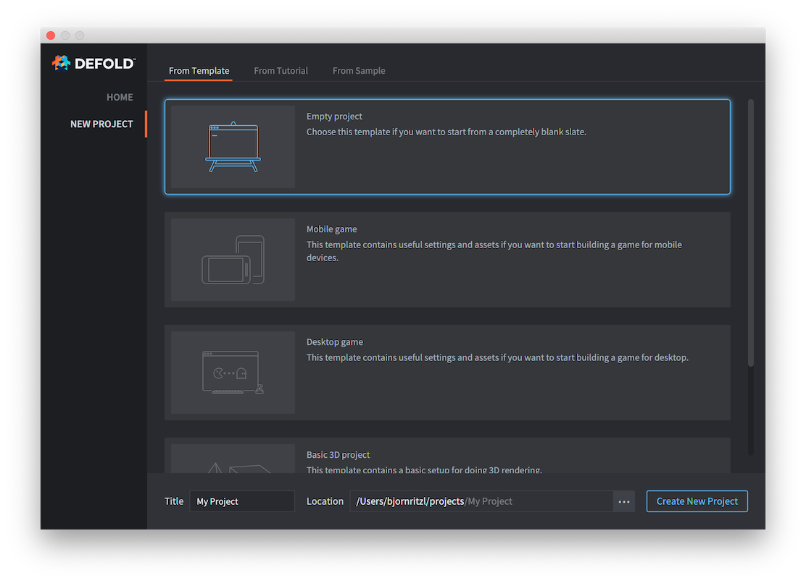
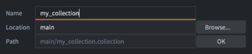

# 编辑器概述

编辑器允许您以高效的方式浏览和操作游戏项目中的所有文件。编辑文件会调出合适的编辑器，并在单独的视图中显示文件的所有相关信息。

## 启动编辑器

当您运行 Defold 编辑器时，会看到一个项目选择和创建界面。点击选择您想要执行的操作：

我的项目 (MY PROJECTS)
: 点击显示您最近打开的项目，以便您可以快速访问它们。这是默认视图。

  如果您之前没有打开过任何项目（或者把列表清空了），界面中会显示两个按钮：您可以点击 `从磁盘打开…` (`Open From Disk…`）按钮，通过系统文件管理器查找并打开一个已有项目；也可以点击 `新建项目` (`Create New Project`）按钮，此时界面会切换到 `模板` (`TEMPLATES`) 标签页。

  


  如果您之前打开过项目，这里会列出您的项目列表，如下图所示：

  

模板 (TEMPLATES)
: 包含空的或几乎空的基础工程，用于帮助您快速创建新的 Defold 项目，例如面向特定平台或内置特定扩展的模板。

教程 (TUTORIALS)
: 如果您想跟着教程一步步学习，这里包含了一些带有手把手教学的项目，供您学习、实践和修改。

示例 (SAMPLES)
: 包含为展示特定用例而准备的示例项目。

  

  当您创建一个新项目时，它会存储在您的本地磁盘上，您所做的任何编辑都会在本地保存。

您可以在[项目设置手册](https://www.defold.com/manuals/project-setup/)中了解有关不同选项的更多信息。

## 编辑器语言

在启动界面的左下角可以看到语言选择下拉菜单。您可以在这里从当前可用的本地化语言中进行选择（自 Defold 1.11.2 起提供）。在编辑器内部也可以通过菜单 `文件 ▸ 首选项 ▸ 常规 ▸ 编辑器语言` (`File ▸ Preferences ▸ General ▸ Editor Language`) 打开相同的语言设置。


## 编辑器各面板

Defold 编辑器被分为一组面板或视图，用于显示特定信息。


### 1. 资产面板 (Assets)

: 列出作为项目一部分的所有文件。点击和滚动来导航列表。所有面向文件的操作都可以在此视图中进行：

   - <kbd>左键单击</kbd> 选择任意文件或文件夹；按住 <kbd>⇧ Shift</kbd> 可扩展当前选择范围，按住 <kbd>Ctrl</kbd>/<kbd>⌘ Cmd</kbd> 可切换当前点击项目的选中状态（选中/取消选中）。
   - <kbd>双击</kbd>文件在该文件类型的编辑器中打开它。
   - <kbd>拖放</kbd>从磁盘上的其他位置将文件添加到项目中，或将文件和文件夹移动到项目中的新位置。
   - <kbd>右键单击</kbd>打开_上下文菜单_，您可以从中创建新文件或文件夹、重命名、删除、跟踪文件依赖关系等。

### 2. 编辑器面板
中心区域会根据文件类型，在对应的编辑器中显示当前打开的文件。例如，脚本文件会在内置的代码编辑器中打开，而可视化组件则会在 3D 可视化编辑器中打开。所有的可视化编辑器都允许您调整摄像机视角：

- 平移：<kbd>Alt</kbd>/<kbd>⌥ Option</kbd> + <kbd>鼠标左键</kbd> 或 <kbd>鼠标右键</kbd>。
- 缩放：<kbd>滚动鼠标滚轮</kbd> <kbd>Alt</kbd>/<kbd>⌥ Option</kbd> + <kbd>鼠标右键</kbd>。
- 3D旋转：<kbd>Ctrl</kbd>/<kbd>^ Control</kbd> + <kbd>鼠标左键</kbd>。

#### 工具栏

在场景视图的右上角有一个工具栏，您可以在其中找到对象操作工具：*移动*、*旋转*和*缩放*，以及 *网格设置* `▦`，*2D模式*`2D`、*摄像机透视*和*可见性过滤器*`👁`。


### 3. 大纲面板 (Outline)

此视图显示当前正在编辑的文件内容，但以分层树结构形式展示。大纲反映了编辑器视图，并允许您对其中的元素执行各种操作：
   - <kbd>单击</kbd>选择一个项目；按住 <kbd>⇧ Shift</kbd> 可扩展当前选择范围，按住 <kbd>Ctrl</kbd>/<kbd>⌘ Cmd</kbd> 可切换当前点击项目的选中状态（选中/取消选中）。
   - <kbd>拖放</kbd>移动项目。将游戏对象拖放到集合中的另一个游戏对象上可以使其成为子对象。
   - <kbd>右键单击</kbd>打开_上下文菜单_，您可以从中添加项目、删除选中的项目等。

可以通过单击列表中元素右侧的小眼睛图标 `👁` 来切换游戏对象和可视化组件的可见性（Defold 1.9.8及更新版本）。


### 4. 属性面板 (Properties)

此视图显示与当前所选项目相关联的属性，如位置、旋转、动画等。

您也可以通过 <kbd>拖动</kbd> 数值字段旁边的 `↕` 上下箭头并移动鼠标来改变数值型属性的值（Defold 1.10.2 及更高版本）。

### 5. 工具面板 (Tools)

此视图有几个标签页。

*控制台* (Console)
: 显示游戏运行时的各种引擎输出（错误、警告、信息），以及您在脚本中通过打印语句（如 print）输出的内容。

*构建错误* (Build Errors)
: 显示项目构建过程中的错误。

*查找结果* (Search Results)
: 当您使用 <kbd>Ctrl</kbd>/<kbd>⌘ Cmd</kbd> + <kbd>Shift</kbd> + <kbd>F</kbd> 在整个项目中搜索，并且勾选了 `保留结果` (`Keep Results`) 时，该标签页会显示搜索结果。

*曲线编辑* (Curve Editor)
: 用于在 [粒子编辑器](/manuals/particlefx/) 中编辑曲线。


工具面板也用于与集成调试器进行交互。更多内容请参阅[调试手册](/manuals/debugging/)。

### 6. 更改的文件面板 (Changed Files)

如果您的项目使用分布式版本控制系统Git，此视图将列出项目中已更改、添加或删除的任何文件。通过定期同步项目，您可以使本地副本与存储在项目Git仓库中的内容保持同步，这样您可以在团队内协作，并且在发生灾难时不会丢失您的工作。您可以在我们的[版本控制手册](/manuals/version-control/)中了解更多关于Git的信息。一些面向文件的操作可以在此视图中执行：

   - <kbd>左键单击</kbd> 选择某个文件；按住 <kbd>⇧ Shift</kbd> 可扩展当前选择范围，按住 <kbd>Ctrl</kbd>/<kbd>⌘ Cmd</kbd> 可切换当前点击项目的选中状态（选中/取消选中）。
   - <kbd>双击</kbd>文件打开文件的差异视图。编辑器会在适合的编辑器中打开文件，就像在资源视图中一样。
   - <kbd>右键单击</kbd>文件打开弹出菜单，您可以从中打开差异视图、恢复对文件所做的所有更改、在文件系统中查找文件等。

### 菜单栏

在编辑器视图顶部（或 macOS 的系统菜单栏中）可以看到菜单栏，其中包含 6 个菜单：`文件` (`File`)，`编辑` (`Edit`)，`视图` (`View`)，`项目` (`Project`)，`调试` (`Debug`)，`帮助` (`Help`)。这些菜单的功能会在其它手册中详细说明。

### 状态栏

在编辑器底部有一条窄的区域显示状态信息，例如：
- 当有新的更新可用时，会显示一个可点击的按钮 `有可用更新` (`Update Available`）——请参阅本手册后面的“更新编辑器”章节。
- 当正在构建（Build）或打包（Bundle）项目时，该区域会显示操作进度。

## 面板大小和可见性

可以在编辑器中通过拖拽六个主面板之间的分隔线来自由调整各面板的大小。

面板的可见性可以通过 `视图` (`View`) 菜单中的选项或快捷键进行切换：
- `切换资产面板` (`Toggle Assets Pane`) (<kbd>F6</kbd>)：切换 *资产* (*Assets*) 和 *更改的文件* (*Changed Files*) 两个面板的可见性；
- `切换更改的文件` (`Toggle Changed Files`)：单独切换 *更改的文件* (*Changed Files*) 面板的可见性；
- `切换工具面板` (`Toggle Tools Pane`) (<kbd>F7</kbd>)：切换 *工具面板* (*Tools*) 的可见性；
- `切换属性面板` (`Toggle Properties Pane`) (<kbd>F8</kbd>)：切换 *大纲* (*Outline*) 和 *属性* (*Properties*) 两个面板的可见性。


在 `视图` (`View`) 菜单中，您还可以切换或更改其他与显示相关的设置，例如 Grid（网格）、Guides（参考线）、Camera（摄像机），或者使用 `聚焦选中对象` (`Frame Selection`)（<kbd>F</kbd>）来让视图适配到选中对象；还可以使用 `重新对齐相机` (`Realign Camera`)（<kbd>.</kbd>）在默认的 2D 与 3D 视图之间切换。许多功能也可以通过工具栏或快捷键访问。

## 标签页

如果同时打开了多个文件，编辑器视图顶部会为每个文件显示一个单独的标签页 (Tab)。同一面板中的标签页可以互相调换位置——使用 <kbd>拖放</kbd> 即可在标签页栏中调整它们的顺序。您还可以：

- 在标签页上 <kbd>右键单击</kbd> 打开_上下文菜单_；
- 点击 `关闭` (`Close`) <kbd>Ctrl</kbd>/<kbd>⌘ Cmd</kbd> + <kbd>W</kbd> 关闭当前标签页；
- 点击 `关闭其他` (`Close Others`) 关闭除当前标签页外的所有标签页；
- 点击 `关闭全部` (`Close All`) <kbd>Ctrl</kbd>/<kbd>⌘ Cmd</kbd> + <kbd>Shift</kbd> + <kbd>W</kbd> 关闭活动面板中的所有标签页；
- 选择 `➝| 打开为` (`Open As`)，使用非默认的编辑器或在 `文件 ▸ 首选项 ▸ 代码 ▸ 自定义编辑器` (`File ▸ Preferences ▸ Code ▸ Custom Editor`) 中设置的外部工具打开文件。更多信息请参阅[编辑器首选项手册](/manuals/editor-preferences)。


## 并排编辑

如果同时打开了多个文件, 编辑器视图上方就会出现多个标签页。可以并排打开2个编辑器视图。<kbd>右键单击</kbd>想要移动的编辑器标签页并选择 `移动到另一个标签页` (`Move to Other Tab Pane`)。


您也可以在标签页菜单中选择 `与另一个标签页交换` (`Swap with Other Tab Pane`）在两个面板之间交换内容，或选择 `合并标签页` (`Join Tab Panes`) 将两个面板重新合并为一个。

## 场景编辑器

双击集合或游戏对象文件会打开*场景编辑器*。默认情况下，所有可视场景都会以 2D 正交视图打开：


如果您在开发 3D 项目，建议检查工具栏并调整 *网格设置* `▦`（网格设置），例如重新对齐摄像机以切换 2D/3D `2D`（或使用 <kbd>.</kbd> 键），将网格设置为显示在 `Y` 平面或其他您认为直观的平面上，并通过工具栏上的切换按钮或 `视图 ▸ 透视相机` (`View ▸ Perspective Camera`) 将摄像机改为透视模式：


### 操作对象

点击主窗口中的对象来选择它们。编辑器视图中围绕对象的矩形（或 3D 中的长方体）会以青色高亮，指示当前选中的条目。所选对象也在*大纲*视图中高亮显示。

  您还可以通过以下方式选择对象：

  - <kbd>单击并拖动</kbd>以选择选择区域内的所有对象。
  - <kbd>单击</kbd>大纲视图中的对象；按住 <kbd>⇧ Shift</kbd> 可扩展当前选择范围，按住 <kbd>Ctrl</kbd>/<kbd>⌘ Cmd</kbd> 可切换当前点击项目的选中状态（选中/取消选中）。

### 移动工具

{.left}
要移动对象，请使用*移动工具*。您可以在场景编辑器右上角的工具栏中找到它，或按<kbd>W</kbd>键。

{.inline}{.inline}

所选对象显示一组操纵器（方块和箭头）。单击并拖动绿色中心方块手柄可在屏幕空间中自由移动对象，单击并拖动箭头可沿X、Y或Z轴移动对象。还有一些方形手柄用于在X-Y平面中移动对象，以及（如果在3D中旋转相机可见）用于在X-Z和Y-Z平面中移动对象。

### 旋转工具
{.left}
要旋转对象，请通过在工具栏中选择它或按<kbd>E</kbd>键来使用*旋转工具*。

{.inline}{.inline}

该工具由四个圆形操纵器组成。一个橙色操纵器在屏幕空间中旋转对象，以及围绕X、Y和Z轴中的每一个旋转的操纵器。由于视图垂直于X轴和Y轴，因此圆仅显示为穿过对象的两条线。

### 缩放工具
{.left}
要缩放对象，请通过在工具栏中选择它或按<kbd>R</kbd>键来使用*缩放工具*。

{.inline}{.inline}

该工具由一组方形手柄组成。中心一个在所有轴（包括Z）中均匀缩放对象。每个X、Y和Z轴还有一个手柄用于缩放，以及一个用于在X-Y平面、X-Z平面和Y-Z平面中缩放的手柄。

### 可见性过滤器

点击工具栏上的眼睛图标 (`👁`) 以打开 *Visibility Filters*（可见性过滤器），可以切换各种组件类型的显示与否，以及边界框和参考线（`Component Guides`，快捷键为 <kbd>Ctrl</kbd> + <kbd>H</kbd>（Windows/Linux）或 <kbd>^ Ctrl</kbd> + <kbd>⌘ Cmd</kbd> + <kbd>H</kbd>（Mac））。


## 创建新的项目文件

要创建新的资源文件，可以选择 `文件 ▸ 新建...` (`File ▸ New...`)，然后从菜单中选择文件类型，或者使用上下文菜单：

在 *资产* (*Assets*) 浏览器中的目标位置<kbd>右键单击</kbd>，然后选择 `新建... ▸ [文件类型]` (`New... ▸ [file type]`)：


为新文件键入合适的名称。包含文件类型后缀的完整文件名显示在对话框的*路径*下：



## 模板

可以为每个项目指定自定义模板。为此，请在项目根目录中创建一个名为`templates`的新文件夹，并添加名为`default.*`的新文件，并带有所需的扩展名，例如`/templates/default.gui`或`/templates/default.script`。此外，如果在这些文件中使用了`{{NAME}}`标记，它将被文件创建窗口中指定的文件名替换。

如果某种文件类型存在模板，那么每当创建该类型的新文件时，都会以 `templates` 目录中对应模板文件的内容进行初始化。


## 导入文件到项目

要向项目添加资产文件（图像、声音、模型等），只需将它们拖放到 *资产* (*Assets*) 浏览器中的正确位置。这将在项目文件结构的选定位置创建文件的副本。更多内容请参阅[资产导入手册](/manuals/importing-assets/)。


## 更新编辑器

编辑器在连接到互联网时会自动检查更新。当检测到新版本时，在项目选择界面的左下角或编辑器窗口右下角会显示一个蓝色的可点击链接 `有可用更新` (`Update Available`)。


点击 `有可用更新` (`Update Available`) 链接即可下载并更新编辑器。会弹出一个包含相关信息的确认窗口——点击 `下载更新` (`Download Update`) 继续。


下载进度会显示在底部状态栏中：


下载完成后，蓝色链接会变为 `重启以更新` (`Restart to Update`)。点击它即可重启编辑器并打开更新后的版本。


## 首选项 (Preferences)

您可以在 `首选项` (`Preferences`）窗口中修改编辑器设置。要打开该窗口，请点击 `文件 ▸ 首选项` (`File ▸ Preferences…`)，或使用快捷键 <kbd>Ctrl</kbd>/<kbd>⌘ Cmd</kbd> + <kbd>,</kbd>。

更多内容请参阅[编辑器首选项手册](/manuals/editor-preferences)。


## 编辑器日志

如果您在使用编辑器时遇到问题，并需要通过 `帮助 ▸ 反馈问题` (`Help ▸ Report Issue`) 报告问题，最好同时提供编辑器本身的日志文件。要在系统文件浏览器中打开日志所在位置，请点击 `帮助 ▸ 显示日志` (`Help ▸ Show Logs`)。

更多内容请参阅[获取帮助手册](/manuals/getting-help/#getting-help)。


  * Windows: `C:\Users\ **您的用户名** \AppData\Local\Defold`
  * macOS: `/Users/ **您的用户名** /Library/Application Support/` 或 `~/Library/Application Support/Defold`
  * Linux: `$XDG_STATE_HOME/Defold` 或 `~/.local/state/Defold`

如果编辑器是从终端/命令提示符启动的，您也可以在编辑器运行时访问编辑器日志。从终端上启动编辑器：

```shell
# Linux:
$ ./path/to/Defold/Defold

# macOS:
$ > ./path/to/Defold.app/Contents/MacOS/Defold
```

## 编辑器服务器

当编辑器打开项目时，它会在随机端口上启动Web服务器。该服务器可用于从其他应用程序与编辑器交互。从1.11.0版本开始，端口被写入`.internal/editor.port`文件中。

此外，从1.11.0版本开始，编辑器可执行文件有一个命令行选项`--port`（或`-p`），允许在启动时指定端口，例如：
```shell
# 在Windows上
.\path\to\Defold\Defold.exe --port 8181

# 在Linux上：
./path/to/Defold/Defold --port 8181

# 在macOS上：
./path/to/Defold/Defold.app/Contents/MacOS/Defold --port 8181
```

## 编辑器样式

编辑器的外观可以通过自定义样式进行修改。更多信息请参阅 [编辑器样式手册](/manuals/editor-styling.md)。

## 常见问题
:[Editor FAQ](../shared/editor-faq.md)
