API 文档位于 [这里](https://defold.github.io/extension-facebook/).

## 注册成为 Facebook 开发者
# Facebook

Facebook API 作为 [原生扩展](/manuals/extensions/) 提供. 此扩展使得 iOS, Android 和 HTML5 游戏可以使用 Facebook 的在线交互功能. Defold Facebook 扩展对于 iOS, Android 和 HTML5 (基于 Facebook Canvas) 不同平台封装了同一的 Facebook API 函数库. 要在游戏中使用 Facebook 在线交互功能, 首先需要有一个 Facebook 账户.

## 安装扩展

要使用 Facebook 扩展, 需要在 `game.project` 文件中设置依赖. 最新稳定版的 URL 是:
```
https://github.com/defold/extension-facebook/archive/master.zip
```

推荐使用 [指定版本](https://github.com/defold/extension-facebook/releases) 的zip包链接作为依赖.

Facebook API 文档位于 [fb扩展主页](https://defold.github.io/extension-facebook/).

## 注册为 Facebook 开发者

开发 Facebook 应用首先要注册成为 Facebook 开发者. 这样你的 Defold 游戏就能与 Facebook 应用交互了.

* 访问 [Facebook 开发者网站](https://developers.facebook.com) 进行注册
* 登入你的 Facebook 账户.
* 注册激活你的开发者身份.

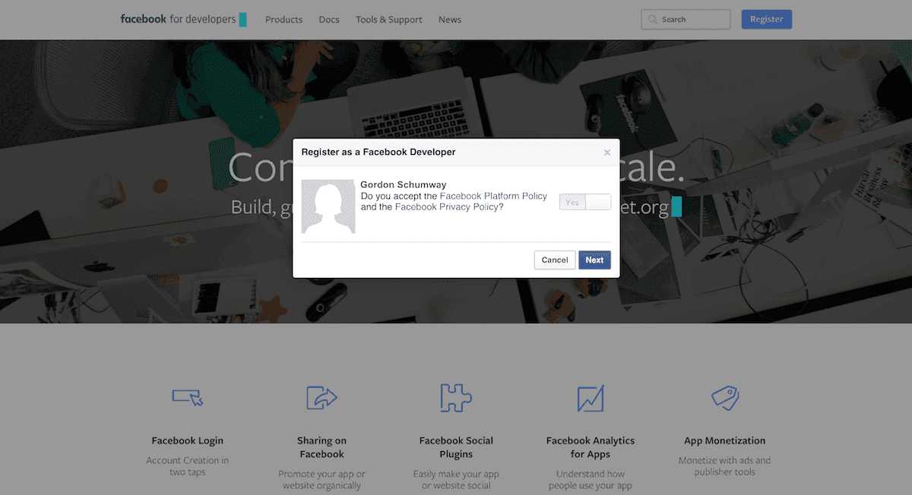
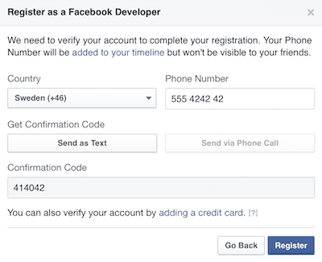

## 创建 Facebook 应用

下一步要创建一个 Facebook 应用. 右上角 <kbd>My Apps</kbd> 菜单列出了你的应用, 以及 <kbd>Add a New App</kbd> 按钮.

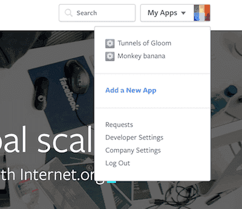

然后是选择目标平台界面. 点击 *basic setup* 可以略过引导界面.

::: sidenote
引导界面里绝大多数内容与开发 Defold 游戏无关. 而且, 一般不需要自己修改 *Info.plist* 或者 *AndroidManifest.xml* 文件. Defold 会自动完成.
:::

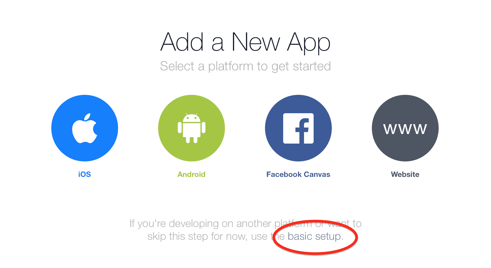

在 dashboard 里可以随意添加, 删除应用或者更改平台设置. 接下来需要设置 *Display Name*, *Namespace* 和 *Category*. 这些也都可以在 dashboard 里设置. 设置完后, Facebook 会给你的应用创建唯一id. *App ID* 是不可修改的.

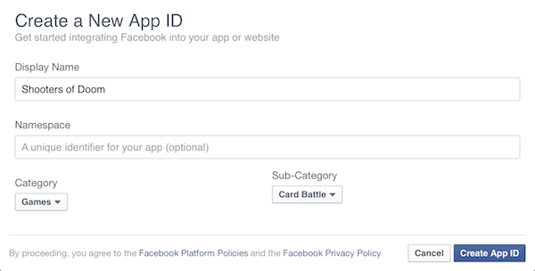

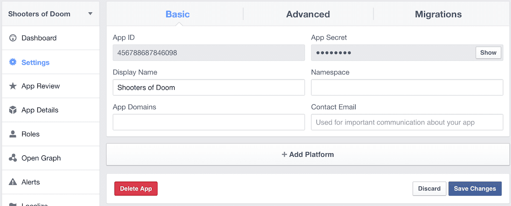

点击 *Settings* 面板. 这里显示了 *App ID*. 你要在 Defold 游戏的 [项目设置](/manuals/project-settings) 里输入这个id. 从 *资源面板* 里打开 *game.project* 文件, 滚动到 *Facebook* 部分, 在 `Appid` 这里填入 *App ID*.

现在回到 Facebook 网站的 *Settings* 页面, 点击 *+ Add Platform* 来为应用设置目标平台. 针对每个平台都有不同的设置.

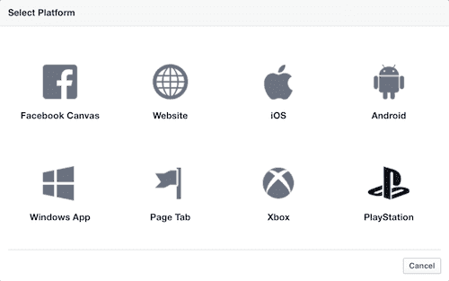

## iOS

iOS 平台需要填写和 *game.project* 里一样的 `bundle_identifier`.

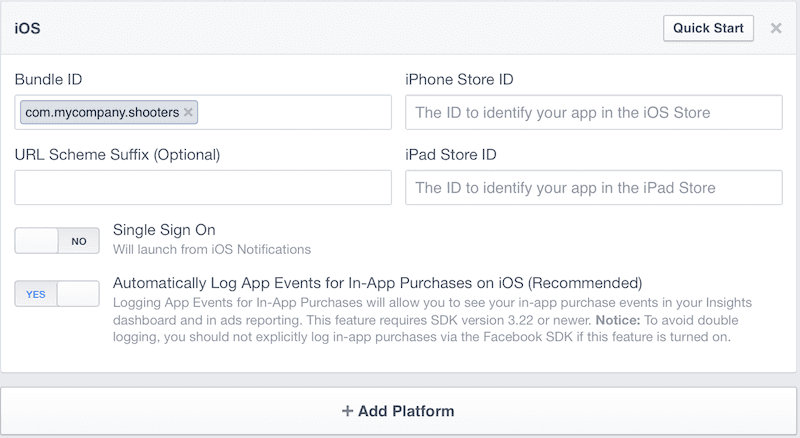

## Android

Android 平台需要填写 *Google Play Package Name*, 也就是 *game.project* 里的 *package* id. 还要在 *Key Hashes* 里填入证书的 Hashes. 可以使用 openssl 从 *certificate.pem* 文件生成 Hashes:

```sh
$ cat certificate.pem | openssl x509 -outform der | openssl sha1 -binary | openssl base64
```

(关于签名文件详细信息参见 [制作 keystore](/manuals/android/#制作 keystore).)

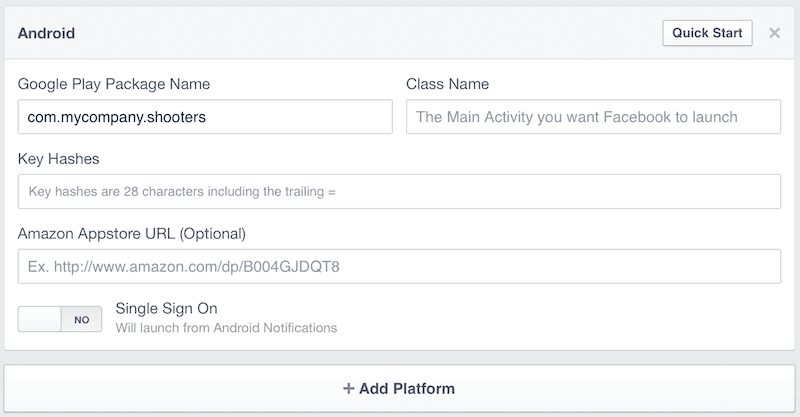

## Facebook Canvas

对于 HTML5 游戏, 过程略有不同. Facebook 需要直接在线访问你的游戏内容. 两个办法:

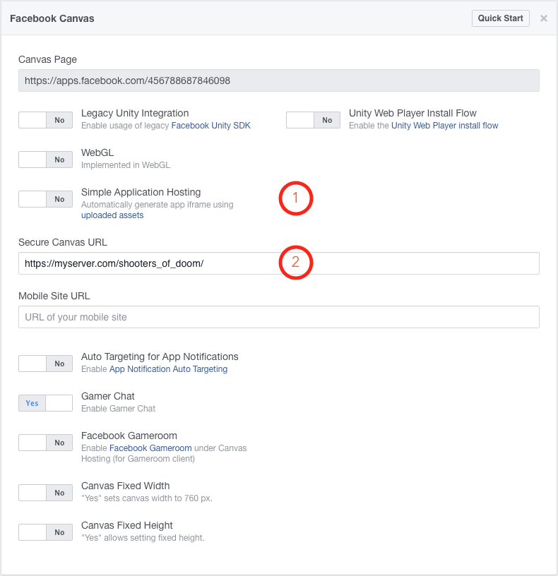

1. 使用 Facebook 的 *Simple Application Hosting*. 点击 *Yes* 使用在线托管. 选择 *uploaded assets* 打开托管资源管理器.

    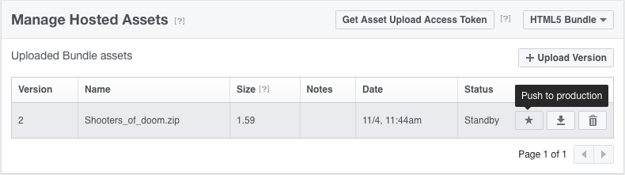

    托管类型选择 "HTML5 Bundle":

    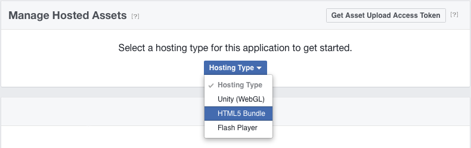

    把你的 HTML5 游戏包压缩为一个 .7z 或者 .zip 包上传至 Facebook. 点击 *Push to production* 即可在线发布.

2. 另一个办法就是把你的 HTML5 游戏包托管到你自己选择的服务器上通过 HTTPS 访问. *Secure Canvas URL* 这里填写你的游戏地址.

至此 Facebook 就能通过 *Canvas Page* 发布你的游戏了.

## 小测试

可以通过创建一个小测试来看看扩展工作是否顺利.

1. 新建游戏对象然后在上面添加一个脚本.
2. 脚本里加入如下代码 (需要 Facebook 扩展 v.2 版及以上):

```lua
local function get_me_callback(self, id, response)
    -- The response table includes all the response data
    pprint(response)
end

local function fb_login(self, data)
    if data.status == facebook.STATE_OPEN then
        -- Logged in ok. Let's try reading some "me" data through the
        -- HTTP graph API.
        local token = facebook.access_token()
        local url = "https://graph.facebook.com/me/?access_token=" .. token
        http.request(url, "GET", get_me_callback)
    elseif data.status == facebook.STATE_CLOSED_LOGIN_FAILED then
        -- Do something to indicate that login failed
    end
    if data.error then
        -- An error occurred
    else
        -- No error
    end
end

function init(self)
    -- Log in with read permissions.
    local permissions = { "public_profile", "email" }
    facebook.login_with_permissions(permissions, facebook.AUDIENCE_EVERYONE, fb_login)
end
```

直接运行, 控制台输出大概这样:

```txt
DEBUG:SCRIPT:
{
  status = 200,
  headers = {
    connection = keep-alive,
    date = Fri, 04 Nov 2016 13:54:33 GMT,
    etag = "0725a4f703fe6af27da183cfec0bb22637e331e0",
    access-control-allow-origin = *,
    content-length = 53,
    expires = Sat, 01 Jan 2000 00:00:00 GMT,
    content-type = text/javascript; charset=UTF-8,
    x-fb-debug = Pr1qUssb8Xa3x3r1t913hHMdefh69DSYYV5vcxeOB7O33mcfShIw+r7BoLpn147I2wzLF2CZRTpnR3/VYOtFpA==,
    facebook-api-version = v2.5,
    cache-control = private, no-cache, no-store, must-revalidate,
    pragma = no-cache,
    x-fb-trace-id = F03S5dtsdaS,
    x-fb-rev = 2664414,
  }
  response = {"name":"Max de Fold ","id":"14159265358979323"},
}
```

* 完整的 Defold Facebook API 文档在 [这里](https://defold.github.io/extension-facebook/).
* Facebook Graph API 在这里: https://developers.facebook.com/docs/graph-api


## Facebook Analytics

Facebook Analytics 可以对游戏相关信息汇总统计并提供适当建议, 比如开启游戏人数, 付款频率和其他各种信息.

### 配置

使用 Facebook Analytics 之前你得创建好 Facebook 应用. 然后就是把分析功能整合进去:

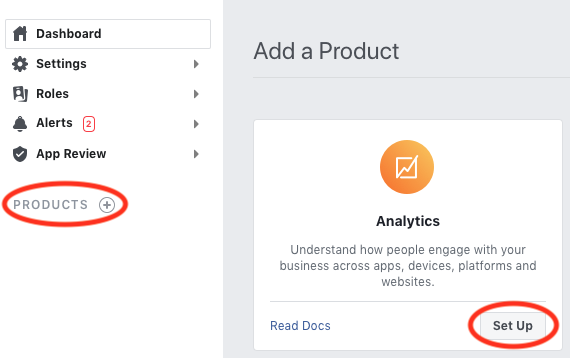

分析功能也有很多配置选项. 详情请见:


### 使用

分析功能配置好之后就可以通过发布分析事件来进行信息统计了:

```lua
function init(self)
    -- post a spent credits event
    local params = { [facebook.PARAM_LEVEL] = 30, [facebook.PARAM_NUM_ITEMS] = 2 }
    facebook.post_event(facebook.EVENT_SPENT_CREDITS, 25, params)

    -- post a custom event
    local level = 19
    local params = { kills = 23, gold = 4, xp = 890 }
    facebook.post_event("level_completed", level, params)
end
```

各种事件和参数详情请见 [Facebook 扩展 API 文档](https://defold.github.io/extension-facebook/). 这些应该与 Facebook 的 [标准事件](https://developers.facebook.com/docs/analytics/send_data/events#standard) 和 [参数](https://developers.facebook.com/docs/analytics/send_data/events#parameter) 文档相一致.

除了分析统计事件, Defold 使用 Facebook SDK 时也会自动产生一些事件, 比如装机次数启动次数之类的. 详情请见 Facebook 的 [自动日志事件](https://developers.facebook.com/docs/analytics/send_data/events#autologged) 文档.

事件汇总后会在 Facebook Analytics dashboard 中显示出来, 点击 *View Analytics* 按钮查看分析信息:

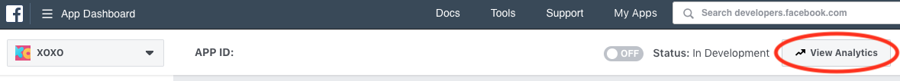

通过页面里 *Events* 选项可以看到各种事件:

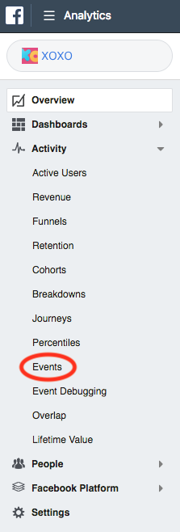

### Facebook 的事件分享

你可以选择是否向 Facebook 分享你的事件数据. 通过 [`enable_event_usage()`](https://defold.github.io/extension-facebook/#enable_event_usage) 和 [`disable_event_usage()`](https://defold.github.io/extension-facebook/#disable_event_usage) 函数控制. 默认不分享.
