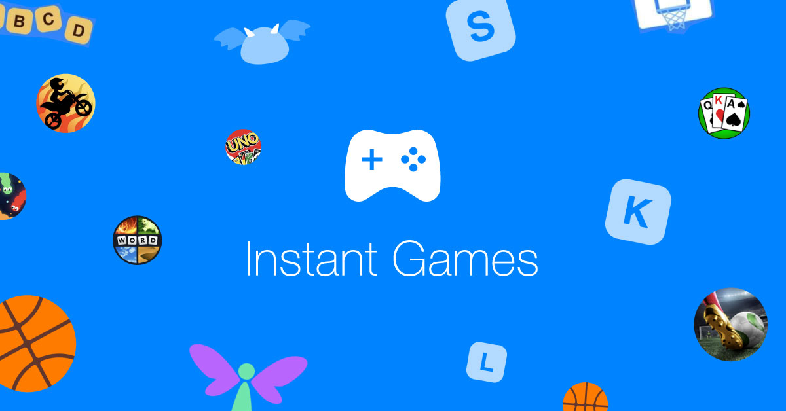
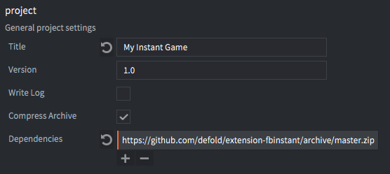
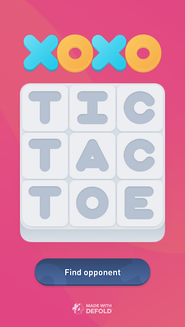

# Facebook Instant Games

Instant Games 可以让玩家在 Facebook 平台上随时玩到游戏的新方式. 基于 HTML5 技术, 可以让玩家直接从新闻Feed或者聊天消息中打开游戏, 同时支持桌面和移动设备.



## 发布 Instant Games

在把你的 Defold 游戏发布到 Facebook 之前, 需要对游戏项目进行一些设定:

1. 在 [Facebook App Dashboard](https://developers.facebook.com/apps) 里创建 Instant Games 应用. 详情请见 [Instant Games 入门指南](https://developers.facebook.com/docs/games/instant-games/getting-started/game-setup).

2. 在你的 *game.project* 文件中添加 Instant Games 扩展依赖. 即把 "https://github.com/defold/extension-fbinstant/archive/master.zip" 添加到 *Dependencies* 属性中.

   

3. 确保在你打包游戏生成的 "index.html" 文件包含了 Instant Games SDK.

   ```html
   <script src="https://connect.facebook.net/en_US/fbinstant.6.3.js"></script>
   ```

   关于打包设置详情请见 [HTML5 教程](/manuals/html5/#自定义HTML5打包).

4. 都准备好之后, 打包 HTML5 游戏并上传至 Facebook.

## API 使用

Instant Games 扩展使用命名空间 `fbinstant.*` , 用 Lua API 对 Javascript SDK 进行了封装. 此扩展基本上是从 Javascript SDK 到 Lua API 一一对应的.

比如, 看以下 Javascript 代码:

```javascript
FBInstant.initializeAsync().then(function() {
    FBInstant.startGameAsync().then(function() {
      var playerID = FBInstant.player.getID();
      var playerName = FBInstant.player.getName();
    });
});
```

相应的 Lua 代码是这样的:

```lua
fbinstant.initialize(function(self, success)
    fbinstant.start_game(function(self, success)
        local player_id = fbinstant.get_player().id
        local player_name = fbinstant.get_player().name
    end)
end)
```

关于如何在Defold中使用 Instant Games SDK 详情请见 [API documentation](https://github.com/defold/extension-fbinstant/blob/master/README.md).

## 示例游戏

有个 Defold 游戏 "Tic Tac Toe" 的 Instant Games 版本在 [官方 GitHub 代码库](https://github.com/defold/extension-fbinstant) 提供了完整的源码和素材. 可以作为学习资料或者素材来使用.



## 减小包体

Facebook Instant Games [最佳实践](https://developers.facebook.com/docs/games/instant-games/best-practices) 建议游戏首次载入时间不得超过5秒. 这对 Defold 来说有点勉强, 好在还有一些方法能减小游戏体积:

去掉未使用引擎特性
: HTML5 版的标准 Defold 引擎用gzip压缩后小于 1.2MB, 但是可以通过去掉不必要的引擎特效来达到减少包体的效果. 在 "app.manifest" 文件中可以指定去掉引擎哪方面特性, 此文件在 *game.project* 文件的 [Native Extension 部分](/manuals/project-settings/#Native extension) 引用.

  此功能尚处于测试阶段且没有说明文档. 这里: https://forum.defold.com/t/stripping-appmanifest-maker/16059 有一个可以自动生成 app.manifests 文件的工具.

使用纹理压缩
: 纹理压缩是有效减少包体和内存占用的方法. 关于纹理压缩详情请见 [Texture Profiles 教程](/manuals/texture-profiles/).

减少启动所需资源按需下载
: 许多游戏把内容分成各个关卡或者各个篇章. 这种类型的游戏可以把内容放到玩家玩到的时候再下载.

这种把内容分块, 保存到服务器上然后按需下载并缓存的方法可以有效减少 Instant Game 包体. 这种方法由 Defold 的 [热更新](/manuals/live-update/) 系统提供支持.

## 已知问题

关于 HTML5 和 Instant Games 的已知问题详见 [HTML5 教程已知问题部分](/manuals/html5/#已知问题和局限性).
