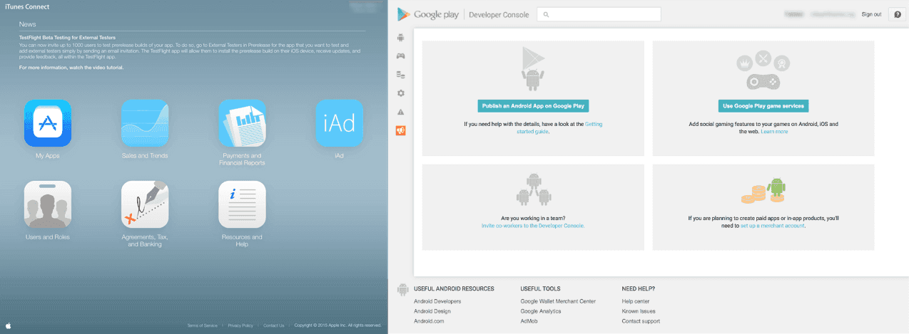
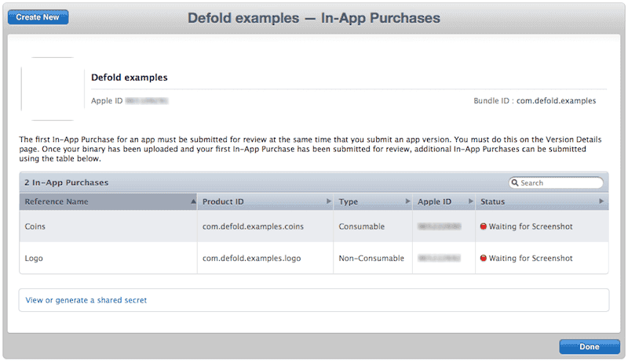
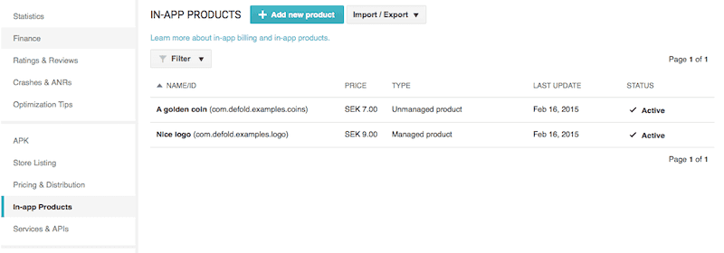
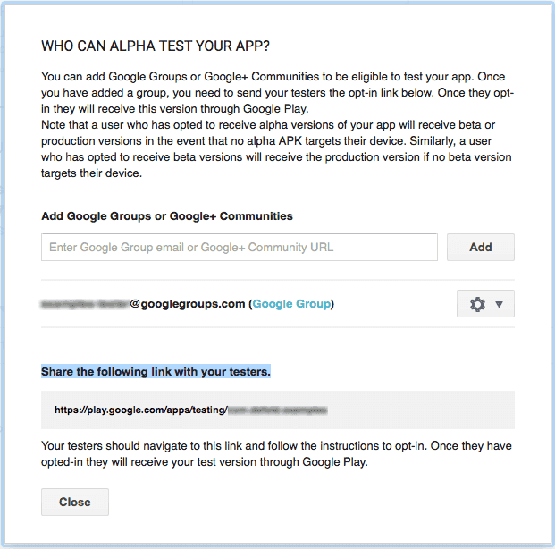
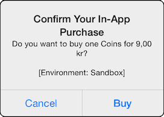
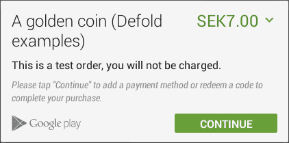
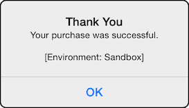

# 应用内支付

Defold 提供了方便的 iOS Appstore "in-app purchases" 和 Google Play 及 Amazon "in-app billing" 系统接口. Facebook Canvas 的 "game payments" 用于 Facebook Canvas 游戏. 这些服务能让你销售:

* 标准应用内支付 (一次性购买) 的消耗品和非消耗品
* 订阅 (自动循环购买)

::: 注意
目前 Defold 接口可以与 Apple 的 Storekit 完整交互. 对于 Google Play 和 Facebook Canvas, 接口是一致的, 这有助于代码跨平台. 但是不同平台需要的流程有所不同. 而且注意目前没有针对 OS X 系统上 Mac Appstore 的支付接口.
:::

关于 Apple, Google, Amazon 和 Facebook 的详细文档参考:

* [In-App Purchase Programming Guide](https://developer.apple.com/library/ios/documentation/NetworkingInternet/Conceptual/StoreKitGuide/Introduction.html).
* [Google Play In-app Billing documentation](http://developer.android.com/google/play/billing/index.html).
* [Amazon In-app Purchase documentation](https://developer.amazon.com/public/apis/earn/in-app-purchasing).
* [Facebook game payments documentation](https://developers.facebook.com/docs/payments).

## 安装扩展

首先要在 `game.project` 文件中加入内支付扩展依赖. 最新稳定版本地址如下:
```
https://github.com/defold/extension-iap/archive/master.zip
```

推荐使用 [正式发布版](https://github.com/defold/extension-iap/releases) 的zip连接作为依赖引用.

其 API 文档详见 [扩展项目首页](https://defold.github.io/extension-iap/).


## 使用静态报告测试 Google Play Billing

Android 建议使用 Google Play 的静态报告来实现 IAP. 这样在正式发布之前就可以确保内支付工作正常. 测试用静态报告包括4个ID:

`android.test.purchased`
: Google Play 报告模拟支付完成. 此报告包含一个 JSON 字符串, 内含模拟支付信息 (比如模拟用户ID等).

`android.test.canceled`
: Google Play 报告模拟支付取消. 这种情况可能因为付款时出现错误, 比如信用卡无效, 或者用户付款前订单被取消.

`android.test.refunded`
: Google Play 报告模拟退款完成.

`android.test.item_unavailable`
: Google Play 报告app可购买物品列表里找不到用户购买的项目.

## 内支付准备流程

iOS 和 Android 内支付的准备流程差不多:

1. 注册为 Apple 或 Google Play 开发者.
2. 为目标平台进行项目配置. 参考 [iOS 开发教程](/manuals/ios) 与 [Android 开发教程](/manuals/android).
3. 为应用商店进行测试配置:

    - Android 上, 使用 [Google Play Developer Console](https://play.google.com/apps/publish/).
    - iOS 上, 使用 [iTunes Connect](https://itunesconnect.apple.com/). 注意你的 App ID (于 https://developer.apple.com 上的 "成员中心" 配置) 要开启 "In-App Purchase" 选项.

    

4. 对于 Google Play, 你需要 _上传并发布_ 测试版 *.apk* 文件. 对于 iTunes Connect, 直到应用审批之前你 _不用上传_ 应用文件给 iTunes Connect. 加入上传了未完成的应用文件给 iTunes Connect, Apple 会拒绝该应用.

5. 设置应用内消费品.

    

    

6. 设置测试用账户.
    - 在 iTunes Connect 页面 *用户与规则* 中可以设置专门用于 _沙盒环境_ 的模拟支付用户. 要给应用做开发者证书签名然后在测试设备上登录 Appstore 沙盒账户进行测试.
    - 在 Google Play Developer Console 上, 选择 *设置 > 账户详情* 的 License Testing 部分设置测试用户 email. 多个 email 用逗号分隔. 然后测试者可以登录并购买消费品而不会真的扣款.
    - 在 Google Play 上, 还需要为测试者们建立 Google Group. Google 使用组来管理应用测试组成员. 在 *Alpha Testing* 页面的 *Manage list of testers* 设置测试者 Google Group. 应用上线前必须通过 Alpha 测试.



Facebook 内支付准备流程:

1. 注册为 Facebook 开发者. 登录 [Facebook for developers](https://developers.facebook.com/), 在 "My Apps" 下 "Register as a developer", 完成注册步骤.
2. Facebook 要求支持同步和异步两种支付方式. 详情请见 [Payment overview](https://developers.facebook.com/docs/payments/overview)
3. 建立应用托管和回调服务器:
    * 建立托管应用的加密 canvas 地址. 详情请见 [Games on Facebook](https://developers.facebook.com/docs/games/gamesonfacebook/hosting).
    * 建立回调服务器. 详情请见 [Setting up your callback server](https://developers.facebook.com/docs/payments/realtimeupdates#yourcallbackserver).
4. 配置应用. 详情请见 [Facebook Developer Dashboard](https://developers.facebook.com/quickstarts/?platform=canvas).
5. 加入测试用户. 在应用面板的 "Canvas Payments" 部分进行设置.
6. 建立应用消费品. 详情请见 [Defining products](https://developers.facebook.com/docs/payments/implementation-guide/defining-products/).

## 异步的内支付 API

内支付 API 是异步的, 也就是说应用发送信息给服务器, 然后能继续运行. 等到从服务器传回的信息时, 一个 _回调_ 函数会被调用, 从中可以根据回调数据进行各种处理工作.

获得消费品列表:

```lua
local COINS_ID = "com.defold.examples.coins"
local LOGO_ID = "com.defold.examples.logo"

local function product_list(self, products, error)
    if error == nil then
        for i,p in pairs(products) do
            print(p.ident)
            print(p.title)
            print(p.description)
            print(p.currency_code)
            print(p.price_string)
        end
    else
        print(error.error)
    end
end

function init(self)
    -- 初始化消费品列表 (对于 Google Play 来说一次能获取 20 个)
    iap.list({ COINS_ID, LOGO_ID }, product_list)
end
```

对于正式交易, 首先要注册交易结果监听器, 然后在玩家购买时调用内支付函数:

```lua
local function iap_listener(self, transaction, error)
    if error == nil then
        if transaction.state == iap.TRANS_STATE_PURCHASING then
            print("Purchasing...")
        elseif transaction.state == iap.TRANS_STATE_PURCHASED then
            print("Purchased!")
        elseif transaction.state == iap.TRANS_STATE_UNVERIFIED then
            print("Unverified!")
        elseif transaction.state == iap.TRANS_STATE_FAILED then
            print("Failed!")
        elseif transaction.state == iap.TRANS_STATE_RESTORED then
            print("Restored")
        end
    else
        print(error.error)
    end
end

function on_message(self, message_id, message, sender)
    ...
    -- 注册内支付结果监听器.
    iap.set_listener(iap_listener)
    -- 买一个金币...
    iap.buy(COINS_ID)
    ...
end
```

操作系统会自动弹出支付界面. 要是处于测试/沙盒环境下, 界面中会明确标明.







## 实时付款

大多数付款系统都是实时的. 支付完成时应用会收到一个消息, TRANS_STATE_PURCHASED. 这是交易的最终状态, 表明对于这笔交易不会再有其他消息了.

## 非实时付款

有的付款系统需要非实时的支持. 也就是说你的应用只在付款开始时收到一个消息. 为了验证付款完成与否, 需要你的服务器 (或者客户端) 与付款系统进行更多的交流.
这种情况下支付完成时应用会收到一个 TRANS_STATE_UNVERIFIED 消息 (而不是 TRANS_STATE_PURCHASED). 这也是交易的最终状态, 表明对于这笔交易不会再有其他消息了.

## 购买交付

玩家购买消费品之后, 应用有义务告知玩家支付已完成 (比如服务器验证支付成功之后).
内支付支持 auto-completion, 也就是自动产生支付完成的消息 (默认设置). 也可以在项目配置里关闭 auto-completion. 支付完成时手动调用 `iap.finish()`, 来产生完成消息.

### 消耗品与非消耗品
Google Play 应用商店只支持消耗品. 必须使用非消耗品的话就关闭 auto-completion 并且不要调用完成函数. 这样在 `iap.set_listener()` 被调用时, 消费品购买总是保持着购买中的状态.

Apple App Store 支持非消耗品, 也就是说购买完成时才向玩家提供消费品交付. 这种情况下 auto-completion 可以开启也可以关闭 (比如你需要自己验证支付成功) 之后调用 `iap.finish()`.

## 支付收据

收据是一堆加密数据, 可以把它发送给 App Store 来验证付款是否真正完成. 这是用开发者服务器验证付款必须使用的东西.

## 除错

Android `iap.list()` 返回 "failed to fetch product"
: 你需要上传 *.apk* 文件到 Google Play Developer Console 的 alpha 或者 beta 频道. 还要注意确保你的设配上 _日期和时间_ 是正确的.

Android (Google Play) `iap.list()` 只返回 20 个消费品
: Google 有 [每次请求返回最多 20 个消费品的限制](https://github.com/googlesamples/android-play-billing/blob/master/TrivialDrive/app/src/main/aidl/com/android/vending/billing/IInAppBillingService.aidl#L62). 可以多次调用 `iap.list()` 然后合并返回结果以实现20个以上的消费品列表.

iOS `iap.list()` 返回空值
: 确保你的账户是 iOS 付款应用账户, 并且签署好一切所需文件. 没有经过认证的话, 你的 iOS 应用内支付 (甚至测试支付) 操作不会正确执行.

  检查 "Member Center" 上的应用ID是否开启了 in-app purchases  (检查 "Member Center" 里 "Certificates, Identifiers & Profiles" 的 "Enabled Services:" 项) 并且该应用 (或者调试版应用) 已用供应商档案进行了签名而且签名没过期.

  内支付消费品信息传到沙盒环境需要几小时时间, 请耐心等待.

iOS `iap.list()` 产生错误日志 "Unexpected callback set"
: `iap.list()` 调用不可以嵌套. 从 `iap.list()` 调用 `iap.list()` 就会产生这个错误日志.

在 iOS 上, "price_string" 里有个 '~' 字符
: '~' 是未找到字体的字符占位符. 调用 `iap.list()` 返回的数据使用 _不间断空白_ (`\u00a0`) 分割价格和货币符号并填充 "price_string" 变量. 使用 GUI 组件渲染的话, 需要在字体 *extra_characters* 属性里设置所需字符. 在 Mac OS X 上按 <kbd>Option + SPACE</kbd> 就是不间断空白. 详情请见 http://en.wikipedia.org/wiki/Non-breaking_space.
