# 推送通知

推送通知作为 [原生扩展](/manuals/extensions/) 在 iOS 和 Android 设备上用来给玩家提示修改和更新之类的信息. iOS 和 Android 实现方法基本一样但是也有一些平台相关的东西需要注意.

推送通知为了找到从服务器到目标设备的通路, 需要得到应用的一些信息. 最复杂的部分包括用于校验客户端接收通知的合法性的应用安全信息. 还需要用于 Apple 或者 Google 校验你发送通知合法性的服务器安全信息. 最后, 推送通知的时候, 你需要知道到用户设备的唯一路径. 为此你需要指定设备的唯一 token (用来分辨用户).

## 安装扩展

使用之前要在 `game.project` 文件里配置扩展依赖. 最新稳定版依赖的 URL 是:

```
https://github.com/defold/extension-push/archive/master.zip
```

推荐使用 [指定版本](https://github.com/defold/extension-push/releases) 的zip包链接作为依赖.

```
https://github.com/defold/extension-firebase-core/archive/master.zip
```

API 文档在 [推送通知扩展项目](https://defold.github.io/extension-push/) 页上.

## iOS 配置

::: sidenote
为了更好地使用 Apple Push Notification 服务, 最好先熟读 [Apple 的官方文档](https://developer.apple.com/library/ios/documentation/NetworkingInternet/Conceptual/RemoteNotificationsPG/Chapters/ApplePushService.html).
:::

iOS 上, 推送通知需要做以下准备:

* 要为 App ID 开启推送通知.
* 需要包含此 App ID 的应用提供商档案.
* 还需要一个 SSL 证书用来把数据从消息服务应用发送到 Apple 服务器.

准备就绪后登录到 [Apple 开发者中心](https://developer.apple.com/membercenter). 找到 AppID 打开通知推送服务.

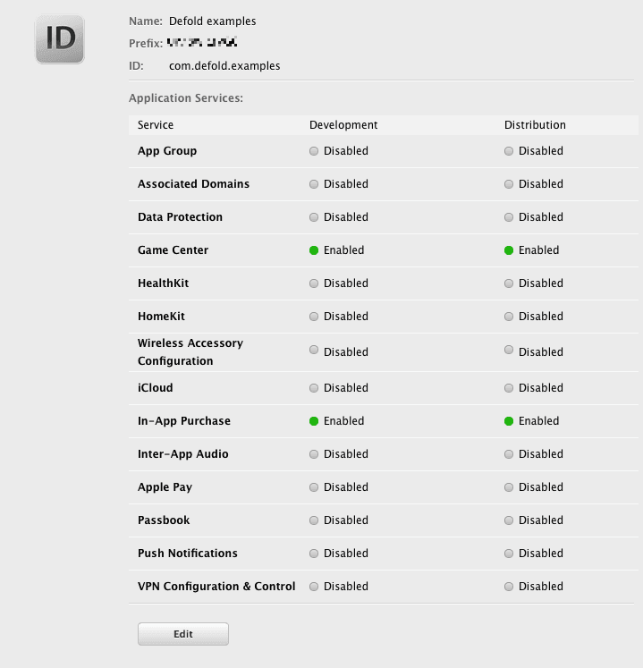

记得创建推送服务 SSL 证书:

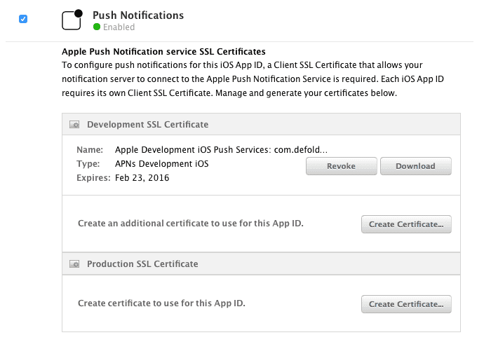

从你的服务器往通知推送服务器发送数据时需要这个证书. 开发调试时, 可以先在本地安装这个证书然后运行 [APNS-Pusher](https://github.com/KnuffApp/APNS-Pusher) 或者 [NWPusher](https://github.com/noodlewerk/NWPusher) 之类的测试工具.

记得创建包含要推送通知 AppID 的供应商档案, 并且在档案中设置好开发设备. 可以在 "Member Center" 页面或者 Xcode 中进行这些操作.

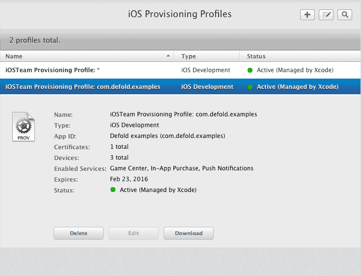

注意 Apple 的沙盒服务器可能需要一段时间更新信息, 通知推送功能也许不能马上使用. 要有耐心.

推送通知测试代码如下:

<a name="above-code"></a>
```lua
local function push_listener(self, payload, origin)
    -- 通知到达这里.
    pprint(payload)
end

function init(self)
    local sysinfo = sys.get_sys_info()
    if sysinfo.system_name == "Android" then
        msg.post("#", "push_android")
    elseif sysinfo.system_name == "iPhone OS" then
        msg.post("#", "push_ios")
    end
end

function on_message(self, message_id, message)
    if message_id == hash("push_ios") then
        local alerts = {push.NOTIFICATION_BADGE, push.NOTIFICATION_SOUND, push.NOTIFICATION_ALERT}
        push.register(alerts, function (self, token, error)
            if token then
                local t = ""
                for i = 1,#token do
                    t = t .. string.format("%02x", string.byte(token, i))
                end
                -- 打印设备token
                print(t)
            else
                -- 错误
                print(error.error)
            end
        end)
        push.set_listener(push_listener)
    elseif message_id == hash("push_android") then
        push.register(nil, function (self, token, error)
            if token then
                -- 打印设备token
                print(token)
            else
                -- 错误
                print(error.error)
            end
        end)
        push.set_listener(push_listener)
    end
end
```

如果一切顺利通知监听器会被注册然后打印出设备的 token:

```txt
DEBUG:SCRIPT: 1f8ba7869b84b10df69a07aa623cd7f55f62bca22cef61b51fedac643ec61ad8
```

如果运行的是测试应用, 你现在就可以尝试使用设备token和通知服务SSL证书向你的设备推送通知了.

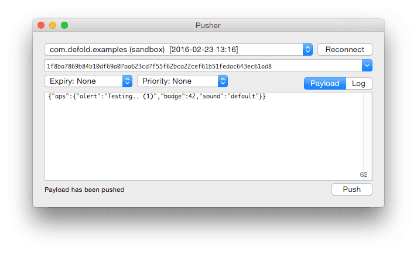

通知发送之后会被测试应用接收, 进入 `push_listener()` 函数:

```txt
DEBUG:SCRIPT:
{
  aps = {
    badge = 42,
    alert = Testing.. (1),
    sound = default,
  }
}
```

同时 iOS 桌面会提示通知:

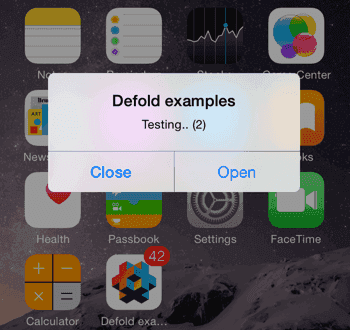

如果要在图标上显示计数角标, 可以使用 `push.set_badge_count()` 函数.

## Android 配置

::: sidenote
建议首先阅读 Firebase Cloud Messaging 服务文档. 文档在这里 https://firebase.google.com/docs/cloud-messaging/
:::

Android 上, 推送通知需要做以下准备:

* Firebase CM Sender ID 和应用 ID. 这些id会打包到应用中去.
* 用于使用 Firebase 服务的服务器 API Key.

::: sidenote
如果你的应用使用了 Google Cloud Messaging 平台, 现在需要导入 Firebase Cloud Messaging 平台中. 把应用从 Google dashboard 导入到 Firebase 即可. 导入后 *sender id* 保持不变, 你的 `game.project` 文件需要更新使用 `Firebase Application ID` (见下文).
:::

基本配置很简单. 登录 [https://console.firebase.google.com](https://console.firebase.google.com), 选择或者新建应用. 然后进入 *Grow* 的 *Cloud Messaging* 页面.

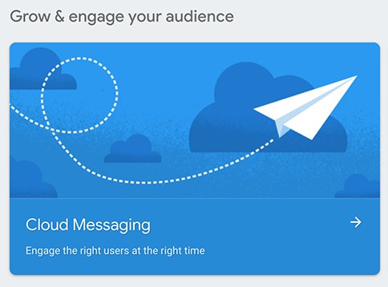

点击 Android 图标开始配置通知推送.


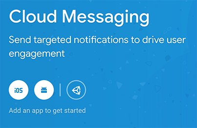

根据提示, 输入 Defold 游戏项目使用的包名.

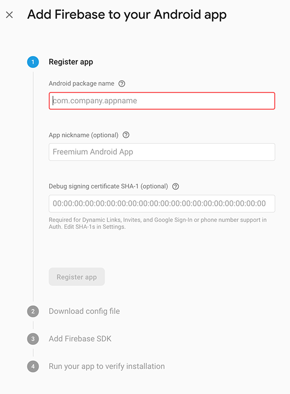

下载 `google-services.json`, 我们需要这个文件里面的一些信息.

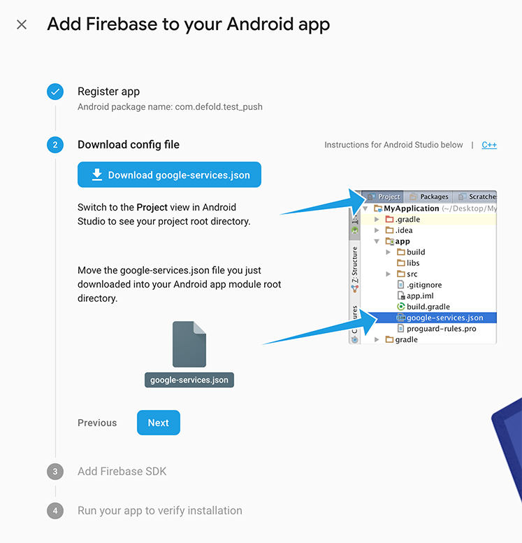

下面两步可以跳过, *Add Firebase SDK* 和 *Run your app to verify installation*. SDK 已打包进 Defold, 无需手动添加.

用文本编辑器打开 `google-services.json` 文件, 找到 *`project_number`* 和 *`mobilesdk_app_id`*. 把这俩id考入 `game.project` 文件, 对应 *android* 部分, `Gcm Sender Id` (`project_number`) 和 `Fcm Application Id` (`mobilesdk_app_id`).

```
{
  "project_info": {
    "project_number": "123456789123",
    "firebase_url": "https://project-name-ki7h7.firebaseio.com",
    "project_id": "project-name-ki7h7",
    "storage_bucket": "project-name-ki7h7.appspot.com"
  },
  "client": [
    {
      "client_info": {
        "mobilesdk_app_id": "1:123456789123:android:c1de85bbda9bc512",
        "android_client_info": {
          "package_name": "my.package.name"
        }
      },

```

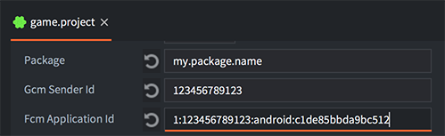

至此客户端准备就绪. [上面测试ios时用的代码](#above-code) 对 Android 同样有效. 运行并记录设备 token.

```txt
DEBUG:SCRIPT: APA91bHkcKm0QHAMUCEQ_Dlpq2gzset6vh0cz46kDDV6230C5rFivyWZMCxGXcjxRDKg1PK4z1kWg3xnUVqSDiO_4_RiG8b8HeYJfaoW1ho4ukWYXjq5RE0Sy-JTyrhqRusUP_BxRTcE
```

发送通知之前需要一个 Firebase 服务认证 key. 这个 key 位于 Firebase dashboard 的 *Settings* 的 *Cloud Messaging* 页面中.

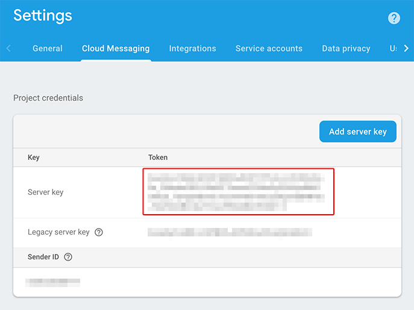

一切准备就绪. 可以通过使用 Web API 的 *curl* 命令测试推送功能:

```sh
$ curl  -X POST  -H "Content-type: application/json"  -H 'Authorization: key=SERVER_KEY' -d '{"registration_ids" : ["TOKEN_ID"], "data": {"alert": "Hello"}}' https://fcm.googleapis.com/fcm/send
```

注意把 `SERVER_KEY` 和 `TOKEN_ID` 替换成你记录下的key和token.

## 本地通知

除了远程推送还可以使用本地通知推送. 下面是本地通知的示例:

```lua
-- 3秒后推送本地通知
local payload = '{"data" : {"field" : "Some value", "field2" : "Other value"}}'
id, err = push.schedule(3, "A notification!", "Hello there", payload, { action = "get going" })
```

通知安排调用返回唯一id以便后续使用. `push.schedule()` 函数的最后一个参数不同平台有不同内容:

action
: (iOS 有效). 这个值用来设置通知右键标题或者用来替换解锁提示  "slide to unlock" 中的 "unlock" 字样.

badge_count
: (iOS 有效). 图标计数角标. 设置为0清除角标.

priority
: (Android 有效). 优先级决定了UI如何展示通知. 有以下5个等级:

  - push.PRIORITY_MIN
  - push.PRIORITY_LOW
  - push.PRIORITY_DEFAULT
  - push.PRIORITY_HIGH
  - push.PRIORITY_MAX

  如果不指定, 默认使用最大优先级.

## 本地通知查看

API 提供了两个函数用来查看当前安排下的本地通知.

```lua
n = push.get_scheduled(id)
pprint(n)
```

这个表里记录了通知相关的详细信息:

```txt
DEBUG:SCRIPT:
{
  payload = {"data":{"field":"Some value","field2":"Other value"}},
  title = A notification!,
  priority = 2,
  seconds = 19.991938,
  message = Hello there,
}
```

注意 `seconds` 是指离通知推送还差多少秒. 还有一个函数可以查看当前安排下的 _所有_ 通知:

```lua
all_n = push.get_all_scheduled()
pprint(all_n)
```

结果是通知id与其内容对应的表:

```txt
DEBUG:SCRIPT:
{
  0 = {
    payload = {"data":{"field":"Some value","field2":"Other value"}},
    title = A notification!,
    priority = 2,
    seconds = 6.009774,
    message = Hey hey,
  }
  1 = {
    payload = {"data":{"field":"Some value","field2":"Other value"}},
    title = Another notification!,
    priority = 2,
    seconds = 12.652521,
    message = Hello there,
  }
  2 = {
    payload = {"data":{"field":"Some value","field2":"Other value"}},
    title = Hey, much notification!,
    priority = 2,
    seconds = 15.553719,
    message = Please answer!,
  }
}
```
