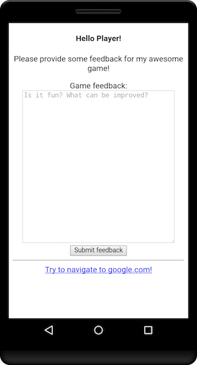
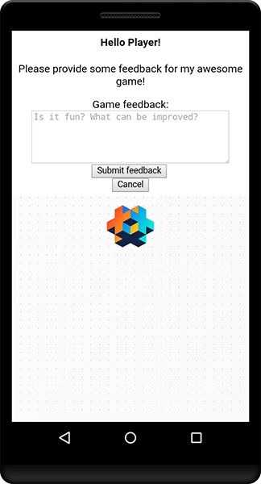

# WebViews
WebView 提供了一套特殊的 API 用来在手机上显示一个网页层. 首先让我们来实现一个简单的 webview.
然后我们会讨论如何使用一套简单的控制按钮控制这个 webview.

## 安装扩展

在你的 *game.project* 文件中设置 webview 依赖.
最新版本位于如下 URL:
```
https://github.com/defold/extension-webview/archive/master.zip
```

API文档位于 [扩展首页](https://defold.github.io/extension-webview/).

## 打开 webview
使用 `webview.create` 就能创建一个网页层, 并且返回一个唯一id. 下文中我们把这个 ID 称为 `webview_id`,
多个 `webview` 之间进行交互时会用到这个id. 也就是说创建和维护多个 webview 是可行的.

`webview.create` 带着一个函数参数, 待会儿我们再来仔细看看这个回调, 现在先给它留空.
```lua
local webview_id = webview.create(function()
        -- 目前无代码
    end)
```
默认状况下新建的 webview 都是不可见的, 因为它还没有加载任何内容. 其主要功能就是显示网页, 现在就来加载个超酷的网页吧!

调用 `webview.open` 函数, 第一个参数就是上文的那个 `webview_id`, 第二个参数是要打开的URL.

```lua
local request_id = webview.open(webview_id, "http://www.defold.com") --广告无处不在
```

这个函数返回网页请求的id, 这个id我们稍后也会用到.

如果一切顺利你将看到神奇的网页占满了屏幕, 就是 Defold 官方首页.

::: sidenote
要在 iOS 里访问的网页必须遵循在 `Info.plist` 文件中的 `NSAppTransportSecurity` 里面设置好的键值对.
```
<key>NSAllowsArbitraryLoads</key>
<true/>
```

开发的时候可以随便设置, 但是发布到 App Store 之后就只能通过使用 `NSExceptionDomains` 键代替. 这有点超出本教程讨论范围,
详情可以参考 [Apple 开发者文档](https://developer.apple.com/library/archive/documentation/General/Reference/InfoPlistKeyReference/Articles/CocoaKeys.html#//apple_ref/doc/uid/TP40009251-SW35).
:::

## 回调函数
顺利打开网页固然是好, 但要是 URL 无效或者出现其他不可预知的问题时要给用户显示错误信息怎么办? 或者要在用户离开网页时做些什么该怎么办?
幸运的是 webview 扩展程序具备了报错, 导航, 载入成功等等事件回调功能. 只需在调用 `webview.create` 时传入回调函数作为参数即可.

回调函数特征如下:
```lua
function callback(self, webview_id, request_id, type, data)
```

* **`self`** - 回调函数所处的脚本引用.
* **`webview_id`** - 回调函数可以做到多个webview共用, 这个参数引用的是回调事件发生的那个webview的id.
* **`request_id`** - 同样 `webview.open` 也可以共用一个回调回调函数, 这个参数引用的是回调事件发生的那个载入请求的id.
* **`type`** - 事件的类型, 枚举类型, 下文 *回调类型* 章节会详细探讨.
* **`data`** - 不同时间连带的各种数据信息.

#### 回调类型
回调的 `type` 参数可以被设置为以下枚举之一：

* **`webview.CALLBACK_RESULT_URL_LOADING`** - 在 webview 内导航时, 载入事件被触发. 调用 `webview.open` 或者
用户点击页面上的超级链接都会造成事件触发. 事件的处理结果决定了载入请求是否被允许. 如果返回 `false` 则载入终止, 其他值则是允许载入.
被允许的链接也会记录在回调函数 `data` 表的 `url` 项里.
* **`webview.CALLBACK_RESULT_URL_ERROR`** 和 **`webview.CALLBACK_RESULT_EVAL_ERROR`** -一旦载入出错, 或者
执行JavaScript脚本出错 (下文 *运行JavaScript脚本* 章节会详细探讨), 错误事件就会被触发. `data` 表的 `result` 项用一个字符串记录了错误的详细内容.
* **`webview.CALLBACK_RESULT_URL_OK`** 和 **`webview.CALLBACK_RESULT_EVAL_OK`** - 一旦载入成功, 或者执行JavaScript脚本成功,
OK事件就会被触发. 对于成功执行的JavaScript程序, 其执行结果会被保存在 `data` 表的 `result` 项之中.

事件触发介绍完了, 现在我们来看一个复杂点的例子.

比如我们要向玩家展示一个反馈页面, 玩家通过一个 HTML 表格发送反馈意见. 我们要在载入不成功的时候要提示友好的错误信息并关闭webview而不是把白屏留给玩家.
接下来我们尽量不让玩家离开这个反馈页面.

升级版的 `webview.create` 调用和回调被设计成下面这样:
```lua
local player_feedback_url = "https://example.com/my_game_name/customer_feedback"

local function webview_callback(self, webview_id, request_id, type, data)
    if type == webview.CALLBACK_RESULT_URL_ERROR then
        -- 遇到错误!
        -- 关闭 webview 然后显示提示文本!
        webview.destroy(webview_id)
        label.set_text("#label", "Player feedback not available at this moment.")

    elseif type == webview.CALLBACK_RESULT_URL_LOADING then
        -- 不让玩家离开这个页面.
        if data.url ~= player_feedback_url then
            return false
        end
    end
end

local feedback_webview = webview.create(webview_callback)
webview.open(feedback_webview, player_feedback_url)
```

一个反馈页面展示就完成了. 网页自己做, 打开后大概像这个样子:



注意: 我们的例子里有一个指向 google.com 的超级链接, 目的是试试玩家点别的链接出不出的去. --牛虻

强制反馈功能完成! 但是怎么提交反馈呢? 也许玩家不想提交反馈呢, 怎么返回游戏? 再说, 全屏的网页真的合适吗? 后面的游戏界面全都被挡住了啊!
我们会在下文的 *运行 JavaScript 脚本* 和 *可视定位控制面板* 章节继续探讨.

## 载入展示自己的 HTML 网页
继续深入探讨之前, 我们来动手做一个可以用来交互的 HTML 简单网页.

通过调用 `webview.open_raw` 函数我们可以让webview直接解析加载 HTML 文件源码. 这样即使没有服务器, 网络环境恶劣的情况下, 都可以载入我们的网页.

`webview.open_raw` 的第一个参数和 `webview.open` 一样是 `webview_id`. 第二个参数换成网页源代码引用.

下面来看一个把网页代码直接写在脚本里的例子:
```lua
local feedback_html = [[
<html>
<script type="text/javascript">
    function closeWebview() {
        // 暂时留空
    }
    function submitFeedback() {
        // 暂时留空
    }
</script>
<body>
    <center>
    <h4>Hello Player!</h4>
    <p>Please provide some feedback for my awesome game!</p>
    <form>
        <label>Game feedback:<br><textarea placeholder="Is it fun? What can be improved?" style="width: 300px; height: 80px"></textarea></label><br>
        <input type="button" onclick="submitFeedback()" value="Submit feedback">
        <br>
        <input type="button" onclick="closeWebview()" value="Cancel">
    </form>
</center>
</body>
</html>
]]

local function webview_callback(self, webview_id, request_id, type, data)
    -- ...
end

local webview_id = webview.create(webview_callback)
webview.open_raw(webview_id, feedback_html)
```

效果与前面的示例类似, 不同的是这次我们可以随时任意修改网页代码.
**注意:** 本例中 `webview_callback` 函数与前例类似故忽略.

众所周知一个 HTML 源码包含所有代码和资源是不明智的, 最好把 JavaScript 和 CSS 等资源分门别类保存为文件, 这种情况下
可以使用 [`sys.load_resource`](https://www.defold.com/ref/sys/#sys.load_resource:filename) 进行资源文件的预加载.
而且这样做还有一个好处就是可以随时打开网页浏览器查看网页效果.

新建一个文件夹 (`custom_resources`) 和一个 HTML 文件 (`feedback.html`). 然后用 `feedback_html` 变量引用这些资源.

```lua
local feedback_html = sys.load_resource("/custom_resources/feedback.html")
-- ...
webview.open_raw(webview_id, feedback_html)
```

## 可视性和位置控制
现在来解决网页占据全屏问题.

为了更方便的互动, 我们要把网页放在游戏屏幕上半部分. 可以使用 `webview.set_position` 函数设置webview的位置和宽高.
设置 `-1` 代表在这个轴向上占据全部屏幕.

```lua
local webview_id = webview.create(webview_callback)
-- 位置: 屏幕左上角 (0, 0)
-- 尺寸: 全屏款, 500像素高
webview.set_position(webview_id, 0, 0, -1, 500)
```



遇到性能不理想的设备, 网页从加载到显示可能会白屏很长时间. 这个体验很不好, 所以加载完成之前我们先把webview隐藏起来. 同时我们还要提示玩家资源正在加载.

这里用到 `webview.open_raw` (`webview.open` 同样) 的第三个参数, 传入一个表, 然后设置 `hidden` 键为 `true`.
默认是 `false`, 代表像前面示例那样一调用加载就可见.

```lua
webview.open_raw(webview_id, feedback_html, {hidden = true})
```

等到 `webview.CALLBACK_RESULT_URL_OK` 事件触发说明资源加载完毕. 这时就可以显示webview了, 调用 `webview.set_visible` 函数即可.

升级版的回调函数如下:
```lua
local function webview_callback(self, webview_id, request_id, type, data)
    if type == webview.CALLBACK_RESULT_URL_OK then
        -- 顺利完成加载, 显示webview!
        webview.set_visible(webview_id, 1)
    elseif type == webview.CALLBACK_RESULT_URL_ERROR then
        -- ...
```

## 运行 JavaScript 脚本
现在来解决关闭webview的事.

前例中已经出现过, 遇到错误事件触发时, 调用了 `webview.destroy` 函数. 但是没有错误就没法把握关闭webview的时机.
幸好引擎提供了从 Lua 到webview里运行的 JavaScript 程序的交互功能. 这样我们就能关注webview里js变量的变化.

当玩家按下网页上的一个按钮时, 运行一段程序, 改变一个变量.
```js
var shouldClose = false;
function closeWebview() {
    shouldClose = true;
}
function submitFeedback() {
    // 自定义反馈处理代码
    // ...
    closeWebview();
}

```

不论玩家按了 "提交反馈" 还是 "取消反馈" 按钮, 程序都会把 `shouldClose` 变量设置为 true.

在 Lua 脚本里我们只要发现 `shouldClose` 变为 true 了, 就知道该调用 `webview.destroy` 了.
正好有个好地方来关注这个变量, 就是在每帧都会被调用的 `update` 函数里.

```lua
function update(self, dt)
    if not self.closeCheckRequest then
        self.closeCheckRequest = webview.eval(webview_id, "shouldClose")
    end
end
```

注意这里 `webview.eval` 返回的并不是 JavaScript 的运行结果, 而是 *运行请求id*. 我们首先要确定回调函数的请求id, 这个函数里传入的 `data.result` 才是真正的 JavaScript 运行结果.

```lua
local function webview_callback(self, webview_id, request_id, type, data)
    if type == webview.CALLBACK_RESULT_EVAL_OK and
        request_id == self.closeCheckRequest then

        -- 比较JavaScript执行结果, 如果是 "true" (iOS 上为 "1" )
        -- 就应该关闭 webview!
        if data.result == "true" or data.result == "1" then
            webview.destroy(webview_id)
        end

    elseif type == webview.CALLBACK_RESULT_URL_OK then
        -- ...
```

这样一来玩家在点击按钮之后就能返回继续游戏了!
