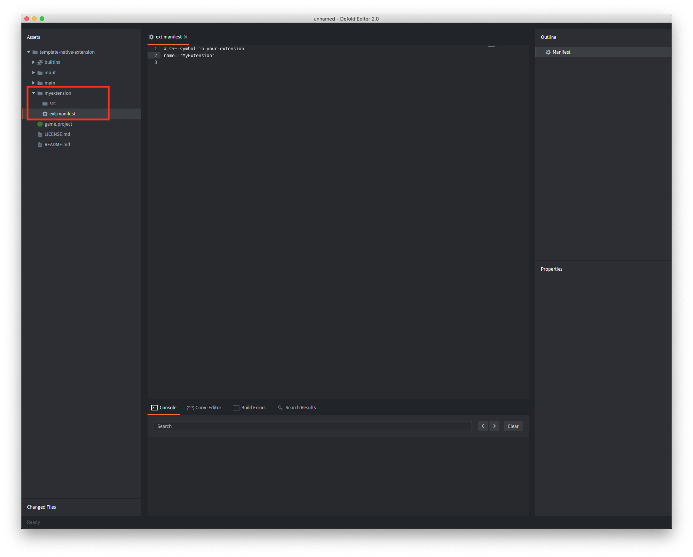

# 原生扩展

如果您需要与外部软件或硬件进行底层交互，而Lua本身无法满足需求，Defold SDK允许您使用C、C++、Objective C、Java或Javascript（取决于目标平台）为引擎编写扩展。原生扩展的典型用例包括：

- 与特定硬件交互，例如手机摄像头。
- 与外部底层API交互，例如不允许通过网络API进行交互的广告网络API，而Luasocket本可以用于此类交互。
- 高性能计算和数据处理。

## 构建服务器

Defold通过基于云的构建解决方案，为零配置原生扩展提供了入口点。任何开发并添加到游戏项目中的原生扩展（无论是直接添加还是通过[库项目](/manuals/libraries/)添加），都将成为普通项目内容的一部分。无需构建特殊版本的引擎并分发给团队成员，这一过程会自动处理——任何构建和运行项目的团队成员都将获得一个包含所有原生扩展的项目特定引擎可执行文件。


Defold免费提供云构建服务器，没有任何使用限制。服务器托管在欧洲，发送本地代码的URL在[编辑器首选项窗口](/manuals/editor-preferences/#extensions)中配置，或通过[bob](/manuals/bob/#usage)的`--build-server`命令行选项配置。如果您希望设置自己的服务器，请[遵循这些说明](/manuals/extender-local-setup)。

## 项目布局

要创建新扩展，请在项目根目录中创建一个文件夹。此文件夹将包含与扩展相关的所有设置、源代码、库和资源。扩展构建器会识别文件夹结构并收集任何源文件和库。

```
 myextension/
 │
 ├── ext.manifest
 │
 ├── src/
 │
 ├── include/
 │
 ├── lib/
 │   └──[platforms]
 │
 ├── manifests/
 │   └──[platforms]
 │
 └── res/
     └──[platforms]

```
*ext.manifest*
: 扩展文件夹_必须_包含一个*ext.manifest*文件。此文件是配置文件，包含构建单个扩展时使用的标志和定义。文件格式定义可在[扩展清单手册](https://defold.com/manuals/extensions-ext-manifests/)中找到。

*src*
: 此文件夹应包含所有源代码文件。

*include*
: 此可选文件夹包含任何包含文件。

*lib*
: 此可选文件夹包含扩展所依赖的任何已编译库。库文件应放置在按`platform`或`architecture-platform`命名的子文件夹中，具体取决于您的库支持的架构。

  :[platforms](../shared/platforms.md)

*manifests*
: 此可选文件夹包含构建或打包过程中使用的其他文件。详情请见下文。

*res*
: 此可选文件夹包含扩展所依赖的任何额外资源。资源文件应像"lib"子文件夹一样，放置在按`platform`或`architecture-platform`命名的子文件夹中。还允许使用`common`子文件夹，包含所有平台通用的资源文件。

### 清单文件

扩展的可选*manifests*文件夹包含构建和打包过程中使用的其他文件。文件应放置在按`platform`命名的子文件夹中：

* `android` - 此文件夹接受要合并到主应用程序中的清单存根文件（[如此处所述](/manuals/extensions-manifest-merge-tool)）。
  * 该文件夹还可以包含一个`build.gradle`文件，其中包含要[由Gradle解析的依赖项](/manuals/extensions-gradle)。
  * 最后，该文件夹还可以包含零个或多个ProGuard文件（实验性）。
* `ios` - 此文件夹接受要合并到主应用程序中的清单存根文件（[如此处所述](/manuals/extensions-manifest-merge-tool)）。
  * 该文件夹还可以包含一个`Podfile`文件，其中包含要[由Cocoapods解析的依赖项](/manuals/extensions-cocoapods)。
* `osx` - 此文件夹接受要合并到主应用程序中的清单存根文件（[如此处所述](/manuals/extensions-manifest-merge-tool)）。
* `web` - 此文件夹接受要合并到主应用程序中的清单存根文件（[如此处所述](/manuals/extensions-manifest-merge-tool)）。


## 共享扩展

扩展在项目中被视为与其他资产一样，可以以相同方式共享。如果原生扩展文件夹作为库文件夹添加，它可以作为项目依赖项共享给其他人使用。有关更多信息，请参考[库项目手册](/manuals/libraries/)。


## 一个简单的扩展示例

让我们构建一个非常简单的扩展。首先，我们创建一个新的根文件夹*`myextension`*并添加一个包含扩展名"MyExtension"的*`ext.manifest`*文件。请注意，该名称是一个C++符号，必须与`DM_DECLARE_EXTENSION`的第一个参数匹配（见下文）。



```yaml
# C++ symbol in your extension
name: "MyExtension"
```

该扩展由一个C++文件*`myextension.cpp`*组成，该文件在"`src`"文件夹中创建。


扩展源文件包含以下代码：

```cpp
// myextension.cpp
// Extension lib defines
#define LIB_NAME "MyExtension"
#define MODULE_NAME "myextension"

// include the Defold SDK
#include <dmsdk/sdk.h>

static int Reverse(lua_State* L)
{
    // The number of expected items to be on the Lua stack
    // once this struct goes out of scope
    DM_LUA_STACK_CHECK(L, 1);

    // Check and get parameter string from stack
    char* str = (char*)luaL_checkstring(L, 1);

    // Reverse the string
    int len = strlen(str);
    for(int i = 0; i < len / 2; i++) {
        const char a = str[i];
        const char b = str[len - i - 1];
        str[i] = b;
        str[len - i - 1] = a;
    }

    // Put the reverse string on the stack
    lua_pushstring(L, str);

    // Return 1 item
    return 1;
}

// Functions exposed to Lua
static const luaL_reg Module_methods[] =
{
    {"reverse", Reverse},
    {0, 0}
};

static void LuaInit(lua_State* L)
{
    int top = lua_gettop(L);

    // Register lua names
    luaL_register(L, MODULE_NAME, Module_methods);

    lua_pop(L, 1);
    assert(top == lua_gettop(L));
}

dmExtension::Result AppInitializeMyExtension(dmExtension::AppParams* params)
{
    return dmExtension::RESULT_OK;
}

dmExtension::Result InitializeMyExtension(dmExtension::Params* params)
{
    // Init Lua
    LuaInit(params->m_L);
    printf("Registered %s Extension\n", MODULE_NAME);
    return dmExtension::RESULT_OK;
}

dmExtension::Result AppFinalizeMyExtension(dmExtension::AppParams* params)
{
    return dmExtension::RESULT_OK;
}

dmExtension::Result FinalizeMyExtension(dmExtension::Params* params)
{
    return dmExtension::RESULT_OK;
}


// Defold SDK uses a macro for setting up extension entry points:
//
// DM_DECLARE_EXTENSION(symbol, name, app_init, app_final, init, update, on_event, final)

// MyExtension is the C++ symbol that holds all relevant extension data.
// It must match the name field in the `ext.manifest`
DM_DECLARE_EXTENSION(MyExtension, LIB_NAME, AppInitializeMyExtension, AppFinalizeMyExtension, InitializeMyExtension, 0, 0, FinalizeMyExtension)
```

请注意用于声明扩展代码中各种入口点的宏`DM_DECLARE_EXTENSION`。第一个参数`symbol`必须与*ext.manifest*中指定的名称匹配。对于这个简单的示例，不需要任何"update"或"on_event"入口点，因此在这些位置向宏提供了`0`。

现在只需构建项目（<kbd>Project ▸ Build</kbd>）。这将把扩展上传到扩展构建器，构建器将生成一个包含新扩展的自定义引擎。如果构建器遇到任何错误，将显示一个包含构建错误的对话框。

要测试扩展，创建一个游戏对象并添加一个带有一些测试代码的脚本组件：

```lua
local s = "abcdefghijklmnopqrstuvwxyzABCDEFGHIJKLMNOPQRSTUVWXYZ"
local reverse_s = myextension.reverse(s)
print(reverse_s) --> ZYXWVUTSRQPONMLKJIHGFEDCBAzyxwvutsrqponmlkjihgfedcba
```

就是这样！我们已经创建了一个完全可用的原生扩展。


## 扩展生命周期

如上所述，`DM_DECLARE_EXTENSION`宏用于声明扩展代码中的各种入口点：

`DM_DECLARE_EXTENSION(symbol, name, app_init, app_final, init, update, on_event, final)`

入口点将允许您在扩展生命周期的各个点运行代码：

* 引擎启动
  * 引擎系统正在启动
  * 扩展 `app_init`
  * 扩展 `init` - 所有Defold API已初始化。这是扩展生命周期中推荐的创建扩展代码Lua绑定的点。
  * 脚本初始化 - 脚本文件的`init()`函数被调用。
* 引擎循环
  * 引擎更新
    * 扩展 `update`
    * 脚本更新 - 脚本文件的`update()`函数被调用。
  * 引擎事件（窗口最小化/最大化等）
    * 扩展 `on_event`
* 引擎关闭（或重启）
  * 脚本最终 - 脚本文件的`final()`函数被调用。
  * 扩展 `final`
  * 扩展 `app_final`

## 已定义的平台标识符

构建器在每个相应平台上定义了以下标识符：

* DM_PLATFORM_WINDOWS
* DM_PLATFORM_OSX
* DM_PLATFORM_IOS
* DM_PLATFORM_ANDROID
* DM_PLATFORM_LINUX
* DM_PLATFORM_HTML5

## 构建服务器日志

当项目使用原生扩展时，构建服务器日志可用。构建服务器日志（`log.txt`）在项目构建时与自定义引擎一起下载，并存储在项目的`.internal/%platform%/build.zip`文件中，同时也解压到项目的构建文件夹中。


## 扩展示例

* [基础扩展示例](https://github.com/defold/template-native-extension)（本手册中的扩展）
* [Android扩展示例](https://github.com/defold/extension-android)
* [HTML5扩展示例](https://github.com/defold/extension-html5)
* [macOS、iOS和Android videoplayer扩展](https://github.com/defold/extension-videoplayer)
* [macOS和iOS摄像头扩展](https://github.com/defold/extension-camera)
* [iOS和Android应用内购买扩展](https://github.com/defold/extension-iap)
* [iOS和Android Firebase Analytics扩展](https://github.com/defold/extension-firebase-analytics)

[Defold资产门户](https://www.defold.com/assets/)也包含多个原生扩展。
