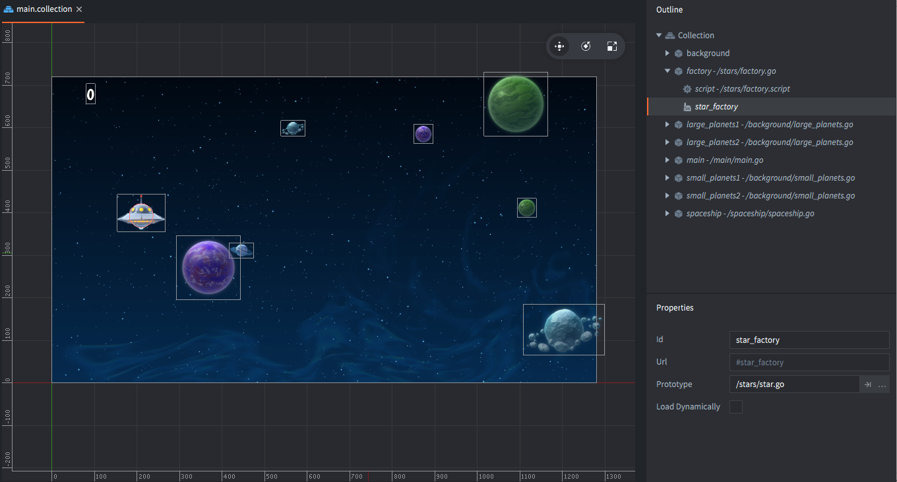
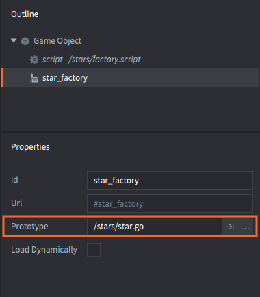
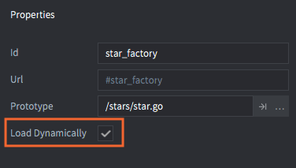

# Factory 组件

工厂组件用于在游戏运行时从对象池动态创建游戏对象.

工厂组件的 *Prototype* 属性就是动态创建游戏对象的蓝图.





要创建游戏对象, 调用 `factory.create()`:

```lua
-- factory.script
local p = go.get_position()
p.y = vmath.lerp(math.random(), min_y, max_y)
local component = "#star_factory"
factory.create(component, p)
```


`factory.create()` 有5个参数:

`url`
: 工厂组件的id.

`[position]`
: (可选) 新创建游戏对象的世界坐标位置. 以 `vector3` 表示. 如果不指定位置, 默认位置是工厂组件游戏对象的位置.

`[rotation]`
: (可选) 新创建游戏对象的世界坐标旋转. 以 `quat` 表示.

`[properties]`
: (可选) 新创建游戏对象的属性初始化 Lua 表. 详情请见 [脚本属性教程](/manuals/script-properties).

`[scale]`
: (可选) 新创建游戏对象的等比缩放. 以 `number` (大于 0) 表示. 或者以 `vector3` 表示每个坐标轴上的非等比缩放.

例如:

```lua
-- factory.script
local p = go.get_position()
p.y = vmath.lerp(math.random(), min_y, max_y)
local component = "#star_factory"
-- Spawn with no rotation but double scale.
-- Set the score of the star to 10.
factory.create(component, p, nil, { score = 10 }, 2.0) -- <1>
```
1. 设置 star 游戏对象的 "score" 属性.

```lua
-- star.script
go.property("score", 1) -- <1>

local speed = -240

function update(self, dt)
    local p = go.get_position()
    p.x = p.x + speed * dt
    if p.x < -32 then
        go.delete()
    end
    go.set_position(p)
end

function on_message(self, message_id, message, sender)
    if message_id == hash("collision_response") then
        msg.post("main#gui", "add_score", {amount = self.score}) -- <2>
        go.delete()
    end
end
```
1. "score" 脚本属性初始化时要有默认值.
2. "score" 脚本属性保存在 "self" 中.


::: 注意
Defold 目前不支持碰撞形状的非等比缩放. 如果赋了非等比值, 比如 `vmath.vector3(1.0, 2.0, 1.0)` 则 sprite 会正确缩放但是碰撞形状不会正确缩放.
:::

## 新对象引用和对象父级

调用 `factory.create()` 会返回新游戏对象的id, 以便保存其引用. 通常把 id:s 保存到一个表里以便需要时统一删除, 比如重启关卡时:

```lua
-- spawner.script
self.spawned_coins = {}

...

-- 把新建对象存入 "spawned_coins" 表中.
local id = factory.create("#coinfactory", coin_position)
table.insert(self.spawned_coins, id)
```

需要的时候:

```lua
-- coin.script
-- 删除所有 coins.
for _, coin_id = ipairs(self.spawned_coins) do
    go.delete(coin_id)
end

-- 或者直接
go.delete_all(self.spawned_coins)
```

另一种常见用法是创建新对象时保存一个引用，同时新对象也保存脚本的一个引用，等以后需要时可以给创建脚本发送通知消息:

```lua
-- spawner.script
-- 创建 drone 然后设置其引用者为此脚本
self.spawned_drone = factory.create("#dronefactory", drone_position, nil, { parent = msg.url() })

...

function on_message(self, message_id, message, sender)
    if message_id == hash("drone_dead") then
        self.spawed_drone = nil
    end
end
```

drone 的脚本:

```lua
-- drone.script
go.property("parent", msg.url())

...

function final(self)
    -- 析构时.
    msg.post(self.parent, "drone_dead")
end
```

## 工厂资源的动态加载

开启工厂属性的 *Load Dynamically*, 工厂资源将会被延迟加载.



关闭动态加载，则加载工厂组件时会同时加载其需要的资源以便工厂可以尽快创建新游戏对象.

开启动态加载, 有两种用法:

同步加载
: 调用 [`factory.create()`](/ref/factory/#factory.create) 函数创建新对象时. 资源会同步加载, 这意味着游戏可能会卡一下, 加载完成后再创建新对象.

  ```lua
  function init(self)
      -- 工厂父级集合加载时
      -- 工厂资源不会被加载. 调用 create 函数
      -- 会把资源进行同步加载.
      self.go_id = factory.create("#factory")
  end
  
  function final(self)  
      -- 删掉游戏对象，资源引用计数减少
      -- 本例中工厂资源也会被卸载
      -- 因为工厂组件不包含对资源的引用.
      go.delete(self.go_id)

      -- 因为工厂组件不包含对资源的引用，所以对工厂调用 unload 没有意义
      factory.unload("#factory")
  end
  ```

异步加载
: 调用 [`factory.load()`](/ref/factory/#factory.load) 函数进行资源的异步加载. 资源加载完毕后, 回调用回调函数.

  ```lua
  function load_complete(self, url, result)
      -- 资源加载完成，可以新建对象
      self.go_id = factory.create(url)
  end
  
  function init(self)
      -- 工厂父级集合加载时
      -- 工厂资源不被加载. 调用 load 函数进行资源异步加载.
      factory.load("#factory", load_complete)
  end
  
  function final(self)
      -- 删掉游戏对象，资源引用计数减少
      -- 本例中工厂资源不会被卸载
      -- 因为工厂组件包含对资源的引用..
      go.delete(self.go_id)
  
      -- 调用 unload 函数，工厂对资源引用被释放,
      -- 这样资源才会被卸载.
      factory.unload("#factory")
  end
  ```

## 实例限制

项目设置 *Collection related settings* 部分 *max_instances* 限制了游戏世界 (启动集合 main.collection 或者通过集合代理加载的集合) 中游戏对象的最大数目. 不论是子编辑器里创建的还是用脚本动态创建的游戏对象综合不得超过这个最大值.


比如如果把 *max_instances* 设置为 1024 然后手动拖放 24 游戏对象到主集合, 那么最多还能创建 1000 个游戏对象. 如果删除一个对象, 就能再创建一个对象.

## 游戏对象池

使用游戏对象池提高对象重用性是个好办法. 然而, 游戏引擎已经使用对象池进行游戏对象管理，用户就不必多此一举了. 不论删除还是创建对象, 都能保证稳定高效.

