# Defold for Flash users

本指南为 Flash 游戏开发者介绍了 Defold 作为替代方案。它涵盖了 Flash 游戏开发中使用的一些关键概念，并解释了 Defold 中相应的工具和方法。

## 介绍

Flash 的一些主要优势是易用性和低入门门槛。新用户可以快速学习该程序，并能在有限的时间投入内创建基本游戏。Defold 通过提供一套专门用于游戏设计的工具提供了类似的优势，同时使高级开发者能够为更复杂的需求创建高级解决方案（例如允许开发者编辑默认渲染脚本）。

Flash 游戏使用 ActionScript 编程（3.0 是最新版本），而 Defold 脚本使用 Lua 编写。本指南不会详细比较 Lua 和 Actionscript 3.0。[Defold 手册](/manuals/lua) 提供了 Defold 中 Lua 编程的良好介绍，并引用了非常有用的 [Programming in Lua](https://www.lua.org/pil/)（第一版），该书可在线免费获取。

Jesse Warden 的一篇文章提供了 [Actionscript 和 Lua 的基本比较](http://jessewarden.com/2011/01/lua-for-actionscript-developers.html)，这可以作为一个很好的起点。但请注意，Defold 和 Flash 在构建方式上的差异比语言层面可见的差异更深。Actionscript 和 Flash 在经典意义上是面向对象的，具有类和继承。Defold 没有类，也没有继承。它包含 *游戏对象* 的概念，可以包含视听表示、行为和数据。对游戏对象的操作是通过 Defold API 中可用的 *函数* 完成的。此外，Defold 鼓励使用 *消息* 在对象之间进行通信。消息是比方法调用更高级的构造，并不打算用作方法调用。这些差异很重要，需要一段时间才能适应，但本指南不会详细讨论。

相反，本指南探讨了 Flash 游戏开发的一些关键概念，并概述了 Defold 中最接近的等价物。讨论了相似性和差异，以及常见的陷阱，使你能够从 Flash 过渡到 Defold 时快速上手。

## 影片剪辑和游戏对象

影片剪辑是 Flash 游戏开发的基础组成部分。每个影片剪辑包含自己的时间轴。Defold 中类似的概念是游戏对象。

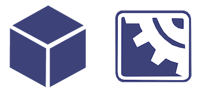

不同的是，Defold 游戏对象没有时间轴。却能包含很多组件。组件有 sprite、sound、脚本等等（关于组件详情请见 [构成教程](/manuals/building-blocks)）。下图这个游戏对象包含一个 sprite 和一个脚本。脚本用来控制游戏对象生命周期中的行为：

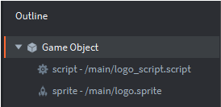

影片剪辑可以包含其他影片剪辑，游戏对象不是 *包含* 其他游戏对象。但是能够与其他游戏对象建立 *父子* 层级关系，父子关系的游戏对象可以一起移动、旋转和缩放。

## Flash 手动创建影片剪辑

在 Flash 中，影片剪辑可以在 IDE 中手动创建，也可以运行时动态创建。手动创建的影片剪辑需要给实例名，才能在代码里引用。


## Defold—手动创建游戏对象

Defold 中，游戏对象可以在编辑器里手动创建，也可以运行时动态创建。手动创建的游戏对象需要给唯一 id，才能在代码里引用。

集合可以用来管理游戏对象。集合是容纳游戏对象和其他集合的容器（或称 prefabs）。最简单的情况，一个游戏有一个集合。通常，Defold 游戏包含许多集合，或者手动指定启动 “main” 集合或者通过 [集合代理](/manuals/collection-proxy) 动态载入集合。但是 Flash 的 "levels" 或者 "screens" 没有这个能力。

下面的例子里，"main" 集合（看右边，*Outline* 窗口里）包含3个 "logo" 游戏对象（看左边，*Assets* 浏览器窗口里）：

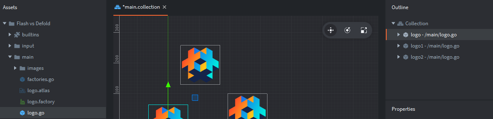

## Flash—手动引用影片剪辑

Flash 需要定义影片剪辑实例名再手动引用:

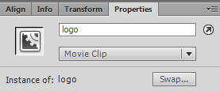

## Defold—游戏对象id

Defold 通过地址引用所有对象. 多数情况下使用快捷地址或者短小的名字就好. 例如:

- `"."` 定位当前游戏对象.
- `"#"` 定位当前脚本组件.
- `"logo"` 定位 id 叫 "logo" 的游戏对象.
- `"#script"` 定位当前游戏对象里 id 叫 "script" 的脚本组件.
- `"logo#script"` 定位游戏对象 "logo" 下的 "script" 脚本.

手动拖放对象的地址由 *Id* 属性 (上图右下角) 决定. 每个集合里一个对象的id是唯一的. 编辑器可以自动生成默认id但是所有对象的id都可以随意更改.


::: sidenote
对象的id可以使用脚本: `print(go.get_id())` 查看. 它会在控制台打印出当前游戏对象的id.
:::

地址定位和消息传递是 Defold 游戏开发的核心概念. [定位教程](/manuals/addressing) 和 [消息传递教程](/manuals/message-passing) 里有更详细的介绍.

## Flash—动态创建影片剪辑

Flash 里动态创建影片剪辑, 需要预先设置好 ActionScript Linkage:


它创建了一个类 (本例是 Logo 图标), 这个类可以用于创建对象. 如下代码使用Logo类在舞台上创建了logo对象:

```as
var logo:Logo = new Logo();
addChild(logo);
```

## Defold—使用工厂创建游戏对象

Defold 使用 *工厂* 动态创建游戏对象. 工厂是创建游戏对象拷贝的组件. 本例中, 以 "logo" 游戏对象为原型创建了一个工厂组件:

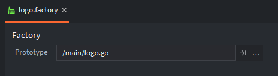

注意工厂组件, 需要像其他组件一样, 需要添加到游戏对象里才能用. 本例中, 我们创建了叫做 "factories" 的游戏对象, 来容纳工厂组件:

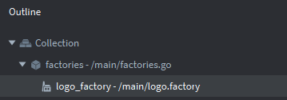

如下代码使用工厂创建了游戏对象实例:

```lua
local logo_id = factory.create("factories#logo_factory")
```

URL 是 `factory.create()` 函数的必要参数. 此外, 还有可选参数用以设置位置, 旋转, 缩放, 和其他属性. 工厂组件详情请见 [工厂教程](/manuals/factory). 注意调用 `factory.create()` 可返回被创建游戏对象的id. 可以把这个id放入表中留待以后引用 (Lua 的表相当于其他语言的数组).

## Flash—舞台

在 Flash 中，我们熟悉时间轴（下图的上部）和舞台（时间轴下方可见）：

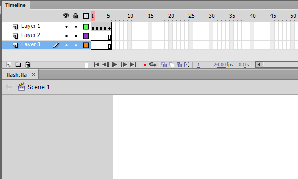

如上面影片剪辑部分所讨论的，舞台本质上是 Flash 游戏的顶级容器，在每次导出项目时创建。舞台默认情况下有一个子对象，即 *`MainTimeline`*。项目中生成的每个影片剪辑都有自己的时间轴，并且可以作为其他符号（包括影片剪辑）的容器。

## Defold—collections

Defold 的集合类似于舞台. 引擎启动时集合文件的内容组成了游戏世界. 默认启动集合叫 "main.collection" 但是可以在 *game.project* 项目配置文件里随意更改:


集合作为容器管理着游戏对象和其他集合. 通过 [集合工厂](/manuals/collection-factory/#创建集合) 可以在运行时动态创建集合内容, 就像游戏对象工厂创建游戏对象一样. 集合可以包含多组敌人, 或者一堆钱币, 之类的. 下图中, 我们手动拖放了两组 "logos" 集合到 "main" 集合中.


有时, 你需要载入完整的游戏世界. [集合代理](/manuals/collection-proxy/) 组件能让你基于集合文件内容创建一个新的游戏世界. 这在诸如需要加载关卡, 迷你游戏, 或者过场动画之类的功能时很有用.

## Flash—时间轴

Flash 时间轴主要用于动画，使用各种逐帧技术或形状/运动补间。项目的整体 FPS（每秒帧数）设置定义了帧显示的时间长度。高级用户可以修改游戏的整体 FPS，甚至单个影片剪辑的 FPS。

形状补间允许在矢量图形的两个状态之间进行插值。它主要适用于简单的形状和应用，如下例中将正方形补间成三角形所示：


运动补间允许对对象的各种属性进行动画，包括大小、位置和旋转。在下面的例子中，所有列出的属性都被修改了。

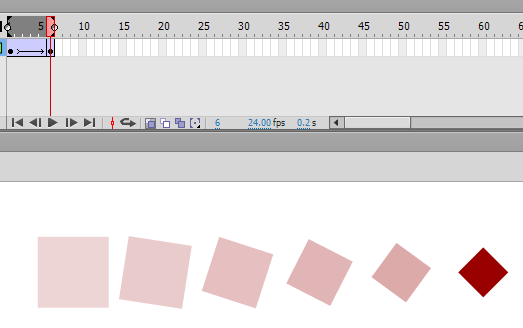

## Defold—属性动画

Defold 不使用矢量图而是使用位图，所以没有形状补间。但是运动补间可以使用 [属性动画](/ref/go/#go.animate) 来实现。通过脚本，调用 `go.animate()` 函数即可。go.animate() 函数基于各种缓动函数（可以自定义），对属性（比如颜色、缩放、旋转或者位置）进行从初始值到设定结束值的补间。Defold 引擎内置了许多要 Flash 用户自定义才能实现的 [缓动函数](/manuals/animation/#easing)。

Flash 在时间轴上用关键帧做动画，Defold 动画功能之一是用导入的序列图做逐帧动画。动画基于图集管理。下例中图集有一个叫做 "run" 的动画，此动画由一组图片组成：


## Flash—depth index

在 Flash 中，显示列表决定显示什么以及以什么顺序显示。容器（如舞台）中对象的排序通过索引处理。使用 `addChild()` 方法添加到容器的对象将自动占据索引的顶部位置，从 0 开始，每个额外对象都会递增。在下面的截图中，我们生成了三个 "logo" 影片剪辑的实例：


显示列表中的位置由每个标志实例旁边的数字指示。忽略处理影片剪辑 x/y 位置的任何代码，上述内容可以如下生成：

```as
var logo1:Logo = new Logo();
var logo2:Logo = new Logo();
var logo3:Logo = new Logo();

addChild(logo1);
addChild(logo2);
addChild(logo3);
```

对象是显示在另一个对象之上还是之下，是由它们在显示列表索引中的相对位置决定的。通过交换两个对象的索引位置可以很好地说明这一点，例如：

```as
swapChildren(logo2,logo3);
```

结果将如下所示（索引位置已更新）：


## Defold—z position

Defold 使用 z 轴位置控制游戏对象的显示顺序。每个游戏对象的位置向量包含 x、y、z 三个分量，其中 z 值越大，对象越靠前显示。在默认 [渲染脚本](/manuals/render) 中，z 轴有效范围为 -1 到 1。

::: sidenote
若游戏对象的 z 值超出 [-1, 1] 范围将不会被渲染（不可见）。这是新手常见困惑点，若对象未显示请优先检查 z 值。
:::

与 Flash 的深度索引不同，Flash 编辑器只隐含深度索引（并允许使用*Bring Forward*和*Send Backward*等命令修改），而 Defold 可直接在编辑器中设置 z 值。下图示例中，"logo3" 因 z=0.2 显示在最上层，其余两个对象 z 值分别为 0.0 和 0.1：


层级叠加规则：对象的最终 z 值 = 自身 z 值 + 所有父级 z 值之和。例如，若 "logos" 集合（包含三个图标）的 z=0.9，则三个图标的最终 z 值为 0.9、1.0、1.1，此时 "logo3" 因 z=1.1 > 1 而不可见：

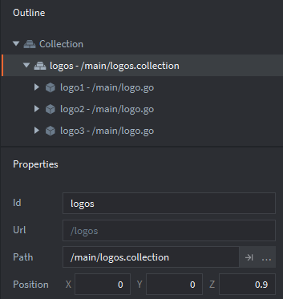

脚本动态修改：
```lua
local pos = go.get_position()
pos.z = 0.5  -- 设置 z 轴位置
go.set_position(pos)
```

## Flash `hitTestObject` 和 `hitTestPoint` 碰撞检测

Flash 中的基本碰撞检测通过使用 `hitTestObject()` 方法实现。在这个例子中，我们有两个影片剪辑："bullet" 和 "bullseye"。下图中展示了这两个对象。在 Flash 编辑器中选择符号时可见的蓝色边界框，正是驱动 `hitTestObject()` 方法结果的边界框。

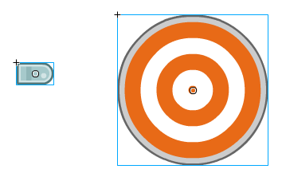

使用 `hitTestObject()` 进行碰撞检测：

```as
bullet.hitTestObject(bullseye);
```

在这种情况下使用边界框并不合适，因为下面的场景会登记为碰撞：

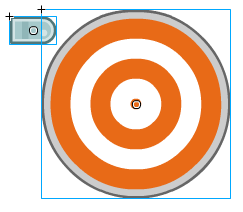

除了 `hitTestObject()` 之外，还有 `hitTestPoint()` 方法。这个方法包含一个 `shapeFlag` 参数，允许针对对象的实际像素进行碰撞测试，而不是边界框。使用 `hitTestPoint()` 进行碰撞检测可以如下所示：

```as
bullseye.hitTestPoint(bullet.x, bullet.y, true);
```

这一行会检查子弹的 x 和 y 位置（在这种情况下是左上角）与目标形状的碰撞。由于 `hitTestPoint()` 检查的是点与形状的碰撞，因此检查哪个点（或哪些点！）是一个关键考虑。

## Defold—collision objects

Defold 内含物理引擎可以用于碰撞检测然后使用其上的脚本进行响应。首先要在游戏对象上面添加碰撞对象组件。如下图所示，我们对 "bullet" 游戏对象添加了碰撞对象。碰撞对象以红色半透明方块表示（只在编辑器中可见）：

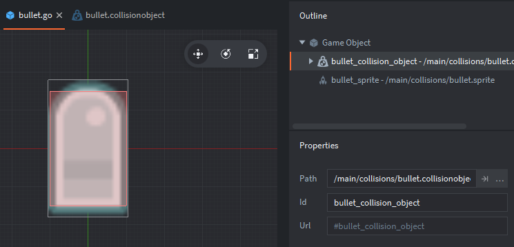

Defold 包含一个 Box2D 物理引擎的修改版，可以用来自动模拟真实的碰撞。本教程使用 Kinematic 碰撞对象，因为它的碰撞检测和 Flash 的最接近。关于动态碰撞详情请见 Defold [物理教程](/manuals/physics)。

此碰撞对象包含如下属性：


用一个矩形代表上例中的子弹。圆形代表靶子进行碰撞检测。设置类型为 Kinematic 意味着使用脚本进行碰撞处理，物理引擎默认不是这样（关于其他类型，请见 [物理手册](/manuals/physics)）。属性 group 和 mask 分别决定了碰撞对象属于哪个组以及和哪个组相碰撞。当前设置是 "bullet" 只能与 "target" 碰撞。要是如下这样：

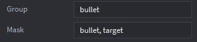

子弹之间就能相互碰撞了。我们为靶子设置了如下的碰撞对象：


注意 *Group* 属性设置为了 "target" 然后 *Mask* 设置为了 "bullet"。

Flash 里，需要脚本调用才会进行碰撞检测。Defold 里，只要碰撞对象开启，后台就会持续进行碰撞检测。碰撞发生时，消息会发送到游戏对象所有组件上（更确切地说是脚本组件）。有 [碰撞处理和碰撞点处理消息](/manuals/physics/#碰撞消息)，其中包含了处理碰撞所需的各种信息。

Defold 的碰撞检测比 Flash 的要高级，毫不费力就能检测复杂形状间的碰撞。碰撞检测是自动的，也就是说不需要手动遍历各个对象然后挨个进行碰撞检测。但是没有 Flash 的 `shapeFlag`。但是对于复杂图形可以使用简单图形组合达成。更复杂的需求下，还可以使用 [自定义图形](https://forum.defold.com/t/does-defold-support-only-three-shapes-for-collision-solved/1985)。

## Flash—事件处理

Flash 中，事件处理通过事件监听器来完成。您可以使用 addEventListener() 方法来添加事件监听器。

## Defold—call-back functions and messaging

Defold 中与 Flash 事件处理系统等效的几个方面。首先，每个脚本组件都带有一组检测特定事件的回调函数。这些函数包括：

init
:   脚本组件初始化时调用。相当于 Flash 中的构造函数。

final
:   脚本组件被销毁时调用（例如，生成的游戏对象被移除）。

update
:   每帧调用。相当于 Flash 中的 `enterFrame`。

on_message
:   脚本组件接收到消息时调用。

on_input
:   当用户输入（例如鼠标或键盘）发送到具有[输入焦点](/ref/go/#acquire_input_focus)的游戏对象时调用，这意味着该对象接收所有输入并可以对其做出反应。

on_reload
:   脚本组件重新加载时调用。

上面列出的回调函数都是可选的，如果不使用可以删除。有关如何设置输入的详细信息，请参阅[输入手册](/manuals/input)。使用集合代理时会出现一个常见问题 - 请参阅输入手册的[此部分](/manuals/input/#input-dispatch-and-on_input)获取更多信息。

如碰撞检测部分所述，碰撞事件通过向涉及的游戏对象发送消息来处理。它们各自的脚本组件在其 on_message 回调函数中接收消息。

## Flash—按钮符号

Flash 使用专用的按钮符号类型。按钮使用特定的事件处理方法（如 `click` 和 `buttonDown`）在检测到用户交互时执行动作。按钮符号中“点击”部分的图形形状决定了按钮的点击区域。

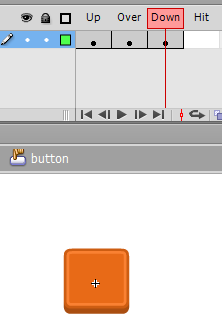

## Defold—GUI 场景和脚本

Defold 不包含原生按钮组件，也不能像 Flash 中那样轻易地检测对特定游戏对象形状的点击。使用 [GUI](/manuals/gui) 组件是最常见的解决方案，部分原因是 Defold GUI 组件的位置不受游戏内摄像机影响（如果使用的话）。GUI API 还包含检测用户输入（如点击和触摸事件）是否在 GUI 元素边界内的函数。

## 调试

在 Flash 中，您使用 `trace()` 命令来帮助调试。Defold 中的等效函数是 `print()`，它的使用方式与 `trace()` 相同：

```lua
print("Hello world!")
```

您可以在一次 `print()` 调用中打印多个变量：

```lua
print(score, health, ammo)
```

还有一个 `pprint()` 函数（美化打印）用于打印表。这个函数输出表的内容，包括嵌套表。考虑以下脚本：

```lua
factions = {"red", "green", "blue"}
world = {name = "Terra", teams = factions}
pprint(world)
```

这里我们将一个表（`factions`）嵌入到另一个表（`world`）中。使用常规的 `print()` 命令只会输出表的 id，而不是其内容：

```
DEBUG:SCRIPT: table: 0x7ff95de63ce0
```

使用 `pprint()` 函数显示更有用的信息：

```
DEBUG:SCRIPT:
{
  name = Terra,
  teams = {
    1 = red,
    2 = green,
    3 = blue,
  }
}
```

如果您的游戏使用碰撞检测，您可以使用以下消息切换物理调试：

```lua
msg.post("@system:", "toggle_physics_debug")
```

您也可以在项目设置中启用物理调试。在启用物理调试之前，我们的项目看起来像这样：


启用物理调试后，项目中的碰撞对象会显示出来：

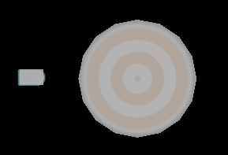

当碰撞发生时，相关碰撞对象会高光显示。而且，碰撞向量也会被显示出来：


最后，关于检测 CPU 和内存使用情况详情请见 [性能分析教程](/ref/profiler/)。更高级的调试技术，详情请见 Defold 手册的 [调试部分](/manuals/debugging)。

## 从这里开始

- [Defold 示例](/examples)
- [教程](/tutorials)
- [手册](/manuals)
- [参考](/ref/go)
- [常见问题](/faq/faq)

如果你有问题或遇到困难，[Defold 论坛](//forum.defold.com) 是寻求帮助的好地方。
